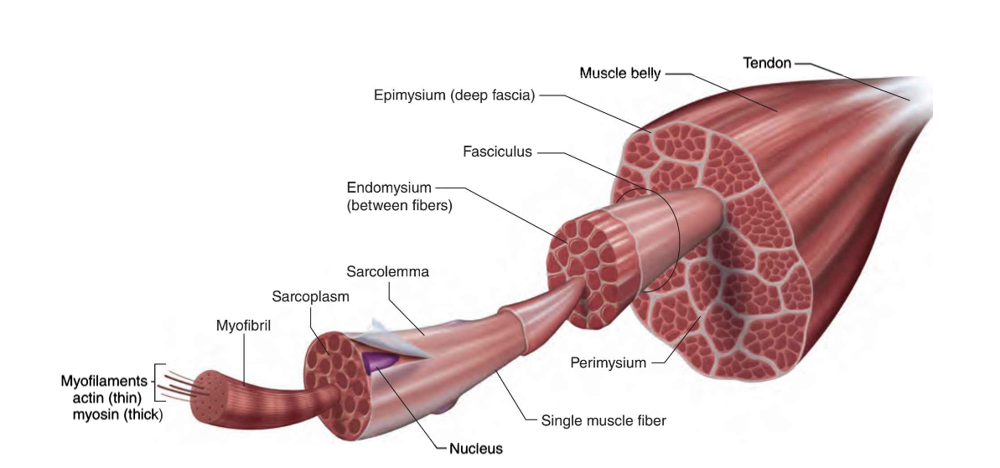

# Gross Anatomy (Macrostructure) of Skeletal Muscle
From outermost(肌肉外部) to innermost(肌肉内部), here is a layer-by-layer breakdownof skeletal muscle structure and function.

## 1. Muscle Belly (肌腹)
- **Definition**: The main contractile part of the skeletal muscle. It consists of multiple fascicles (肌束), which contain muscle fibers (肌纤维).
- **Function**: Generates force for movement by contracting when stimulated by nerves.

## 2. Tendon (肌腱)
- **Definition**: A strong connective tissue (结缔组织) that connects muscle to bone (肌肉附着于骨骼).
- **Function**: Transfers force generated by the muscle belly to move the bone.

## 3. Epimysium (肌外膜)
- **Definition**: The outermost connective tissue layer surrounding the entire muscle belly.
- **Function**: Provides structural support and reduces friction between muscles.

## 4. Perimysium (肌束膜)
- **Definition**: A connective tissue layer that wraps around each fascicle (肌束).
- **Function**: Separates fascicles and contains nerves (神经) and blood vessels (血管) that supply oxygen and nutrients.

## 5. Fascicle (肌束)
- **Definition**: A bundle of muscle fibers enclosed by the perimysium.
- **Function**: Groups muscle fibers together to improve force distribution and contraction efficiency.

## 6. Endomysium (肌内膜)
- **Definition**: A thin layer of connective tissue that surrounds each individual muscle fiber (单个肌纤维).
- **Function**: Provides structural support and helps transmit forces from individual fibers to the whole muscle.

## 7. Muscle Fiber / Muscle Cell (肌纤维 / 肌细胞)
- **Definition**: The actual muscle cell, which is long, cylindrical, and multinucleated (多核的长圆柱形细胞).
- **Function**:
  - Contracts to produce movement.
  - Stores nutrients (glycogen and creatine phosphate).

 

 
 

# Muscle Fiber Internal Structure (肌纤维内部结构)

## 8. Sarcolemma (肌膜)
- **Definition**: The plasma membrane (细胞膜) of the muscle fiber.
- **Function**:
  - Conducts electrical signals (电信号) from the nervous system.
  - Regulates the entry of nutrients and removal of waste.

## 9. Sarcoplasm (肌质)
- **Definition**: The cytoplasm (细胞质) of a muscle cell.
- **Function**:
  - Stores glycogen (糖原) for energy.
  - Contains myoglobin (肌红蛋白), which binds oxygen for ATP production.

## 10. Myofibril (肌原纤维)
- **Definition**: Long, thread-like structures inside a muscle fiber responsible for contraction.
- **Function**: Contains sarcomeres (肌节), the basic contractile units of muscle.

## 11. Sarcomere (肌节)
- **Definition**: The smallest functional unit of muscle contraction.
- **Function**: Generates force and movement when contracting.

## 12. Myofilaments (肌丝)
- **Definition**: The contractile proteins inside the sarcomere, responsible for muscle contraction.
- **Types**:
  - **Actin (肌动蛋白)** – Thin filament (细肌丝)
  - **Myosin (肌球蛋白)** – Thick filament (粗肌丝)

 

 
 

# How These Components Work Together to Contract a Muscle (肌肉如何收缩)

1. **Nerve Signal (神经信号) → Sarcolemma (肌膜)**
   - A motor neuron (运动神经元) sends an electrical signal (电信号) to the sarcolemma, triggering muscle activation.

2. **Calcium Release (钙释放) → Sarcoplasmic Reticulum (肌质网)**
   - The sarcoplasmic reticulum releases calcium ions (Ca²⁺, 钙离子) into the muscle fiber.

3. **Cross-Bridge Formation (肌桥形成)**
    - Calcium binds to troponin (钙结合到肌钙蛋白), exposing binding sites on the actin filament.
      - Tropomyosin: a long, rope-like protein that physically blocks myosin binding sites on actin in a resting muscle
      - troponin: a globular protein complex attached to tropomyosin that acts as a calcium-sensitive switch
   - Myosin heads (肌球蛋白头部) attach to actin, forming a cross-bridge (肌桥).

4. **Power Stroke (动力冲程)**
   - Myosin pulls actin toward the center of the sarcomere, shortening the muscle.
   - ATP (三磷酸腺苷) provides energy for this process.

5. **Relaxation (松弛)**
   - Calcium is pumped back into the sarcoplasmic reticulum, causing the muscle to relax.

 
 

# Summary Table (总结表格)

| Structure                 | Function                                                  |
|---------------------------|-----------------------------------------------------------|
| Muscle Belly (肌腹)        | Main contractile part, generates force.                   |
| Tendon (肌腱)              | Connects muscle to bone, transmits force.                 |
| Epimysium (肌外膜)         | Surrounds entire muscle, provides structure.              |
| Perimysium (肌束膜)        | Surrounds fascicles, contains nerves and blood vessels.   |
| Fascicle (肌束)            | Bundle of muscle fibers, distributes force.               |
| Endomysium (肌内膜)        | Surrounds individual muscle fibers, supports contraction. |
| Muscle Fiber (肌纤维)      | Individual muscle cell, contracts to generate force.      |
| Sarcolemma (肌膜)          | Conducts electrical signals.                             |
| Sarcoplasm (肌质)          | Stores glycogen and myoglobin for energy.                 |
| Myofibril (肌原纤维)       | Contains sarcomeres, responsible for contraction.         |
| Sarcomere (肌节)           | Smallest contractile unit, contains actin and myosin.     |
| Actin (肌动蛋白)           | Thin filament, slides to shorten the muscle.              |
| Myosin (肌球蛋白)          | Thick filament, pulls actin for contraction.              |

---

## Muscle Structure Overview

- **Muscle** - Epimysium covers it
  - **Fascicle** - Perimysium covers it
    - **Endomysium** - section fibers, provide structure
      - **Muscle fiber (cell)** - Sarcolemma covers it
        - **Myofibril**
          - **Sarcomeres** (sections within myofibrils)
            - **Myofilaments** (actin, myosin, tropomyosin, troponin)