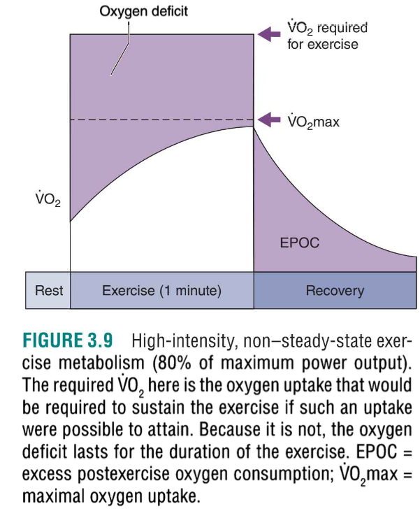
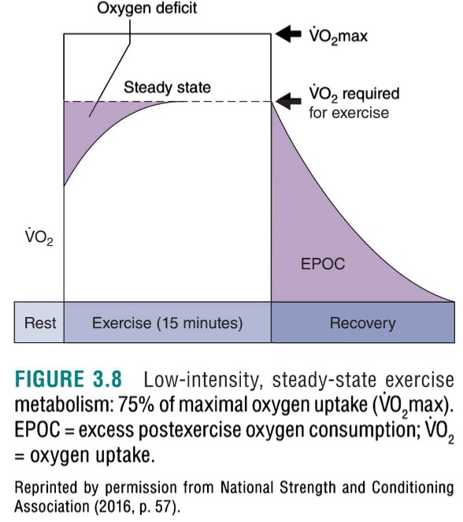

# OXYGEN UPTAKE AND THE AEROBIC AND ANAEROBIC CONTRIBUTIONS TO EXERCISE

### Key Concepts

- **Oxygen Uptake (VO₂)**: A measure of a person's ability to take in and use oxygen. Higher oxygen uptake is associated with greater fitness levels.

- **Steady State**: During low-intensity exercise, oxygen uptake increases for the first few minutes until a steady state is reached, where oxygen demand equals oxygen consumption.

- **Anaerobic Contribution**: At the start of exercise, the body relies on anaerobic mechanisms (energy production without oxygen) to supply some of the required energy. This phase contributes to the **oxygen deficit**, which represents the energy supplied anaerobically before reaching steady-state aerobic metabolism.

- **Oxygen Deficit**: The difference between the oxygen required for a given exercise and the oxygen actually consumed during the early stages of exercise, before steady-state is reached.

- **Excess Postexercise Oxygen Consumption (EPOC)**: After exercise, oxygen uptake remains elevated above resting levels. This elevated oxygen consumption helps restore the body to its pre-exercise state, replenishing ATP, phosphocreatine (PCr), and clearing lactate. The amount and duration of EPOC vary based on exercise intensity and duration.

- **Oxygen Debt**: Refers to the excess postexercise oxygen consumption (EPOC). It is the oxygen required to restore the body to pre-exercise conditions and helps in processes like lactate clearance and recovery.

- **Anaerobic Contribution During High-Intensity Exercise**: If the exercise intensity exceeds the maximal oxygen uptake, the body relies more on anaerobic systems to supply energy. As anaerobic contribution increases, exercise duration typically decreases. For example, if someone new to exercise engages in an advanced spinning class, much of the energy is supplied anaerobically.

  