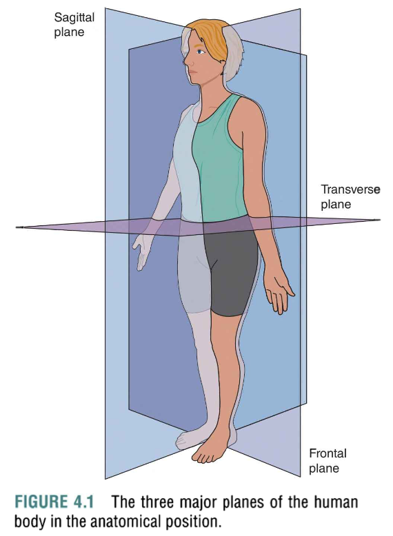
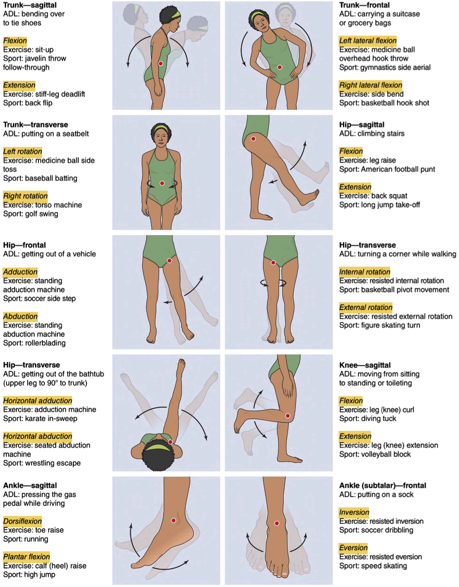

# MECHANICAL FOUNDATIONS

Mechanical principles are fundamental to understanding how forces influence the body and its movement. These principles provide insight into how exercises affect performance, reduce injury risk, and improve efficiency.

---

## 1. Mechanical Terminology and Principles

- **Mechanics**: The study of forces and their effects on matter.
- **Statics**: Study of forces on stationary objects.
- **Dynamics**: Study of forces on moving objects.
- **Kinematics**: Study of motion without considering forces.
- **Kinetics**: Study of the forces causing movement.

---

## 2. Units of Measure

- **Length**: Measured in meters (m).
- **Mass**: Measured in kilograms (kg).
- **Time**: Measured in seconds (s).
- **Force**: Measured in Newtons (N), where 1 N = 1 kg·m/s².
- **Work**: Measured in Joules (J), where 1 J = 1 N·m.
- **Power**: Measured in Watts (W), where 1 W = 1 J/s.
- **Energy**: Measured in Joules (J), similar to work.
- **Torque**: Measured in Newton-meters (N·m).

---

## 3. Force

- **Force**: A push or pull that can cause an object to accelerate or deform.
- **Formula**: \( F = ma \) (Force = mass × acceleration).
- **Characteristics**:
  - **Magnitude**: Size of the force.
  - **Direction**: Direction in which the force is applied.
  - **Point of Application**: The location where the force is applied on the body or object.

---

## 4. Newton’s Laws of Motion

- **First Law (Inertia)**: An object will stay at rest or in uniform motion unless acted upon by an external force. This explains why the body resists changes in motion.
  
- **Second Law (Acceleration)**: The acceleration of an object is directly proportional to the net force acting on it and inversely proportional to its mass:  
  \[ F = ma \]
  This explains how muscles must generate more force to overcome greater resistance (i.e., heavier weights).
  
- **Third Law (Action-Reaction)**: For every action, there is an equal and opposite reaction. When you push against the ground during a squat or deadlift, the ground pushes back with an equal and opposite force, aiding your movement.

---

## 5. Momentum and Impulse

- **Momentum**: The quantity of motion an object has, calculated as the product of an object’s mass and velocity.  
  \[ p = mv \]
  Where:
  - **p** = momentum
  - **m** = mass
  - **v** = velocity
  
- **Impulse**: The change in momentum, which is the product of the force applied and the time the force is applied.  
  \[ J = F \cdot t \]
  Where:
  - **J** = impulse
  - **F** = force
  - **t** = time
  Impulse explains why it's beneficial to apply a force over a longer period (e.g., during controlled deceleration to reduce injury risk).

---

## 6. Torque

- **Torque**: A rotational force that causes angular motion. Torque is generated when a force is applied at a distance from a pivot point (e.g., a joint).
  \[ T = F \cdot d \cdot \sin(\theta) \]
  Where:
  - **T** = torque
  - **F** = force applied
  - **d** = distance from the pivot (moment arm)
  - **θ** = angle between the force and the lever arm
  
- **Moment Arm**: The perpendicular distance from the axis of rotation to the line of action of the force. The longer the moment arm, the greater the torque.

---

## 7. Lever Systems

A lever is a rigid bar that rotates around a fixed point called a **fulcrum**. The body uses levers to generate movement at the joints.

- **Types of Levers**:
  1. **First Class Lever**: Fulcrum is between the force and the load (e.g., neck extension).
  2. **Second Class Lever**: Load is between the fulcrum and the force (e.g., calf raise).
  3. **Third Class Lever**: Force is between the fulcrum and the load (e.g., bicep curl).

- **Mechanical Advantage**: The ability of a lever to amplify force. Levers in the body are typically third-class levers, meaning they provide a mechanical disadvantage (greater force needed for movement), but this results in a larger range of motion.

---

## 8. Work

- **Work**: The transfer of energy through force exerted over a distance.
  \[ W = F \cdot d \]
  Where:
  - **W** = work
  - **F** = force
  - **d** = displacement (distance the object moves)
  
- Work is done only when a force causes a displacement of an object in the direction of the applied force. 

---

## 9. Power

- **Power**: The rate at which work is done, or energy is transferred. Power is crucial in understanding athletic performance, especially during explosive movements.  
  \[ P = \frac{W}{t} = F \cdot v \]
  Where:
  - **P** = power
  - **W** = work
  - **t** = time
  - **F** = force
  - **v** = velocity

- **Power and Performance**: In athletic performance, power is essential for explosive movements like sprints, jumps, or weightlifting.

---

## 10. Energy

- **Energy**: The capacity to do work. There are two main forms of energy in biomechanics:
  1. **Kinetic Energy**: Energy due to motion.  
     \[ KE = \frac{1}{2} mv^2 \]
     Where:
     - **m** = mass
     - **v** = velocity
     
  2. **Potential Energy**: Stored energy due to position or configuration (e.g., gravitational potential energy).  
     \[ PE = mgh \]
     Where:
     - **m** = mass
     - **g** = acceleration due to gravity
     - **h** = height

- **Energy Transformation**: During exercise, energy is continuously transformed between kinetic and potential forms. For example, in a squat, energy is stored as potential energy when lowering, and released as kinetic energy when pushing up.

---

## 11. Mechanical and Movement Efficiency

- **Efficiency**: The ratio of useful work output to energy input. In human movement, it refers to how well energy is utilized for movement rather than being dissipated as heat or wasted.
  
- **Mechanical Efficiency**: The ability of the musculoskeletal system to produce movement with minimal energy loss. This can be influenced by factors such as joint alignment, muscle length-tension relationships, and neural activation patterns.

- **Improving Efficiency**: Proper technique, joint mobility, muscle balance, and training specific movement patterns can all improve the efficiency of human movement.