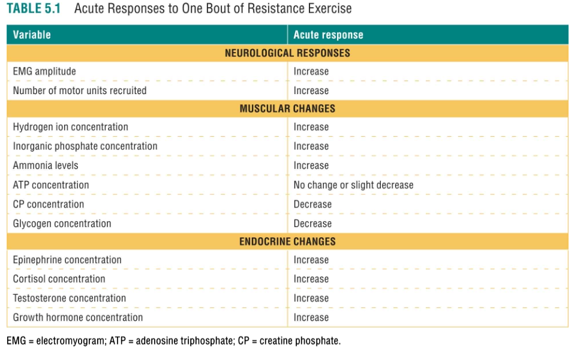
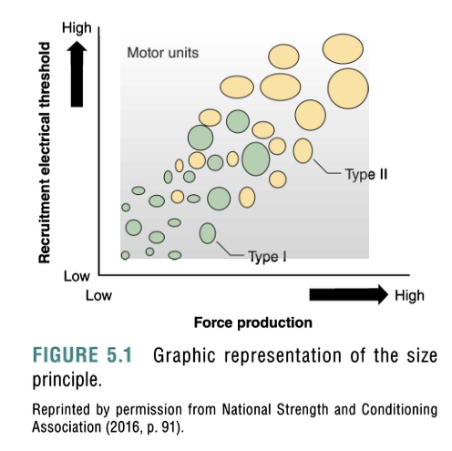

## ACUTE RESPONSES TO TRAINING  
*Changes during/immediately after a single bout.*  

### Neurological Changes  
- **Increased EMG amplitude** and **motor unit recruitment** (Table 5.1).  
- **Force control**:  
  - **Motor unit recruitment**: More units activated for heavier loads.  
  - **Rate coding**: Increased firing rate (action potentials/sec) for higher force.  
  - **Size principle**: Low-threshold (Type I) units recruit first, then high-threshold (Type II) (Figure 5.1).  
  
- Fatigue increases recruitment/firing rate to compensate for reduced force.  

### Muscular Changes  
- **Metabolite accumulation**: ↑ H⁺ (↓ pH), inorganic phosphate (Pᵢ), ammonia, lactate.  
- **Substrate depletion**: ↓ CP (phosphagen system), glycogen (glycolysis fuels ~80% ATP in bodybuilding-style training).  
- **Preliminary evidence**: Lactate may promote hypertrophy; phosphate may aid autophagy.  

### Endocrine Changes  
- **Anabolic hormones** (↑ post-exercise): Testosterone, GH, IGF-1 (stimulate protein synthesis).  
  - **Steroid hormones**: Derived from cholesterol (e.g., testosterone, estrogen). **Growth hormone is a peptide hormone** (Study Q2: **B is incorrect**).  
- **Catabolic hormones**: Cortisol (breaks down protein for glucose).  
- **Mechanotransduction**: Mechanical stress (not just hormones) activates mTORc1 to ↑ protein synthesis.  
- **Training bout design**: Higher volume/shorter rest → stronger hormonal response.  
  - *Key point*: **Acute hormonal spikes** (e.g., testosterone post-exercise) are more pronounced than chronic changes (Study Q3: **B is incorrect**).  
  
