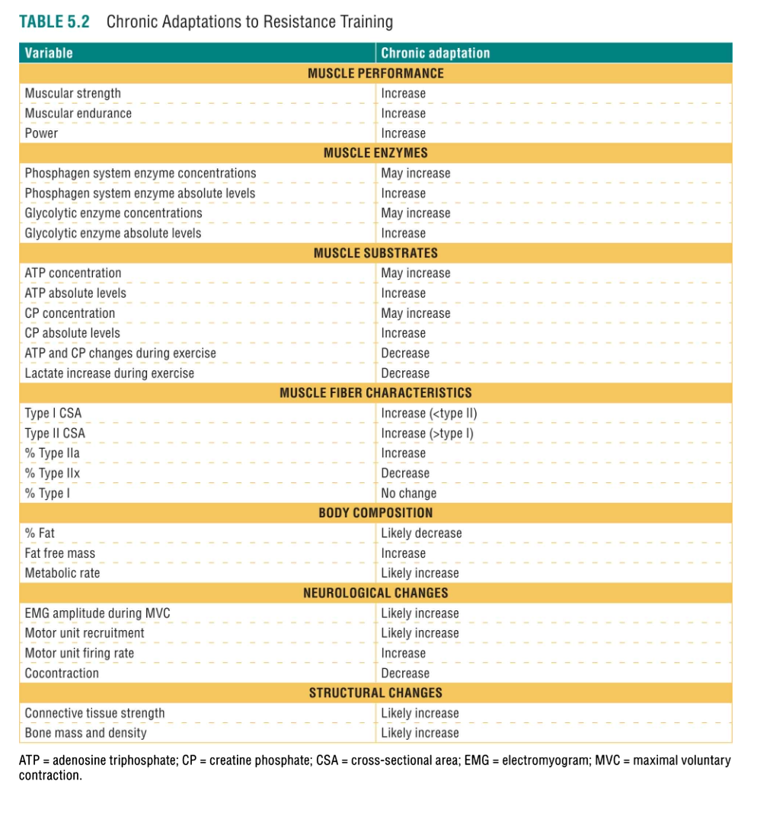

## CHRONIC ADAPTATIONS  
*Long-term changes from repeated training.*  

### Neurological Changes  
- Early strength gains (1–2 months) are **primarily neural** (↑ motor unit recruitment, firing rate, synchronization).  
- **Reduced cocontraction**: Less antagonist activation (e.g., hamstrings during quad extension) improves efficiency.  
- **Cross-education**: Unilateral training improves contralateral strength.  

### Muscle Tissue Changes  
- **Hypertrophy**:  
  - ↑ Myofibrils (actin/myosin) → ↑ force/power.  
  - Type II fibers hypertrophy more than Type I.  
  - Measurable after 4–8 weeks; hyperplasia is rare in humans.  
- **Fiber type shifts**: Type IIx → IIa (faster with training).  
- **Protein turnover**: Initial weeks ↑ synthesis & breakdown; later, synthesis dominates.  

### Skeletal Changes  
- **Bone mineral density (BMD)**: Resistance training ↑ BMD (critical for osteoporosis prevention).  
- **Strain magnitude/rate matters**: Explosive/plyometric training may be optimal for bone formation.  

### Tendon/Ligament Changes  
- **Collagen synthesis**: ↑ tendon stiffness/cross-sectional area (e.g., Achilles in runners).  
- **Sex differences**: Males show greater tendon hypertrophy (possibly due to estrogen's inhibition of collagen synthesis).  

### Cartilage Changes  
- **Osteoarthritis (OA)**: Resistance training improves joint function/pain but cartilage thickening evidence is mixed.  
- **Dynamic loading** (e.g., stair climbing) ↑ nutrient diffusion for cartilage health.  

### Metabolic Changes  
- **Anaerobic enzymes/substrates**: ↑ CP, glycogen (absolute levels; concentrations may dilute with hypertrophy).  
- **Mitochondrial density**: ↓ relative to muscle size (but total mitochondria may ↑).  

### Endocrine Changes  
- **Chronic ↑ androgen receptors** → enhanced testosterone sensitivity.  
- Resting hormone levels (e.g., testosterone, GH) may not change significantly (Study Q3: **D is correct**; GH does not increase chronically).  

### Cardiorespiratory Changes  
- **VO₂ max**: Minimal improvement in young adults; may ↑ in older/low-fitness individuals.  
- **Capillarization**: Maintained despite hypertrophy to support blood flow.  

### Body Composition Changes  
- **Fat-free mass (FFM)**: ↑ muscle → ↓ body fat % (even if fat mass is unchanged).  
- **Fat loss**: Resistance training ↑ calorie expenditure (~200–300 kcal/session), but REE ↑ is modest (~10 kcal/day per lb muscle).  

---