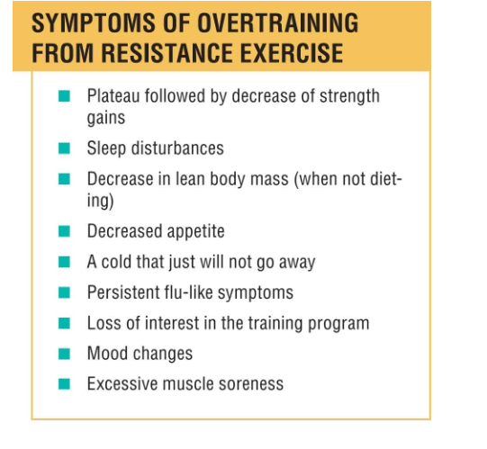

## OVERTRAINING  
- **Causes**: Excessive volume/intensity → ↓ performance, mood disturbances, persistent soreness.  
- **Symptoms**: Sleep loss, appetite ↓, frequent illness, strength plateaus.  

- **Prevention**: Periodization, deload weeks, avoid training to failure every session.  
