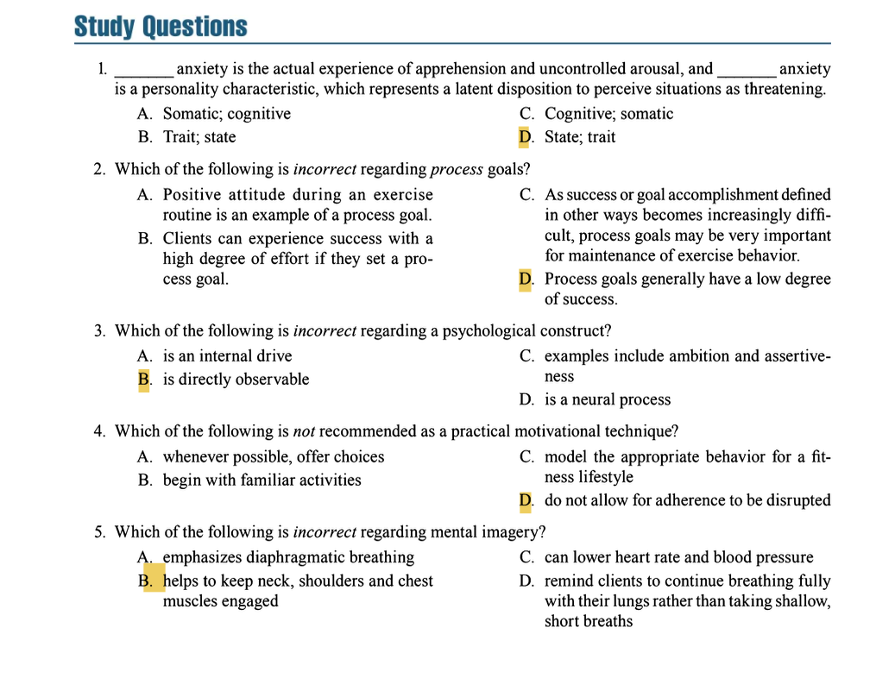

## **MENTAL HEALTH ASPECTS OF EXERCISE**  
1. **Stress Reduction Effects of Exercise**  
   - **Anxiety Reduction**:  
     - Exercise alleviates both **state anxiety** and **trait anxiety**
       - **state anxiety**: actual experience of anxiety that is characterized by feelings of
apprehension or threat and accompanied by increased
physiological arousal, particularly as mediated by the
autonomic nervous system
       - **trait anxiety**: more persistent personality characteristic related to a general tendency to experience anxiety
     - Meta-analyses confirm **small to moderate reductions** in anxiety with physical activity.  
     - Effective for **clinical and nonclinical populations**.  
   - **Mechanisms**:  
     - **Rhythmic activity** (e.g., walking, cycling) promotes relaxation via brain stem inhibition.  
     - **Thermogenic effect**: Increased body heat triggers hypothalamic relaxation responses.  
     - **Frontal asymmetry**: Exercise increases left frontal brain activation, linked to positive mood.  
     - **Beta-endorphin release**: Post-exercise "feel-better" effect counters stress.  
   - **Social & Psychological Factors**:  
     - **Caring, task-involving climates** (e.g., supportive trainers) reduce stress and cortisol levels.  
     - Exercise provides a **diversion** from daily stressors.  

2. **Anti-Depressive Effects of Exercise**  
   - Comparable to medication for **clinical depression**, with fewer side effects.  
   - **Mechanisms**:  
     - Increased **serotonin, dopamine, and norepinephrine** (neurotransmitters linked to mood regulation).  
     - Enhanced **self-efficacy** and sense of accomplishment.  
   - Benefits **older adults** by promoting independence and life satisfaction.  

3. **Cognitive Benefits**  
   - **Enhanced cognition** (memory, focus, decision-making) in older adults.  
   - Physically fit individuals show **slower age-related cognitive decline**.  
   - Improved **reaction time** and mental performance in fit vs. sedentary individuals.  

---
 
 

## **GOAL SETTING**  
1. **Purpose & Importance**  
   - Increases **motivation, adherence, and effort intensity**.  
   - Provides **feedback and reinforcement** to sustain behavior.  

2. **Types of Goals**  
   - **Process Goals**: High personal control (e.g., effort, technique, attendance).  
   - **Performance Goals**: Moderate control (e.g., self-referenced standards like lifting heavier weights).  
   - **Outcome Goals**: Low control (e.g., winning a race; socially comparative).  

3. **Effective Goal-Setting Strategies**  
   - **Short-Term Goals**:  
     - Should have a **~50% success rate** to balance challenge and achievability.  
     - Adjust if not met within the timeframe.  
   - **Long-Term Goals**: Provide meaning and direction (e.g., running a marathon).  
   - **Diversified Goals**: Combine process, performance, and outcome goals for sustained motivation.  

4. **Goal Orientations**  
   - **Task-Involved**: Focus on **self-improvement** (e.g., beating personal records).  
   - **Ego-Involved**: Focus on **social comparison** (e.g., outperforming others).  
   - Trainers should **align goals with clients’ orientations** (e.g., emphasize task-involved goals for beginners).  

5. **Practical Tips for Trainers**  
   - Start with **simple process goals** (e.g., attending sessions 3x/week).  
   - Progress to **challenging performance goals** (e.g., lifting a specific weight).  
   - Use **measurable metrics** (e.g., weight, reps, race times).  
   - Set **realistic time frames** and adjust as needed.  
   - Ensure goals are **compatible** (e.g., weight loss and strength gain).  

6. **Example of Diversified Goal Setting**  
   - **Long-term**: Run a 10K in <60 minutes.  
   - **Short-term**:  
     - Performance: Increase weekly running distance.  
     - Process: Improve running form on training days.  
     - Psychological: Use positive self-talk during runs.  

**Key Takeaway**: Effective goal setting blends **challenge, personal relevance, and feedback** to foster commitment and long-term success.

---
 
 

## **MOTIVATION**  
1. **Definition & Key Concepts**  
   - **Motivation**: A psychological construct that **arouses and directs behavior**.  
     - **Directional aspect**: Influences choices (e.g., exercise vs. inactivity).  
     - **Intensity aspect**: Determines effort level.  

2. **Reinforcement & Punishment**  
   - **Positive Reinforcement**: Adds a reward to **increase behavior** (e.g., praise for completing a workout).  
   - **Negative Reinforcement**: Removes an aversive stimulus to **increase behavior** (e.g., skipping a disliked exercise after hitting a target).  
   - **Punishment**: Decreases behavior:  
     - *Positive punishment*: Adds an aversive stimulus (e.g., criticism).  
     - *Negative punishment*: Removes a valued stimulus (e.g., revoking gym privileges).  
   - **Key Insight**: **Reinforcement** (positive/negative) is more effective than punishment for long-term adherence.  

3. **Self-Determination Theory (SDT)**  
   - **Intrinsic Motivation**: Behavior driven by **internal enjoyment** (e.g., loving exercise).  
   - **Extrinsic Motivation**: Behavior driven by **external rewards** (e.g., weight loss, social approval).  
   - **Continuum of Motivation**:  
     1. **Amotivation**: No motivation.  
     2. **External Regulation**: Exercise to avoid punishment (e.g., doctor’s orders).  
     3. **Introjected Regulation**: Exercise out of guilt/obligation.  
     4. **Identified Regulation**: Exercise because it aligns with personal values (e.g., "I value health").  
     5. **Integrated Regulation**: Exercise is part of identity (e.g., "I am a runner").  
     6. **Intrinsic Regulation**: Exercise for pure enjoyment.  
   - **Goal**: Shift clients toward **integrated/intrinsic motivation** for sustained adherence.  

4. **Effect of Rewards on Motivation**  
   - **Extrinsic rewards** (e.g., trophies, cash) can **undermine intrinsic motivation** by shifting focus to the reward.  
   - **Positive feedback** (e.g., verbal praise) enhances intrinsic motivation.  

5. **Transtheoretical Model (Stages of Change)**  
   - **Precontemplation**: No intention to exercise.  
   - **Contemplation**: Thinking about exercise.  
   - **Preparation**: Exercising sporadically (<3 days/week).  
   - **Action**: Consistently exercising (≥5 days/week for <6 months).  
   - **Maintenance**: Exercising consistently for ≥6 months.  
   - **Application**: Tailor interventions to the client’s stage (e.g., educate precontemplators, support maintainers).  

6. **Self-Efficacy (Confidence)**  
   - **Definition**: Belief in one’s ability to succeed.  
   - **Four Influences**:  
     1. **Performance Accomplishments**: Small wins build confidence (e.g., mastering a squat).  
     2. **Modeling**: Observing others succeed (e.g., peers achieving goals).  
     3. **Verbal Persuasion**: Encouragement from credible sources (e.g., trainer praise).  
     4. **Physiological Arousal**: Managing stress/anxiety (e.g., deep breathing).  

---
 
 

## **METHODS TO MOTIVATE A CLIENT**  
1. **Minimizing Procrastination**  
   - **Barrier**: Overwhelm from too many choices (e.g., diet plans, workouts).  
   - **Solution**: Simplify decisions (e.g., "Start with 3 days/week").  

2. **Identifying False Beliefs**  
   - **Examples**:  
     - "No pain, no gain" → Leads to overtraining.  
     - "Exercise isn’t for me" → Creates self-doubt.  
   - **Strategy**:  
     - **Question clients** to uncover limiting beliefs.  
     - **Educate** to replace myths with evidence (e.g., moderate exercise is effective).  

3. **Modifying Self-Talk**  
   - **Steps**:  
     1. **Awareness**: Identify negative thoughts (e.g., "I can’t do this").  
     2. **Reframing**: Replace with positive affirmations (e.g., "I’m getting stronger").  
     3. **Practice**: Recite affirmations daily (aloud → mental).  

4. **Mental Conditioning**  
   - **Mental Imagery**: Visualizing success to enhance motivation/technique.  
     - **Past Success**: Recall a previous achievement (e.g., proper squat form).  
     - **Future Success**: Imagine achieving a goal (e.g., finishing a race).  
   - **Relaxation Techniques**:  
     - **Progressive Relaxation**: Tense/release muscle groups.  
     - **Deep Breathing**: Lowers heart rate, reduces tension.  

5. **SMART Goal Setting**  
   - **Specific, Measurable, Action-oriented, Realistic, Time-bound**.  
   - **Example**: "Run 3 miles in 30 minutes within 8 weeks."  

**Key Takeaway**: Combine **reinforcement, self-efficacy building, and mental strategies** to foster intrinsic motivation and long-term adherence.

---

### **Question 1**  
**Correct Answer: D. State; trait**  
**Textbook Reference**:  
*"State anxiety can be defined as the actual experience of anxiety that is characterized by feelings of apprehension or threat and accompanied by increased physiological arousal... Trait anxiety is a dispositional factor relating to the probability that a given person is likely to perceive situations as threatening."*  
*(Chapter 8, "Mental Health Aspects of Exercise")*  

**Incorrect Options**:  
- **A. Somatic; cognitive**: *Not mentioned in the context of anxiety types.*  
- **B. Trait; state**: *Reversed order of definitions.*  
- **C. Cognitive; somatic**: *Not relevant to the anxiety classifications discussed.*  

---

### **Question 2**  
**Correct Answer: D. Process goals generally have a low degree of success.**  
**Textbook Reference**:  
*"Process goals are goals that clients have a high degree of personal control over... Regardless of the difficulty of the short-term goal, clients can experience success with a high degree of effort if they set a process goal."*  
*(Chapter 8, "Goal Setting")*  

**Incorrect Options**:  
- **A, B, C**: *All align with textbook definitions of process goals.*  

---

### **Question 3**  
**Correct Answer: B. is directly observable**  
**Textbook Reference**:  
*"Motivation is a psychological construct... A construct is simply an internal drive or neural process that cannot be directly observed but must be indirectly inferred from observation of outward behavior."*  
*(Chapter 8, "Motivation")*  

**Incorrect Options**:  
- **A, C, D**: *All align with the definition of a psychological construct.*  

---

### **Question 4**  
**Correct Answer: D. do not allow for adherence to be disrupted**  
**Textbook Reference**:  
*No direct quote supports rigidity in adherence. Instead, the text emphasizes flexibility, client input, and adaptive strategies (e.g., adjusting goals, positive reinforcement).*  

**Incorrect Options**:  
- **A, B, C**: *Supported by principles like client autonomy ("agree on goals"), modeling ("demonstrating technique"), and starting with familiarity ("simple process goals").*  

---

### **Question 5**  
**Correct Answer: B. helps to keep neck, shoulders and chest muscles engaged**  
**Textbook Reference**:  
*"Deep breathing emphasizes diaphragmatic breathing... [to] reduce muscular tension... [and avoid] tightening chest, shoulder, or neck muscles."*  
*(Chapter 8, "Methods to Motivate a Client")*  

**Incorrect Options**:  
- **A, C, D**: *All align with benefits of deep breathing/mental imagery.*  

**Note**: Option B contradicts the textbook’s emphasis on *reducing* tension in these muscles.