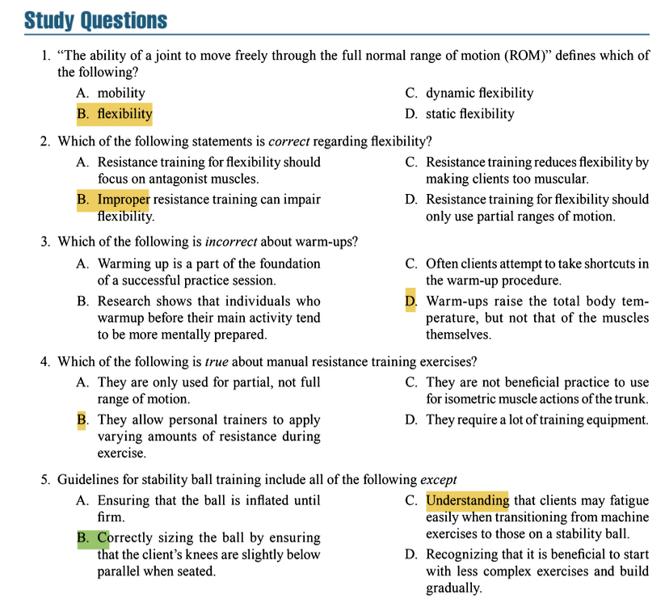

# Flexibility and Warm-Up Concepts and Bodyweight and Stability Ball Exercise Technique

### I. DEFINING FLEXIBILITY

*   **Flexibility**: The ability of a joint, or series of joints, to move through a full, non-restricted, pain-free **range of motion (ROM)**.
*   **Range of Motion (ROM)**: The movement potential of a joint, typically measured in degrees.
*   Flexibility is **joint-specific**; a person may be very flexible in one joint (e.g., shoulder) and inflexible in another (e.g., hip).

---

### II. FLEXIBILITY TRAINING AS PART OF THE TOTAL EXERCISE PROGRAM

*   Flexibility training is a key component of a well-rounded fitness program, alongside:
    *   Cardiovascular training
    *   Resistance training
    *   Neuromuscular training (e.g., balance, agility, coordination)
*   It should be integrated appropriately, typically during the warm-up and cool-down phases of a workout session.

---

### III. BENEFITS OF FLEXIBILITY TRAINING

*   **Injury Reduction**: May help reduce the risk of muscle strains and joint sprains.
*   **Decreased Postexercise Muscle Soreness**: Can help alleviate **delayed-onset muscle soreness (DOMS)**.
*   **Improved Posture**: Can help correct muscle imbalances that lead to poor posture.
*   **Reduced Risk of Low Back Pain**: Improved flexibility in the hips, pelvis, and hamstrings reduces stress on the lumbar spine.
*   **Increased Blood Flow and Nutrients to Tissues**: Enhances circulation.
*   **Improved Muscle Coordination**: May enhance neuromuscular efficiency.
*   **Enhanced Enjoyment of Physical Activity**: Increased ease of movement.

---

### IV. FACTORS AFFECTING FLEXIBILITY

*   **Joint Structure**: The type of joint (e.g., ball-and-socket vs. hinge) determines its inherent ROM.
*   **Age**: Flexibility generally decreases with age.
*   **Sex**: Females tend to be more flexible than males.
*   **Connective Tissue**: The elasticity of tendons, ligaments, and the joint capsule.
*   **Resistance of Muscle and Other Tissues to Stretch**.
*   **Activity Level**: Active individuals tend to be more flexible than inactive ones.
*   **Muscle Bulk**: Excessive hypertrophy can sometimes impede full ROM.
*   **Previous Injury**: Scar tissue can reduce flexibility.
*   **Neuromuscular Coordination**: The ability of the nervous system to allow a muscle to relax and lengthen.

---

### V. ELASTICITY AND PLASTICITY

*   **Elasticity**: The ability of soft tissue to return to its original resting length **immediately** after a passive stretch is removed. (Temporary change).
*   **Plasticity**: The tendency of soft tissue to assume a new, **greater length** after a passive stretch is removed. (Permanent, long-term change).
*   Effective stretching must move tissue past its elastic limit to induce plastic deformation.

---

### VI. TYPES OF FLEXIBILITY TRAINING

1.  **Static Stretch**
    *   A stretch is slowly applied and held in a **stationary position**.
    *   **Passive Static Stretch**: An external force is applied (e.g., partner, gravity, strap).
    *   **Active Static Stretch**: The force is applied by the antagonist muscles of the limb being stretched.
    *   *Most common, safest, and recommended for general fitness.*

2.  **Dynamic Stretch**
    *   Involves **active movement** through a joint's ROM.
    *   Examples: leg swings, torso twists, walking lunges.
    *   *Primarily used during a warm-up to prepare for activity.*

3.  **Ballistic Stretch**
    *   Uses the **momentum of a moving body segment** to produce the stretch (e.g., bouncing).
    *   **Not generally recommended** due to a high risk of injury.

4.  **Proprioceptive Neuromuscular Facilitation (PNF)**
    *   An **advanced** technique involving passive stretching and **isometric contractions**.
    *   Common techniques: **Hold-Relax**, **Contract-Relax**.
    *   Requires a partner; highly effective.

---

### VII. RECOMMENDED FLEXIBILITY ROUTINE AND GUIDELINES

*   **Frequency**: Minimum **2-3 days/week**; ideally **5-7 days/week**.
*   **Intensity**: To the point of **mild discomfort or tension, but not pain**.
*   **Time (Duration)**: Hold **static stretches for 15-30 seconds**.
*   **Repetitions**: **2-4 repetitions** for each stretch.
*   **Type**: A program of **static stretches** for all major muscle-tendon units.
*   **When to Stretch**: **Best during the cool-down** when muscles are warm.
*   Stretch both agonist and antagonist muscle groups.
*   Breathe slowly and rhythmically; do not hold your breath.

---

### VIII. WARM-UP

*   **Definition**: A preparatory activity that **enhances subsequent performance** and reduces injury risk.
*   **Purpose**: To **increase core body temperature** and **muscle temperature**.
*   **General Warm-Up**
    *   **5-10 minutes** of light-to-moderate aerobic activity (e.g., jogging, cycling).
    *   Goal: Increase heart rate, blood flow, and muscle temperature.
*   **Specific Warm-Up (Dynamic Stretching)**
    *   **~8-12 minutes** of movements that mimic the upcoming activity.
    *   Involves dynamic stretching and sport-specific drills.
    *   Goal: Activate the neuromuscular system for specific tasks.

---

### IX. BODYWEIGHT AND STABILITY BALL EXERCISES

#### Bodyweight Exercises
*   **Definition**: Use the individual's own body weight as resistance.
*   **Benefits**:
    *   Improve muscular endurance, coordination, and stability.
    *   Require little to no equipment.
    *   Are functional and foundational.
*   **Examples**: Push-up, Bodyweight Squat, Lunge, Plank, Jumping Jack.

#### Stability Ball (Swiss Ball) Exercises
*   **Definition**: An inflated, vinyl ball used as an unstable surface.
*   **Benefits**:
    *   **Enhances Core Stability and Strength**: Recruits stabilizer muscles.
    *   **Improves Balance and Neuromuscular Coordination**.
    *   Allows for a greater ROM in some exercises.
*   **Selecting Ball Size**: When sitting, knees and hips should be at ~90-degree angles.
*   **Safety Guidelines**:
    *   Maintain a neutral spine and drawn-in position.
    *   Inflate to specifications; use a burst-resistant ball.
    *   Keep away from sharp objects.
    *   Progress from simple to complex exercises.

---

### **Question 1**
**Correct Answer: B. flexibility**  
**Textbook Reference**:  
*"Flexibility is the ability of a joint, or series of joints, to move through a full, non-restricted, pain-free range of motion (ROM)."*  
*(Chapter 12, "DEFINING FLEXIBILITY")*  

**Incorrect Options**:  
- **A. mobility**: While related, the textbook's specific definition for the ability to move through the full ROM is "flexibility."  
- **C. dynamic flexibility / D. static flexibility**: These describe types of flexibility training, not the core definition.  

---

### **Question 2**
**Correct Answer: B. Improper resistance training can impair flexibility.**  
**Textbook Reference**:  
*"Improper resistance training can impair flexibility... For example, if a client consistently uses a limited range of motion or overdevelops a muscle group, a loss of ROM can occur."*  
*(Chapter 12, "FLEXIBILITY TRAINING AS PART OF THE TOTAL EXERCISE PROGRAM")*  

**Incorrect Options**:  
- **A. Resistance training for flexibility should focus on antagonist muscles**: Not supported; the text emphasizes full ROM training and stretching.  
- **C. Resistance training reduces flexibility by making clients too muscular**: This is a misconception; proper training maintains or improves flexibility.  
- **D. Resistance training for flexibility should only use partial ranges of motion**: Incorrect; full ROM is recommended to preserve flexibility.  

---

### **Question 3**
**Correct Answer: D. Warm-ups raise the total body temperature, but not that of the muscles themselves.**  
**Textbook Reference**:  
*"The purpose of the warm-up is to increase core body temperature and muscle temperature."*  
*(Chapter 12, "WARM-UP")*  

**Incorrect Options**:  
- **A. Warming up is a part of the foundation of a successful practice session**: Supported as a key principle.  
- **B. Research shows that individuals who warm up tend to be more mentally prepared**: The text notes warm-ups enhance psychological preparation.  
- **C. Clients often attempt to take shortcuts in the warm-up procedure**: Implied as a common issue trainers must address.  

---

### **Question 4**
**Correct Answer: B. They allow personal trainers to apply varying amounts of resistance during exercise.**  
**Textbook Reference**:  
*While not explicitly detailed in the provided study guide section, manual resistance training is a recognized technique in personal training where the trainer subjectively adjusts resistance based on the client’s strength curve, allowing for accommodating resistance throughout the range of motion. This aligns with NSCA principles of individualized adaptation.*  

**Incorrect Options**:  
- **A. They are only used for partial, not full range of motion**: Manual resistance can be applied through a full ROM.  
- **C. They are not beneficial for isometric muscle actions of the trunk**: Manual resistance is effective for isometric actions, including trunk stabilization.  
- **D. They require a lot of training equipment**: Manual resistance relies primarily on the trainer’s ability to provide resistance, requiring minimal equipment.  

---

### **Question 5**
**Correct Answer: B. Correctly sizing the ball by ensuring that the client's knees are slightly below parallel when seated.**  
**Textbook Reference**:  
*"Selecting the Correct Ball Size: When sitting on the ball, the knees and hips should be at ~90-degree angles with feet flat on the floor."*  
*(Chapter 12, "BODYWEIGHT AND STABILITY BALL EXERCISES")*  

**Incorrect Options**:  
- **A. Ensuring that the ball is inflated until firm**: Correct guideline for stability and safety.  
- **C. Understanding that clients may fatigue easily when transitioning from machine exercises to those on a stability ball**: Valid due to increased neuromuscular demands.  
- **D. Recognizing that it is beneficial to start with less complex exercises and build gradually**: Supported as a fundamental progression principle.  

---