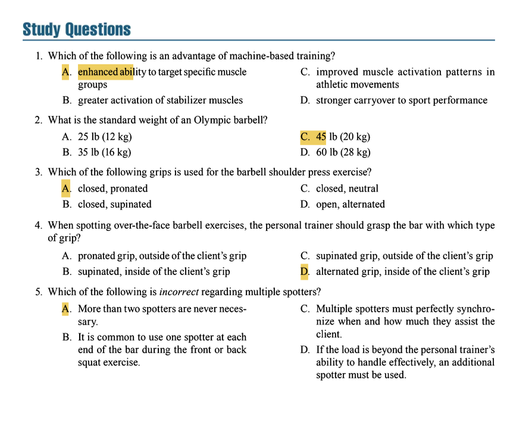

# 🏋️ Comprehensive Study Guide: NSCA Essentials of Personal Training  

## 1. Common Types of Resistance Training Equipment  

#### Selectorized Equipment  
- **Description**: Machines that use a stack of weights connected by a cable or rod. Users select resistance by inserting a pin into the weight stack.  
- **Advantages**: Easy to use, minimal setup required, and safe for beginners.  
- **Examples**: Leg extension machines, lat pulldown machines.  

#### Plate-Loaded Equipment  
- **Description**: Machines or stands where users manually add weight plates (e.g., Olympic plates) to the equipment.  
- **Advantages**: Allows for incremental resistance adjustments and mimics free-weight movements with guided paths.  
- **Examples**: Hammer strength machines, plate-loaded leg presses.  

#### Cam-Based Equipment  
- **Description**: Uses a cam (asymmetric wheel) to vary resistance throughout the range of motion, matching human strength curves.  
- **Advantages**: Provides variable resistance, maximizing tension during stronger parts of the movement.  
- **Examples**: Preacher curl machines, some leg curl machines.  

#### Rod or Linear Guided Equipment  
- **Description**: Equipment where the resistance moves along a fixed linear path, often with rods or rails.  
- **Advantages**: Stabilizes movement pattern, reducing the need for balance.  
- **Examples**: Smith machines, guided squat machines.  

#### Hydraulic Equipment  
- **Description**: Uses fluid-filled cylinders to provide resistance. Resistance is speed-dependent; faster movements yield higher resistance.  
- **Advantages**: Low impact and suitable for rehabilitation settings.  
- **Disadvantages**: Limited eccentric loading.  
- **Examples**: Hydraulic leg presses.  

#### Air or Pneumatic Equipment  
- **Description**: Uses compressed air to provide resistance. Resistance is controlled by air pressure adjustments.  
- **Advantages**: Smooth resistance and easy to adjust.  
- **Examples**: Pneumatic chest press machines.  

#### Isokinetic Equipment  
- **Description**: Provides resistance at a constant speed, regardless of force applied. Requires specialized machinery.  
- **Applications**: Primarily used in rehabilitation and testing settings.  
- **Examples**: Isokinetic dynamometers.  

#### Free Weights  
- **Barbells**: Long bars designed to hold weight plates. Allow for compound movements and heavy lifting.  
- **Dumbbells**: Short bars held in one hand. Useful for unilateral training and stability challenges.  
- **Kettlebells**: Cannonball-shaped weights with handles. Ideal for ballistic movements like swings and snatches.  

#### Alternative Equipment  
- **Tires**: Large tires used for flipping, dragging, or striking. Develops power and full-body strength.  
- **Weighted Bags**: Sandbags or other weighted bags for functional training.  
- **Ropes**: Battling ropes for upper-body and cardiovascular conditioning.  
- **Instability Devices**: Tools like stability balls or BOSU balls to challenge balance and core stability.  
- **Chains**: Used with barbells to accommodate resistance (increased resistance at the top of the movement).  
- **Medicine Balls and Slam Balls**: Weighted balls for throws, slams, and dynamic movements.  
- **Resistance Bands**: Elastic bands providing variable resistance. Portable and versatile.  
- **Wooden Clubs**: Used for rotational exercises to improve shoulder mobility and strength.  
- **Sleds**: Pushed or pulled for conditioning and lower-body power development.  

---

## 2. Fundamental Exercise Technique Guidelines  

#### Grip Types and Width  
- **Grip Types**:  
  - **Pronated (Overhand) Grip**: Palms facing down.  
  - **Supinated (Underhand) Grip**: Palms facing up.  
  - **Alternated Grip**: One pronated, one supinated (e.g., for deadlifts).  
  - **Closed Grip**: Thumb wrapped around the bar.  
  - **Open Grip (False Grip)**: Thumb not wrapped around the bar (not recommended for heavy lifting).  
- **Grip Width**:  
  - **Narrow Grip**: Shoulder-width or less.  
  - **Shoulder-Width Grip**: Aligned with shoulders.  
  - **Wide Grip**: Wider than shoulder-width.  

#### Stance and Body Positioning  
- **Feet Placement**:  
  - For standing exercises, feet should be between hip-width and shoulder-width apart for stability .  
- **Five-Point Body Contact Position**:  
  - For **Seated or Supine Exercises**:  
    1. Head placed firmly on the bench or pad.  
    2. Shoulders and upper back relaxed and in contact with the bench.  
    3. Lower back slightly arched (natural curvature).  
    4. Right foot flat on the floor.  
    5. Left foot flat on the floor.  
  - For **Prone Exercises**:  
    1. Head facing down or turned to the side.  
    2. Chest and torso in contact with the bench.  
    3. Hips and thighs firmly placed.  
    4. Right hand gripping the bar or handle.  
    5. Left hand gripping the bar or handle.  

#### Breathing Techniques  
- **General Rule**: Exhale during the concentric (lifting) phase and inhale during the eccentric (lowering) phase .  
- **Valsalva Maneuver**:  
  - Involves holding one's breath during the sticking point of a lift to increase intra-abdominal pressure and spinal stability.  
  - **Contraindications**: Not recommended for clients with cardiovascular, metabolic, or respiratory conditions .  

#### Use of Lifting Belts  
- **Purpose**: To increase intra-abdominal pressure during heavy lifts.  
- **When to Use**:  
  - For structural exercises (e.g., squats, deadlifts, overhead presses) with heavy or maximal loads.  
  - Not necessary for light loads or non-structural exercises.  
- **Drawbacks**: Overuse can weaken core stability muscles.  

---

## 3. Spotting Resistance Training Exercises  

#### Exercises Requiring Spotting  
1. **Overhead Exercises**: e.g., overhead press.  
2. **Exercises Over the Face**: e.g., bench press, skull crushers.  
3. **Bar on the Back or Shoulders**: e.g., back squats, front squats.  
4. **Bar on the Front Shoulders or Clavicles**: e.g., front squats.  

#### Spotting Techniques  
- **For Barbell Exercises**:  
  - The spotter should stand close to the client and use an **alternated grip** (one pronated, one supinated) within the client's hand placement.  
  - Feet should be staggered for stability, and the back should remain straight.  
- **For Dumbbell Exercises**:  
  - Spot near the wrists (not the elbows or arms) to control the weight.  
- **Number of Spotters**:  
  - **One Spotter**: Stands directly behind the client for exercises like back squats.  
  - **Two Spotters**: One on each end of the barbell.  
  - **Three Spotters**: One behind the client and one on each end of the barbell (for heavy or maximal lifts).  

#### Communication Between Spotter and Client  
- **Key Points to Discuss**:  
  - Number of repetitions to be attempted.  
  - When to start and end the set.  
  - How and when the spotter will assist (e.g., liftoff assistance for bench press).  
- **Client's Role**: Clearly communicate their capabilities and fatigue levels.  

#### Exercises Not Requiring Spotting  
- **Explosive Movements**: e.g., power cleans, snatches, and other Olympic lifts. Spotting is impractical and may increase the risk of injury.  

---

Of course. Here are the answers and explanations for the study questions, based on the content from the *NSCA Essentials of Personal Training* textbook.

---

### **Question 1**  
**Correct Answer: A. enhanced ability to target specific muscle groups**  
**Textbook Reference**:  
Machine-based exercises are designed to isolate and target specific muscle groups due to their fixed movement patterns. This is a primary advantage for rehabilitation or bodybuilding purposes where isolating a muscle is the goal.  
*(Chapter 13, "Common Types of Resistance Training Equipment")*  

**Incorrect Options**:  
- **B. greater activation of stabilizer muscles**: This is a key advantage of *free-weight* exercises, not machine-based training. Machines stabilize the movement for the user.
- **C. improved muscle activation patterns in athletic movements / D. stronger carryover to sport performance**: These are advantages of free-weight and alternative training (e.g., tires, sleds) because they allow for movement in all three planes of motion, which more closely mimics athletic performance.

---

### **Question 2**  
**Correct Answer: C. 45 lb (20 kg)**  
**Textbook Reference**:  
The standard Olympic barbell weighs 45 pounds (20 kilograms). This is a fundamental piece of knowledge for calculating total load in free-weight training.  
*(Chapter 13, "Barbells")*  

**Incorrect Options**:  
- **A. 25 lb (12 kg)**: This is a typical weight for a technique bar or a women's-specific barbell, not the standard Olympic bar.
- **B. 35 lb (16 kg)**: This is a common weight for a fixed-weight "curl bar" or a lighter utility bar.
- **D. 60 lb (28 kg)**: This is not a standard weight for any common barbell type.

---

### **Question 3**  
**Correct Answer: A. closed, pronated**  
**Textbook Reference**:  
For the barbell shoulder press (overhead press), the standard and safest grip is a **closed grip** (thumb wrapped around the bar) with a **pronated** (overhand, palms facing forward) hand position.  
*(Chapter 13, "Fundamental Exercise Technique Guidelines" - Grip Types and Width)*  

**Incorrect Options**:  
- **B. closed, supinated**: A supinated (underhand) grip is used for exercises like the biceps curl, not the overhead press.
- **C. closed, neutral**: A neutral grip (palms facing each other) is used for exercises like dumbbell neutral-grip presses or some machine handles.
- **D. open, alternated**: An open (false) grip is dangerous for overhead movements as the bar can roll out of the hands. An alternated grip is primarily used for the deadlift to prevent the bar from rolling.

---

### **Question 4**  
**Correct Answer: D. alternated grip, inside of the client’s grip**  
**Textbook Reference**:  
When spotting over-the-face exercises (e.g., bench press, skull crushers), the spotter must use an **alternated grip** (one hand pronated, one hand supinated) and place their hands **inside** the client's hands. This provides the most secure grip on the bar and maximizes control to prevent it from falling onto the client.  
*(Chapter 13, "Spotting Resistance Training Exercises" - Spotting Techniques)*  

**Incorrect Options**:  
- **A. pronated grip, outside of the client’s grip**: A pronated-only grip is less secure than an alternated grip. Being outside the client's hands offers less control over the bar's path.
- **B. supinated, inside of the client’s grip**: A supinated-only grip is weak and biomechanically inefficient for spotting a heavy bar.
- **C. supinated grip, outside of the client’s grip**: This is the least effective and most dangerous option, offering poor control and leverage.

---

### **Question 5**  
**Correct Answer: A. More than two spotters are never necessary.**  
**Textbook Reference**:  
This statement is incorrect. The textbook explicitly states that for very heavy loads or certain exercises, **three spotters** may be necessary: one at each end of the bar and one behind the client (e.g., for a heavy back squat).  
*(Chapter 13, "Spotting Resistance Training Exercises" - Number of Spotters)*  

**Incorrect Options**:  
- **B. It is common to use one spotter at each end of the bar...**: This is correct for exercises like the bench press with a heavy load.
- **C. Multiple spotters must perfectly synchronize...**: This is correct; lack of synchronization can unbalance the bar and cause injury.
- **D. If the load is beyond the personal trainer’s ability... an additional spotter must be used**: This is a fundamental safety rule. The spotter must be able to handle the load effectively, and if not, more spotters are required.