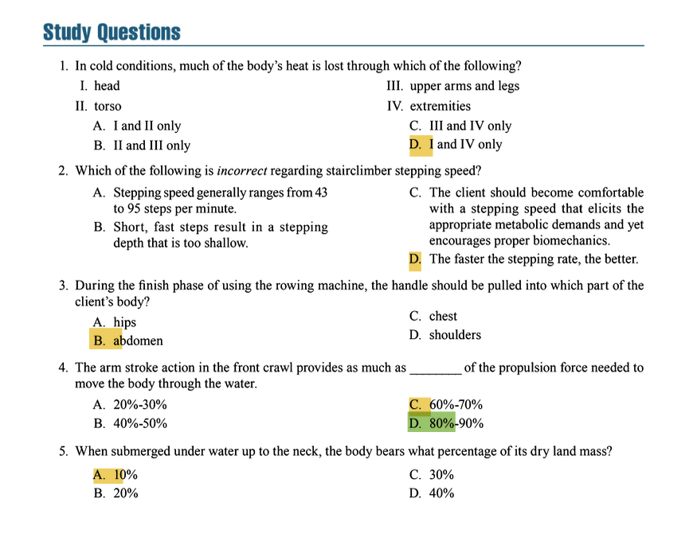

# Cardiovascular Exercise Techniques

## 1 CLOTHING AND FOOTWEAR

### Key Concepts & Exam Focus
- **Purpose**: Clothing and footwear are designed to enhance **comfort**, **safety**, and **performance** during cardiovascular exercise. Proper selection helps regulate body temperature, manage moisture, and provide support.
- **Hydration**: Adequate fluid intake is critical. The **general guideline** is to consume **5–7 mL of fluid per kilogram of body weight** at least 4 hours before exercise. For every pound (0.45 kg) of body weight lost during exercise, **20–24 ounces (approx. 600–710 mL) of fluid** should be consumed to rehydrate.
- **Exam Focus**: Understand hydration guidelines, the role of moisture-wicking fabrics, and the importance of proper footwear selection (e.g., cushioning, stability, flexibility).

### Critical Statistics & Specifics
- **Shoe Replacement**: Shoes should be replaced every **300–500 miles** (approx. 480–800 km) to maintain adequate cushioning and support.
- **Environmental Considerations**:
  - In **cold conditions**, significant heat loss occurs through the **head and extremities** (e.g., hands and feet). Layering with moisture-wicking base layers, insulating mid-layers, and wind/water-resistant outer layers is recommended.
  - In **hot/humid conditions**, light-colored, loose-fitting, and breathable clothing is advised to facilitate heat dissipation.

### Technique & Safety Precautions
- **Safety**: Avoid cotton clothing as it retains moisture and can lead to chafing and discomfort. Instead, use **synthetic moisture-wicking fabrics**.
- **Footwear**: Ensure shoes are activity-specific (e.g., running shoes for treadmill work, with adequate heel cushioning and arch support).

### Study Question Integration
- **Study Question 1 Answer**: In cold conditions, much of the body’s heat is lost through the **head and extremities** (Answer: D. I and IV only).

---

## 2 TRAINING ON CARDIOVASCULAR MACHINES

### 2.1 Treadmill
#### Key Concepts & Exam Focus
- **Usage**: Treadmills allow for walking, jogging, or running in a controlled environment. Key variables include **speed** and **incline**.
- **Exam Focus**: Understand safety protocols (e.g., emergency stop clip), proper handrail use (minimal grip to avoid postural compromises), and how incline affects intensity.

#### Critical Statistics & Specifics
- **Speed Guidelines**: Novice clients should start at speeds not exceeding **4.0–4.5 mph** for walking and **5.5–6.5 mph** for running.
- **Incline Limitations**: Most clients should avoid sustained inclines above **7–10%** due to increased stress on the Achilles tendon and plantar fascia.

#### Technique & Safety Precautions
- **Starting Procedure**: Begin with feet on side rails; start the belt at slow speeds. Always use the emergency stop clip.
- **Form**: Maintain an upright posture with a neutral spine. Avoid excessive handrail support.

### 2.2 Stair Climber (Stepper Machines)
#### Key Concepts & Exam Focus
- **Usage**: Simulates stair climbing. Focus on **controlled stepping speed** and **full foot contact** with pedals.
- **Exam Focus**: Know that stepping speed should prioritize proper biomechanics over speed.

#### Critical Statistics & Specifics
- **Stepping Speed**: Generally ranges from **43 to 95 steps per minute**. Short, fast steps may result in too shallow a stepping depth.
- **Step Depth**: Should not exceed **6–8 inches** to minimize patellofemoral stress.

#### Technique & Safety Precautions
- **Form**: Maintain an upright posture with knees tracking in line with toes. Avoid leaning on handrails.
- **Safety**: Contraindicated for clients with knee osteoarthritis or patellofemoral pain.

#### Study Question Integration
- **Study Question 2 Answer**: The statement that is *incorrect* regarding stairclimber stepping speed is **D. The faster the stepping rate, the better** (emphasis on controlled speed for proper biomechanics).

### 2.3 Elliptical Trainer
#### Key Concepts & Exam Focus
- **Usage**: Provides low-impact, total-body cardiovascular exercise. Key features include **ramp incline** and **resistance settings**.
- **Exam Focus**: Understand the low-impact benefits and the importance of full foot contact.

#### Technique & Safety Precautions
- **Form**: Keep the entire foot in contact with the pedal. Knees should not move past the toes to reduce stress.
- **Special Populations**: Ideal for clients with joint replacements or arthritis.

### 2.4 Stationary Bicycle
#### Key Concepts & Exam Focus
- **Types**: Upright and recumbent. Focus on **proper seat height** and **cadence**.
- **Exam Focus**: Know how to adjust seat height for optimal knee flexion (25–30° at the bottom of the pedal stroke).

#### Critical Statistics & Specifics
- **Cadence Guidelines**: Typically **60–100 rpm**.
- **Seat Height Calculation**: For upright bikes, seat height = inseam × 1.09 (measured from the center of the bottom bracket).

#### Technique & Safety Precautions
- **Form**: Maintain a slight forward lean with relaxed shoulders.
- **Special Populations**: Recumbent bikes are beneficial for clients with lower back pain or balance issues.

### 2.5 Upper Body Ergometer (Arm Ergometer)
#### Key Concepts & Exam Focus
- **Usage**: Provides cardiovascular exercise focusing on the upper body. Often used for clients with lower extremity limitations.
- **Exam Focus**: Recognize that heart rate during arm ergometry is typically **10–15 bpm higher** than during leg exercise at the same oxygen consumption.

#### Technique & Safety Precautions
- **Form**: Avoid shrugging shoulders to prevent upper trapezius overuse.
- **Contraindications**: Not recommended for clients with shoulder impingement or rotator cuff pathology.

### 2.6 Rowing Machine
#### Key Concepts & Exam Focus
- **Usage**: Full-body cardiovascular exercise. The stroke consists of the **catch**, **drive**, and **recovery** phases.
- **Exam Focus**: Understand the proper sequence of the rowing stroke (legs → torso → arms).

#### Technique & Safety Precautions
- **Form**: During the **finish phase**, the handle should be pulled to the **chest or upper abdomen**.
- **Common Errors**: Avoid initiating the pull with the arms instead of the legs.

#### Study Question Integration
- **Study Question 3 Answer**: During the finish phase of using the rowing machine, the handle should be pulled into the **chest** (Answer: C. chest).

---

## 3 NONMACHINE CARDIOVASCULAR EXERCISE TECHNIQUES

### 3.1 Walking and Running
#### Key Concepts & Exam Focus
- **Gait Mechanics**: Walking involves a heel-to-toe rolling pattern; running includes a flight phase.
- **Exam Focus**: Understand impact forces (walking: ~1.0–1.5 times body weight; running: ~2.5–3.0 times body weight).

#### Critical Statistics & Specifics
- **Progression**: Follow the **10% rule** (increase weekly distance or time by no more than 10% per week).

#### Technique & Safety Precautions
- **Terrain**: Soft surfaces reduce impact but may increase ankle instability risk.

### 3.2 Swimming
#### Key Concepts & Exam Focus
- **Propulsion**: The arm stroke in the front crawl provides **80–90%** of the propulsion force.
- **Buoyancy**: When submerged up to the neck, the body bears only **10%** of its dry land mass due to buoyancy.

#### Technique & Safety Precautions
- **Breathing**: Exhale continuously underwater to establish rhythmic breathing.
- **Safety**: Ensure basic swimming competency. Not recommended for clients with uncontrolled epilepsy or open wounds.

#### Study Question Integration
- **Study Question 4 Answer**: The arm stroke action in the front crawl provides **80–90%** of the propulsion force (Answer: D. 80%-90%).
- **Study Question 5 Answer**: When submerged under water up to the neck, the body bears **10%** of its dry land mass (Answer: A. 10%).

### 3.3 Group Exercise Classes
#### Key Concepts & Exam Focus
- **Leadership**: Instructors should hold certifications from recognized organizations (e.g., ACE, ACSM).
- **Exam Focus**: Know the importance of form maintenance and impact modifications.

#### Critical Statistics & Specifics
- **Music Tempo**: Typically **120–140 beats per minute** for most cardio formats.

#### Technique & Safety Precautions
- **Safety**: Encourage participants to prioritize form over speed and use appropriate modifications.

---

## Key Points from the Chapter
- **Hydration**: Fluid intake guidelines are critical for safety and performance.
- **Footwear**: Replace shoes every 300–500 miles to maintain support and cushioning.
- **Machine-Specific Techniques**: Each cardiovascular machine requires specific form and safety considerations (e.g., treadmill incline limits, rowing stroke sequence).
- **Non-Machine Exercises**: Swimming and walking/running have unique biomechanical and safety considerations (e.g., propulsion forces in swimming, impact forces in running).
- **Study Questions**: Answers are integrated throughout the guide and are frequently tested on exams.

### Question 1
**Correct Answer:** D. I and IV only

**Textbook Reference:**
"In cold conditions, a large amount of heat can be lost through the head and the extremities (hands and feet)."
(Chapter 14, "Clothing and Footwear")

**Incorrect Options:**
*   A. I and II only: While the head (I) is correct, heat loss is not significantly concentrated in the upper arms and legs (II) compared to the extremities.
*   B. II and III only: The torso (III) is a core area that the body works to keep warm; it is not a primary source of heat loss. The upper arms and legs (II) are also not primary sites.
*   C. III and IV only: While the extremities (IV) are correct, the torso (III) is insulated and is not a primary source of heat loss.

### Question 2
**Correct Answer:** D. The faster the stepping rate, the better.

**Textbook Reference:**
"A fast stepping rate is not desirable if it results in a stepping depth that is too shallow... the faster the stepping rate, the greater the chance that the client will use momentum instead of muscular effort to move the steps."
(Chapter 14, "Training on Cardiovascular Machines: Stair Climber")

**Incorrect Options:**
*   A. Stepping speed generally ranges from 43 to 95 steps per minute: This is a correct statement from the textbook regarding common stepping speeds.
*   B. Short, fast steps result in a stepping depth that is too shallow: This is a correct statement explaining the biomechanical drawback of a fast stepping rate.
*   C. The client should become comfortable with a stepping speed that elicits the appropriate metabolic demands and yet encourages proper biomechanics: This is a correct statement summarizing the appropriate goal for stepping speed.

### Question 3
**Correct Answer:** C. chest

**Textbook Reference:**
"The handle should be pulled to the chest... The finish is the final position of the drive... elbows are pulled backward past the torso and the handle is held against the chest or upper abdomen."
(Chapter 14, "Training on Cardiovascular Machines: Rowing Machine")

**Incorrect Options:**
*   A. hips: Pulling the handle to the hips would indicate an incomplete range of motion and improper technique, failing to engage the upper back muscles effectively.
*   B. abdomen: While "upper abdomen" is sometimes noted as the target area alongside the chest, pulling only to the lower abdomen would be incorrect and represent a weak finish to the stroke.
*   D. shoulders: Pulling the handle to the shoulders would involve excessive shoulder elevation and shrugging, which is an incorrect and inefficient technique.

### Question 4
**Correct Answer:** D. 80%-90%

**Textbook Reference:**
"The arm stroke action provides as much as 80% to 90% of the propulsion force."
(Chapter 14, "Nonmachine Cardiovascular Exercise Techniques: Swimming")

**Incorrect Options:**
*   A. 20%-30%: This percentage is far too low. The arm stroke is the primary source of propulsion in the front crawl.
*   B. 40%-50%: This underestimates the significant contribution of the arm stroke to forward movement.
*   C. 60%-70%: While a major contribution, this still underestimates the force produced by the arms, which the textbook specifies is up to 90%.

### Question 5
**Correct Answer:** A. 10%

**Textbook Reference:**
"When a person is submerged in water up to the neck, the body is bearing only approximately 10% of its total land body weight."
(Chapter 14, "Nonmachine Cardiovascular Exercise Techniques: Swimming")

**Incorrect Options:**
*   B. 20%: This overestimates the weight-bearing load in water. The buoyant force of water significantly reduces weight-bearing.
*   C. 30%: This significantly overestimates the load. A key benefit of aquatic exercise is its low-impact, low weight-bearing nature.
*   D. 40%: This is incorrect and far too high. At neck level, buoyancy supports nearly all of the body's weight.