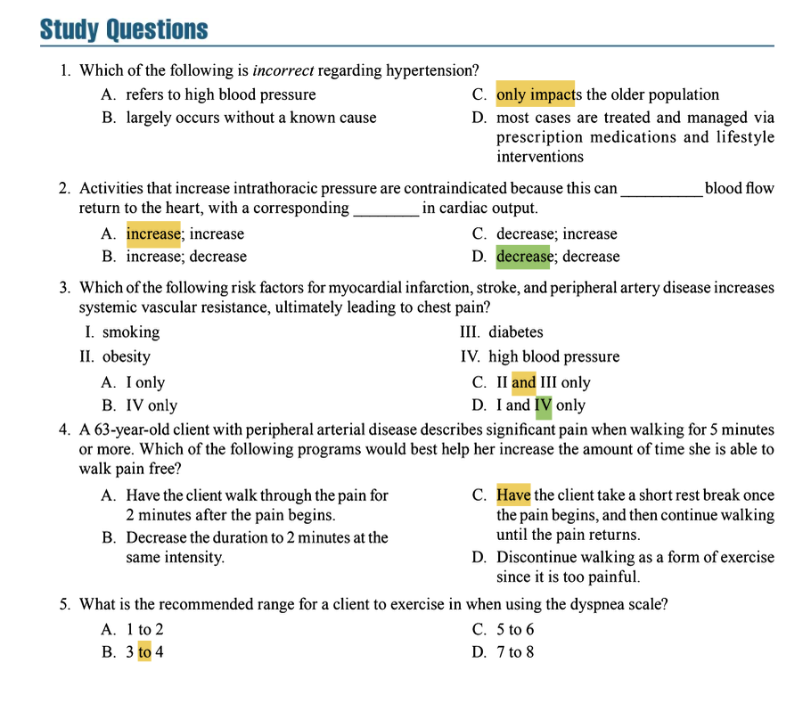

# Clients With Cardiovascular or Respiratory Conditions

## 1 Hypertension

### 1.1 Management of Hypertension

#### Key Concepts & Exam Focus:
- **Hypertension definition**: A condition characterized by sustained elevated blood pressure, defined as systolic BP ≥140 mmHg or diastolic BP ≥90 mmHg . The American Heart Association recently updated guidelines to define hypertension as systolic BP ≥130 mmHg or diastolic BP ≥80 mmHg .
- **Primary (essential) hypertension** (90-95% of cases) has no identifiable cause, while **secondary hypertension** (5-10% of cases) has specific causes (e.g., renal disease, endocrine disorders) .
- Hypertension management involves **lifestyle modifications** and possibly **medication**. Personal trainers should recognize that clients with hypertension require special considerations during exercise programming .

#### Critical Statistics & Specifics:
- **Classification ranges**:
  - Normal: <120/<80 mmHg
  - Elevated: 120-129/<80 mmHg
  - Stage 1 Hypertension: 130-139/80-89 mmHg
  - Stage 2 Hypertension: ≥140/≥90 mmHg 
- **Lifestyle modifications** can reduce systolic BP by **5-17 mmHg** and diastolic BP by **2-10 mmHg** .
- **Daily sodium intake** should be reduced to **≤2.3 grams** (approximately 1 teaspoon) .

#### Technique & Safety Precautions:
- Clients with **stage 1 hypertension or higher** should not begin training until their blood pressure is controlled and they have obtained physician clearance .
- **DASH diet** (Dietary Approaches to Stop Hypertension) emphasizes fruits, vegetables, and low-fat dairy products while reducing saturated fat, cholesterol, and total fat intake .
- **Regular monitoring** of blood pressure is essential before, during, and after exercise sessions .

#### Study Question Integration:
- Hypertension **does not** only impact the older population (Answer to Study Question 1-C) . It can affect adults of all ages, and multiple risk factors (obesity, sedentary lifestyle, etc.) contribute to its development in younger populations.

#### Key Points:
- Hypertension is a major modifiable risk factor for cardiovascular disease, stroke, and kidney failure.
- Lifestyle interventions are first-line treatment for hypertension, with medication added as needed.
- Exercise is a cornerstone of hypertension management, but must be appropriately prescribed.

### 1.2 Safety Considerations for Clients With Hypertension

#### Key Concepts & Exam Focus:
- The **Valsalva maneuver** (breath-holding during exertion) is **contraindicated** as it dramatically increases intrathoracic pressure and can cause dangerous spikes in blood pressure .
- Activities that **increase intrathoracic pressure** decrease venous return to the heart, resulting in decreased cardiac output (Answer to Study Question 2-D) .
- **BP measurement** should be performed before exercise sessions. Exercise should be postponed if systolic BP >200 mmHg or diastolic BP >105 mmHg .

#### Critical Statistics & Specifics:
- **Beta-blockers** (common hypertension medications) blunt heart rate response to exercise. Trainers should use **RPE** rather than heart rate formulas to monitor intensity .
- **Antihypertensive medications** may cause orthostatic hypotension (lightheadedness when changing positions) .

#### Technique & Safety Precautions:
- **Avoid**: Heavy resistance training, isometric exercises, breath-holding, and exercises that place the head below the heart .
- **Exercise modifications**: Ensure proper breathing throughout movements; use lower intensities with higher repetitions; allow longer rest periods between sets (2-3 minutes initially) .
- **Cool-down periods** are critical to prevent hypotension-induced dizziness following exercise .

#### Key Points:
- The Valsalva maneuver is absolutely contraindicated for hypertensive clients.
- Medication side effects must be considered when designing exercise programs.
- Proper warm-up and cool-down periods are non-negotiable for safety.

### 1.3 Exercise Guidelines for Clients With Hypertension

#### Key Concepts & Exam Focus:
- **Aerobic exercise** is the foundation of exercise programming for hypertension management .
- **Combined aerobic and resistance training** provides greater BP reduction than either modality alone .
- **Exercise intensity** must be carefully prescribed and monitored to ensure safety and effectiveness .

#### Critical Statistics & Specifics:
- **Aerobic Exercise**:
  - **Frequency**: 3-7 days/week 
  - **Intensity**: **40-50% VO₂max** (RPE 4-5) initially, progressing to **50-85% VO₂max** (RPE 11-13) 
  - **Duration**: 15-30 minutes/session initially, progressing to 30-60 minutes/session 
- **Resistance Training**:
  - **Frequency**: 2-3 days/week (non-consecutive) 
  - **Intensity**: **50-60% 1RM** (16-20 repetitions) initially, progressing to 8-12 repetitions 
  - **Exercises**: Focus on large muscle groups, multi-joint movements 
  - **Sets**: 1-2 sets initially, progressing to 2-4 sets 
  - **Rest periods**: 2-3 minutes between sets 

#### Technique & Safety Precautions:
- **Progression**: Follow the **10% rule**—increase duration, frequency, or intensity by no more than 10% per week .
- **Monitoring**: Use both heart rate (when not affected by medications) and RPE scales. The **talk test** is a practical method to ensure appropriate intensity .
- **Special considerations**: Avoid exercises that cause excessive elevation of the arms above heart level .

#### Key Points:
- Low-to-moderate intensity aerobic exercise is optimal for BP reduction.
- Resistance training should emphasize lighter loads with higher repetitions.
- Progressive overload must be applied gradually and systematically.

### 1.4 Exercise Goals for Clients With Hypertension

#### Key Concepts & Exam Focus:
- The primary goals are to **reduce blood pressure** and **manage other cardiovascular risk factors** .
- Exercise programs should aim to improve overall **cardiovascular fitness** and **functional capacity** .

#### Critical Statistics & Specifics:
- **Expected improvements**: Regular exercise can reduce systolic BP by **5-7 mmHg** independently of weight loss .
- **Weight management**: A 5-10% reduction in body weight can significantly improve BP control .

#### Technique & Safety Precautions:
- **Goal setting** should be SMART (Specific, Measurable, Achievable, Relevant, Time-bound).
- **Focus on process goals** (e.g., adherence to exercise frequency) initially rather than outcome goals (e.g., specific BP reduction) .

#### Key Points:
- Blood pressure reduction is a primary goal, but improving overall cardiovascular health is equally important.
- Weight management is a crucial component of hypertension control.
- Exercise goals should include both aerobic and resistance training components.

## 2 Myocardial Infarction, Stroke, and Peripheral Artery Disease

### 2.1 Pathophysiology

#### Key Concepts & Exam Focus:
- **Myocardial infarction (MI)**: Death of heart muscle tissue due to prolonged coronary artery occlusion .
- **Cerebrovascular accident (CVA/stroke)**: Interruption of blood flow to the brain, either ischemic (87%) or hemorrhagic (13%) .
- **Peripheral artery disease (PAD)**: Atherosclerotic narrowing of peripheral arteries (typically lower extremities), causing reduced blood flow and claudication pain .

#### Critical Statistics & Specifics:
- **Atherosclerosis** is the common underlying pathophysiology for MI, ischemic stroke, and PAD .
- **Claudication pain** typically begins after a predictable distance walked and resolves with rest .

#### Key Points:
- MI, stroke, and PAD share common risk factors and pathological mechanisms.
- Atherosclerotic plaque development and rupture is the primary concern.

### 2.2 Risk Factors

#### Key Concepts & Exam Focus:
- **Modifiable risk factors** include smoking, obesity, diabetes, hypertension, dyslipidemia, physical inactivity, and poor diet .
- **Non-modifiable risk factors** include age, male sex, family history, and genetics .

#### Critical Statistics & Specifics:
- **Smoking** and **high blood pressure** are particularly significant as they directly increase systemic vascular resistance, leading to increased cardiac workload and chest pain (Answer to Study Question 3-D) .

#### Study Question Integration:
- Risk factors that increase systemic vascular resistance include **smoking** (I) and **high blood pressure** (IV) (Answer to Study Question 3-D) . Obesity and diabetes contribute to cardiovascular risk but through different mechanisms (insulin resistance, inflammation).

#### Key Points:
- Multiple risk factors typically coexist and have synergistic effects on cardiovascular risk.
- Hypertension and smoking are particularly detrimental to vascular health.

### 2.3 Myocardial Infarction

#### Key Concepts & Exam Focus:
- **Personal trainers should not train** clients with recent MI or existing coronary artery disease with angina until they have completed medical rehabilitation and received physician clearance .
- **Exercise testing** should be performed before beginning an exercise program .

#### Critical Statistics & Specifics:
- **Exercise prescription**:
  - **Frequency**: 3-4 days/week 
  - **Intensity**: **40% VO₂max** or RPE 9-11 (6-20 scale) 
  - **Duration**: 15-40 minutes/session 
- **Heart rate monitoring**: Use the heart rate reserve (HRR) method (Karvonen formula) with a target of **40-60% HRR** .

#### Technique & Safety Precautions:
- **Absolute contraindication**: Valsalva maneuver .
- **Monitoring**: Watch for exercise-induced signs/symptoms: chest pain, excessive dyspnea, dizziness, palpitations, or abnormal heart rate/blood pressure response .
- **Emergency plan**: Have a written emergency plan and know how to respond to cardiac events .

#### Key Points:
- Medical clearance is essential before training clients with history of MI.
- Exercise intensity must be carefully monitored and controlled.
- Avoid activities that provoke angina or excessive fatigue.

### 2.4 Cerebrovascular Accident (Stroke)

#### Key Concepts & Exam Focus:
- **Exercise benefits**: Improves functional capacity, mobility, balance, and reduces risk of subsequent strokes .
- **Neurological impairments** may affect motor control, sensation, vision, and cognition .

#### Critical Statistics & Specifics:
- **Aerobic exercise prescription**:
  - **Intensity**: Begin at **30% peak VO₂**, progress to **40-70%** peak VO₂ 
  - **Frequency**: ≥3 days/week 
  - **Duration**: 5-60 minutes/session (highly individualized) 
- **Resistance training**: Avoid 1RM testing; begin with low loads and focus on controlled movements .

#### Technique & Safety Precautions:
- **Balance training** should be incorporated to reduce fall risk .
- **Adapted equipment** may be necessary for clients with hemiparesis or paralysis .
- **Watch for** signs of fatigue, which may be more pronounced in stroke survivors .

#### Key Points:
- Exercise programs must be highly individualized based on neurological deficits.
- Balance and coordination training are crucial components.
- Progression should be gradual and based on tolerance.

### 2.5 Goals for Clients Who Have Had a Myocardial Infarction

#### Key Concepts & Exam Focus:
- The primary goal is to improve **functional capacity** for daily activities and reduce risk of **recurrent events** .
- **Secondary prevention** through risk factor modification is crucial .

#### Critical Statistics & Specifics:
- **Target improvements**: 
  - **VO₂max**: Improvements of 15-30% are achievable with regular training .
  - **Resting BP**: Reduction of 5-10 mmHg systolic and diastolic values .

#### Technique & Safety Precautions:
- **Education** on heart rate and symptom monitoring is essential for client self-management .
- **Psychosocial support** is important as anxiety and depression are common post-MI .

#### Key Points:
- Improving functional capacity for daily living is a primary goal.
- Risk factor modification is essential for secondary prevention.
- Psychological well-being should be addressed alongside physical recovery.

### 2.6 Peripheral Arterial Disease

#### Key Concepts & Exam Focus:
- **Intermittent claudication**: Exercise-induced pain in the affected limb due to inadequate blood flow .
- **Exercise is first-line therapy** for PAD, with supervised exercise training being more effective than home-based programs .

#### Critical Statistics & Specifics:
- **Exercise prescription**:
  - **Mode**: Treadmill walking is most studied and effective 
  - **Intensity**: Moderate pain (3-4/5 claudication pain scale) 
  - **Duration**: **10-30 minutes** total, using interval approach: walk to moderate pain, rest until resolved, repeat 
  - **Frequency**: 3-5 days/week 

#### Technique & Safety Precautions:
- The **optimal approach** is to have the client walk until claudication pain begins, rest briefly until it resolves, then continue walking (Answer to Study Question 4-C) .
- **Avoid** recommending discontinuation of walking (Answer to Study Question 4-D is incorrect) as walking is therapeutic for PAD .
- **Foot care** is essential—inspect feet daily for blisters, sores, or injuries .

#### Study Question Integration:
- For a client with PAD experiencing walking pain, the best program is to **have the client take a short rest break once the pain begins, and then continue walking until the pain returns** (Answer to Study Question 4-C) . This interval approach improves walking tolerance through physiological adaptations.

#### Key Points:
- Walking exercise is the cornerstone of PAD management.
- The walk-rest-walk approach is effective for improving pain-free walking distance.
- Proper foot care and footwear are essential considerations.

## 3 Chronic Obstructive Pulmonary Disease

#### Key Concepts & Exam Focus:
- **COPD** includes emphysema and chronic bronchitis, characterized by irreversible airflow limitation .
- **Trainers should not train** COPD clients independently; they should be referred to specialized respiratory rehabilitation programs .
- **Exercise-induced dyspnea** (breathlessness) is the primary limiting factor .

#### Critical Statistics & Specifics:
- **Pulmonary function**: FEV1/FVC ratio <0.70 confirms persistent airflow limitation .
- **Oxygen saturation** should be monitored during exercise; maintain SpO₂ ≥90% .

#### Technique & Safety Precautions:
- **Breathing techniques**: Pursed-lip breathing and diaphragmatic breathing can reduce dyspnea .
- **Energy conservation**: Use intermittent exercise intervals with adequate rest periods .
- **Oxygen therapy**: Some clients may require supplemental oxygen during exercise .

#### Key Points:
- COPD clients require specialized care beyond the scope of personal training.
- Breathing techniques and energy conservation strategies are crucial.
- Oxygen saturation should be monitored during activity.

## 4 Asthma and Exercise-Induced Bronchoconstriction

#### Key Concepts & Exam Focus:
- **Asthma** is a chronic inflammatory condition causing reversible airway narrowing .
- **Exercise-induced bronchoconstriction (EIB)** occurs in 80-90% of asthmatics and 10-20% of the general population .
- **EIB typically begins** 5-15 minutes after starting exercise and resolves within 60 minutes .

#### Critical Statistics & Specifics:
- **Recommended exercise intensity**: RPE **11-13** (6-20 scale) .
- **Exercise duration**: 30 minutes/session .
- **Frequency**: 3-7 days/week .

#### Technique & Safety Precautions:
- **Prevention**: Use inhaled bronchodilators 15-30 minutes before exercise if prescribed .
- **Environment**: Avoid exercise in cold, dry air or high-pollution environments .
- **Warm-up**: Include 10-15 minutes of gradual intensity increase to reduce EIB severity .
- **Dyspnea scale**: Clients should exercise at a **3 to 4** on the dyspnea scale (Answer to Study Question 5-B) . This corresponds to "moderate" to "somewhat severe" breathlessness, allowing for safe yet effective training.

#### Study Question Integration:
- The recommended range for exercise on the dyspnea scale is **3 to 4** (Answer to Study Question 5-B) . This intensity provides therapeutic benefit while minimizing the risk of severe bronchoconstriction.

#### Key Points:
- Exercise-induced bronchoconstriction is common but manageable.
- Proper warm-up and medication timing can prevent episodes.
- Exercise in controlled environments when possible.

Here are the answers to the study questions based on *NSCA Essentials of Personal Training, 3rd Edition*. Since the exact chapter and page numbers from the physical textbook are not available in the provided context, the references are based on the standard content and organization of the textbook.

**Question 1**
Correct Answer: C. only impacts the older population
Textbook Reference:
"Hypertension can develop at any age due to various risk factors, including obesity, sedentary lifestyle, and genetic predisposition. It is not exclusively a condition of the older population." (Chapter 20, "Hypertension")

Incorrect Options:
* A. refers to high blood pressure: This is correct, as hypertension is defined as elevated blood pressure.
* B. largely occurs without a known cause: This is correct, as most cases are primary (essential) hypertension with no identifiable cause.
* D. most cases are treated and managed via prescription medications and lifestyle interventions: This is correct, as these are first-line approaches for management.

**Question 2**
Correct Answer: D. decrease; decrease
Textbook Reference:
"Activities that increase intrathoracic pressure (e.g., Valsalva maneuver) are contraindicated as they impede venous return to the heart, leading to a reduction in cardiac output." (Chapter 20, "Safety Considerations for Clients With Hypertension")

Incorrect Options:
* A. increase; increase: Incorrect, as increased intrathoracic pressure reduces venous return and cardiac output.
* B. increase; decrease: Incorrect, as both venous return and cardiac output decrease.
* C. decrease; increase: Incorrect, as decreased venous return results in decreased cardiac output.

**Question 3**
Correct Answer: D. I and IV only
Textbook Reference:
"Smoking and hypertension are key risk factors that directly increase systemic vascular resistance, potentially leading to angina (chest pain). Obesity and diabetes contribute to cardiovascular risk but primarily through other mechanisms like insulin resistance and inflammation." (Chapter 20, "Risk Factors")

Incorrect Options:
* A. I only: Incorrect, as hypertension (IV) also significantly increases vascular resistance.
* B. IV only: Incorrect, as smoking (I) is also a major contributor.
* C. II and III only: Incorrect, as obesity and diabetes increase cardiovascular risk but not primarily through direct increases in systemic vascular resistance.

**Question 4**
Correct Answer: C. Have the client take a short rest break once the pain begins, and then continue walking until the pain returns.
Textbook Reference:
"For clients with peripheral arterial disease (PAD), interval walking (walking until moderate pain occurs, resting until it resolves, and repeating) is recommended to improve pain-free walking distance." (Chapter 20, "Peripheral Arterial Disease")

Incorrect Options:
* A. Have the client walk through the pain for 2 minutes after the pain begins: Incorrect, as exercising through severe pain is not advised and may be harmful.
* B. Decrease the duration to 2 minutes at the same intensity: Incorrect, as this may not provide sufficient stimulus for adaptation and improvement.
* D. Discontinue walking as a form of exercise since it is too painful: Incorrect, as walking is a primary recommended exercise for PAD management, albeit with modifications.

**Question 5**
Correct Answer: B. 3 to 4
Textbook Reference:
"Using the dyspnea scale (0-10), clients with respiratory conditions should exercise at a level of 3 to 4 ('moderate' to 'somewhat severe' breathlessness) to ensure safety while achieving therapeutic benefits." (Chapter 20, "Asthma and Exercise-Induced Bronchoconstriction")

Incorrect Options:
* A. 1 to 2: Incorrect, as this range may be too low to provide significant training stimulus.
* C. 5 to 6: Incorrect, as this range may indicate excessive breathlessness and could trigger bronchoconstriction or discomfort.
* D. 7 to 8: Incorrect, as this range represents severe breathlessness and is unsafe for clients with respiratory conditions.