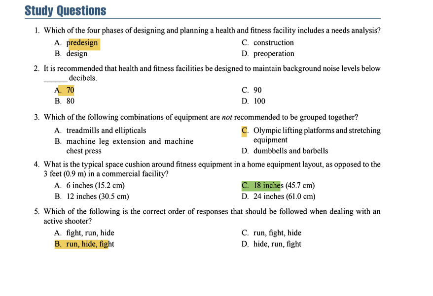

### Facility and Equipment Layout and Maintenance

---

#### **1. FACILITY DESIGN AND PLANNING**

**Key Concepts:**
*   The process of designing and planning a facility is divided into **four distinct phases**: Predesign, Design, Construction, and Preoperation.
*   A **Facility Design Committee** must be formed, consisting of various professionals, including administrators, an architect, a contractor, and **a personal trainer**.
*   The committee's work is essential for both new facilities and renovations/expansions of existing ones.

**Phase 1: Predesign Phase**
*   **Needs Analysis:** The committee must answer fundamental questions to define the project's scope:
    *   Who is the target clientele?
    *   What is the expected number of users?
    *   What is the facility's location and main focus?
    *   What programs, services, and budget are available?
    *   Who will supervise the facility?
*   **Feasibility Study:** Determines if the project should proceed based on the needs analysis. A **SWOT analysis** (Strengths, Weaknesses, Opportunities, Threats) is a key component.
*   **Master Plan:** Created if the feasibility study is positive. It details the project's goals, procedures, and specific objectives (e.g., types and quantities of equipment needed).
*   **Architect Selection:** Based on a bid process evaluating costs and experience.
*   **Future Planning:** A common mistake is failing to plan for future expansion or alternative uses of space.

**Study Question Integration:**
*   **Study Question 1:** Which of the four phases includes a needs analysis?
    *   **Answer: A. Predesign.** The needs analysis is the first step undertaken in the predesign phase.

**Phase 2: Design Phase**
*   This phase results in a **detailed blueprint** of the facility.
*   The committee works closely with the architect and other professionals to finalize the design, considering equipment spacing and all relevant health, safety, and legal codes.

**Phase 3: Construction Phase**
*   This is the longest phase. The committee must **oversee the construction** to ensure it adheres to the master plan and meets deadlines.

**Phase 4: Preoperation Phase**
*   Focuses on **staffing and staff development**.
*   The committee must determine the number and qualifications of staff needed, recruitment strategies, and training protocols.

---

#### **2. FACILITY SPECIFICATION GUIDELINES**

**Key Concepts:**
*   Personal trainers must be familiar with the structural specifications for the entire facility and the resistance training room to ensure a safe and effective environment.
*   Compliance with the **Americans with Disabilities Act (ADA)** is mandatory.

**A. General Facility Guidelines**
*   **Passageways:** Must be at least **36 inches (91.4 cm)** wide (ADA). Hallways should be **60 inches (152.4 cm)**. Door thresholds should not exceed **0.5 inches (1.3 cm)**.
*   **Lighting & Windows:** Natural lighting is desirable. Higher windows or skylights must be evaluated to prevent glare.
*   **Noise:** Background noise levels should be maintained **below 70 decibels** and never exceed **90 decibels**. The occupational noise exposure limit (TWA) is **85 dB** for 8 hours. Urethane-coated weights can reduce noise.
*   **Electrical:** Facilities require both **110V and 220V** outlets. **Ground-fault circuit interrupters (GFCIs)** are essential safety devices.
*   **Temperature & Humidity:** Recommended temperature is **68-78°F (20-26°C)**. The ventilation system should provide **8-15 air exchanges per hour**. Optimal humidity is **≤50%** (no higher than 60%).
*   **Emergency Equipment:** **AEDs** must be located within a **1.5-minute walk** of any potential incident site and must be accessible from a wheelchair.
*   **Other:** Signage, communication boards, telephones, and a suggestion box should be strategically placed.

**Study Question Integration:**
*   **Study Question 2:** It is recommended that health and fitness facilities be designed to maintain background noise levels below ______ decibels.
    *   **Answer: A. 70.** The text explicitly states the recommendation is to keep levels below 70 decibels.

**B. Resistance Training Room Guidelines**
*   **Location:** Ideal location is on the ground floor near locker rooms and a service entrance. Should be away from quiet areas (e.g., libraries, classrooms).
*   **Supervision:** A supervisor's office should have an unobstructed view of the room. The recommended staff-to-member ratio is **no more than 100:1**.
*   **Ceiling Height:** **12-14 feet (3.7-4.3 m)** is desirable to accommodate overhead exercises and utilities.
*   **Mirrors:** Must be installed at least **20 inches (50.8 cm)** above the floor. All equipment should be placed at least **6 inches (15.2 cm)** away from mirrors to prevent breakage. Protective rails or padding can be used.
*   **Flooring:**
    *   **Poured rubber** is the best (most durable, seamless).
    *   **Interlocking rubber mats** are a good alternative but can trap debris.
    *   **Carpet** is the least expensive but least durable.
    *   **Wood** is best for Olympic platforms.
    *   If not on the ground floor, the floor must have a load-bearing capacity of at least **100 lbs per square foot (488.2 kg/m²)**.
*   **Walls:** Must be free of obstructions (e.g., extended bars, cables, unsecured mirrors).

---

#### **3. SELECTING EXERCISE EQUIPMENT**

**Key Concepts:**
*   The selection process involves **three phases** and uses tools like a tentative floor plan and a priority list (with safety as the highest priority).
*   There are no absolute standards for equipment quantity; it is based on a needs analysis.

**Phase 1: Develop Functional Criteria**
*   Understand the mechanics of equipment (e.g., cam, leverage, resistance systems) and the types of movements they allow.

**Phase 2: Evaluate Specifications and Effectiveness**
*   Key questions to ask regarding the target audience, budget, warranty, maintenance services, and delivery of parts.
*   **Estimating Cardio Equipment Needs:**
    1.  Estimate users in a 2-hour peak period = **25% of total membership**.
    2.  Estimate daily users = **33%** of the figure from step 1.
    3.  Apply a facility standard (e.g., 1 piece of cardio equipment per 5 daily users).
*   **General Guideline:** Provide at least **one circuit weight training area for every 1,000 users**.

**Phase 3: Evaluate Manufacturers’ Business Practices**
*   Review company records, product quality, customer service, and reputation.
*   Contact references and obtain bids from multiple manufacturers.
*   A **50% down payment** is common when placing an order.
*   **Delivery:** Confirm dates/times. Establish who is responsible for installation. **Inspect equipment immediately** upon delivery for any defects and record all serial and model numbers.

---

#### **4. FLOOR PLAN AND EQUIPMENT ORGANIZATION**

**Key Concepts:**
*   Equipment is organized into three areas: **Resistance Training, Aerobic Training, and Stretching/Bodyweight**.
*   The goals are to ensure **easy access, proper traffic flow, effective supervision, and safety**.

**A. Organization Principles**
*   Group equipment by **body part targeted** (can use color-coding), by **type** (e.g., all treadmills together), or by **brand**.
*   Create a **circuit training** area for time-efficient workouts.
*   Ensure the layout is accessible and inclusive for persons with disabilities.

**B. Equipment Spacing & Traffic Flow**
*   **General Space:** Provide **25-50 square feet (2.3-4.6 m²)** per piece of equipment.
*   **ADA Requirement:** A clear floor space of **30 x 48 inches (76.2 x 121.9 cm)** is required adjacent to each piece of equipment.
*   **Walkways:** An unobstructed pathway of at least **3 feet (0.9 m)** must be maintained. A walkway should bisect the room for emergency access.
*   **Specific Space Requirements:**
    *   **Stretching Area:** **40-60 sq ft (3.7-5.6 m²)** per user (**49 sq ft / 4.6 m²** is optimal).
    *   **Resistance Machines:** Spaced at least **2-3 feet (0.6-0.9 m)** apart.
    *   **Free-Weights:** Ends of barbells on racks should be **3 ft (0.9 m)** apart. The area should fit **3-4 people**.
    *   **Olympic Lifting Platform:** Requires **36 sq ft (3.3 m²)** of space, with perimeter walkways **3-4 ft (0.9-1.2 m)** wide.
    *   **Aerobic Equipment:** A **3 ft (0.9 m)** safety cushion is needed on all sides.
        *   Treadmill: **45 sq ft (4.2 m²)**
        *   Rower: **40 sq ft (3.7 m²)**
        *   Bike/Stair Machine: **24 sq ft (2.2 m²)**
        *   Ski Machine: **6 sq ft (0.6 m²)**
        *(Note: These larger numbers already include the safety cushion).*

**C. Equipment Placement Rules**
*   Place equipment needing a spotter in easily supervised areas, away from distractions.
*   Place taller machines along walls or pillars; bolt them down for stability.
*   Dumbbell racks should be against walls, at least **6 inches (15.2 cm)** from mirrors.
*   Arrange cardio equipment so taller machines (treadmills) are behind shorter ones (bikes) to avoid blocking views.
*   **Critical Safety Rule:** **Never place treadmills near medicine balls or stability balls.** A ball can be sucked under the belt, causing serious injury.
*   All equipment should be at least **6 inches (15.2 cm)** from mirrors.

**Study Question Integration:**
*   **Study Question 3:** Which combinations of equipment are *not* recommended to be grouped together?
    *   **Answer: C. Olympic lifting platforms and stretching equipment.** Olympic lifting is explosive and requires a segregated, safe space. Stretching areas should be quiet and low-traffic, making them incompatible.

---

#### **5. SPECIAL CONSIDERATIONS FOR A HOME FACILITY**

**Key Concepts:**
*   The principles of commercial design apply but on a smaller scale.
*   The personal trainer often advises clients on setting up a safe and effective home gym.

**A. Home Equipment Purchases**
*   Decisions must be based on: client needs/budget, available space (ceiling height, door width), equipment quality/warranty, and shipping costs.
*   Avoid equipment that is designed to be stored out of sight, as this creates a barrier to use.

**B. Home Environment Issues**
*   **Safety:** The primary concern is preventing access to the area by **children and pets**. Use safety gates and lock doors. **Disable equipment** when not in use (unplug treadmills, remove weight pins and plates).
*   **Electrical:** Ensure the electrical supply is sufficient. Use **GFCI-protected outlets**.
*   **Layout:** Equipment is typically arranged along the perimeter of the room.
*   **Space Cushion:** The safety space cushion is reduced to **18 inches (45.7 cm)** instead of 3 feet.
*   **Activity Space:** **25-49 square feet (2.3-4.6 m²)** is needed for activities like aerobics or bodyweight exercises.

**Study Question Integration:**
*   **Study Question 4:** What is the typical space cushion around fitness equipment in a home equipment layout?
    *   **Answer: C. 18 inches (45.7 cm).** This is explicitly stated as the reduced standard for home facilities.

---

#### **6. FACILITY AND EQUIPMENT MAINTENANCE**

**Key Concepts:**
*   Maintenance must be **proactive and preventive**, not reactive.
*   A **systematic daily, weekly, and monthly schedule** for inspection, maintenance, and cleaning is mandatory.
*   Follow **CDC guidelines** for disinfecting equipment.
*   Proper maintenance ensures **client safety, equipment longevity, and reduces liability**.

**A. Facility Maintenance**
*   **Floors:** Inspect daily for damage (splinters, gaps, tears). Clean with antifungal/antibacterial agents. Ensure flooring is glued/fastened properly.
*   **Walls & Mirrors:** Clean 2-3 times per week.
*   **Ceilings:** Often overlooked. Clean fixtures and replace damaged tiles as needed.

**B. Equipment Maintenance**
*   **General:** Post "Out of Order" signs on broken equipment or remove it entirely.
*   **Cleaning:** Provide cleaning supplies for users. Wear gloves when cleaning bodily fluids; wash hands afterwards.
*   **Resistance Machines:** Clean upholstery daily. Lubricate guide rods 2-3x/week. Inspect for loose parts weekly. Inspect weight plates for cracks weekly.
*   **Free-Weights:** Inspect bench welds monthly. Check dumbbells for loose hex nuts frequently. Keep floors clean and non-slip.
*   **Olympic Bars:** Lubricate and tighten bars. Clean knurling with a wire brush. Keep the platform area clear of clutter.
*   **Aerobic Equipment:** Clean surfaces contacting skin frequently. Lubricate moving parts 2-3x/week.
*   **Stretching/Bodyweight Areas:** Clean and disinfect mats daily. Inspect equipment like plyometric boxes monthly for wear.

---

#### **7. EMERGENCY RESPONSE PLAN**

**Key Concepts:**
*   A formal plan is required for **fires, environmental disasters, medical emergencies, and security threats**.
*   The plan must define specific **roles and responsibilities** for all staff.
*   Staff require regular training (CPR/AED, blood-borne pathogens) and must **practice the plan annually**.

**Active Shooter Protocol:**
*   The mandated order of response is: **Run, Hide, Fight**.
    1.  **RUN:** Evacuate if safe to do so. Leave belongings behind. Keep hands visible.
    2.  **HIDE:** If unable to run, hide in a secure area. Lock/block doors and silence phones.
    3.  **FIGHT:** As an absolute **last resort** and only if your life is in imminent danger, attempt to disrupt or incapacitate the shooter by using aggressive force and improvised weapons.

**Study Question Integration:**
*   **Study Question 5:** Which of the following is the correct order of responses that should be followed when dealing with an active shooter?
    *   **Answer: B. Run, Hide, Fight.** This is the explicit, mandated order described in the chapter.

Of course. Here are the answers to the study questions based on the provided excerpts from *NSCA's Essentials of Personal Training, 3rd Edition*.

**Question 1**
Correct Answer: A. predesign
Textbook Reference:
"The predesign phase involves conducting a needs analysis and a feasibility study." (Chapter 24, "Predesign Phase")

Incorrect Options:
*   B. design: The design phase involves creating a detailed blueprint from the plans established in the predesign phase; it does not involve the initial needs analysis.
*   C. construction: The construction phase involves overseeing the building process; the needs analysis is completed long before this phase begins.
*   D. preoperation: The preoperation phase focuses on staffing and operational plans, not the initial assessment of facility needs.

**Question 2**
Correct Answer: A. 70
Textbook Reference:
"It is recommended that health and fitness facilities be designed to maintain background noise levels below 70 decibels and never exceed 90 decibels." (Chapter 24, "General Health and Fitness Facility Guidelines")

Incorrect Options:
*   B. 80: While 80 dB is below the hazardous level, the textbook specifically recommends a background level below 70 dB.
*   C. 90: 90 dB is the level that should never be exceeded, not the recommended background level.
*   D. 100: 100 dB is well above the recommended maximum and would be considered hazardous.

**Question 3**
Correct Answer: C. Olympic lifting platforms and stretching equipment
Textbook Reference:
"A separate designated space for stretching should be set up in an area that has less traffic or is quieter." and "The platform area should be free of benches, boxes, and other clutter to give the client sufficient room to safely perform power and explosive exercises." Grouping a quiet stretching area with a platform for explosive, high-traffic Olympic lifts creates a safety hazard and contradicts the design principles for each space. (Chapter 24, "Equipment Placement" and "Olympic Lifting Area" maintenance)

Incorrect Options:
*   A. treadmills and ellipticals: These are both types of popular cardiovascular equipment and are commonly grouped together in an aerobic exercise area.
*   B. machine leg extension and machine chest press: These are both resistance training machines. While they target different body parts, grouping machines by type (e.g., all selectorized machines together) is a common and acceptable practice.
*   D. dumbbells and barbells: These are both free-weight equipment and are logically grouped together in the free-weight resistance area of a facility.

**Question 4**
Correct Answer: C. 18 inches (45.7 cm)
Textbook Reference:
"The space cushion around equipment is often reduced (e.g., 18 inches [45.7 cm] instead of 3 feet [0.9 m])." (Chapter 24, "Special Considerations for a Home Facility")

Incorrect Options:
*   A. 6 inches (15.2 cm): This is the minimum distance dumbbell racks and other equipment should be placed from mirrors to prevent breakage, not the safety space cushion around equipment.
*   B. 12 inches (30.5 cm): This is not a measurement cited for home equipment spacing in the provided text.
*   D. 24 inches (61.0 cm): This is closer to the correct answer but is not the specific measurement provided by the textbook.

**Question 5**
Correct Answer: B. run, hide, fight
Textbook Reference:
"There are three scenarios when encountering an active shooter, in this order: Run, hide, or fight." and "As a last option and only if lives are in danger, the personal trainer should act with physical aggression, attempting to disarm the shooter and fight." (Chapter 24, "Emergency Response Plan")

Incorrect Options:
*   A. fight, run, hide: Fighting is an absolute last resort, not the first response. The primary goal is always to evacuate (run) if it is safe to do so.
*   C. run, fight, hide: The protocol is to hide if running is not a safe option. Fighting is only considered if hiding fails and lives are in imminent danger.
*   D. hide, run, fight: The first and best option is always to run (evacuate) if possible. Hiding is the secondary option if evacuation is not safe.