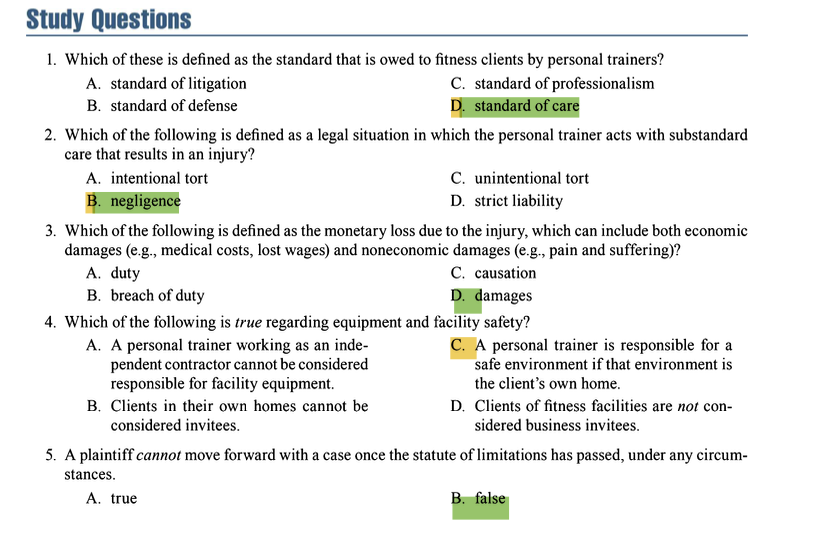

# Professional, Legal, and Ethical Responsibilities of Personal Trainers

## Introduction
*   **Purpose:** This chapter explores the legal aspects of personal training, focusing on the standard of care owed to clients and the strategies to minimize legal liability.
*   **Focus:** It concentrates on tort law and contract law, with some aspects of criminal law. The information is based on U.S. state law.
*   **Key Concept:** Personal trainers must understand their legal responsibilities to provide safe, effective service and to protect themselves from litigation.

## The Perils of Litigation

### Increased Litigation
*   Society has become more litigious, and the fitness industry is not immune.
*   Many personal trainers operate with an "ignorance is bliss" attitude, evidenced by a lack of liability insurance and low attendance at legal risk management seminars.
*   A significant problem is the lack of stringent education, certification, and experience requirements for personal trainers in many facilities.

### Training and Certification
*   True qualification requires in-depth knowledge of anatomy, physiology, kinesiology, and exercise science, gained through formal education and practical experience.
*   **Warning:** Weekend cram courses and many of the estimated 300+ certification programs are often insufficient. A certificate is only as valuable as the training behind it.
*   **Research shows:** Formal education in exercise science coupled with certification from reputable organizations like the **NSCA** or **ACSM** are strong predictors of knowledge, whereas years of experience alone is not.
*   The public is now less likely to blame themselves for injuries and more likely to hold facilities and trainers accountable, leading to an increase in lawsuits.

### Significance of Understanding Legal Aspects
*   With the growth of personal training, more lawsuits are predicted.
*   Clients may sue the individual trainer (especially if they operate independently) or the facility (viewed as having "deeper pockets").
*   Due to their unique skills and fiduciary relationships with clients, personal trainers are often held to a **higher standard of care** than group fitness instructors.
*   Knowledge of the legal system is an asset for competence and self-defense.

## The Legal System

### Divisions of Law
*   **Common Law (Case Law):** Unwritten laws based on customs, usages, and past court decisions.
*   **Statutory Law (Codified Law):** Laws enacted by legislative bodies (e.g., Congress, state legislatures). Can impose duties or grant immunities (e.g., Good Samaritan laws).
*   **Civil Law:** Governs private rights and remedies between individuals or groups (e.g., contracts, torts). Resolved via monetary judgments.
*   **Criminal Law:** Governs conduct towards society as a whole. Violations are punishable by fines or imprisonment. Personal trainers could face this for the unauthorized practice of medicine or an allied health profession.

### Contract Law
*   Governs agreements between parties that create legal obligations.
*   A **personal service contract** should be written, agreed upon, and signed by both the client and trainer.
*   Other important contracts include releases, waivers, assumptions of risk, and informed consents.
*   **Independent Contractor vs. Employee:** The legal litmus test is **"control"** as defined by the IRS, not the title in a contract. If the facility controls hours, duties, and schedule, the trainer is likely an employee.

### Tort Law
*   Governs civil wrongs or injuries not arising from a breach of contract.
*   **Elements of a Tort:** (1) A legal duty exists, (2) There is a breach of that duty, (3) The breach is the actual or proximate cause, (4) of an injury, (5) for which damages may be awarded.
*   **Categories of Torts:**
    *   **Intentional Torts:** Purposeful conduct causing injury.
    *   **Negligence (Primary concern):** Failure to conform to a generally accepted standard of care.
    *   **Strict Liability:** Liability regardless of fault (e.g., for defective products that cause injury).

### Anatomy of a Lawsuit
1.  An injured client (plaintiff) retains a lawyer to sue the trainer (defendant).
2.  The defendant's insurance company investigates and may provide a lawyer.
3.  **Discovery:** Both parties exchange and analyze all relevant documents (contracts, health forms, logs, etc.).
4.  **Depositions:** Sworn, out-of-court testimony is taken from all involved parties and witnesses.
5.  **Expert Witnesses:** Specialists in exercise science review the case and give an opinion on whether the standard of care was violated.
6.  **Burden of Proof:**
    *   Civil trials use "preponderance of the evidence" (slight advantage) or "clear and convincing evidence."
    *   Criminal trials use "beyond a reasonable doubt."
7.  The case may go to arbitration/mediation or proceed to a trial (by judge or jury).

## Negligence
*   **Definition:** The failure to conform one’s conduct to a generally accepted standard or to act as a reasonably prudent person would. It is the primary legal concern for trainers.
*   It can occur by **omission** (failing to do something, like not screening a client) or **commission** (performing an act negligently, like teaching an exercise incorrectly).
*   **Vicarious Liability (Respondent Superior):** An employer can be held liable for the negligent acts of their employees. This may also apply to independent contractors if the court finds the facility had control.

### Elements of Negligence (The Plaintiff Must Prove All Four)
1.  **Duty:** An obligation recognized by law requiring the trainer to conform to a certain standard of care.
2.  **Breach of Duty:** The trainer's conduct was not consistent with that standard of care.
3.  **Causation:** The breach of duty was the actual and proximate cause of the injury.
4.  **Damages:** The monetary loss due to the injury. This includes:
    *   **Compensatory Damages:** For actual loss (economic: medical costs, lost wages; noneconomic: pain and suffering).
    *   **Punitive Damages:** To punish the defendant for extreme, willful, or reckless conduct (often not covered by insurance).
*   **Comparative Negligence:** Most states use this system. If the plaintiff is found partially at fault (e.g., 25%), their damage award is reduced by that percentage.

### Duty and the Personal Trainer
A court determines if a duty was breached by comparing the trainer's conduct to:
1.  The accepted **standard of care**.
2.  **Standards of practice** published by professional organizations.

#### Standards of Practice
*   Published by organizations like the NSCA and ACSM as standards, guidelines, position statements, and recommendations.
*   **Standards:** Mandatory procedures that reflect the standard of care.
*   **Guidelines:** Recommended procedures to enhance quality and safety.
*   Adhering to these standards serves as a "shield" against liability. Ignoring them serves as a "sword" for the plaintiff.
*   The NSCA and ACSM standards are considered the "gold standard" and a safe harbor for trainers.

#### Ethics
*   Ethical standards (like the NSCA's Code of Ethics) are external standards of right and wrong.
*   While not a direct element of a lawsuit, courts may consider ethical conduct in their decisions.

### Morality Versus Legality: A Fitness Challenge
*   **Key Quote:** "Just because one is a certified personal trainer does not mean that he or she is a qualified personal trainer."
*   Many injuries and deaths result from insufficient screening, ineffective instruction, and improper supervision.
*   Facility management often prioritizes profitability over safety (e.g., using warning signs instead of hiring lifeguards or pool attendants). **Morality should supersede legality.**

### The Special Relationship
*   The court may find a **fiduciary relationship** exists between trainer and client, where the client trusts and relies on the trainer's expertise.
*   This relationship imposes additional duties of honest intent, confidentiality, truthfulness, and frankness.
*   Because of this relationship and their advanced training, personal trainers are often held to a **higher standard of care** than other fitness staff.

## Duties and Responsibilities of Personal Trainers (The STEPS Acronym)
The court will evaluate if a trainer breached their duty by examining these key areas:

### S - Screening
**(Preparticipation Screening and Medical Clearance)**
*   **Purpose:** To identify clients at increased risk for cardiovascular or musculoskeletal problems and determine if medical clearance is needed.
*   **Standard of Care:** Screening is mandatory (NSCA & ACSM standard).
*   **Process:** Includes health history, lifestyle questionnaire, and blood pressure assessment.
*   **Crucial Distinction:** Trainers are **"suspecticians," not diagnosticians.** They may suspect a condition like hypertension but cannot diagnose it. Doing so is the unauthorized practice of medicine.
*   Trainers must have the knowledge to properly interpret and use the health information they gather.
*   **HIPAA Privacy Rule:** All client health information must be kept confidential.

### T - Testing
**(Fitness Testing)**
*   **Purposes (ACSM):** Collect baseline data, develop exercise programs, evaluate progress, and motivate clients.
*   **Process:**
    *   Provide clients with written preparation instructions.
    *   Ensure a consistent testing environment.
    *   Use a legally sufficient **informed consent** form that explains the test's purpose, risks, benefits, and client responsibilities.
    *   Tests typically assess the 5 components of health-related fitness. Some trainers may also perform performance-related tests.

### E - Evaluation
*   Evaluate data from health appraisals and fitness tests to share with the client.
*   Go beyond just comparing to normative data; recognize **individual differences** to design safe, effective, tailor-made programs.

### P - Program Design and Scope of Practice
*   Use the term **"program design"** instead of "exercise prescription" to avoid medical connotations.
*   The five components of program design are: mode, intensity, duration, frequency, and progression.
*   **Scope of Practice:** A trainer must operate within legal and professional limits.
    *   **Do NOT:** Diagnose medical conditions, treat medical conditions, prescribe diets or supplements (unless a registered dietitian), or provide counseling for personal problems.
    *   **Do:** Provide general nutrition education based on authoritative guidelines (e.g., Dietary Guidelines for Americans) and refer clients to appropriate healthcare professionals when their needs exceed your qualifications.
*   Always maintain a **professional relationship**. Avoid oversharing personal details and be overly cautious when training underage clients (schedule sessions in open, observable areas).

### S - Supervision and Instruction
*   This is the most common allegation of negligence.
*   **Specific Supervision:** Requires continuous, attentive observation during a session to correct ineffective or unsafe movements, watch for signs of overexertion, and ensure proper intensity and form (including spotting).
*   **General (Floor) Supervision:** Requires qualified staff to be visible, answer questions, instruct on equipment, and respond to emergencies. The facility must have no blind spots.
*   **Special Areas:** Locker rooms, saunas, steam rooms, and pools are often under-supervised and are potential areas for litigation. An attendant should be present.
*   **Faulty Supervision** includes failing to screen, test, design proper programs, educate on safety, or recognize a medical emergency.

### Equipment and Facility Safety
*   Clients are considered **business invitees**, and the facility owner has a duty to inspect for dangers and repair or warn them.
*   A personal trainer, even an independent contractor or one working in a client's home, can be viewed as taking on these responsibilities to ensure a safe environment.
*   Trainers can minimize equipment-related negligence by following NSCA/ACSM standards on proper instruction, inspection, and warning of risks.

## Emergency Plan
*   A comprehensive, written **Emergency Response Plan (ERP)** is a **standard** for all facilities (NSCA, ACSM, IHRSA).
*   The ERP must cover environmental, life-threatening, and non-life-threatening situations. All staff must be familiar with it.
*   The plan must outline specific roles: who recognizes the event, activates EMS, attends to the victim, controls crowds, etc.
*   Plans must be **practiced regularly** with both announced and unannounced drills, followed by critiques and corrective actions.
*   **First Aid & CPR/AED:** While most trainers are certified, skills deteriorate rapidly. Studies show 66% fail skills tests after 3 months, and 90% fail after one year. Ongoing training and drills are essential.
*   **Key Failure:** Inability to recognize Sudden Cardiac Arrest (SCA). Agonal gasping (snorting, snoring, groaning) is a sign of SCA, not normal breathing, and requires immediate CPR and AED use.
*   **Cardiovascular Events:** Myocardial Infarction (MI, heart attack) and SCA are major concerns.
    *   For a suspected MI, activate EMS and administer emergency oxygen if available.
    *   For SCA, rapid defibrillation with an **AED** is the only definitive treatment. Survival chance decreases 7-10% per minute without it.
*   **Professional Position:** The ACSM and AHA strongly encourage (and ACSM standards require) AEDs in fitness facilities. The availability of AEDs and oxygen saves lives and the legal argument against having them has little merit.
*   **Special Populations:** With an aging clientele, trainers often work with clients with chronic diseases. Additional education and certification in this area are recommended for safety and liability reduction.

## Record Keeping and Confidentiality
*   Meticulous records are critical for business success and for defending a potential lawsuit (they are discoverable).
*   **Documents to Maintain:**
    *   Initial interview notes & personal service contracts
    *   Medical history forms (witnessed, signed under penalty of perjury)
    *   Physician clearance forms & released medical reports
    *   Informed consents for testing and training
    *   Fitness profiles and testing record sheets
    *   **Program design/exercise prescription**
    *   Workout logs and progress notes
    *   All client correspondence
    *   Equipment installation and maintenance logs
    *   Emergency plan rehearsal critiques and corrective action forms
*   **Confidentiality:** All client health information is protected under the **HIPAA Privacy Rule**. Get signed releases for using client names or data for marketing/statistics.
*   **Retention:** Keep client files for at least four years, if not indefinitely, after the relationship ends.

## Strategies for Minimizing Legal Liability (Risk Management)
Three major strategies to minimize liability associated with negligence:
1.  **Implement Procedures:** Adhere to the duties and responsibilities (STEPS) discussed. This is the first line of defense—if there is no breach of duty, there is no negligence.
2.  **Use Protective Legal Documents:** Have clients sign waivers/releases. This is a second line of defense.
3.  **Purchase Liability Insurance:** This is a third and final line of defense. It may cover damages if you are found negligent. Ensure your policy covers all your activities (e.g., outdoor training). Employees may be covered under their facility's policy.

## Protective Legal Documents
Three common types used in fitness:
1.  **Informed Consent**
2.  **Agreement to Participate**
3.  **Prospective Release (Waiver)**

### Causes of Injury & Corresponding Documents
*   **Inherent Injuries:** Accidents that are not preventable and are no one's fault. Best defended with an **Assumption of Risk** document (informed consent or agreement to participate) that outlines the specific dangers of the activity.
*   **Negligence (Ordinary):** Injuries due to the fault of the defendant. Best protected by a **Waiver** containing an **exculpatory clause** where the client releases the trainer from liability for negligence.
*   **Extreme Forms of Negligence:** Gross negligence, willful/wanton/reckless conduct. **No document can reliably protect** a trainer from this. It can lead to punitive damages.

### Enforceability of Protective Documents
*   These documents provide "evidence" that can strengthen a defense or defeat a plaintiff's claim entirely.
*   A waiver can be used as an **affirmative defense** to argue the client waived their right to sue.
*   **Validity varies by state.** Trainers should have a lawyer review their documents to ensure they are legally sufficient for their state.
*   **Statute of Limitations:** An affirmative defense stating the plaintiff filed the lawsuit too late. The time period varies by state and circumstance.

### Employee vs. Independent Contractor
*   This is a critical distinction for who is held liable (**vicarious liability**).
*   **Employee:** The facility controls hours, job duties, pays a wage, withholds taxes. The employer is typically liable for the employee's negligent acts.
*   **Independent Contractor:** The facility does not control schedule or activities, does not pay a wage (the trainer may even pay the facility for space). The employer is typically **not** liable for the independent contractor's negligent acts.
*   **The IRS "Control" Test is Key:** A contract calling someone an independent contractor is meaningless if the facility exerts control over their work. The court will likely rule the person is an employee, making the facility liable.

**Question 1**
**Correct Answer:** D. standard of care
**Textbook Reference:**
"The court or jury makes a factual determination as to whether the defendant personal trainer breached the duty owed to the client in two ways: By comparing the personal trainer’s conduct to the accepted standard of care (practice) and comparing his or her conduct to the standards of practice developed and published by professional organizations and the state’s tort law of negligence." (Chapter 25, "Duty and the Personal Trainer")

**Incorrect Options:**
*   A. standard of litigation: This is not a defined legal standard for professional conduct. Litigation is the process of taking legal action.
*   B. standard of defense: This is not a defined standard of conduct. Defense refers to the strategies used to argue against a claim in court.
*   C. standard of professionalism: While personal trainers should uphold professionalism, the specific legal duty they owe is called the "standard of care," which is a legally defined concept pertaining to the level of service a prudent professional would provide.

**Question 2**
**Correct Answer:** B. negligence
**Textbook Reference:**
"Negligence is the failure to conform one’s conduct to a generally accepted standard or the failure to act as a reasonably prudent person would act under similar circumstances... When a duty has been created, a court of law will evaluate a personal trainer’s performance in relationship to established standards and guidelines... if this omission or commission is determined to be the proximate cause of a proven assault or injury, damages may be awarded." (Chapter 25, "Negligence" and "Tort Law")

**Incorrect Options:**
*   A. intentional tort: An intentional tort involves purposeful conduct meant to bring about a specific consequence, such as injury or harm to reputation. Negligence involves a failure to meet a standard of care, not intentional harm.
*   C. unintentional tort: While negligence is a type of unintentional tort, the specific term defined in the textbook for acting with substandard care is "negligence."
*   D. strict liability: This is "liability regardless of fault," often applied to manufacturers for defective products that cause injury. It does not require proving substandard care by the personal trainer.

**Question 3**
**Correct Answer:** D. damages
**Textbook Reference:**
"**Damages**: the monetary loss due to the injury, which can include both economic damages (e.g., medical costs, lost wages) and noneconomic damages (e.g., pain and suffering)." (Chapter 25, "Negligence")

**Incorrect Options:**
*   A. duty: Duty is the first element of negligence, meaning an obligation to conform to a standard of care. It is not the monetary loss itself.
*   B. breach of duty: Breach is the second element, meaning the personal trainer's conduct failed to meet the standard of care. It is not the monetary loss itself.
*   C. causation: Causation is the third element, meaning the breach of duty must be the direct cause of the injury. It is not the monetary loss itself.

**Question 4**
**Correct Answer:** C. A personal trainer is responsible for a safe environment if that environment is the client’s own home.
**Textbook Reference:**
"The same responsibilities [to inspect for danger and warn or correct it] will apply if a personal trainer works with clients in their homes, even though the client in this case would not be classified as an invitee. However, the personal trainer must ensure that the home in which the client is being trained provides a safe environment." (Chapter 25, "Equipment and Facility Safety")

**Incorrect Options:**
*   A. A personal trainer working as an independent contractor cannot be considered responsible for facility equipment: This is false. The text states that an independent contractor "could be viewed as taking on such responsibilities" for facility safety. Furthermore, under the doctrine of *respondent superior*, an employer may still be vicariously liable for an independent contractor's acts in some cases.
*   B. Clients in their own homes cannot be considered invitees: While this statement about legal classification may be true, it is irrelevant because the personal trainer's responsibility for safety remains, as explained in the correct answer.
*   D. Clients of fitness facilities are *not* considered business invitees: This is false. The text explicitly states, "The law classifies members and clients of fitness facilities as business invitees."

**Question 5**
**Correct Answer:** B. false
**Textbook Reference:**
"Be mindful that there are exceptions to nearly every rule in court. Sometimes, for good cause shown or other extenuating circumstances, the court may allow the plaintiff to go forward even though the statute of limitations has lapsed." (Chapter 25, "Protective Legal Documents")

**Incorrect Options:**
*   A. true: The statement is not absolutely true because the textbook specifies that courts can make exceptions to the statute of limitations rule under certain extenuating circumstances.