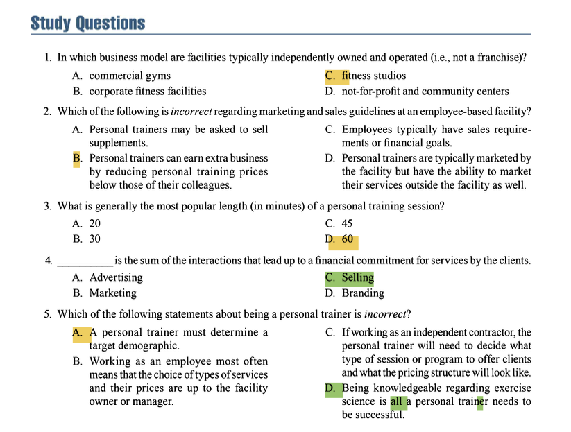

### Appendix - The Business of Personal Training

#### **Introduction**
*   Building a successful career requires more than exercise science knowledge; it requires understanding the **business side** of the industry.
*   The first and most important decision is to determine a **target market** or specific population to work with (e.g., women golfers over 50).
    *   This choice guides subsequent decisions on programs, pricing, marketing, and sales.
    *   A specific niche makes a personal trainer more desirable to that demographic.
*   New trainers unsure of their niche should seek employment in a facility that allows them to work with diverse clients to discover what they find most rewarding.

---

### **Employment Options for the Personal Trainer**
Personal trainers have two main employment options: working as an **employee** or as an **independent contractor**.

#### **Common Business Models**
There are four common business models for employment:
1.  **Fitness Studios**: Typically **independently owned and operated (i.e., not a franchise)**. They often serve a specific demographic and can be great for intermediate or entry-level trainers. **(Answer to Study Question 1: A)**
2.  **Not-for-Profit and Community Centers** (e.g., YMCAs, JCCs): Gear toward family involvement and community outreach. Great for entry-level trainers to explore different areas.
3.  **Commercial Gyms or Health Clubs**: Range from small equipment-only gyms to large clubs. Membership-driven and a significant source of personal training revenue.
4.  **Corporate Fitness Facilities**: Located within large businesses to improve employee health and reduce healthcare costs.

#### **Employee-Based Personal Trainers**
Working as an employee offers opportunities to train various clients, learn from peers, and potentially move into management.

**Expectations of Being an Employee**
*   **Professional Requirements**: Typically include maintaining an accredited certification, CPR/AED certification, and abiding by a professional code of conduct.
*   **Hiring Process**: Involves submitting a resume with a work objective, education/certification, work experience/expertise, and references, often accompanied by a detailed cover letter.
*   **Professional Liability Insurance**: Employees are **typically covered under the employer’s insurance plan**, but they should verify this and understand any gaps in coverage.
*   **Compensation and Benefits**:
    *   Average earnings are ~$61,600 annually.
    *   Compensation typically falls between **40-60%** of the client session fee.
    *   Benefits (for full-time employees) can include health insurance, retirement plans, paid time off, and continued education.
*   **Work Duties and Responsibilities**: Dictated by the facility owner and can include assessments, program design, floor hours, facility maintenance, and scheduled management tasks.
*   **Marketing and Sales Guidelines**:
    *   **Employees are typically marketed by the facility** but can also market themselves externally with approval.
    *   **Employees typically have sales requirements or financial goals** set by management (e.g., selling memberships, sessions, supplements, merchandise).
    *   **Prices are set by ownership and are not negotiable**; trainers cannot undersell colleagues to earn business. **(Answer to Study Question 2: B)**
    *   Techniques for building a client base include working floor hours, referral programs, and educational offerings.
*   **Professional Growth and Development**: Growth involves moving from floor hours to a full client schedule, offering new services (small group, workshops), and advancing to management positions through positive performance reviews.

#### **Independent Contractor Personal Trainers**
Independent contractors run their own business, often by opening their own studio, subleasing space in a facility, or training clients in homes/offices. They have freedom but also more responsibility.

**Professional Requirements**
*   Manage their own taxes and adhere to state business codes.
*   **Required to carry their own professional liability insurance**, as the facility's insurance typically does not cover them.
*   Suggested steps: Form an LLC or sole proprietorship, maintain certifications and CPR/AED, earn CECs, and keep proper client records.

**The Process of Starting a Business**
*   Requires a business plan, timeline, standard operating procedures, facility design, equipment purchase, and creating all necessary client and business forms.

**Compensation and Benefits**
*   Independent contractors collect fees directly from clients.
*   They are responsible for filing their own taxes and paying for facility rent (either a flat monthly rate or a commission share of their income).
*   They must purchase their own benefits (health insurance, retirement plans) and fund their own sick/vacation time.

**Work Duties and Responsibilities**
*   Primarily defined by the financial agreement with the facility owner and agreements to operate within professional codes of conduct and ethics.
*   Outside of these, they have minimal responsibilities to the facility and have the freedom to run their business as they see fit.

**Marketing and Sales Guidelines**
*   **Independent contractors are responsible for their own marketing campaigns and materials** (website, social media, networking).

---

### **Determining Personal Training Offerings**
Modern training offers variety beyond the standard 60-minute, one-on-one session. Offerings can vary in:
1.  **Number of Clients**: One-on-one, semiprivate (2-5), small group (2-15), large group (12+).
2.  **Length of Sessions**: **30, 45, and 60 minutes are the most common.** **(Answer to Study Question 3: The most popular is not explicitly stated, but 60 minutes is listed as the standard and is among the most common. The correct answer from the questions is D) 60)**.
3.  **Focused Goals**: Packages without a predefined goal vs. predefined programs with a specific goal and end date (e.g., an 8-week "Bridal Conditioning" program).
4.  **Combinations of Session Types**: A program may mix different session types (e.g., walk/run sessions + resistance training) for best results.
5.  **Duration**: Programs typically run from 4 to 12 weeks.
6.  **Number of Sessions**: The total number of sessions included in a package or program.

---

### **Setting Appropriate Pricing**
Pricing is complex and must account for several variables. What the client is charged is not the same as the trainer's compensation.

**Factors Affecting Pricing:**
*   **Operating Expenses**: Prices must be high enough to cover all business costs (rent, equipment, utilities, marketing, etc.).
*   **Target Market**: The chosen demographic must be able to afford the services. This may necessitate offering small group training to keep prices accessible.
*   **Competition**: Knowing competitors' prices helps understand the market's "normal" price, which can serve as a baseline.
*   **Unique Selling Proposition (USP)**: What differentiates the trainer (credentials, experience, niche, service level) and can justify higher prices.
*   **Perceived Value**: The client's perception of what the service is worth. It's crucial to demonstrate value beyond just stating a price.
*   **Self-Value**: The trainer's own sense of worth. Pricing too low leads to unhappiness; pricing too high (relative to self-value) leads to guilt.
*   **Time**: Prices must account for limited training hours, non-training hours (planning, transportation), and the need to generate sufficient income.

**Pricing Groups:**
*   Group pricing is typically **60-75% of the one-on-one session price** per person.
*   The trainer should earn *more* total for a group session, as training multiple clients simultaneously is more challenging.

---

### **Marketing Personal Training Services**
*   **Marketing** is the process of bringing a target market from awareness to becoming a client.
*   **Selling is the sum of the interactions that lead up to a financial commitment** for services by the clients. **(Answer to Study Question 4: C)**
*   The key is to build relationships so potential clients know, like, and trust the trainer by providing value before trying to sell.

**Meeting Face to Face (Most Effective Method)**
*   Strategies: Joining and volunteering for target market organizations, networking at events, and creating events (workshops, charity events).

**Connecting Online**
*   Use social media and email platforms popular with the target demographic.
*   Seek out online groups and pages where the target market gathers.

---

### **Understanding and Implementing Sales**
Many trainers believe selling is disreputable, but it is a critical and natural process for helping clients commit to their goals.

**The Sales Process**
The ideal opportunity is the initial client consultation.

**The Components of a Client Consultation**
1.  **The Greeting**: Make a warm first impression with a smile, eye contact, and guiding the client to a private area.
2.  **The Interview**: Use medical history forms and active listening (acknowledgements, paraphrasing) to build rapport and understand the client's needs, goals, and obstacles. Ask open-ended questions.
3.  **The Recommendation**: Offer a well-informed, honest opinion on the best course of action, explaining how it will solve past problems and handle future obstacles.
4.  **Asking for Client Commitment**: Simply ask, *“Does that sound like something you would be interested in?”*

**Handling Responses**
*   **Yes**: Acknowledge and schedule the start date.
*   **No**: Inquire why, provide clarifications or additional information for them to succeed on their own, and ask to check back in a week. This shows care and leaves the door open for future business.

---

### **Conclusion**
*   **Knowing business basics is just the beginning.** Commitment to ongoing learning in both exercise science and business is essential for success.
*   **Being knowledgeable regarding exercise science is *not* all a personal trainer needs to be successful;** understanding the business side is equally critical. **(Answer to Study Question 5: D)**
*   The business process involves: determining a target demographic, choosing a work status and environment, building relationships, consulting with potential clients, making recommendations, and asking for a commitment.

**Question 1**
**Correct Answer:** A. commercial gyms
**Textbook Reference:**
"Fitness studios are typically independently owned and operated (i.e., not a franchise) and will have their own designated business practices..." (Appendix, "Common Business Models")

**Incorrect Options:**
*   B. corporate fitness facilities: These are programs located inside large businesses and are not described as independently owned.
*   C. fitness studios: This is the correct answer, as per the textbook reference.
*   D. not-for-profit and community centers: These are organizations like the YMCA or city-run departments, not independently owned studios.

**Question 2**
**Correct Answer:** B. Personal trainers can earn extra business by reducing personal training prices below those of their colleagues.
**Textbook Reference:**
"The prices for training services are set by ownership and are typically not negotiable by the personal trainer; thus, personal trainers cannot attempt to undersell other employees or make deals with a client to earn business." (Appendix, "Marketing and Sales Guidelines")

**Incorrect Options:**
*   A. Personal trainers may be asked to sell supplements: The text states employees "may be asked to sell supplements, merchandise... as dictated by management."
*   C. Employees typically have sales requirements or financial goals: The text states "Employees typically have sales requirements or financial goals set by their manager."
*   D. Personal trainers are typically marketed by the facility but have the ability to market their services outside the facility as well: The text states employees are "marketed by the facility but have the ability to market their services outside the facility as well per the facility’s approval."

**Question 3**
**Correct Answer:** D. 60
**Textbook Reference:**
"As mentioned previously, sessions used to be a standard 60 minutes. Now sessions are offered in a variety of time increments, with 30, 45, and 60 minutes being the most common." (Appendix, "Determining Personal Training Offerings")

**Incorrect Options:**
*   A. 20: This time increment is not listed among the most common session lengths.
*   B. 30: While this is a common length, the text identifies 60 minutes as the historical and still common standard.
*   C. 45: While this is a common length, the text identifies 60 minutes as the historical and still common standard.

**Question 4**
**Correct Answer:** C. Selling
**Textbook Reference:**
"Selling is the sum of the interactions that lead up to a financial commitment for services by the clients." (Appendix, "Understanding and Implementing Sales")

**Incorrect Options:**
*   A. Advertising: Advertising is a component of marketing, which is defined as creating awareness *up to* the point of meeting, not the interactions leading to the financial commitment itself.
*   B. Marketing: The text defines marketing as "all actions that inform and create interest in potential clients up to the point that they meet with the personal trainer."
*   D. Branding: Branding is part of creating a business identity and is not the term used to define the interactions leading to a sale.

**Question 5**
**Correct Answer:** D. Being knowledgeable regarding exercise science is all a personal trainer needs to be successful.
**Textbook Reference:**
"Being knowledgeable regarding exercise science is *not* all a personal trainer needs to be successful; understanding the business side is equally critical." (Appendix, "Conclusion")

**Incorrect Options:**
*   A. A personal trainer must determine a target demographic: The text states this is "the first and most important decision" for building a business.
*   B. Working as an employee most often means that the choice of types of services and their prices are up to the facility owner or manager: The text confirms this in the conclusion: "Working as an employee most often means the choice of types of services and prices are up to the facility owner or manager."
*   C. If working as an independent contractor, the personal trainer will need to decide what type of session or program to offer clients and what the pricing structure will look like: The text confirms this in the conclusion: "As an independent contractor, the personal trainer will need to decide what type of session or program to offer clients and what the pricing structure will look like."