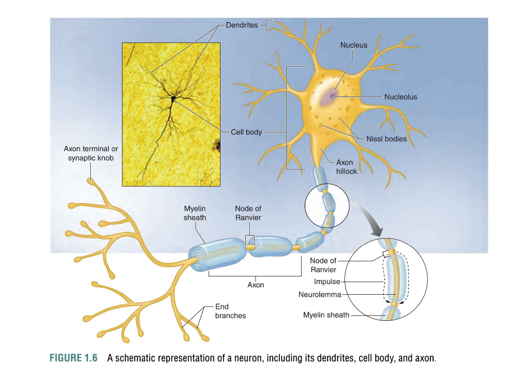
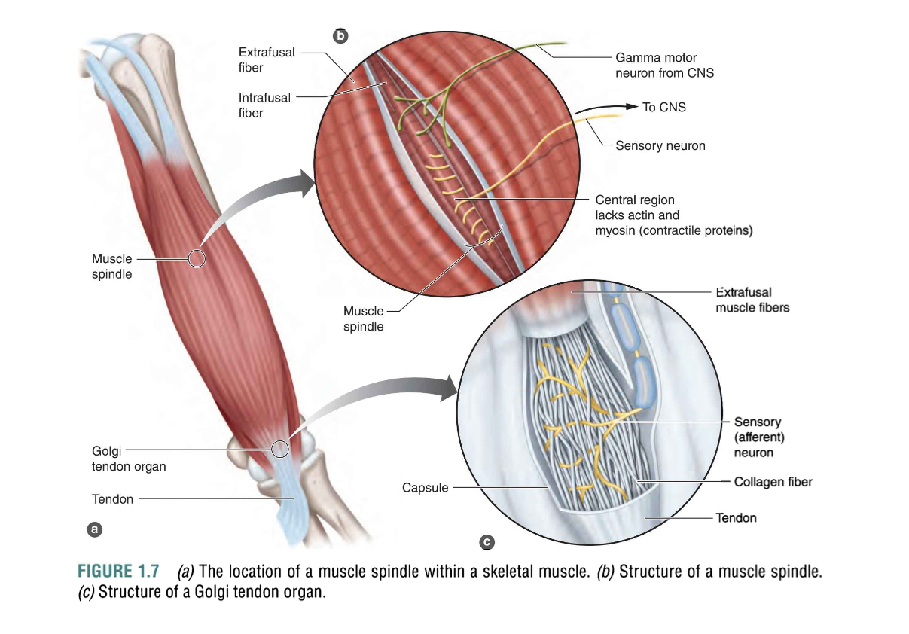

# Organization of the Nervous System (神经系统的组织)
- The nervous system is organized into two main divisions:
  - **Central Nervous System (CNS - 中枢神经系统)**: Composed of the brain and spinal cord. It processes information and coordinates body functions.
  - **Peripheral Nervous System (PNS - 外周神经系统)**: Includes motor neurons (send signals from the CNS to muscles) and sensory neurons (send signals from sensory receptors to the CNS). It connects the CNS to the rest of the body.
---
# Neurons (神经元)
- Neurons are the functional units of the nervous system. They transmit electrical signals throughout the body.
- There are three main types of neurons:
  - **Sensory Neurons (感觉神经元)**: Transmit sensory information from receptors to the CNS.
  - **Motor Neurons (运动神经元)**: Carry signals from the CNS to muscles and glands.
  - **Interneurons (中介神经元)**: Connect sensory and motor neurons within the CNS.
- **Action Potential (动作电位)**: The electrical signal that travels along a neuron, caused by the movement of ions across the neuron membrane (depolarization and repolarization).

---
# Muscle Spindle (肌梭)
- Muscle Spindle is a proprioceptor (感觉受体) found within the muscle that detects changes in muscle length and the rate of change in length.
- **Function**: It sends information to the CNS to help regulate muscle length and contraction. It plays a key role in stretch reflexes (e.g., preventing overstretching).
- **Stretch Reflex (拉伸运动反射)**: When the muscle is stretched, the muscle spindle is activated and sends signals to the CNS, which in turn triggers the muscle to contract to resist further stretching and prevent injury.
- Moving slowly into a stretched position prevents activation of the muscle spindle. (比如卧推, 深蹲要控制而不是砸)

---
# Golgi Tendon Organ (高尔基腱器官)
- The Golgi Tendon Organ (GTO - 高尔基腱器官) is a proprioceptor located at the junction of muscle and tendon.
- **Function**: It senses tension within the tendon and helps protect muscles from excessive force by inhibiting muscle contraction when tension is too high.
- **Autogenic Inhibition (自我抑制)**: The GTO triggers a reflex that causes the muscle to relax when the tension is too high, which helps prevent tendon or muscle damage during heavy lifting.

---
# The Motor Unit (运动单元)
- A motor unit consists of a single motor neuron and all the muscle fibers it innervates.
- **Motor Unit Recruitment**: When a muscle contracts, motor units are recruited to generate the appropriate force.
- Smaller motor units (with fewer fibers) are recruited for low-force, precise movements.
- Larger motor units (with more fibers) are recruited for high-force, gross movements.
- **Types of Motor Units**:
  - **Type I motor units**: Contain Type I muscle fibers, suited for endurance and low-force production.
  - **Type II motor units**: Contain Type II fibers, suited for high-force, quick contractions.
- **All-or-None Principle (全或无原则)**: When a motor unit is activated, all of the muscle fibers it innervates contract maximally. It cannot partially activate muscle fibers.

---
# Gradation of Force (力量的逐级增加) - 怎么增力
- Gradation of Force refers to how the body adjusts the amount of force produced by muscles, which is important for different types of movement and tasks.
- **Methods of Gradation**:
  - **Recruitment of Motor Units**: More motor units are recruited as force requirements increase. Initially, smaller motor units are activated, but as more force is needed, larger motor units (Type II) are recruited.
  - **Rate Coding (频率编码)**: The frequency at which motor neurons fire action potentials determines the force of contraction. Higher firing rates result in more forceful contractions.
- Small force contractions: Recruit primarily Type I motor units (slow-twitch fibers).
- Large force contractions: Recruit larger Type II motor units (fast-twitch fibers), which generate more force but fatigue quicker.

---
# Key Takeaways:
- The nervous system regulates muscle contraction, proprioception, and motor control.
- Muscle spindles and Golgi tendon organs provide feedback to the CNS to regulate muscle length and tension, ensuring proper movement and injury prevention.
- Motor units and their recruitment, along with gradations of force (via recruitment and rate coding), help the body perform precise and powerful movements.
- The nervous system is essential in coordinating motor activity and allowing muscles to adapt to varying levels of force and demands during exercise.