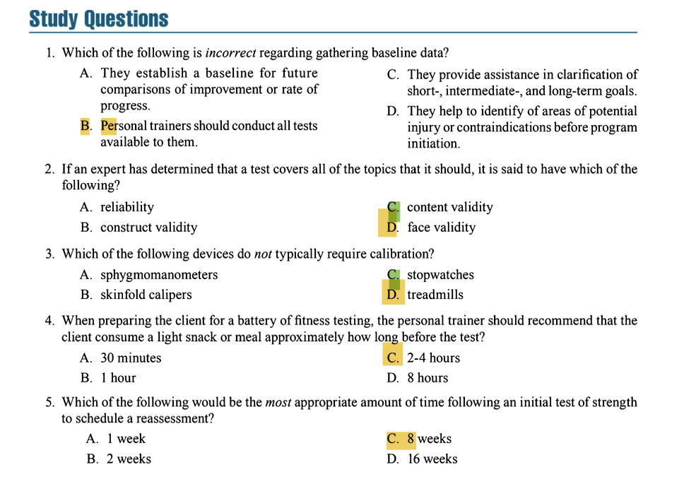

## **PURPOSES OF ASSESSMENT**  
1. **Gathering Baseline Data**  
   - Provides a starting point for tracking progress.  
   - Identifies strengths, weaknesses, and potential injury risks.  
   - Helps set appropriate exercise intensities and volumes.  
   - Clarifies short-, intermediate-, and long-term goals.  
   - May reveal need for medical referral (e.g., cardiovascular/respiratory issues).  
   - Documents client status for professional accountability.  

2. **Goal and Program Development**  
   - Assessments align with client goals and preferred exercise modes (e.g., treadmill vs. cycle ergometer for aerobic testing).  
   - Example: Timed mile test for walkers to track progress via speed, heart rate, or perceived exertion.  
   - Non-weight-bearing tests (e.g., cycling) may suit clients with joint pain or obesity.  
   - Baseline data ensures programs are safe, effective, and motivating.  

---
 
 

## **CHOOSING APPROPRIATE ASSESSMENTS**  
1. **Key Considerations**  
   - No universal test battery; selections depend on:  
     - Client health/exercise history.  
     - Client goals.  
     - Trainer’s expertise.  
   - Prioritize validity, reliability, and safety.  

2. **Assessment Terminology**  
   - **Formative Evaluation**: Ongoing assessments during training (e.g., periodic tests, subjective observations).  
   - **Summative Evaluation**: Final assessment after a training period to measure overall progress.  

3. **Test Quality Criteria**  
   - **Reliability**: Consistency of results (test-retest method, intrarater consistency).  
   - **Validity**: Measures what it claims (e.g., 1RM for strength, not flexibility).  
     - *Face validity*: Test appears appropriate (e.g., BMI for general obesity but not athletes).  
     - *Criterion-related validity*: Field tests compared to lab standards (e.g., submaximal cycle test vs. VO₂ max).  
   - **Objectivity**: Multiple trainers achieve similar results.  

4. **Client Factors Affecting Test Selection**  
   - **Health Status**: E.g., avoid high-intensity tests for deconditioned clients.  
   - **Age**: 1.5-mile run unsuitable for preadolescents (immature cardiovascular system).  
   - **Sex**: Modified push-ups/knee-flexed position for women due to upper-body strength differences.  
   - **Pretraining Status**:  
     - Untrained clients need gradual introduction (e.g., 4–6 weeks aerobic prep before 1.5-mile run).  
     - Practice sessions for skill-based tests (e.g., agility drills, 1RM lifts).  

5. **Environmental Factors**  
   - **Temperature/Humidity**:  
     - High heat/humidity (>65°F/18°C + >65% humidity) increases heatstroke risk.  
     - Cold (<25°F/-4°C) may stress cardiovascular/respiratory systems (caution for elderly/asthmatics).  
   - **Altitude**: Requires 7–12 days acclimatization above 1,900 ft (580 m).  
   - **Air Quality (AQI)**: Affects oxygen transport; check local AQI reports for sensitive populations.  
   - **Test Setting**:  
     - Quiet, private, 68–72°F (20–22°C), ≤60% humidity.  
     - Calibrated equipment, emergency protocols.  

6. **Trainer & Equipment Factors**  
   - **Trainer Skill**:  
     - Technical tests (e.g., skinfold measurements) require ~100 practice trials for proficiency.  
   - **Equipment Calibration**: Essential for accuracy (e.g., treadmills, calipers, blood pressure cuffs).  

---
 
 

## **ADMINISTRATION AND ORGANIZATION OF FITNESS ASSESSMENTS**  
##### **Test Preparation**  
1. **Preassessment Screening & Safety**:  
   - Conduct initial interviews, health appraisals, and physician clearances if needed.  
   - Documented risks of exercise testing are low (0.06% complication rate).  

2. **Verify Test Appropriateness**:  
   - Select tests based on:  
     - Client goals/health status.  
     - Trainer expertise.  
     - Test validity/reliability.  

3. **Facilities & Equipment**:  
   - **Laboratory Tests**:  
     - Use diagnostic tools (e.g., metabolic cart, hydrostatic weighing).  
     - Require medical professionals for high-risk tests.  
   - **Field Tests**:  
     - Practical, low-cost (e.g., walk/run tests, 1RM tests).  
     - Require basic equipment (calipers, stopwatch, AED, etc.).  

4. **Client Pre-Test Instructions**:  
   - Rest: 6–8 hours of sleep; no vigorous exercise 24 hours prior.  
   - Nutrition: Light meal 2–4 hours before.  
   - Hydration: Adequate water intake.  
   - Avoid stimulants (e.g., caffeine, nicotine).  
   - Wear proper attire (athletic shoes, loose clothing).  
   - Understand test procedures and termination rights.  

5. **Record-Keeping**:  
   - Use organized systems (forms/software) for raw scores and client notes.  
   - Ensure confidentiality and easy retrieval for comparisons.  

---
 
 

## **Test Implementation**  
- **Sequence of Assessments**:  
  - **General Fitness**:  
    1. Resting tests (HR, BP, body composition).  
    2. Nonfatiguing tests (flexibility, balance).  
    3. Strength tests (10RM bench press).  
    4. Muscular endurance (YMCA bench press).  
    5. Submaximal aerobic tests (Rockport walk, 1.5-mile run).  
  - **Athletic Performance**:  
    1. Resting tests → Nonfatiguing → Agility → Power/strength → Sprints → Muscular endurance → Anaerobic/aerobic tests.  
  - **Maximal Tests**: Schedule on separate days or last to avoid fatigue.  

- **Test Protocols**:  
  - Standardize instructions, demonstrations, and practice trials.  
  - Ensure safety: warm-up, cooldown, spotting.  
  - Terminate tests if needed (e.g., angina, BP drop, client request).  

---
 
 

## **INTERPRETATION AND REVIEW OF RESULTS**  
- **Norm-Referenced Standards**:  
  - Compare client performance to peers (e.g., percentile rankings).  
  - Example: 50th percentile = average performance.  
  - Limitations: Doesn’t indicate health status; may demotivate unfit clients.  

- **Criterion-Referenced Standards**:  
  - Compare to health benchmarks (e.g., BMI, waist circumference).  
  - Example: Waist >35 inches (women) = high disease risk.  
  - Challenges: No universal health cutoffs for all fitness components.  

- **Reviewing Results**:  
  - Provide illustrated summaries with strengths/weaknesses.  
  - Emphasize progress, not comparisons to others.  

--- 
 
 

## **REASSESSMENT**  
- **Formative Evaluation**:  
  - Ongoing feedback via logs, observations, and intermediate tests.  
  - Adjust programs based on progress.  

- **Summative Evaluation**:  
  - Post-tests after 8+ weeks to measure goal attainment.  
  - Avoid frequent retesting to prevent "learning effect" skewing results.  

- **Key Principles**:  
  - Compare clients to their own baselines, not norms.  
  - Modify programs post-assessment to set new goals.  

---
 
 

### **Question 1**  
**Correct Answer: B. Personal trainers should conduct all tests available to them.**  
**Textbook Reference**:  
*"However, subjecting clients to a seemingly endless barrage of assessments that have little or no relevance to their program goals is a violation of the trust the client places in the personal trainer to gather necessary information to design a program."*  
*(Chapter 10, "PURPOSES OF ASSESSMENT")*  

**Incorrect Options**:  
- **A. They establish a baseline for future comparisons**: *"The data collected provide... a baseline for future comparisons of improvement or rate of progress."*  
- **C. They assist in goal clarification**: *"assistance in clarification of short-, intermediate-, and long-term goals."*  
- **D. They identify injury risks**: *"identification of areas of potential injury or contraindications before program initiation."*  

---

### **Question 2**  
**Correct Answer: C. content validity**  
**Textbook Reference**:  
*"Content validity indicates an expert has determined that a test covers all topics or abilities it should."*  
*(Chapter 10, "Validity")*  

**Incorrect Options**:  
- **A. reliability**: *"Reliability is a measure of repeatability or consistency of a test."*  
- **B. construct validity**: *"Construct validity... a test is able to differentiate between performance abilities."*  
- **D. face validity**: *"Face validity... means the test appears to test what it is supposed to test."*  

---

### **Question 3**  
**Correct Answer: C. stopwatches**  
**Textbook Reference**:  
*"Common mechanisms and devices... that require calibration are cycle, stepping, and treadmill ergometers; blood pressure sphygmomanometers; skinfold calipers... and other electronic devices."*  
*(Chapter 10, "Equipment Factors")*  

**Incorrect Options**:  
- **A. sphygmomanometers**: Listed as requiring calibration.  
- **B. skinfold calipers**: Listed as requiring calibration.  
- **D. treadmills**: Listed as requiring calibration.  

---

### **Question 4**  
**Correct Answer: C. 2-4 hours**  
**Textbook Reference**:  
*"The client should receive pretest instructions... moderate food intake (e.g., a light meal or snack 2 to 4 hours before the test)."*  
*(Chapter 10, "Instruct Client on Preassessment Protocols")*  

**Incorrect Options**:  
- **A. 30 minutes / B. 1 hour**: Not mentioned; too close to testing may cause discomfort.  
- **D. 8 hours**: Refers to sleep, not food intake.  

---

### **Question 5**  
**Correct Answer: C. 8 weeks**  
**Textbook Reference**:  
*"The date scheduled for a posttest may be eight or more weeks from program initiation. The personal trainer should keep in mind that reassessments performed too frequently may disclose a learning effect by the client rather than true physiological changes."*  
*(Chapter 10, "REASSESSMENT")*  

**Incorrect Options**:  
- **A. 1 week / B. 2 weeks**: Too short; risks measuring learning effects, not progress.  
- **D. 16 weeks**: Exceeds recommended timeframe for initial reassessment.