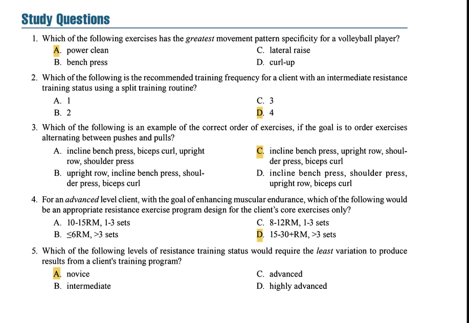

# Comprehensive Study Guide: NSCA Essentials of Personal Training, 3rd Edition - Chapter 15: Resistance Training Program Design

## 1 General Training Principles

### 1.1 Key Concepts & Exam Focus
- **Specificity (SAID Principle)**: The body adapts specifically to the demands placed upon it. This includes:
  - **Movement Pattern Specificity**: Exercises should mimic the movement patterns of the sport or activity .
  - **Muscle Group Involvement**: Training should target the specific muscle groups used in the sport.
  - **Energy System Specificity**: Training should match the metabolic demands of the activity (ATP-PC, glycolytic, or oxidative) .
- **Overload Principle**: To produce adaptations, the training stimulus must exceed what the body is accustomed to .
- **Variation Principle**: Systematic changes in training variables (volume, intensity, exercises) are necessary to continue prompting adaptation and avoid plateaus .
- **Progressive Overload**: The systematic increase in training frequency, intensity, time, or type to continue making gains .

### 1.2 Critical Statistics & Specifics
- **Progression Rates**: Generally, a **2.5-10%** increase in load is appropriate when progressing exercises, depending on training status and movement complexity .
- **"2-for-2" Rule**: If a client can perform **2 or more repetitions** over their target rep number in the last set for **2 consecutive training sessions**, weight should be increased .

### 1.3 Technique & Safety Precautions
- When implementing progressive overload:
  - **Priority**: Form and technique must never be compromised for increased load.
  - **Monitoring**: Use subjective measures (RPE, talk test) and objective measures (velocity tracking, rep performance) to guide progression.
- **Contraindications**: Avoid implementing multiple overload strategies simultaneously (e.g., increasing both intensity and volume in the same session).

### 1.4 Study Question Integration
- **Question 1**: Which exercise has the greatest movement pattern specificity for a volleyball player? **Answer: A. power clean** (Explanation: The power clean develops explosive triple extension at the ankles, knees, and hips which mimics the jumping motion critical in volleyball, making it the most specific choice) .
- **Question 5**: Which training status requires the least variation? **Answer: A. novice** (Explanation: Novice clients can make progress with minimal variation as they are experiencing initial neurological adaptations to training) .

### 1.5 Key Points
- The **SAID principle** (Specific Adaptations to Imposed Demands) is the foundation of program design.
- **Progressive overload** must be applied systematically and appropriately based on the client's training status and recovery capacity.
- **Variation** is necessary to prevent plateaus, with advanced trainees requiring more variation than novices.

## 2 Initial Fitness Consultation and Evaluation

### 2.1 Key Concepts & Exam Focus
- **Needs Analysis**: A two-stage process involving:
  - **Evaluation of the Sport/Activity**: Movement analysis, physiological analysis, and injury analysis .
  - **Athlete/Client Assessment**: Training status, exercise history, injury history, and conducting appropriate tests .
- **Training Status Classification**: Clients are categorized as **novice**, **intermediate**, or **advanced** based on their training history and current abilities .
- **Goal Assessment**: Determining primary training goals (muscular endurance, hypertrophy, strength, power) is essential for proper program design .

### 2.2 Critical Statistics & Specifics
- **Training Status Guidelines**:
  - **Novice**: No training experience or has not trained regularly for several years
  - **Intermediate**: Approximately 1 year of consistent training experience
  - **Advanced**: Multiple years of dedicated training experience 

### 2.3 Technique & Safety Precautions
- **Health Screening**: Always conduct a pre-participation health screening (e.g., PAR-Q+) and obtain medical clearance when necessary before assessing fitness .
- **Test Order**: Administer tests in this order: 1) Resting measures, 2) Non-fatiguing tests (e.g., body comp, flexibility), 3) Power/strength tests, 4) Muscular endurance tests, 5) Aerobic capacity tests .
- **Safety**: Ensure proper spotting equipment and techniques for maximal strength testing.

### 2.4 Key Points
- A thorough **needs analysis** is the foundation of an effective program.
- **Training status** significantly influences all program variables.
- **Testing** should be specific to the client's goals and abilities.

## 3 Determination of Training Frequency

### 3.1 Key Concepts & Exam Focus
- **Training Frequency**: Refers to the number of training sessions per week for a specific muscle group or movement pattern .
- **Recovery Considerations**: 48-72 hours of recovery is generally recommended between training the same muscle groups .
- **Split Routines**: Dividing training by body parts or movement patterns allows for more frequent training of individual muscle groups .

### 3.2 Critical Statistics & Specifics
- **General Frequency Recommendations**:
  - **Novice**: 2-3 days/week (full body)
  - **Intermediate**: 3-4 days/week (split routine)
  - **Advanced**: 4-6+ days/week (split routine) 
- **Seasonal Variations**:
  - **Off-season**: 4-6 days/week
  - **Pre-season**: 3-4 days/week
  - **In-season**: 1-2 days/week
  - **Post-season**: 1-3 days/week 

### 3.3 Technique & Safety Precautions
- **Overtraining Signs**: Monitor for persistent fatigue, decreased performance, increased resting HR, sleep disturbances, and appetite changes - adjust frequency accordingly .
- **Novice Clients**: Begin with 2 non-consecutive days per week to allow for adaptation and recovery.

### 3.4 Study Question Integration
- **Question 2**: Recommended training frequency for an intermediate client using a split routine? **Answer: C. 3** (Explanation: Intermediate clients typically train 3-4 days per week with a split routine) .

### 3.5 Key Points
- Training frequency is influenced by **training status**, **recovery ability**, **training volume**, and **nutrition/sleep**.
- **Split routines** allow for increased frequency for individual muscle groups.
- **More is not always better** - adequate recovery is essential for adaptation.

## 4 Exercise Selection

### 4.1 Key Concepts & Exam Focus
- **Core Exercises**: Multi-joint movements that involve large muscle groups and are prioritized in programming (e.g., squats, deadlifts, presses) .
- **Assistance Exercises**: Typically single-joint movements that target smaller muscle groups (e.g., bicep curls, tricep extensions) .
- **Structural Exercises**: Core exercises that load the axial skeleton (e.g., back squat, deadlift) .
- **Power Exercises**: High-velocity movements (e.g., cleans, snatches, push presses) .

### 4.2 Critical Statistics & Specifics
- **Exercise Selection Ratio**: Programs should generally include **~80% core exercises** and **~20% assistance exercises** for most training goals.
- **Novice Clients**: Should focus primarily on core exercises to build foundational strength and movement competency.

### 4.3 Technique & Safety Precautions
- **Exercise Progression**: Introduce new exercises in this order: 1) Demonstrate, 2) Explain, 3) Client performs with light load, 4) Provide feedback, 5) Gradually increase load .
- **Power Exercise Safety**: These should only be introduced after clients have established adequate strength base (e.g., 1RM squat of 1.5x body weight) and technical proficiency .
- **Contraindications**: Avoid upright rows for clients with shoulder impingement issues .

### 4.4 Key Points
- **Core exercises** should form the foundation of most programs.
- **Power exercises** require technical competency and should be programmed appropriately.
- **Exercise selection** should consider the client's goals, injury history, and equipment availability.

## 5 Exercise Order

### 5.1 Key Concepts & Exam Focus
- **General Principles**:
  - **Large before small**: Multi-joint before single-joint
  - **High skill before low skill**: Technical exercises before simpler ones
  - **High intensity before low intensity**: Heavy exercises before lighter ones 
- **Common Sequencing Methods**:
  - **Power, Core, Assistance**: Perform power exercises first, then core, then assistance
  - **Push-Pull Alternation**: Alternate between pushing and pulling movements
  - **Upper-Lower Alternation**: Alternate between upper and lower body exercises
  - **Super-sets**: Pairing exercises for agonist-antagonist muscles with minimal rest
  - **Compound-sets**: Pairing exercises for the same muscle group with minimal rest 

### 5.2 Critical Statistics & Specifics
- **Rest Between Paired Sets**: For super-sets and compound-sets, rest is typically **30-90 seconds** after the paired exercises .

### 5.3 Technique & Safety Precautions
- **Fatigue Management**: Proper exercise order helps manage fatigue and maintain technical proficiency, especially for complex lifts.
- **Power Exercises**: Should always be performed when fresh, not under fatigue .
- **Contraindications**: Avoid placing technically demanding exercises at the end of sessions when fatigue compromises form.

### 5.4 Study Question Integration
- **Question 3**: Example of correct order alternating between pushes and pulls? **Answer: C. incline bench press (push), upright row (pull), shoulder press (push), biceps curl (pull)** (Explanation: This sequence correctly alternates between push and pull movements for all exercises) .

### 5.5 Key Points
- **Exercise order** significantly impacts the quality of the training session.
- **Power and technical exercises** should be performed early in the session.
- **Multiple methods** of sequencing can be effective depending on the client's goals.

## 6 Training Load: Resistance and Repetitions

### 6.1 Key Concepts & Exam Focus
- **Repetition Maximum (RM)**: The maximum number of repetitions that can be performed with a given load .
- **%1RM Method**: Using a percentage of the client's 1-repetition maximum to determine training load .
- **Repetition Continuum**: Different repetition ranges produce different adaptations:
  - **Strength**: ≤6 repetitions
  - **Hypertrophy**: 6-12 repetitions
  - **Muscular Endurance**: ≥12 repetitions 

### 6.2 Critical Statistics & Specifics
- **RM Continuum**:
  - **Strength**: 1-6RM (≥85% 1RM)
  - **Hypertrophy**: 6-12RM (67-85% 1RM)
  - **Endurance**: 12-20+RM (≤67% 1RM) 
- **Power Training Loads**:
  - **Single-effort events**: 80-90% 1RM
  - **Multiple-effort events**: 75-85% 1RM 

### 6.3 Technique & Safety Precautions
- **1RM Testing Considerations**:
  - **Novices**: Should not test 1RM; use estimated values from submaximal testing
  - **Proper Warm-up**: 5-10 reps at 50% 1RM, 3-5 reps at 70% 1RM, 2-3 reps at 80% 1RM
  - **Rest Between Attempts**: 2-4 minutes
  - **Technical Proficiency**: Clients must demonstrate proper form before testing 
- **Safety**: Always use spotters and appropriate safety equipment (collars, power racks) for heavy loading.

### 6.4 Study Question Integration
- **Question 4**: For an advanced client targeting muscular endurance, appropriate core exercise design? **Answer: D. 15-30+RM, >3 sets** (Explanation: Muscular endurance is best developed with high repetition ranges (15-30+ RM) and multiple sets) .

### 6.5 Key Points
- **Training load** is arguably the most important programming variable.
- The **%1RM method** is the most accurate way to determine training load.
- **Repetition ranges** correspond to specific training adaptations.

*Table: Training Goals and Loading Recommendations*

| **Training Goal** | **Load (%1RM)** | **Repetitions** | **Rest Periods** |
|-------------------|-----------------|-----------------|------------------|
| **Strength**      | ≥85%            | ≤6              | 2-5 minutes      |
| **Power**         | 75-90%          | 1-5             | 2-5 minutes      |
| **Hypertrophy**   | 67-85%          | 6-12            | 30-90 seconds    |
| **Endurance**     | ≤67%            | ≥12             | ≤30 seconds      |

## 7 Progression

### 7.1 Key Concepts & Exam Focus
- **Progressive Overload**: The systematic increase in training stress to continue driving adaptations .
- **Types of Progression**:
  - **Load Progression**: Increasing the resistance
  - **Volume Progression**: Increasing sets/reps
  - **Density Progression**: Decreasing rest periods
  - **Technical Progression**: Increasing exercise complexity 
- **Timing of Progression**: Progress should be implemented when the current training stimulus no longer provides sufficient challenge.

### 7.2 Critical Statistics & Specifics
- **Load Increase Guidelines**:
  - **Upper Body**: 2.5-5 lb (1-2.5 kg) increases
  - **Lower Body**: 5-15 lb (2.5-7 kg) increases 
- **Percentage-Based Progression**: Generally **2.5-10%** load increase depending on training status and movement .

### 7.3 Technique & Safety Precautions
- **Conservative Approach**: Smaller, more frequent increases are better than large, infrequent jumps.
- **Technical Maintenance**: Form must not be compromised for the sake of progression.
- **Client Monitoring**: Use training logs, subjective feedback, and periodic testing to guide progression decisions.

### 7.4 Key Points
- **Progression** must be systematic and individualized.
- **Multiple methods** of progression can be used beyond simply increasing load.
- **Form and technique** should never be sacrificed for increased load or volume.

## 8 Training Volume: Repetitions and Sets

### 8.1 Key Concepts & Exam Focus
- **Training Volume**: Typically calculated as **Sets × Reps × Load** .
- **Dose-Response Relationship**: Higher volumes generally produce greater hypertrophy and endurance adaptations, though with diminishing returns .
- **Set Recommendations**: Vary based on training goals and experience level.

### 8.2 Critical Statistics & Specifics
- **Set Recommendations by Goal**:
  - **Novices**: 1-3 sets per exercise
  - **Strength**: 2-6 sets per exercise
  - **Hypertrophy**: 3-6 sets per exercise
  - **Endurance**: 2-3 sets per exercise 
- **Weekly Volume Guidelines**:
  - **Hypertrophy**: 10-20 sets per muscle group per week
  - **Strength**: 10-15 sets per movement pattern per week 

### 8.3 Technique & Safety Precautions
- **Volume Management**: Excessive volume can lead to overtraining and injury - especially for novice clients.
- **Exercise Variation**: Volume should be distributed across different exercises for the same muscle groups.
- **Progressive Overload**: Increase volume gradually, not abruptly.

### 8.4 Key Points
- **Training volume** is a key determinant of the training response.
- **Higher volumes** are generally associated with hypertrophy and endurance adaptations.
- **Volume and intensity** have an inverse relationship.

## 9 Rest Intervals

### 9.1 Key Concepts & Exam Focus
- **Rest Interval Definition**: The time dedicated to recovery between sets and exercises .
- **Energy Recovery**: ATP-PC system replenishes rapidly (∼90% in 30 seconds, full recovery in 3-5 minutes) .
- **Training Goal Influence**: Rest periods vary significantly based on the primary training objective.

### 9.2 Critical Statistics & Specifics
- **Rest Period Recommendations**:
  - **Strength/Power**: 2-5 minutes
  - **Hypertrophy**: 30-90 seconds
  - **Muscular Endurance**: ≤30 seconds 
- **Metabolic Considerations**: Shorter rest periods increase metabolic stress and hormone response, favoring hypertrophy .

### 9.3 Technique & Safety Precautions
- **Client Monitoring**: Watch for breathing rate and conversation ability as indicators of recovery between sets.
- **Technical Maintenance**: Complex exercises require longer rest periods to maintain technique.
- **Conditioning Level**: Adjust rest periods based on the client's current fitness level and recovery capacity.

### 9.4 Key Points
- **Rest periods** significantly influence the metabolic and hormonal response to training.
- **Shorter rest periods** increase metabolic stress but may limit the load that can be used.
- **Rest periods** should be prescribed based on the client's training goals.

## 10 Variation

### 10.1 Key Concepts & Exam Focus
- **Variation Principle**: Systematic alteration of training variables to optimize adaptation and avoid plateaus .
- **Periodization**: The structured planning of training variables over time to maximize specific adaptations .
- **Training Monotony**: Lack of variation can lead to stagnation, overtraining, and injury.

### 10.2 Critical Statistics & Specifics
- **Variation Timeline**:
  - **Novices**: Change every 4-8 weeks
  - **Intermediates**: Change every 2-4 weeks
  - **Advanced**: Change weekly or even within sessions (daily undulating periodization) 
- **Volume-Load Recommendations**: Vary volume-load by **5-10%** in microcycles and **15-25%** in mesocycles .

### 10.3 Technique & Safety Precautions
- **Strategic Changes**: Variation should be planned and systematic, not random.
- **Exercise Rotation**: Implement exercise rotations rather than complete exercise changes to maintain movement pattern specificity.
- **Client Feedback**: Monitor for signs of staleness or overtraining and adjust variation accordingly.

### 10.4 Key Points
- **Variation** is necessary to continue driving adaptation.
- **Advanced athletes** require more frequent variation than novices.
- **Variation** should be planned systematically through periodization.

*Table: Periodization Cycles and Characteristics*

| **Cycle**      | **Time Frame**   | **Primary Focus**                           |
|----------------|------------------|---------------------------------------------|
| **Macrocycle** | Several months to a year | Long-term planning toward major goals    |
| **Mesocycle**  | Several weeks to months  | Specific training phase (e.g., hypertrophy) |
| **Microcycle** | 1-4 weeks        | Short-term implementation of training       |

## 11 Comprehensive Program Design Summary

When designing resistance training programs, personal trainers must systematically address each variable based on the client's needs, goals, and training status. The most effective programs:

- Are built on a foundation of **specificity** to the client's goals and needs
- Implement **progressive overload** in a structured, systematic manner
- Include appropriate **variation** to prevent plateaus
- Balance **volume** and **intensity** according to the client's recovery capacity
- Prioritize **proper exercise technique** and **safety** above all else

**Question 1**
**Correct Answer:** A. power clean
**Textbook Reference:**
"Exercise selection should be based on the principle of specificity (SAID principle). For a volleyball player, exercises that develop explosive triple extension (ankles, knees, hips) similar to jumping movements are most specific. The power clean trains this explosive hip extension pattern and rate of force development, directly transferring to volleyball performance." (Chapter 15, "Exercise Selection")

**Incorrect Options:**
*   **B. bench press**: This is a upper-body horizontal press that develops general upper-body strength but lacks the explosive, lower-body triple extension specific to a volleyball spike or block.
*   **C. lateral raise**: This is an isolation exercise for the shoulder abductors. It has no movement pattern similarity to the primary power movements in volleyball.
*   **D. curl-up**: This is a core endurance exercise. While core stability is important, it does not train the explosive movement patterns or the prime movers (legs, hips) critical for volleyball.

**Question 2**
**Correct Answer:** C. 3
**Textbook Reference:**
"For an intermediate client utilizing a split routine (training different muscle groups on different days), a training frequency of 3-4 days per week is recommended. This allows for adequate training volume per muscle group while ensuring sufficient recovery time between sessions targeting the same muscles." (Chapter 15, "Determination of Training Frequency")

**Incorrect Options:**
*   **A. 1**: A frequency of 1 day per week is generally insufficient for maintaining, let alone improving, fitness goals for an intermediate client and is more typical for a maintenance program.
*   **B. 2**: A 2-day-per-week frequency is typically recommended for novice clients performing full-body workouts, not for intermediates on a split routine seeking further adaptation.
*   **D. 4**: While 4 days is within the possible range for some intermediates, 3 days is the standard recommended starting point for a split routine. A 4-day split is more common for advanced trainees.

**Question 3**
**Correct Answer:** C. incline bench press, upright row, shoulder press, biceps curl
**Textbook Reference:**
"Alternating between push (e.g., bench press, shoulder press) and pull (e.g., upright row, bent-over row) exercises is an effective method for sequencing exercises. This allows the agonist muscle group to rest while the antagonist group is working, which can enhance recovery within the session and improve performance for subsequent sets." (Chapter 15, "Exercise Order")

**Incorrect Options:**
*   **A. incline bench press (push), biceps curl (pull), upright row (pull), shoulder press (push)**: This sequence is incorrect because it places two pull exercises (biceps curl and upright row) back-to-back, violating the push-pull alternation rule.
*   **B. upright row (pull), incline bench press (push), shoulder press (push), biceps curl (pull)**: This sequence is incorrect because it places two push exercises (incline bench press and shoulder press) back-to-back.
*   **D. incline bench press (push), shoulder press (push), upright row (pull), biceps curl (pull)**: This sequence is incorrect because it places two push exercises together followed by two pull exercises, failing to alternate between the movement patterns.

**Question 4**
**Correct Answer:** D. 15-30+RM, >3 sets
**Textbook Reference:**
"To enhance muscular endurance, the recommended prescription is a light load (≤67% of 1RM) allowing for high repetitions (15 or more), and multiple sets (≥3). For an advanced client, a higher volume (e.g., >3 sets) is necessary to provide a sufficient stimulus for further adaptation." (Chapter 15, "Training Load: Resistance and Repetitions" and "Training Volume: Repetitions and Sets")

**Incorrect Options:**
*   **A. 10-15RM, 1-3 sets**: This prescription (moderate load, moderate repetitions) is more suited for hypertrophy goals, not the high-repetition focus required for muscular endurance.
*   **B. ≤6RM, >3 sets**: This prescription (very heavy load, low repetitions) is designed for maximal strength development and is counterproductive for muscular endurance.
*   **C. 8-12RM, 1-3 sets**: This prescription (moderate-to-heavy load, moderate repetitions) is the classic recommendation for hypertrophy and is not optimal for targeting muscular endurance, especially for an advanced client who requires more volume (>3 sets).

**Question 5**
**Correct Answer:** A. novice
**Textbook Reference:**
"Novice clients require the least variation in their training programs. They can make consistent progress (often through neurological adaptations) with very small changes in program variables. In contrast, intermediate and advanced clients require more frequent variation to continue provoking adaptation and overcoming plateaus." (Chapter 15, "Variation")

**Incorrect Options:**
*   **B. intermediate**: Intermediate clients have exhausted the rapid gains of novices and require more planned variation (e.g., every 2-4 weeks) to continue making progress.
*   **C. advanced**: Advanced clients require the most variation, often employing sophisticated periodization models with frequent changes in volume and intensity (e.g., weekly or daily) to break through plateaus.
*   **D. highly advanced**: This is not a standard classification in the text, but any "advanced" trainee requires significantly more variation than a novice.