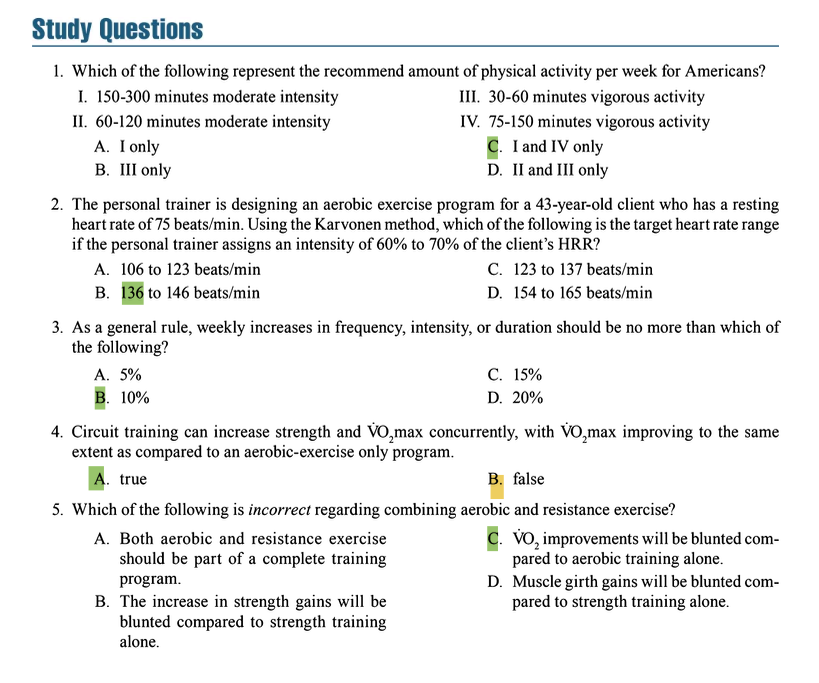

# Aerobic Training Program Design  

## Introduction to Aerobic Endurance Training  

**Key Concepts & Exam Focus**:  
- **Aerobic endurance training** is characterized by the **ability to perform large-muscle dynamic exercise for prolonged periods** at moderate-to-high intensities, typically utilizing **60-80% of maximum heart rate** .  
- The primary **physiological adaptations** include: **increased maximal oxygen consumption (VO₂max)**, **increased cardiac output**, **increased mitochondrial density**, **increased capillary density**, **increased oxidative enzymes**, and **decreased submaximal heart rate** .  
- **Health benefits** include: **improved blood lipid profiles** (decreased LDL and triglycerides, increased HDL), **decreased resting blood pressure**, **improved insulin sensitivity**, **reduced body fat**, and **enhanced cardiovascular health** .  

**Critical Statistics & Specifics**:  
- **VO₂max improvements**: Typical improvements range from **5-30%** following appropriate training programs, with greater improvements in previously sedentary individuals .  
- **Blood pressure**: Aerobic training can reduce systolic BP by **5-7 mmHg** and diastolic BP by **3-5 mmHg** in hypertensive individuals .  
- **Lipid profiles**: Aerobic training can **reduce triglycerides by 11-18%**, **increase HDL by 8-21%**, and **reduce LDL by 13-23%** .  

**Key Points**:  
- Aerobic endurance training induces **significant cardiovascular and metabolic adaptations** that enhance performance and improve health markers.  
- Training programs must be designed with consideration of the **FITT principle** (Frequency, Intensity, Time, Type) to optimize adaptations while minimizing injury risk.
-  Physical activity and health: **150 to 300
minutes per week of moderate-intensity** physical activ-
ity and about **75 to 150 minutes of vigorous-intensity**
physical activity per week is considered within the
target range.

## 1 SPECIFICITY OF AEROBIC ENDURANCE TRAINING  

### 1.1 Metabolic Specificity  

**Key Concepts & Exam Focus**:  
- The **SAID principle** (Specific Adaptations to Imposed Demands) dictates that **training adaptations are specific to the metabolic systems and muscle groups stressed** during exercise .  
- **Three primary energy systems**:  
  1. **Phosphagen system** (ATP-PC): Dominant during **high-intensity efforts lasting 0-30 seconds**  
  2. **Glycolytic system**: Dominant during **moderate-to-high-intensity efforts lasting 30 seconds to 2 minutes**  
  3. **Oxidative system**: Dominant during **lower-intensity efforts lasting beyond 2 minutes**   

**Critical Statistics & Specifics**:  
- **Training intensity zones** based on metabolic specificity:  
  - **Zone 1 (Recovery)**: <65% HRmax, <50% VO₂max  
  - **Zone 2 (Extensive endurance)**: 65-75% HRmax, 50-65% VO₂max  
  - **Zone 3 (Intensive endurance)**: 75-85% HRmax, 65-80% VO₂max  
  - **Zone 4 (Threshold)**: 85-95% HRmax, 80-90% VO₂max  
  - **Zone 5 (Interval training)**: >95% HRmax, >90% VO₂max   

**Key Points**:  
- Training should be designed to **target specific energy systems** based on the client's goals and event-specific demands.  
- **Higher-intensity training** produces greater improvements in VO₂max and anaerobic threshold, but **lower-intensity training** is important for building an aerobic base and promoting fat adaptation .  

*Table: Energy System Specificity in Training*  
| **Training Type** | **Intensity (%HRmax)** | **Primary Energy System** | **Typical Duration** |  
|-------------------|------------------------|---------------------------|----------------------|  
| Recovery | <65% | Oxidative | 20-45 min |  
| Long Slow Distance | 65-75% | Oxidative | 30 min - 2+ hours |  
| Pace/Tempo | 75-85% | Oxidative + Glycolytic | 20-30 min |  
| Interval Training | 85-95% | Glycolytic + Phosphagen | 30 sec - 5 min intervals |  
| High-Intensity Interval | >95% | Phosphagen + Glycolytic | 10-30 sec intervals |  

## 2 COMPONENTS OF AN AEROBIC ENDURANCE TRAINING PROGRAM  

### 2.1 Exercise Mode  

**Key Concepts & Exam Focus**:  
- **Mode** refers to the **type of activity** selected for training (e.g., running, cycling, swimming) .  
- Selection should consider: **client preference**, **availability of equipment**, **specificity to goal activities**, and **injury risk** .  
- **Impact vs. non-impact**: Lower-impact activities (cycling, swimming) are preferable for **overweight clients** or those with **orthopedic limitations** .  

**Technique & Safety Precautions**:  
- **Proper equipment fitting** is essential (bike fit, proper footwear for running).  
- **Cross-training** incorporating multiple modes can reduce overuse injury risk while maintaining cardiovascular adaptations .  

### 2.2 Exercise Intensity  

**Key Concepts & Exam Focus**:  
- **Intensity** is the **most critical variable** for stimulating physiological adaptations .  
- **Four primary methods for prescribing intensity**:  
  1. **Heart rate methods** (most common)  
  2. **Metabolic equivalents** (METs)  
  3. **Power output** (watts)  
  4. **Rating of perceived exertion** (RPE)   

**Critical Statistics & Specifics**:  
- **Heart Rate Reserve (HRR) method** (Karvonen formula):  
  - **Target HR = [(HRmax - HRrest) × Intensity%] + HRrest**  
  - Example: For a 43-year-old with RHR of 75 bpm at 60-70% intensity:  
    - HRmax = 220 - 43 = 177 bpm  
    - HRR = 177 - 75 = 102 bpm  
    - 60% intensity: (102 × 0.60) + 75 = 136.2 bpm  
    - 70% intensity: (102 × 0.70) + 75 = 146.4 bpm  
    - **Answer: 136-146 bpm** (matches option B from study questions)   
- **Percentage of Maximum Heart Rate method**:  
  - **HRmax = 220 - age** (less accurate than HRR method)  
  - Target intensity typically **70-85% of HRmax**   
- **METs method**:  
  - **1 MET = 3.5 ml·kg⁻¹·min⁻¹** (resting oxygen consumption)  
  - Moderate intensity: **3-6 METs**  
  - Vigorous intensity: **>6 METs**   
- **Rating of Perceived Exertion (RPE)**:  
  - **Borg Scale (6-20)**: Moderate intensity = 12-13, Vigorous intensity = 14-17  
  - **Category-Ratio Scale (0-10)**: Moderate intensity = 3-4, Vigorous intensity = 5-6   

**Key Points**:  
- The **Karvonen (HRR) method** is generally **more accurate** than the percentage of HRmax method because it accounts for individual differences in resting heart rate.  
- **RPE is particularly useful** for individuals taking medications that affect heart rate (beta-blockers) .  

### 2.3 Exercise Duration  

**Key Concepts & Exam Focus**:  
- **Duration** refers to the **length of each training session** .  
- **Inverse relationship with intensity**: Higher-intensity sessions typically have shorter durations, while lower-intensity sessions can be maintained longer .  

**Critical Statistics & Specifics**:  
- **General recommendations**: **20-60 minutes** of continuous or intermittent activity per session .  
- **Minimum for health benefits**: **20-30 minutes** of moderate-intensity exercise .  
- **Weight management**: **50-60 minutes** or more daily may be needed for prevention of weight regain .  

**Key Points**:  
- Duration should be **progressed gradually** after establishing appropriate frequency and intensity.  
- **Multiple shorter bouts** (e.g., 3 × 10 minutes) can be effectively accumulated throughout the day for health benefits .  

### 2.4 Exercise Frequency  

**Key Concepts & Exam Focus**:  
- **Frequency** refers to the **number of training sessions per week** .  
- Depends on: **client goals**, **current fitness level**, **training intensity**, **training duration**, and **recovery ability** .  

**Critical Statistics & Specifics**:  
- **General recommendations**: **3-5 days per week** .  
- **Minimum frequency**: **2 days/week** to maintain aerobic fitness .  
- **Higher frequencies** (5-6 days/week) may be appropriate for **advanced athletes** .  
- **Lower intensities and durations** allow for **higher frequencies** .  

**Key Points**:  
- **Allow at least 24 hours recovery** between moderate-to-high intensity sessions for beginners.  
- **High-frequency training** (>5 days/week) increases injury risk and should be implemented cautiously .  

### 2.5 Progression  

**Key Concepts & Exam Focus**:  
- **Progression** refers to the **systematic increase in training stimulus** over time .  
- The **10% rule** is a general guideline: **do not increase frequency, intensity, or duration by more than 10% per week** .  

**Critical Statistics & Specifics**:  
- **Weekly increases** should generally not exceed:  
  - **Frequency**: ≤10% increase  
  - **Intensity**: ≤10% increase  
  - **Duration**: ≤10% increase  
  - (Answer to study question 3: B. 10%)   
- **Three progression strategies**:  
  1. **Initial conditioning phase**: 4-6 weeks of light-to-moderate intensity at lower durations  
  2. **Improvement phase**: 4-8 months of gradual increases in frequency, intensity, and duration  
  3. **Maintenance phase**: Ongoing training after achieving goals   

**Technique & Safety Precautions**:  
- **Monitor for signs of overtraining**: Persistent fatigue, decreased performance, increased RPE at same workload, mood disturbances, sleep disturbances.  
- **Individualize progression**: Some clients may tolerate more rapid progression, while others may need more conservative approaches.  

**Key Points**:  
- **Progress only one variable at a time** (e.g., increase duration before increasing intensity).  
- **Periodic reassessment** is essential to adjust the program based on client response and adaptation .  

## 3 TYPES OF AEROBIC ENDURANCE TRAINING PROGRAMS  

### 3.1 Long, Slow Distance (LSD) Training  

**Key Concepts & Exam Focus**:  
- **LSD training** involves exercise at **60-70% of HRmax** for **duration longer than race distance** or **≥30 minutes** .  
- **Primary goals**: **Improve aerobic endurance**, **enhance fat utilization**, **improve thermoregulatory mechanisms**, and **increase mitochondrial density** .  

**Critical Statistics & Specifics**:  
- **Intensity**: **60-70% HRmax** or **VO₂max** .  
- **Duration**: **30 minutes to 2 hours** .  
- **Frequency**: **No more than 2 times per week** to avoid overtraining .  

**Technique & Safety Precautions**:  
- **Appropriate for beginners** due to lower intensity and injury risk.  
- **Ensure proper hydration** for sessions lasting >60 minutes.  
- **Gradually increase duration** following the 10% rule.  

**Key Points**:  
- LSD training forms the **aerobic base** for more intense training later.  
- Improves **aerobic capacity** but may have **limited effect on VO₂max** in trained athletes .  

### 3.2 Pace/Tempo Training  

**Key Concepts & Exam Focus**:  
- **Pace/Tempo training** involves exercise at **intensity at or slightly above race pace**,
 corresponding to **lactate threshold** .  
- **Primary goals**: **Increase lactate threshold**, **improve energy production efficiency**, and **develop race pace sense** .  

**Critical Statistics & Specifics**:  
- **Intensity**: **At or slightly above lactate threshold** (typically 75-85% HRmax) .  
- **Duration**: **20-30 minutes** continuously or **3-5 minute intervals** with 30-90 seconds rest .  
- **Frequency**: **1-2 times per week** .  

**Technique & Safety Precautions**:  
- **Not appropriate for beginners** until adequate aerobic base is established.  
- **Monitor form deterioration** as fatigue sets in near the end of intervals.  

**Key Points**:  
- Pace/Tempo training is **highly specific to race performance** and improves the ability to sustain higher intensities for longer durations .  

### 3.3 Interval Training  

**Key Concepts & Exam Focus**:  
- **Interval training** involves **brief, high-intensity efforts** interspersed with **recovery periods** .  
- **Primary goals**: **Improve VO₂max**, **enhance anaerobic capacity**, and **increase fatigue resistance** at high intensities .  

**Critical Statistics & Specifics**:  
- **Intensity**: **≥VO₂max** or **≥95% HRmax** .  
- **Work duration**: **30 seconds to 5 minutes** .  
- **Work:rest ratio**: **1:1 to 1:3** (shorter rest for aerobic focus, longer rest for anaerobic focus) .  
- **Frequency**: **1-2 times per week** .  

**Technique & Safety Precautions**:  
- **Requires thorough warm-up** due to high intensity.  
- **Ensure adequate recovery** between sessions (at least 48 hours).  
- **Appropriate running surface** is critical to reduce impact stress.  

**Key Points**:  
- Interval training produces **similar or greater improvements in VO₂max** compared to steady-state training, despite **lower total volume** .  

### 3.4 Circuit Training  

**Key Concepts & Exam Focus**:  
- **Circuit training** combines **aerobic and resistance exercises** in sequence with minimal rest .  
- **Primary goals**: **Simultaneously improve strength and aerobic capacity** .  

**Critical Statistics & Specifics**:  
- **Circuit design**: **8-12 exercises** targeting different muscle groups  
- **Work duration**: **30-60 seconds per exercise**  
- **Rest interval**: **15-30 seconds between exercises**  
- **Total circuit time**: **15-30 minutes**   

**Study Question Integration**:  
- Circuit training can increase strength and VO₂max concurrently, but **VO₂max improvements are blunted compared to aerobic-only training** (Answer to study question 4: B. False) .  

**Key Points**:  
- Circuit training provides a **time-efficient** method for improving both strength and aerobic fitness.  
- Best suited for **general fitness clients** rather than competitive endurance athletes .  

*Table: Comparison of Aerobic Endurance Training Programs*  
| **Training Type** | **Intensity** | **Duration** | **Primary Adaptations** | **Best For** |  
|-------------------|---------------|--------------|------------------------|--------------|  
| LSD Training | 60-70% HRmax | 30 min - 2 hr | ↑ Mitochondrial density, ↑ Fat utilization | Beginners, Base building |  
| Pace/Tempo | 75-85% HRmax | 20-30 min | ↑ Lactate threshold, ↑ Race pace efficiency | Intermediate/Advanced athletes |  
| Interval Training | ≥95% HRmax | 30 sec - 5 min intervals | ↑ VO₂max, ↑ Anaerobic capacity | Advanced athletes |  
| Circuit Training | 40-60% HRR | 15-30 min | Moderate improvements in both strength and VO₂max | General fitness, Time-limited clients |  

## 4 COMBINING AEROBIC AND RESISTANCE TRAINING  

**Key Concepts & Exam Focus**:  
- **Concurrent training** refers to combining **aerobic and resistance training** in a comprehensive program .  
- The **interference effect** describes how concurrent training may **blunt optimal gains** in both strength and endurance compared to training each alone .  

**Critical Statistics & Specifics**:  
- **Strength gains** are **blunted** compared to resistance training alone .  
- **Muscle hypertrophy** is **blunted** compared to resistance training alone .  
- **VO₂max improvements** are **NOT typically blunted** compared to aerobic training alone (Answer to study question 5: C is incorrect) .  
- **Recommended sequencing**:  
  - **Primary goal = strength**: Perform resistance training before aerobic training  
  - **Primary goal = endurance**: Perform aerobic training before resistance training   

**Technique & Safety Precautions**:  
- **Allow adequate recovery** between sessions (≥6 hours between high-intensity aerobic and resistance sessions).  
- **Periodize training** to focus on specific adaptations at different times of year.  

**Key Points**:  
- Despite the interference effect, **both aerobic and resistance exercise should be part of a complete training program** for overall health and fitness .  
- The interference effect is **most pronounced in elite athletes**; general fitness clients can effectively train both systems simultaneously .  

## 5 KEY POINTS SUMMARY  

- The **FITT principle** (Frequency, Intensity, Time, Type) provides the framework for designing aerobic endurance training programs .  
- The **Karvonen (HRR) method** is superior to percentage of HRmax for prescribing intensity because it accounts for individual differences in resting heart rate .  
- The **10% rule** (weekly increases not exceeding 10% in frequency, intensity, or duration) helps prevent overtraining and injury .  
- **Training specificity** dictates that adaptations are specific to the energy systems and muscle groups stressed during training .  
- **LSD training** builds an aerobic base, **pace/tempo training** improves lactate threshold, and **interval training** enhances VO₂max and anaerobic capacity .  
- **Circuit training** provides moderate improvements in both strength and aerobic capacity but is not optimal for maximizing either adaptation .  
- **Concurrent training** may blunt optimal strength and hypertrophy gains but remains valuable for overall health and fitness .  

Question 1
Correct Answer: C. I and IV only
Textbook Reference:
"For substantial health benefits, adults should do at least 150 minutes to 300 minutes a week of moderate-intensity, or 75 minutes to 150 minutes a week of vigorous-intensity aerobic physical activity." (Chapter 16, "Components of an Aerobic Endurance Training Program")

Incorrect Options:
* A. I only: This is incomplete. While 150-300 minutes of moderate-intensity exercise is correct, the guidelines also include an equivalent option of 75-150 minutes of vigorous-intensity activity.
* B. III only: This option is incorrect. The recommended amount of vigorous-intensity activity is 75-150 minutes per week, not 30-60 minutes.
* D. II and III only: Both options are incorrect. The recommended moderate-intensity range is 150-300 minutes, not 60-120. The recommended vigorous-intensity range is 75-150 minutes, not 30-60.

Question 2
Correct Answer: B. 136 to 146 beats/min
Textbook Reference:
"The Karvonen method (heart rate reserve method) uses the following formula: Target HR = [(HR_max - HR_rest) × Intensity%] + HR_rest." For a 43-year-old (HR_max = 220 - 43 = 177 bpm) with a resting HR of 75 bpm, the HRR is 102 bpm. At 60-70% HRR, the target range is calculated as 136.2 to 146.4 bpm. (Chapter 16, "Components of an Aerobic Endurance Training Program - Exercise Intensity")

Incorrect Options:
* A. 106 to 123 beats/min: This range is too low. It may result from incorrectly using a percentage of maximum heart rate without adding back the resting heart rate or using a much lower intensity percentage.
* C. 123 to 137 beats/min: This range is also incorrect. It could be a miscalculation, potentially using a different formula or incorrect intensity percentages.
* D. 154 to 165 beats/min: This range is too high. It may result from using a percentage of maximum heart rate alone (e.g., 85-93% of HR_max) without considering heart rate reserve.

Question 3
Correct Answer: B. 10%
Textbook Reference:
"A general rule is that weekly increases in frequency, intensity, or duration should be no more than 10%." (Chapter 16, "Components of an Aerobic Endurance Training Program - Progression").

Incorrect Options:
* A. 5%: This is a more conservative increase than the general 10% rule recommended to minimize injury risk and allow for adaptation.
* C. 15%: This exceeds the recommended 10% guideline and could increase the risk of overtraining and injury.
* D. 20%: This is double the recommended guideline and significantly increases the risk of overuse injuries and burnout.

Question 4
Correct Answer: B. false
Textbook Reference:
"Circuit training can increase strength and VO₂ max concurrently... However, the improvement in VO₂ max is generally not as substantial as that achieved from a traditional aerobic-exercise-only program." (Chapter 16, "Types of Aerobic Endurance Training Programs - Circuit Training").

Incorrect Options:
* A. true: This statement is false because, while circuit training improves VO₂ max, the improvements are blunted compared to a program dedicated solely to aerobic exercise.

Question 5
Correct Answer: C. VO₂ improvements will be blunted compared to aerobic training alone.
Textbook Reference:
"VO₂max improvements are NOT typically blunted compared to aerobic training alone" when combining aerobic and resistance training. This is the incorrect statement. (Chapter 16, "Combining Aerobic and Resistance Training").

Incorrect Options:
* A. Both aerobic and resistance exercise should be part of a complete training program: This is correct. A complete program includes both components for overall health and fitness.
* B. The increase in strength gains will be blunted compared to strength training alone: This is correct and describes the "interference effect," where concurrent training can limit maximal strength gains.
* D. Muscle girth gains will be blunted compared to strength training alone: This is correct. The interference effect also applies to muscle hypertrophy, which can be limited when combined with aerobic training.