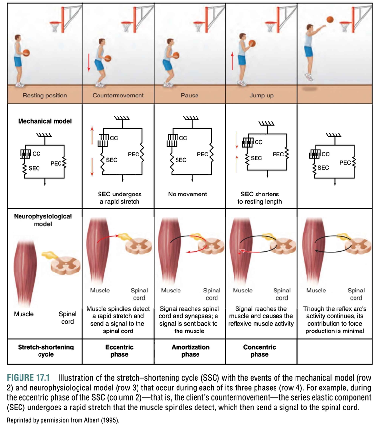
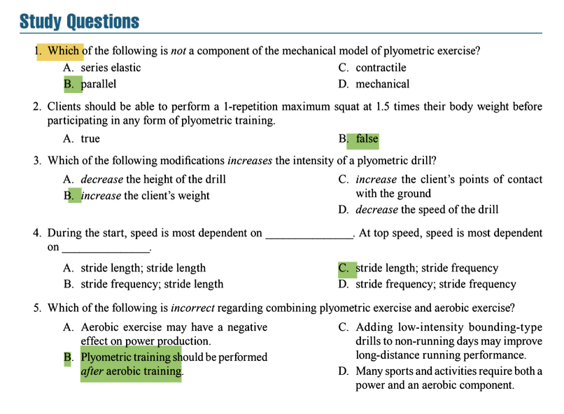

# Plyometric and Speed Training Program Design and Technique

## 1 PLYOMETRIC MECHANICS AND PHYSIOLOGY

### Key Concepts & Exam Focus

- **Stretch-Shortening Cycle (SSC)**: The fundamental physiological mechanism behind plyometrics that involves **rapid eccentric loading** followed immediately by **explosive concentric contraction**. This cycle enhances power output through two primary mechanisms: 
  - **Elastic Energy Storage**: Muscle-tendon units store kinetic energy during the eccentric phase like a spring.
  - **Stretch Reflex Activation**: Muscle spindles are stimulated by rapid stretch, triggering a reflexive contraction.

- **Three Phases of SSC**: 
  - **Eccentric (Loading) Phase**: Pre-stretch phase where muscle is stretched and elastic energy is stored.
  - **Amortization (Transition) Phase**: The **most critical phase** where pause between eccentric and concentric must be **brief** (<0.2 seconds) to prevent dissipation of stored energy as heat.
  - **Concentric (Unloading) Phase**: Release of stored elastic energy combined with voluntary contraction produces greater force output.

*Table: Phases of the Stretch-Shortening Cycle*
| **Phase** | **Duration** | **Key Actions** | **Training Emphasis** |
|-----------|--------------|-----------------|----------------------|
| Eccentric | Variable | Muscle stretching, energy storage | Control and precision |
| Amortization | <0.2 seconds | Transition between phases | Minimize transition time |
| Concentric | Explosive | Energy release, powerful contraction | Maximal force output |

### Critical Statistics & Specifics

- **Amortization Phase Timing**: Must be **≤0.2 seconds** for optimal energy transfer. Longer transitions decrease power output significantly .
- **Force Production**: SSC can increase force production by **10-30%** compared to concentric-only movements .

### Technique & Safety Precautions

- **Emphasis on Quick Transitions**: Cue clients to "**jump immediately upon landing**" rather than pausing.
- **Progressive Implementation**: Begin with **jump-landing drills** before progressing to rebound movements.

### Study Question Integration

- The mechanical model of plyometric exercise consists of **series elastic** (tendons, fascia), **parallel** (muscle tissue), and **contractile** (actin, myosin) components. **Mechanical** is not a component (Answer D to Question 1) .

## 2 WHEN TO USE PLYOMETRIC EXERCISE

### Key Concepts & Exam Focus

- **Primary Benefits**: Enhances **power production**, **rate of force development**, **reactive strength**, and **neuromuscular efficiency** .
- **Performance Applications**: Improves **jumping height**, **sprinting speed**, **change-of-direction ability**, and **sport-specific movements** .
- **Health Applications**: Increases **bone mineral density** (reducing osteoporosis risk), improves **muscle recruitment efficiency**, and enhances **body control and balance** .

### Critical Statistics & Specifics

- **Bone Mineral Density**: Studies show **significant improvements** in BMC across various populations, including older adults (58-79 years) .
- **Injury Risk Reduction**: Proper plyometric training can reduce sports-related injuries by **50-80%** in athletes through improved neuromuscular control .

### Technique & Safety Precautions

- **Age Considerations**: 
  - **Youth**: Focus on **fun, games-based activities**; avoid high-intensity drills due to growth plate vulnerability.
  - **Older Adults**: Use **low-to-moderate intensity** drills; avoid high-impact loading .
- **Contraindications**: Acute musculoskeletal injuries, severe osteoarthritis, or recent surgeries require medical clearance.

## 3 PLYOMETRIC SAFETY CONSIDERATIONS

### Key Concepts & Exam Focus

- **Prerequisite Strength Levels**: 
  - **Lower body**: 1.5x body weight back squat 1RM
  - **Upper body**: 1.0x body weight bench press (≥220 lbs) or 1.5x body weight (<220 lbs)
  - **Alternative upper body test**: 5 clap push-ups consecutively .
  
- **Balance Requirements**: Clients must pass **single-leg balance tests** (30 seconds without falling) before progression .

### Critical Statistics & Specifics

- **Body Weight Considerations**: Clients >100 kg (220 lbs) have **increased injury risk** and should avoid high-intensity drills .
- **Depth Jump Height**: Limited to **18 inches** for athletes over 220 pounds .
- **Volume Metrics**: Beginners should not exceed **100 foot contacts** per session .

### Technique & Safety Precautions

- **Landing Surface Requirements**: 
  - **Recommended**: Grass, turf, rubber mats with **adequate shock absorption**.
  - **Avoid**: Concrete, tile, hardwood (insufficient cushioning), or very thick mats (>6 inches) that prolong amortization .
  
- **Footwear**: Supportive shoes with **ankle support**, **arch stability**, **lateral stability**, and **wide non-slip soles** .

- **Landing Mechanics**: 
  - Shoulders over knees, knees aligned with/toes (never valgus)
  - Ankle, knee, and hip flexion for shock absorption
  - Weight distributed toward **forefoot** rather than heels
  - "Soft" landing with minimal sound upon impact 

### Study Question Integration

- Clients should be able to perform a **1.5 times body weight** squat before plyometric training (Answer A to Question 2 is True) .

## 4 MINIMUM REQUIREMENTS FOR PARTICIPATION IN A PLYOMETRIC TRAINING PROGRAM

### Key Concepts & Exam Focus

- **Strength Standards**: The **1.5x body weight squat** requirement ensures adequate eccentric strength for landing forces .
- **Speed Standards**: Clients must complete **5 repetitions** of 60% body weight squat or bench press in **≤5 seconds** .
- **Balance Proficiency**: **Single-leg half squat hold** for 30 seconds demonstrates stability for single-leg plyometrics .

### Critical Statistics & Specifics

- **Speed Benchmark**: 5 reps @ 60% body weight in ≤5 seconds .
- **Balance Test Duration**: 30 seconds for single-leg positions .

### Technique & Safety Precautions

- **Assessment Protocol**:
  1. **Back squat 1RM** testing (ensure proper form)
  2. **Speed test** with submaximal load
  3. **Balance assessment** with single-leg holds
  4. **Landing technique** evaluation with simple jumps 

## 5 PLYOMETRIC PROGRAM DESIGN

### Key Concepts & Exam Focus

- **Exercise Classification**:
  - **Lower Body**: Jumps (2 legs), hops (1 leg), bounds (alternating), box drills, depth drops
  - **Upper Body**: Medicine ball throws, clap push-ups, bench throws 
  
- **Program Variables**:
  - **Intensity**: Controlled by drill complexity, height, distance, and external load
  - **Volume**: Measured by **number of contacts** (lower body) or **throws** (upper body)
  - **Frequency**: **48-72 hours** between sessions for adequate recovery 
  - **Recovery**: **1:5 to 1:10** work-to-rest ratio for intra-session recovery 

### Critical Statistics & Specifics

- **Volume Guidelines**:
  - **Beginners**: 80-100 contacts/session
  - **Intermediate**: 100-120 contacts/session
  - **Advanced**: 120-140 contacts/session 
  
- **Intensity Progression**: 
  - **Low**: Double-leg jumps, minimal horizontal movement
  - **Medium**: Single-leg hops, moderate horizontal movement
  - **High**: Depth jumps, weighted vest drills, maximal horizontal effort 

*Table: Plyometric Intensity Progression Guidelines*
| **Intensity Level** | **Drill Examples** | **Volume Range (contacts)** | **Appropriate Population** |
|---------------------|---------------------|----------------------------|----------------------------|
| Low | Double-leg jumps, standing jumps | 80-100 | Beginners, older adults |
| Medium | Single-leg hops, box jumps | 100-120 | Intermediate, athletes |
| High | Depth jumps, weighted drills | 120-140 | Advanced, elite athletes |

### Technique & Safety Precautions

- **Progression Principles**: 
  - Master technique at current level before advancing
  - Increase volume before intensity
  - Introduce new drills without fatigue 
  
- **Intensity Modifications**: 
  - **Increase intensity**: Increase height/distance, add external load, implement single-leg variations
  - **Decrease intensity**: Reduce height/distance, implement double-leg variations, decrease speed 

### Study Question Integration

- Intensity of plyometric drills is increased by **increasing the client's weight** (Answer B to Question 3). Decreasing height (A), increasing points of contact (C), or decreasing speed (D) all decrease intensity .

## 6 SPEED TRAINING MECHANICS AND PHYSIOLOGY

### Key Concepts & Exam Focus

- **Speed Definition**: The ability to achieve **high velocity** through optimal stride length and frequency .
- **Stride Characteristics**:
  - **Initial Acceleration**: More dependent on **stride length** (powerful ground forces)
  - **Maximum Velocity**: More dependent on **stride frequency** (rapid limb turnover) 
  
- **Speed-Power Relationship**: Force production must occur at **high velocities** to translate to speed development .

### Critical Statistics & Specifics

- **Stride Length vs. Frequency**: 
  - **Acceleration phase (0-10m)**: Stride length contributes **~70%** to speed
  - **Maximum velocity phase (>30m)**: Stride frequency contributes **~60%** to speed 
  
- **Assisted Sprinting**: Should not exceed **10%** faster than client's maximum speed .

### Technique & Safety Precautions

- **Sprinting Technique Cues**:
  - **Body lean**: Forward during acceleration, upright at top speed
  - **Arm action**: 90° elbow flexion, drive elbows backward
  - **Foot strike**: Forefoot contact under center of mass 

### Study Question Integration

- During the start, speed is most dependent on **stride length**; at top speed, speed is most dependent on **stride frequency** (Answer C to Question 4) .

## 7 SPEED TRAINING SAFETY CONSIDERATIONS

### Key Concepts & Exam Focus

- **Surface Selection**: **Tracks** and **firm grass** are ideal; avoid concrete, sand, or uneven terrain .
- **Environmental Factors**: Consider temperature, humidity, and altitude when programming sprint work .
- **Fatigue Management**: Terminate reps when technique deteriorates (typically after **5-8 seconds** of maximal effort) .

### Critical Statistics & Specifics

- **Work-Rest Ratios**: 
  - **Acceleration drills**: 1:5-1:10 ratio (e.g., 6s sprint = 30-60s rest)
  - **Speed endurance drills**: 1:3-1:5 ratio 
  
- **Session Volume**: 
  - **Acceleration focus**: 150-300m total volume
  - **Max velocity focus**: 300-500m total volume 

### Technique & Safety Precautions

- **Warm-Up Protocol**: 
  - Dynamic stretching (5-10 minutes)
  - Technique drills (A-skips, B-skips, butt kicks)
  - Build-up sprints (60-80% effort) 
  
- **Progressions**: 
  - Wall drills → Falling starts → resisted sprints → free sprints
  - Straight-line → curved runs → change-of-direction 

## 8 COMBINING PLYOMETRICS AND SPEED TRAINING WITH OTHER FORMS OF EXERCISE

### Key Concepts & Exam Focus

- **Exercise Order Priority**: 
  - Perform **plyometrics and speed training** before **resistance training** and **aerobic exercise**
  - Perform **power-based activities** when neuromuscular fatigue is minimal 
  
- **Complex Training**: Alternating heavy resistance exercises with plyometric exercises targeting similar movements can enhance power development .

### Critical Statistics & Specifics

- **Recovery Periods**: Allow **≥72 hours** between high-intensity plyometric sessions and heavy lower body resistance training .
- **Aerobic Interference**: Excessive endurance training can impair power production through **neuromuscular adaptations** .

### Technique & Safety Precautions

- **Weekly Layout Example**:
  - **Monday**: Lower body resistance training
  - **Tuesday**: Upper body plyometrics + aerobic exercise
  - **Wednesday**: Active recovery
  - **Thursday**: Speed training + upper body resistance training
  - **Friday**: Lower body plyometrics
  - **Saturday**: Sport-specific activity
  - **Sunday**: Rest 

### Study Question Integration

- Regarding combining plyometric and aerobic exercise: Plyometric training should be performed **BEFORE** aerobic training, not after (Answer B to Question 5 is incorrect) . Aerobic exercise may negatively affect power (A), bounding drills may improve running performance (C), and many sports require both components (D) are all correct statements .

## 9 KEY POINTS SUMMARY

### High-Yield Exam Concepts

- **SSC Amortization Phase**: Must be **brief** (<0.2s) for optimal power enhancement .
- **Strength Prerequisites**: **1.5x body weight squat** is mandatory for lower body plyometrics .
- **Program Design**: Volume is measured by **foot contacts**; intensity controlled by drill selection .
- **Speed Development**: Acceleration relies on **stride length**; max velocity relies on **stride frequency** .
- **Exercise Order**: Always perform **power-based activities** (plyometrics, speed) before **strength** and **endurance** activities .
- **Age Considerations**: **Youth** programs should be fun and game-based; **older adults** should avoid high-intensity impacts .
- **Safety Fundamentals**: Proper **landing surface** and **footwear** are critical for injury prevention .

### Common Exam Misconceptions

- **Plyometrics Are Not Just Jumping**: They are specifically designed to minimize amortization time and maximize SSC utilization .
- **More Volume Is Not Better**: Quality over quantity—fatigue compromises technique and increases injury risk .
- **Plyometrics Aren't Only for Athletes**: Properly programmed, they benefit various populations including older adults .

Here are the answers to the study questions based on the NSCA Essentials of Personal Training, 3rd Edition, Chapter 17.

**Question 1**
Correct Answer: D. mechanical

**Textbook Reference**:
"The mechanical model of plyometric exercise describes the body's ability to store and release elastic energy and consists of three components: the series elastic component (SEC), the parallel elastic component (PEC), and the contractile component (CC)." (Chapter 17, "Plyometric Mechanics and Physiology")

Incorrect Options:
*   A. series elastic: This is a correct component of the model, representing the tendons and fascia that act like springs to store elastic energy.
*   B. parallel: This is a correct component of the model, referring to the muscle tissue itself (e.g., epimysium, perimysium, endomysium, sarcolemma) that provides a parallel elastic element.
*   C. contractile: This is a correct component of the model, representing the actin and myosin filaments that are responsible for the contractile force of the muscle.

**Question 2**
Correct Answer: A. true

**Textbook Reference**:
"For lower body plyometrics, participants should possess a strength level of approximately 1.5 times their body weight for a one-repetition maximum (1RM) back squat." (Chapter 17, "Minimum Requirements for Participation in a Plyometric Training Program")

Incorrect Options:
*   B. false: This is incorrect because the textbook explicitly states that a 1.5x body weight squat is a recommended minimum strength prerequisite for safely handling the high forces involved in lower body plyometric exercises.

**Question 3**
Correct Answer: B. *increase* the client’s weight

**Textbook Reference**:
"Intensity [of plyometric drills] can be increased by... adding external weight or resistance (e.g., weight vest, bands)... However, external resistance should not exceed 10% of the client's body weight." (Chapter 17, "Plyometric Program Design")

Incorrect Options:
*   A. *decrease* the height of the drill: Decreasing the height of a box for a depth jump, for example, would *decrease* the intensity by reducing the eccentric load and impact forces.
*   C. *increase* the client’s points of contact with the ground: Increasing points of contact (e.g., going from a single-leg to a double-leg hop) *decreases* intensity by distributing force and making the exercise more stable.
*   D. *decrease* the speed of the drill: The essence of plyometrics is high velocity. Decreasing speed lengthens the amortization phase, reduces the stretch reflex, and dissipates elastic energy, thereby *decreasing* the intensity and effectiveness of the drill.

**Question 4**
Correct Answer: C. stride length; stride frequency

**Textbook Reference**:
"During initial acceleration (0 to 10 m [0 to 33 ft]), stride length is the primary determinant of velocity. As running velocity approaches maximum speed, stride frequency becomes the most important factor." (Chapter 17, "Speed Training Mechanics and Physiology")

Incorrect Options:
*   A. stride length; stride length: Stride length is crucial for acceleration but is not the primary factor for achieving top speed.
*   B. stride frequency; stride length: Stride frequency is more critical for top speed, not stride length. Stride length is more important for the start.
*   D. stride frequency; stride frequency: Stride frequency is critical for top speed, but it is not the most dependent factor for the initial start and acceleration phase.

**Question 5**
Correct Answer: B. Plyometric training should be performed *after* aerobic training.

**Textbook Reference**:
"Plyometric and speed training sessions should be performed before aerobic endurance training... If plyometric or speed training is conducted after endurance training, the resulting fatigue may impair the quality of exercise technique and the ability to develop speed and power, while also potentially increasing the risk of injury." (Chapter 17, "Combining Plyometrics and Speed Training with Other Forms of Exercise")

Incorrect Options:
*   A. Aerobic exercise may have a negative effect on power production: This is correct. Chronic, prolonged aerobic endurance training can induce neuromuscular adaptations that are detrimental to power development.
*   C. Adding low-intensity bounding-type drills to non-running days may improve long-distance running performance: This is correct. This strategy can improve running economy and power without interfering with aerobic development on recovery days.
*   D. Many sports and activities require both a power and an aerobic component: This is correct. This is the fundamental reason why many athletes need to train both energy systems.