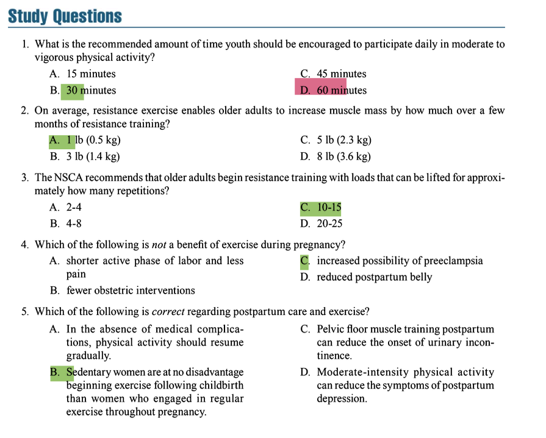

# Clients Who Are Preadolescent, Older, or Pregnant  

## 1 PREADOLESCENT YOUTH  

### 1.1 Key Concepts & Exam Focus  

- **Definition**: Preadolescence (approximately **ages 6-12**) is the period before the onset of secondary sexual characteristics, characterized by significant physical and psychological development .  
- **Trainability**: Youth can improve **strength**, **endurance**, and **motor skills** through appropriate training, but programs must account for their **developmental stage** and avoid excessive intensity.  
- **Psychological Aspects**: Preadolescents are developing **self-identity**, are influenced by **peer relationships**, and may experience increased **anxiety** or risk-taking behaviors; trainers should foster a supportive environment .  
- **Program Design Focus**: Emphasize **fun**, **skill development**, and **confidence building** rather than competitive outcomes.  

### 1.2 Critical Statistics & Specifics  

- **Physical Activity Recommendation**: **60 minutes** of daily moderate to vigorous physical activity (MVPA) for youth .  
- **Strength Training**:  
  - Use **bodyweight exercises** or **light external resistance** with focus on technique.  
  - Repetition range: **8-15 repetitions** per set for strength exercises.  
  - Frequency: **2-3 times per week** on non-consecutive days.  
- **Growth Considerations**: Avoid maximal loads; **peak height velocity** (growth spurt) may temporarily increase injury risk due to muscle-tendon imbalances.  

*Table: Youth Exercise Programming Guidelines*  
| **Component** | **Recommendation** | **Notes** |  
|---------------|-------------------|-----------|  
| **Aerobic Activity** | 60 min/day moderate to vigorous | Include games & play |  
| **Strength Training** | 2-3 days/week | Focus on technique |  
| **Repetitions** | 8-15 per set | Avoid maximal loads |  
| **Exercise Selection** | Bodyweight, light resistance | Prioritize fundamental movements |  

### 1.3 Technique & Safety Precautions  

- **Technique Instruction**:  
  - Teach **fundamental movement skills** (e.g., squatting, pushing, pulling) with emphasis on proper form.  
  - Use **simple cues** and **demonstrations**; preadolescents are developing abstract thinking but still learn well visually .  
- **Safety Considerations**:  
  - **Avoid maximal lifts** due to risk of growth plate injuries.  
  - **Supervision is critical** to ensure safe technique and prevent risk-taking behaviors.  
  - **Environment**: Ensure equipment is sized appropriately for smaller bodies.  
  - **Hydration**: Encourage fluid intake before, during, and after exercise.  
- **Contraindications**:  
  - Avoid competitive weightlifting until physical and emotional maturity is achieved.  
  - No repetitive overhead lifting with heavy loads.  

### 1.4 Study Question Integration  

- **Study Question 1**: What is the recommended amount of time youth should be encouraged to participate daily in moderate to vigorous physical activity?  
  - **Answer**: **D. 60 minutes**. This is a key public health recommendation integrated into NSCA guidelines for youth programming .  

### 1.5 Key Points  

- Youth strength training is **safe and beneficial** when appropriately supervised and programmed.  
- Focus on **skill development**, **confidence**, and **enjoyment** to promote lifelong physical activity.  
- **Avoid specialization** early; encourage diverse movement experiences.  

## 2 OLDER ADULTS  

### 2.1 Key Concepts & Exam Focus  

- **Definition**: Older adults (typically **age 65+**) experience age-related physiological declines but can improve function through exercise.  
- **Sarcopenia**: Age-related loss of muscle mass and strength, which can be mitigated through resistance training.  
  - Older adults who do not resistance train experience a **5% to 10%** reduction in muscle mass every decade 
  - older adults who do not resistance train also experience a **10% to 30%** reduction in bone mineral density every decade
  - average resting metabolic rate reduction of **3%** per decade
  - muscle strength is decreasing at the rate of **10% to 20%** and power is decreasing at the rate of **30% to 40%** per decade. 
- **Functional Independence**: Exercise programs should target **activities of daily living** (ADLs) to maintain independence.  
- **Health Considerations**: Higher prevalence of chronic conditions (e.g., arthritis, osteoporosis, cardiovascular disease) requires careful screening and program modifications .  

### 2.2 Critical Statistics & Specifics  

- **Muscle Mass Increase**: Older adults can gain approximately **3 lb (1.4 kg)** of muscle mass over a few months of resistance training .  
- **Resistance Training**:  
  - **Repetition Range**: Begin with **10-15 repetitions** per set to allow for technique mastery and minimize joint stress .  
  - **Frequency**: **2-3 days/week** on non-consecutive days.  
  - **Intensity**: Moderate intensity (e.g., **5-6 on a 10-point RPE scale**).  
- **Balance Training**: Reduce fall risk with **3+ days/week** of balance activities (e.g., single-leg stands, tai chi).  
- **Bone Health**: Weight-bearing exercises help maintain bone density; osteoporosis management may require impact modifications.  

*Table: Resistance Training Components for Older Adults*  
| **Component** | **Recommendation** | **Rationale** |  
|---------------|-------------------|---------------|  
| **Initial Rep Range** | 10-15 reps | Builds endurance & technique mastery |  
| **Progression** | Gradually increase load | Stimulates strength adaptations |  
| **Frequency** | 2-3 days/week | Allows recovery |  
| **Focus** | Multi-joint exercises | Improves functional capacity |  

### 2.3 Technique & Safety Precautions  

- **Technique Instruction**:  
  - **Emphasize control** throughout movements, especially eccentric phases.  
  - **Teach breathing techniques** to avoid Valsalva maneuver, which can exacerbate hypertension.  
  - Use **supported positions** (e.g., seated) for beginners if balance is a concern.  
- **Safety Considerations**:  
  - **Screen for balance deficits** and orthopedic limitations.  
  - **Environment**: Remove trip hazards; ensure equipment is stable.  
  - **Progress slowly** to avoid excessive muscle soreness or injury.  
  - **Monitor blood pressure** responses in clients with hypertension.  
- **Contraindications**:  
  - Avoid high-impact activities with severe osteoporosis.  
  - Avoid extreme spinal flexion or twisting under load.  

### 2.4 Study Question Integration  

- **Study Question 2**: On average, resistance exercise enables older adults to increase muscle mass by how much over a few months of resistance training?  
  - **Answer**: **B. 3 lb (1.4 kg)**. This demonstrates the trainability of older adults despite age-related sarcopenia.  
- **Study Question 3**: The NSCA recommends that older adults begin resistance training with loads that can be lifted for approximately how many repetitions?  
  - **Answer**: **C. 10-15 repetitions**. This higher rep range prioritizes safety and technique learning before intensification .  

### 2.5 Key Points  

- Resistance training is **critical for combating sarcopenia** and maintaining functional independence.  
- **Balance training** should be integrated to reduce fall risk.  
- **Individualize programs** based on health status, mobility, and goals.  

## 3 PREGNANT WOMEN  

### 3.1 Key Concepts & Exam Focus  

- **Physiological Adaptations**: Pregnancy increases **blood volume**, **cardiac output**, and **oxygen demand** while altering posture and joint laxity due to relaxin.  
- **Benefits of Exercise**: Includes **reduced back pain**, **better weight management**, **improved mood**, and potentially **shorter labor** with **fewer interventions** .  
- **Contraindications**: Absolute contraindications include **placenta previa**, **preterm labor**, and **preeclampsia**; relative contraindications require medical clearance.  
- **Postpartum Considerations**: Focus on **gradual return** to activity, **pelvic floor rehabilitation**, and addressing **postpartum depression**.  

### 3.2 Critical Statistics & Specifics  

- **Exercise Intensity**: Moderate intensity (e.g., **Borg RPE 12-14/20**); use "talk test" to monitor.  
- **Frequency**: **3-5 days/week** of aerobic and strength activities.  
- **Avoid Supine Position**: After **first trimester**, avoid exercises lying on back due to risk of vena cava compression.  
- **Core Temperature**: Avoid excessive heat stress; keep core temperature **<38°C (100.4°F)**.  

*Table: Exercise Modifications During Pregnancy*  
| **Trimester** | **Modifications** | **Rationale** |  
|---------------|-------------------|---------------|  
| **First** | Minimal modifications | Low miscarriage risk from exercise |  
| **Second** | Avoid supine positions | Prevents vena cava compression |  
| **Third** | Reduce impact & balance exercises | Minimize fall risk & joint stress |  

### 3.3 Technique & Safety Precautions  

- **Technique Instruction**:  
  - **Modify movements** that challenge balance (e.g., use supports for single-leg exercises).  
  - **Emphasize pelvic floor activation** during exercises to support core.  
  - **Avoid explosive movements** or high-impact activities if joints are painful.  
- **Safety Considerations**:  
  - **Obtain medical clearance** before starting or continuing exercise.  
  - **Stay hydrated** and avoid overheating.  
  - **Stop immediately** with warning signs (e.g., vaginal bleeding, dizziness, contractions).  
  - **Avoid lying supine** after first trimester.  
- **Contraindications**:  
  - Avoid contact sports, scuba diving, and activities with high fall risk.  
  - No maximal lifts or Valsalva maneuver.  

### 3.4 Study Question Integration  

- **Study Question 4**: Which of the following is *not* a benefit of exercise during pregnancy?  
  - **Answer**: **C. Increased possibility of preeclampsia**. Exercise is associated with *reduced* risk of preeclampsia and gestational hypertension. Benefits include shorter active labor, fewer interventions, and reduced postpartum belly.  
- **Study Question 5**: Which of the following is *correct* regarding postpartum care and exercise?  
  - **Answer**: **All options A, C, and D are correct based on NSCA guidelines**:  
    - A. "In the absence of medical complications, physical activity should resume gradually."  
    - C. "Pelvic floor muscle training postpartum can reduce the onset of urinary incontinence."  
    - D. "Moderate-intensity physical activity can reduce the symptoms of postpartum depression."  
  - **Option B is incorrect**: Sedentary women are at a *disadvantage* compared to those who exercised during pregnancy due to lower fitness levels.  

### 3.5 Key Points  

- Exercise during pregnancy is **generally safe and beneficial** with appropriate modifications.  
- **Avoid overheating** and **supine positions** after the first trimester.  
- **Postpartum exercise** should emphasize pelvic floor rehabilitation and gradual progression.  

## 4 GENERAL PROGRAMMING AND RISK MANAGEMENT  

### 4.1 Key Concepts & Exam Focus  

- **Screening**: Thorough **health screening** and **medical clearance** are essential for all special populations .  
- **Communication**: Maintain open dialogue with clients and their healthcare providers.  
- **Documentation**: Keep detailed records of assessments, programs, and client responses.  

### 4.2 Critical Statistics & Specifics  

- **Medical Clearance**: Required for older adults with multiple chronic conditions and pregnant women with risk factors.  
- **Risk Management**: Ensure certifications (CPR, AED) are current and emergency plans are in place .  

### 4.3 Technique & Safety Precautions  

- **Start low and progress slowly** for all special populations.  
- **Monitor responses** closely (e.g., heart rate, blood pressure, perceived exertion).  
- **Adapt environment** to minimize risks (e.g., non-slip floors, adequate space).  

### 4.4 Key Points  

- **Safety first** is the priority when training special populations.  
- **Continuing education** on population-specific guidelines is critical for professionalism.  

