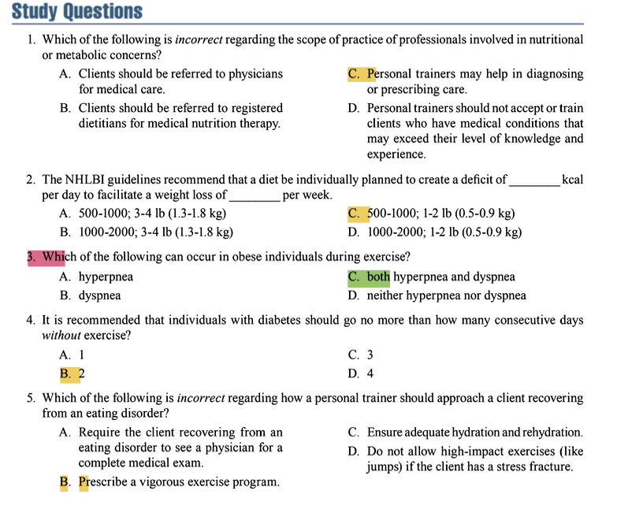

# Clients With Nutritional or Metabolic Concerns

## **SCOPE OF PRACTICE**

**Key Concepts & Exam Focus:**
*   The primary role of a personal trainer is to provide exercise guidance and motivation.
*   **Trainers must never diagnose medical conditions, prescribe therapeutic diets, or provide medical nutrition therapy (MNT).** This is the role of physicians and Registered Dietitians (RDs).
*   Scope of practice is a major theme on the NSCA exam. Understand the boundaries clearly.

**Critical Statistics & Specifics:**
*   N/A for this section (beyond the scope definitions).

**Technique & Safety Precautions:**
*   **Referral is mandatory:** Always refer clients to a physician for medical care and to an RD for MNT.
*   **Know your limits:** Do not accept clients with conditions that exceed your knowledge and experience without proper medical clearance and a collaborative team approach.

**Study Question Integration:**
*   **Question 1: Which of the following is *incorrect* regarding the scope of practice...?**
    *   **Answer: C. Personal trainers may help in diagnosing or prescribing care.**
    *   **Explanation:** This is absolutely outside a trainer's scope of practice. Diagnosis and prescription of care are legally defined acts for medical professionals. Options A, B, and D are correct actions for a trainer.

**Key Points:**
*   Personal trainers are part of a collaborative team that includes physicians and RDs.
*   The trainer's role is to support the plan created by these medical professionals through appropriate exercise prescription.

---

### **OVERWEIGHT AND OBESITY**

#### **Definitions of Overweight and Obesity and Important Differences**

**Key Concepts & Exam Focus:**
*   **Overweight:** Body weight above a standard weight for a given height.
*   **Obesity:** An excessive amount of body fat relative to lean body mass.
*   **Body Mass Index (BMI):** A common clinical tool to classify weight status. Know the categories.
*   **Waist Circumference:** A measure of abdominal fat, which is a key indicator of health risk.

**Critical Statistics & Specifics:**
*   **BMI Classifications:**
    *   Underweight: <18.5 kg/m²
    *   Normal weight: 18.5–24.9 kg/m²
    *   **Overweight: 25.0–29.9 kg/m²**
    *   **Obesity, Class I: 30.0–34.9 kg/m²**
    *   Obesity, Class II: 35.0–39.9 kg/m²
    *   Obesity, Class III: ≥40.0 kg/m² (Extreme Obesity)
*   **High-Risk Waist Circumference:**
    *   Men: >40 inches (102 cm)
    *   Women: >35 inches (88 cm)

#### **Causes and Correlates of Overweight and Obesity**

**Key Concepts & Exam Focus:**
*   Causes are multifactorial: genetic predisposition, physiological factors, environmental factors (sedentary lifestyle, high-calorie food access), and behavioral factors (dietary choices, lack of exercise).

#### **Fat Distribution**

**Key Concepts & Exam Focus:**
*   **Android ("apple-shaped") obesity:** Fat stored primarily in the abdominal area. **Associated with higher health risks** (cardiovascular disease, type 2 diabetes).
*   **Gynoid ("pear-shaped") obesity:** Fat stored primarily in the hips and thighs.

#### **Benefits of Exercise in a Weight Reduction Program for Obesity**

**Key Concepts & Exam Focus:**
*   Increases energy expenditure, creating a caloric deficit.
*   Helps preserve Fat-Free Mass (FFM) during weight loss.
*   Improves insulin sensitivity and cardiovascular health.
*   Can help regulate appetite.

#### **Successful Weight Management Programs for Obesity**

**Key Concepts & Exam Focus:**
*   The most successful programs combine **dietary modification, exercise, and behavior modification.**
*   **National Heart, Lung, and Blood Institute (NHLBI) Guidelines** are a gold standard.

**Critical Statistics & Specifics:**
*   **NHLBI Caloric Deficit:** 500–1,000 kcal per day.
*   **NHLBI Recommended Rate of Weight Loss:** 1–2 lb (0.5–0.9 kg) per week.
*   Initial goal of weight loss therapy is to reduce body weight by **~10%** from baseline.

**Study Question Integration:**
*   **Question 2: The NHLBI guidelines recommend that a diet be individually planned to create a deficit of ______ kcal per day to facilitate a weight loss of ______ per week.**
    *   **Answer: C. 500-1000; 1-2 lb (0.5-0.9 kg)**
    *   **Explanation:** This is a direct recall of the NHLBI guidelines. A larger deficit (1000-2000 kcal) is not recommended as it promotes rapid loss of lean mass and is unsustainable.

#### **Exercise Concerns of Clients Who Are Overweight or Obese**

**Key Concepts & Exam Focus:**
*   **Thermoregulation:** Obese individuals may have impaired heat dissipation, increasing risk of heat-related illness.
*   **Joint Stress:** Higher body weight increases stress on joints, particularly the spine, hips, knees, and ankles.
*   **Cardiovascular and Pulmonary Strain:** Higher heart rate and blood pressure at rest and during exercise. **Hyperpnea** (increased depth and rate of breathing) is common to meet oxygen demands. This can sometimes be perceived as **dyspnea** (difficult or labored breathing).

**Study Question Integration:**
*   **Question 3: Which of the following can occur in obese individuals during exercise?**
    *   **Answer: C. both hyperpnea and dyspnea**
    *   **Explanation:** Hyperpnea is a normal physiological response to increased metabolic demand. However, due to the increased workload and potential deconditioning, this can easily cross over into the subjective feeling of dyspnea (shortness of breath).

#### **Exercise Prescription and Program Design for Clients Who Are Overweight or Obese**

**Key Concepts & Exam Focus:**
*   **Mode:** Low-impact or non-weight-bearing activities to reduce joint stress (e.g., cycling, swimming, water aerobics, elliptical training).
*   **Frequency:** **5–7 days/week** to maximize caloric expenditure.
*   **Duration:** Progress toward **50–60 minutes/day** of moderate-intensity activity, which can be accumulated in bouts of at least 10 minutes.
*   **Intensity:** **40–60% HRR or VO₂R** (moderate intensity). Use the Talk Test.

**Technique & Safety Precautions:**
*   **Contraindications:** Avoid high-impact activities (jumping, running) initially, especially if orthopedic issues are present.
*   **Form Cues:** Focus on proper posture and alignment to manage load on the spine and joints.
*   **Environment:** Exercise in climate-controlled environments to manage thermoregulation risks. Ensure adequate hydration.

#### **Obesity Paradox**

**Key Concepts & Exam Focus:**
*   The observation that, in some specific disease populations (e.g., heart failure), individuals classified as overweight or obese may have a better prognosis than normal-weight individuals. **This does not mean obesity is healthy;** rather, it highlights the complexity of the relationship between body weight and health outcomes.

---

### **HYPERLIPIDEMIA**

#### **Possible Causes of Hyperlipidemia**

**Key Concepts & Exam Focus:**
*   High levels of lipids (cholesterol, triglycerides) in the blood.
*   Causes include genetics, diet high in saturated and trans fats, obesity, and physical inactivity.

#### **Lifestyle Treatment for Hyperlipidemia**

**Key Concepts & Exam Focus:**
*   First-line treatment involves therapeutic lifestyle changes (TLC): **dietary modification, weight management, and regular aerobic exercise.**

#### **Dietary Fat Modification**

**Key Concepts & Exam Focus:**
*   Reduce saturated fats to **<7%** of total daily calories.
*   Reduce trans fats as much as possible.
*   Dietary cholesterol to **<200 mg/day**.

#### **Limiting Sugar From Beverages and Foods for Heart Health**

**Key Concepts & Exam Focus:**
*   High intake of simple sugars, especially from sugar-sweetened beverages, is linked to increased triglycerides.

#### **Exercise Prescription and Program Design for Clients With Hyperlipidemia**

**Key Concepts & Exam Focus:**
*   **Frequency:** **3–5 days/week**
*   **Intensity:** **40–75% HRR or VO₂R**
*   **Duration:** **30–60 minutes/day**
*   **Mode:** Primarily aerobic exercise (walking, jogging, cycling).

**Critical Statistics & Specifics:**
*   Exercise can increase HDL-C ("good" cholesterol) by **5–10%**.
*   Exercise can decrease triglycerides and LDL-C ("bad" cholesterol).

---

### **METABOLIC SYNDROME (MetS)**

#### **Exercise and Dietary Modification for MetS**

**Key Concepts & Exam Focus:**
*   **MetS is diagnosed when an individual has 3 or more of 5 risk factors:**
    1.  Abdominal obesity (by waist circumference)
    2.  Elevated triglycerides (≥150 mg/dL)
    3.  Low HDL-C (<40 mg/dL in men, <50 mg/dL in women)
    4.  Elevated blood pressure (≥130/85 mmHg)
    5.  Elevated fasting glucose (≥100 mg/dL)
*   **Treatment is lifestyle intervention:** Weight loss, regular moderate-intensity physical activity, and a healthy diet (e.g., DASH diet).

**Critical Statistics & Specifics:**
*   Primary goal is to achieve **>7% weight loss** and engage in **>150 minutes of moderate-intensity exercise per week**.

---

### **DIABETES MELLITUS**

#### **Types of Diabetes**

**Key Concepts & Exam Focus:**
*   **Type 1 Diabetes (5-10% of cases):** Autoimmune destruction of pancreatic beta-cells. **Insulin-dependent.**
*   **Type 2 Diabetes (90-95% of cases):** Insulin resistance and relative insulin deficiency. Strongly associated with obesity and physical inactivity.
*   **Gestational Diabetes:** Glucose intolerance with onset during pregnancy.

#### **Exercise Prescription and Program Design for Clients With Diabetes Mellitus**

**Key Concepts & Exam Focus:**
*   **Primary Goal:** Improve glycemic control (lower HbA1c).
*   **Aerobic Exercise:**
    *   **Frequency: ≥3 days/week** (with no more than 2 consecutive days between sessions to maintain insulin sensitivity).
    *   **Intensity:** 40–70% VO₂R or HRR.
    *   **Duration:** At least 150 minutes/week of moderate or 75 minutes/week of vigorous activity.
*   **Resistance Training:**
    *   **Frequency: 2–3 days/week** (non-consecutive days).
    *   **Intensity:** Moderate-to-vigorous (2–3 sets of 8–12 reps at 60–80% 1RM).
    *   Crucial for increasing glucose-utilizing muscle mass.

**Technique & Safety Precautions:**
*   **Hypoglycemia (low blood sugar <70 mg/dL) is the biggest exercise risk.** Can occur during, immediately after, or up to 24-48 hours after exercise (delayed onset).
*   **Client must monitor blood glucose:** Before, during (if session >60 min), and after exercise.
*   **Never exercise if blood glucose is:**
    *   **<100 mg/dL** (must consume carbs first)
    *   **>250–300 mg/dL** with ketosis (risk of ketoacidosis)
    *   **>300 mg/dL** without ketosis (use caution; may be hyperglycemic but can exercise if feeling well).
*   **Always have a fast-acting carbohydrate source (juice, glucose tablets) available.**
*   **Inspect feet daily** for blisters or sores. Wear proper footwear.

**Study Question Integration:**
*   **Question 4: It is recommended that individuals with diabetes should go no more than how many consecutive days *without* exercise?**
    *   **Answer: B. 2**
    *   **Explanation:** The improved insulin sensitivity from exercise is transient, lasting roughly 48-72 hours. To maintain this benefit and stable glycemic control, clients should not go more than 2 consecutive days without exercise.

---

### **EATING DISORDERS**

#### **Disordered Eating and Restrictive Dieting**
**Key Concepts & Exam Focus:** A wide range of irregular eating behaviors that may or may not warrant a diagnosis of a specific eating disorder.

#### **Anorexia Nervosa**
**Key Concepts & Exam Focus:** Restriction of energy intake leading to significantly low body weight, intense fear of gaining weight, and disturbed body image.
**SELECT WARNING SIGNS FOR ANOREXIA:**
*   Severe weight loss.
*   Preoccupation with food, calories, and dieting.
*   Denial of hunger.
*   Excessive, compulsive exercise.

#### **Bulimia Nervosa**
**Key Concepts & Exam Focus:** Recurrent episodes of binge eating followed by inappropriate compensatory behaviors to prevent weight gain (e.g., self-induced vomiting, laxative misuse, excessive exercise).
**SELECT WARNING SIGNS FOR BULIMIA:**
*   Disappearing after meals (to purge).
*   Signs of vomiting (swollen cheeks, calluses on knuckles "Russell's Sign").
*   Excessive and rigid exercise routine.

#### **Binge Eating Disorder**
**Key Concepts & Exam Focus:** Recurrent episodes of binge eating **without** the regular use of compensatory behaviors. Often associated with obesity.
**SELECT WARNING SIGNS FOR BINGE EATING DISORDER:**
*   Eating large amounts of food rapidly and in secret.
*   Feeling a lack of control during a binge.
*   Feelings of guilt, shame, and distress after bingeing.

#### **Difference between Anorexia Nervosa, BULIMIA, and Binge Eating disorder**
*   **Anorexia:** Low body weight from restriction.
*   **Bulimia:** Typically normal weight, with cycles of bingeing and purging.
*   **Binge Eating:** Often overweight/obese, with bingeing but no purging.

#### **Other Specified Feeding or Eating Disorders (OSFEDs)**
**Key Concepts & Exam Focus:** Conditions that cause significant distress and impairment but do not meet the full criteria for another eating disorder.

#### **Prevalence of Eating Disorders in Women and Men**
**Critical Statistics & Specifics:**
*   More prevalent in women, but **~25% of cases occur in men.**
*   Often underreported in male populations.

#### **The Female Athlete Triad and Relative Energy Deficiency in Sport (RED-S)**
**Key Concepts & Exam Focus:**
*   **Female Athlete Triad:** Interrelationship of **1. Low Energy Availability (with or without an eating disorder), 2. Menstrual Dysfunction, and 3. Low Bone Mineral Density.**
*   **RED-S:** A broader, more comprehensive model that includes the Triad but also recognizes impairments in metabolic rate, immunity, protein synthesis, and cardiovascular health in both male and female athletes.

#### **Exercise Prescription and Program Design for Clients Recovering From an Eating Disorder**

**Key Concepts & Exam Focus:**
*   **The trainer must work as part of a treatment team (physician, therapist, RD).**
*   **Obtain medical and psychological clearance** before beginning any exercise program.
*   The focus should be on **fun, health, and function**, NOT on calorie burning, weight loss, or body composition change.

**Technique & Safety Precautions:**
*   **Contraindications:** **Do NOT prescribe a vigorous exercise program** (Option B in Q5). Exercise can be a trigger for compulsive behavior.
*   **Medical Exam is REQUIRED:** A physician must rule out medical complications like arrhythmias, severe osteoporosis, or stress fractures.
*   **If a stress fracture is present, high-impact exercises (jumps) are contraindicated.**
*   Monitor for and ensure **adequate hydration**.
*   The program should be low-to-moderate intensity and supervised.

**Study Question Integration:**
*   **Question 5: Which of the following is *incorrect* regarding how a personal trainer should approach a client recovering from an eating disorder?**
    *   **Answer: B. Prescribe a vigorous exercise program.**
    *   **Explanation:** Prescribing vigorous exercise is contraindicated and dangerous. It can exacerbate the underlying psychological condition and physical health risks (e.g., heart complications, further bone loss). Options A, C, and D are all correct and essential safety steps.

**Key Points:**
*   Personal trainers must be able to recognize warning signs of eating disorders.
*   The trainer's role is supportive and must be guided by the client's treatment team.
*   The gym environment should promote body positivity and health, not aesthetics and performance above all else.

***

### **Question 1**
**Correct Answer:** C. Personal trainers may help in diagnosing or prescribing care.
**Textbook Reference:**
"Personal trainers must never diagnose medical conditions, prescribe therapeutic diets, or provide medical nutrition therapy (MNT). This is the role of physicians and Registered Dietitians (RDs)." (Chapter 19, "Scope of Practice")

**Incorrect Options:**
*   **A. Clients should be referred to physicians for medical care.**: This is correct practice. Trainers must refer clients to physicians for medical issues outside their scope.
*   **B. Clients should be referred to registered dietitians for medical nutrition therapy.**: This is correct practice. Providing MNT is outside a trainer's scope and requires a registered dietitian.
*   **D. Personal trainers should not accept or train clients who have medical conditions that may exceed their level of knowledge and experience.**: This is correct practice. Ethical guidelines require trainers to recognize their limitations and refer clients when necessary.

### **Question 2**
**Correct Answer:** C. 500-1000; 1-2 lb (0.5-0.9 kg)
**Textbook Reference:**
"The NHLBI guidelines recommend that a diet be individually planned to create a deficit of 500–1,000 kcal per day to facilitate a weight loss of 1–2 lb (0.5–0.9 kg) per week." (Chapter 19, "Overweight and Obesity / Successful Weight Management Programs for Obesity")

**Incorrect Options:**
*   **A. 500-1000; 3-4 lb (1.3-1.8 kg)**: The calorie deficit is correct, but the expected weight loss per week is too high. A loss of 3-4 lbs per week is not recommended as it often involves loss of lean mass.
*   **B. 1000-2000; 3-4 lb (1.3-1.8 kg)**: The calorie deficit is too large and not recommended by NHLBI guidelines. The expected weight loss is also incorrect.
*   **D. 1000-2000; 1-2 lb (0.5-0.9 kg)**: The expected weight loss is correct, but the calorie deficit is too large and not recommended by NHLBI guidelines for sustainable weight loss.

### **Question 3**
**Correct Answer:** C. both hyperpnea and dyspnea
**Textbook Reference:**
"Hyperpnea (increased depth and rate of breathing) is common to meet oxygen demands [in obese individuals]. This can sometimes be perceived as dyspnea (difficult or labored breathing)." (Chapter 19, "Overweight and Obesity / Exercise Concerns of Clients Who Are Overweight or Obese")

**Incorrect Options:**
*   **A. hyperpnea**: This is only partially correct. While hyperpnea does occur, dyspnea can also be present.
*   **B. dyspnea**: This is only partially correct. While dyspnea can be perceived, the physiological response of hyperpnea is also occurring.
*   **D. neither hyperpnea nor dyspnea**: This is incorrect. The increased metabolic demand and potential for deconditioning in obese individuals make both respiratory responses possible during exercise.

### **Question 4**
**Correct Answer:** B. 2
**Textbook Reference:**
"It is recommended that individuals with diabetes should go no more than 2 consecutive days without exercise. The improved insulin sensitivity from exercise is transient, lasting roughly 48-72 hours." (Chapter 19, "Diabetes Mellitus / Exercise Prescription and Program Design for Clients With Diabetes Mellitus")

**Incorrect Options:**
*   **A. 1**: While exercising daily is beneficial, the guideline specifically states that the benefits of improved insulin sensitivity last long enough that a gap of 2 days is the maximum recommended.
*   **C. 3**: Going 3 days without exercise would allow the transient improvements in insulin sensitivity to diminish significantly.
*   **D. 4**: Going 4 days without exercise is too long and would not maintain the glycemic control benefits of regular exercise.

### **Question 5**
**Correct Answer:** B. Prescribe a vigorous exercise program.
**Textbook Reference:**
"Do NOT prescribe a vigorous exercise program for a client recovering from an eating disorder. Exercise can be a trigger for compulsive behavior and is contraindicated due to medical risks like arrhythmias and severe osteoporosis." (Chapter 19, "Eating Disorders / Exercise Prescription and Program Design for Clients Recovering From an Eating Disorder")

**Incorrect Options:**
*   **A. Require the client recovering from an eating disorder to see a physician for a complete medical exam.**: This is correct and required practice before initiating any training program.
*   **C. Ensure adequate hydration and rehydration.**: This is a correct and important safety consideration for all clients, especially those with a history of eating disorders who may have fluid and electrolyte imbalances.
*   **D. Do not allow high-impact exercises (like jumps) if the client has a stress fracture.**: This is correct practice. Clients with eating disorders often have low bone mineral density and are at high risk for stress fractures, making high-impact activities contraindicated.