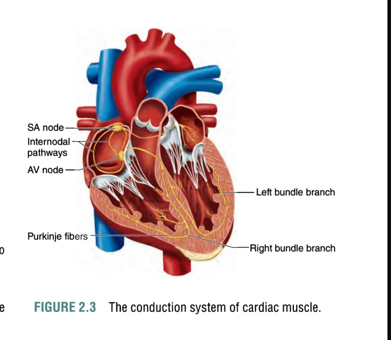
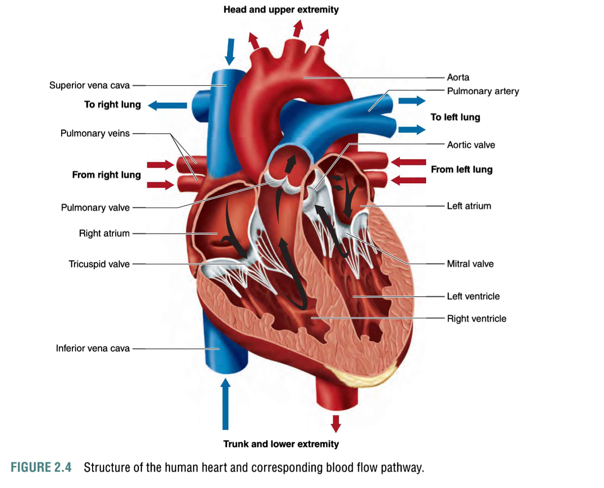

# Oxygen Transport (氧气运输)

- **Hemoglobin (血红蛋白)**: Hemoglobin in red blood cells binds to oxygen, carrying it through the bloodstream to tissues.
- **Oxygen saturation (氧饱和度)**: Refers to the percentage of hemoglobin binding sites occupied by oxygen molecules.
- **Bohr effect (博尔效应)**: A physiological phenomenon where the oxygen dissociation curve of hemoglobin shifts in response to changes in pH or carbon dioxide levels, facilitating oxygen delivery to tissues during exercise.

---

# Cardiac Morphology (心脏形态学)

- **Heart structure (心脏结构)**: The heart is a muscular organ consisting of four chambers—two atria (心房) and two ventricles (心室).
- **Atria (心房) and ventricles (心室)**: Atria receive blood from the body or lungs, and ventricles pump blood to the lungs or the rest of the body.
- **Valves (心脏瓣膜)**: Ensure one-way blood flow through the heart, including the mitral valve (二尖瓣), tricuspid valve (三尖瓣), pulmonary valve (肺动脉瓣), and aortic valve (主动脉瓣).

---

# Electrocardiogram (心电图, ECG)

- **ECG waves (心电图波形)**: Represents the electrical activity of the heart. Key components include:
  - **P wave (P波)**: Atrial depolarization (心房去极化).
  - **QRS complex (QRS波群)**: Ventricular depolarization (心室去极化).
  - **T wave (T波)**: Ventricular repolarization (心室复极化).
- **Heart rate (心率)**: Can be measured by counting the number of R waves (R波) per minute on the ECG.

---

# Circulation (循环系统)

- **Systemic circulation (体循环)**: Blood flow from the heart through the body and back to the heart.
- **Pulmonary circulation (肺循环)**: Blood flow between the heart and the lungs for oxygenation.
- **Arteries (动脉) and veins (静脉)**: Arteries carry oxygenated blood away from the heart, while veins return deoxygenated blood back to the heart.

---

# Cardiac Cycle (心脏周期)

- **Systole (收缩期)**: The phase of the cardiac cycle when the heart contracts, pumping blood into the arteries.
- **Diastole (舒张期)**: The phase when the heart relaxes and fills with blood.
- **Phases of the cardiac cycle (心脏周期的各个阶段)**: Include atrial systole (心房收缩), ventricular systole (心室收缩), and the relaxation period (舒张期).

---

# Cardiac Output (心输出量)

- **Cardiac output (心输出量, CO)**: The amount of blood the heart pumps per minute, calculated as stroke volume (每搏输出量, SV) times heart rate (心率, HR).
- **Formula**:
  - **Stroke volume (每搏输出量)**: The volume of blood ejected by the heart per contraction.
  - **Factors affecting cardiac output (影响心输出量的因素)**: Include heart rate, stroke volume, and overall cardiovascular health.