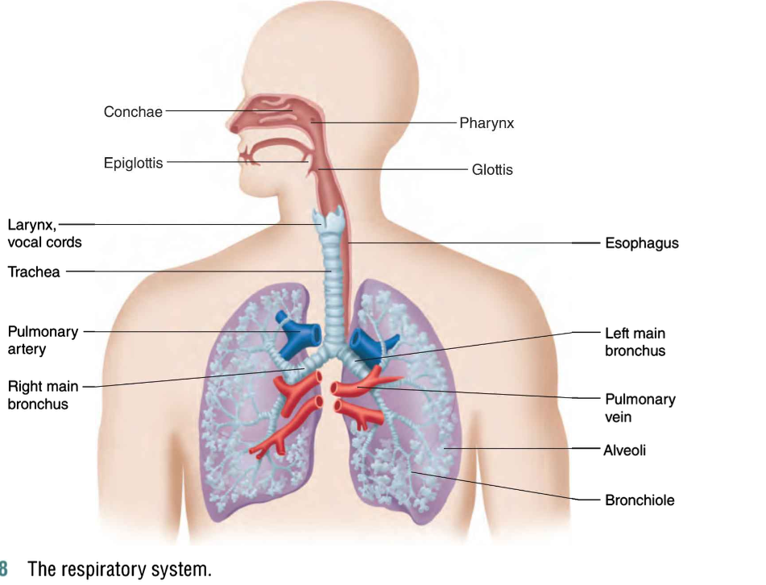
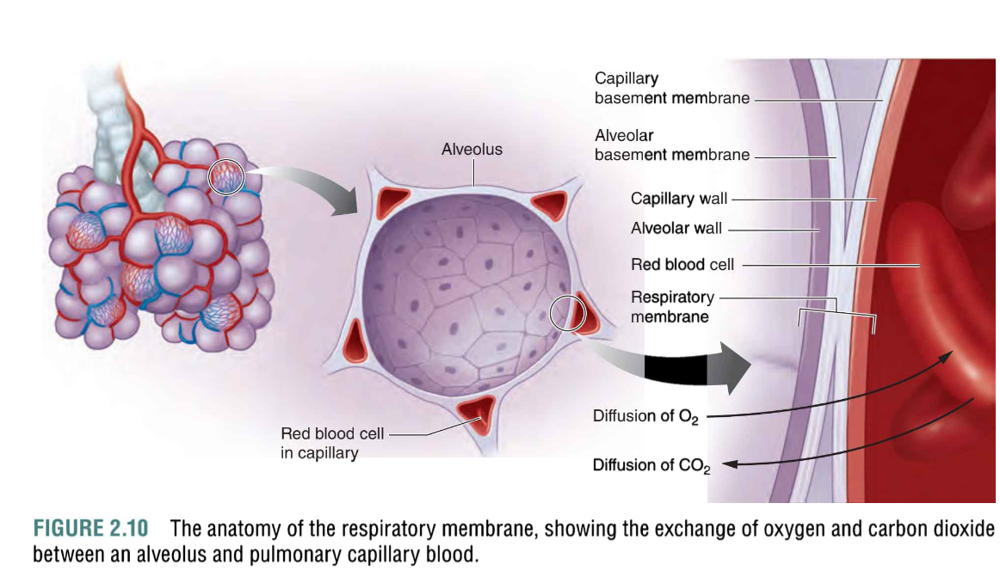
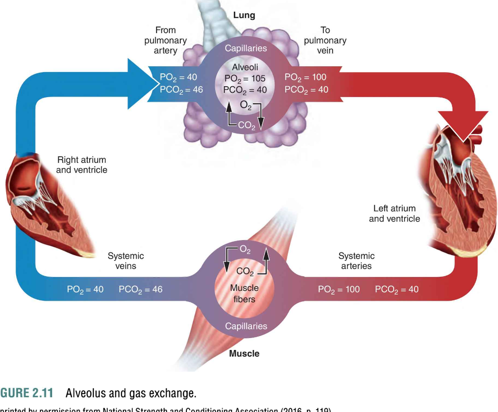

# Structure (结构)

- **Upper Respiratory Tract (上呼吸道)**: 
  - Includes the nose (鼻子), pharynx (咽部), and larynx (喉部), which warm, filter, and humidify the air before it reaches the lungs.

- **Lower Respiratory Tract (下呼吸道)**:
  - Includes the trachea (气管), bronchi (支气管), and lungs (肺), where gas exchange takes place.

- **Alveoli (肺泡)**:
  - Tiny air sacs in the lungs where oxygen and carbon dioxide are exchanged between the air and the blood.

---

# Lung Volumes (肺容积)

- **Tidal Volume (潮气量, TV)**: 
  - The volume of air inhaled or exhaled with each breath under normal resting conditions.

- **Inspiratory Reserve Volume (最大吸气量, IRV)**: 
  - The additional volume of air that can be inhaled after a normal inhalation.

- **Expiratory Reserve Volume (最大呼气量, ERV)**: 
  - The additional volume of air that can be exhaled after a normal exhalation.

- **Residual Volume (残气量, RV)**: 
  - The volume of air remaining in the lungs after maximal exhalation.

- **Vital Capacity (肺活量, VC)**: 
  - The maximum volume of air a person can exhale after a maximal inhalation. 
  - Formula: `VC = TV + IRV + ERV`

- **Total Lung Capacity (总肺容积, TLC)**: 
  - The total volume of air the lungs can hold. 
  - Formula: `TLC = VC + RV`

---

# Gas Exchange (气体交换)

- **Diffusion (扩散)**: 
  - The process by which oxygen (O₂) moves from the alveoli (肺泡) into the blood, and carbon dioxide (CO₂) moves from the blood into the alveoli to be exhaled.

- **Partial Pressure (分压)**: 
  - The pressure exerted by a single gas in a mixture, such as oxygen or carbon dioxide. 
  - Diffusion occurs from areas of high partial pressure to low partial pressure.

- **Hemoglobin (血红蛋白)**: 
  - A protein in red blood cells that binds to oxygen and carries it through the bloodstream. 
  - Hemoglobin also helps transport carbon dioxide.

 

---

# Oxygen Uptake (氧气摄取)

- **VO₂ (氧气摄取量)**: 
  - The volume of oxygen consumed by the body per minute. It is a key indicator of aerobic fitness.

- **Maximal Oxygen Uptake (最大摄氧量, VO₂ max)**: 
  - The maximum amount of oxygen the body can utilize during intense exercise. 
  - It is a measure of cardiovascular and aerobic fitness.

- **Oxygen Extraction (氧气提取)**: 
  - The process by which oxygen is transferred from the blood to the tissues. 
  - The more oxygen the tissues extract from the blood, the higher the efficiency of the cardiovascular system.