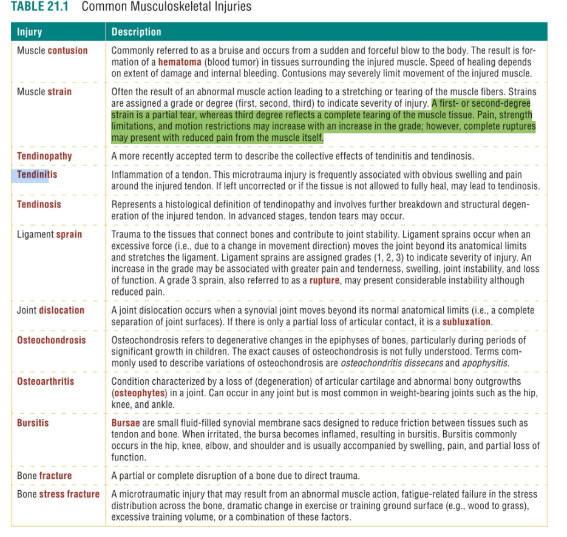
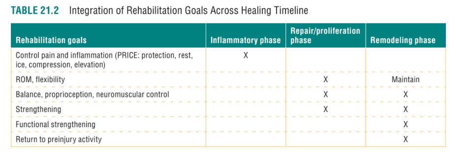
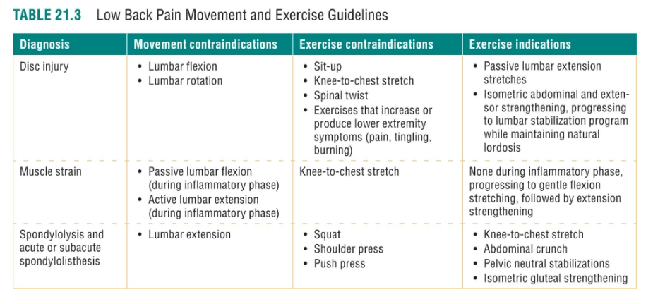
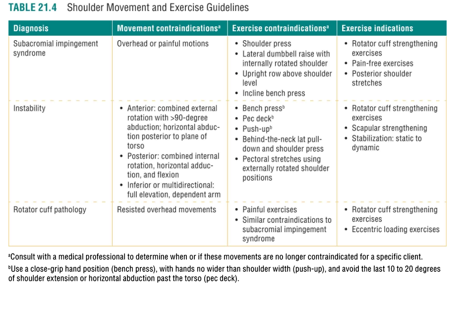
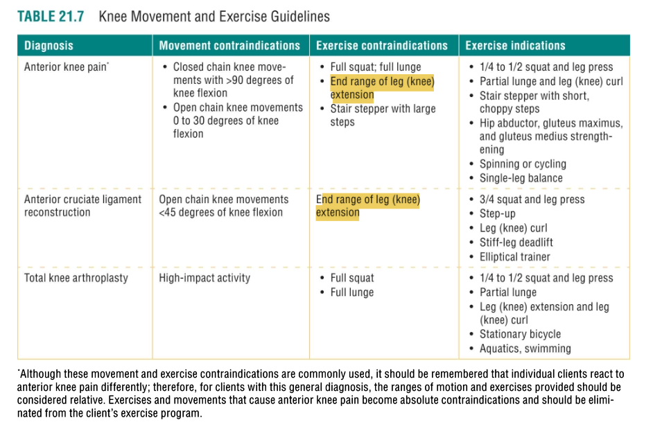
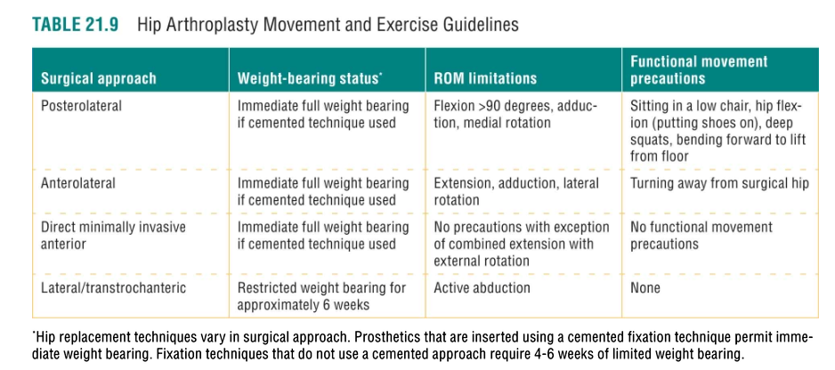
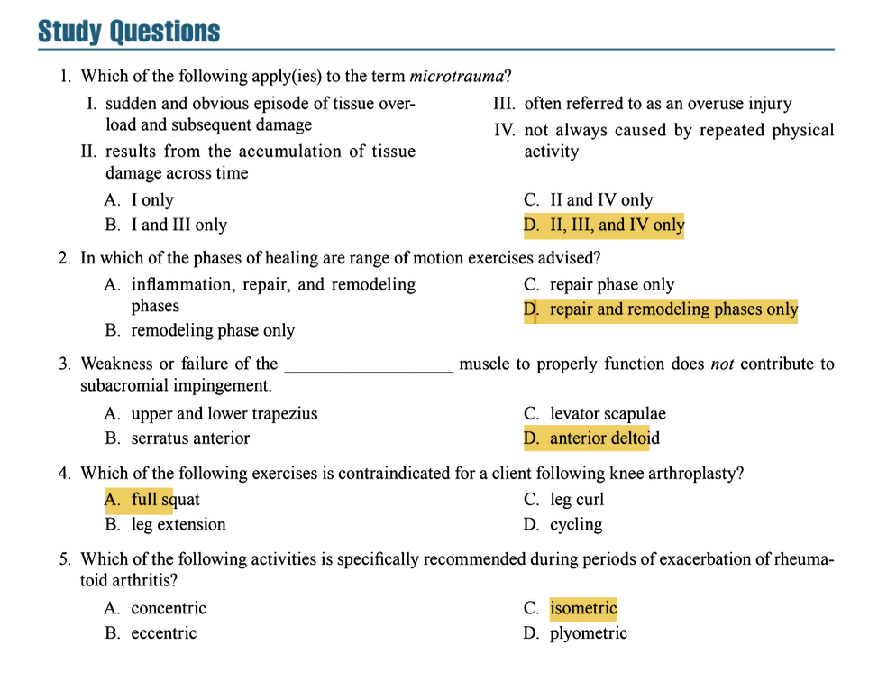

# Clients With Orthopedic, Injury, or Rehabilitation Concerns

## 1 Injury Classification

### Key Concepts & Exam Focus
- **Macrotrauma**: Injury resulting from a **specific, sudden event** that causes structural damage (e.g., fractures, dislocations, ligament sprains, muscle tears). Characterized by **immediate pain and dysfunction**.
- **Microtrauma**: Injury resulting from **repeated, submaximal overload** to tissues over time, leading to **cumulative damage** . Often referred to as **"overuse injuries"** but can occur without physical activity (e.g., metabolic disorders, inflammatory conditions). Key features:
  - Results from **accumulation of tissue damage** across time
  - **Not always caused by repeated physical activity** (systemic factors can contribute)
  - Typically presents with **gradual onset of symptoms** that worsen progressively

### Critical Statistics & Specifics
- **Microtrauma injuries** account for approximately **30-50%** of all sports injuries according to epidemiological studies.
- **Stress fractures** occur most commonly in the **tibia (25-50%)**, metatarsals (10-25%), and fibula (7-15%) based on clinical studies.

### Study Question Integration
- **Question 1**: Which applies to microtrauma? 
  - **Answer**: D. II, III, and IV only (results from accumulation of tissue damage across time, often referred to as an overuse injury, not always caused by repeated physical activity).

## 2 Impact of Injury on Function

### Key Concepts & Exam Focus
- **Immediate effects**: **Pain, swelling, weakness**, and **reduced range of motion**.
- **Neuromuscular inhibition**: **Arthrogenic muscle inhibition** (AMI) refers to reflexive inhibition of muscles surrounding a joint after injury, leading to **weakness and atrophy**.
- **Movement compensation**: Development of **altered movement patterns** to avoid pain, which may persist after healing and increase risk of re-injury.

### Technique & Safety Precautions
- **Compensations to observe**: **Antalgic gait** (limping), **shoulder hiking** during arm elevation, **reduced weight-bearing** on injured side, **trunk leaning** during squatting.
- **Assessment tools**: **Movement Compensation Patterns** (MCPs) should be assessed using functional movement screens like the **Overhead Squat Assessment**, **Single-Leg Squat Assessment**, and **Push-Up Assessment**.

## 3 Tissue Healing After Injury

### 3.1 Inflammatory Phase

#### Key Concepts & Exam Focus
- **Duration**: Typically **2-5 days** post-injury (may be prolonged in certain conditions).
- **Purpose**: **Remove debris** and **initiate healing** through vascular and cellular responses.
- **Cardinal signs**: **Pain (dolor), heat (calor), redness (rubor), swelling (tumor), loss of function (functio laesa)**.

#### Critical Statistics & Specifics
- **Inflammatory markers**: **C-reactive protein (CRP)** and **erythrocyte sedimentation rate (ESR)** are elevated during this phase.
- **Timeframe**: **Acute inflammation** peaks at **24-48 hours** and gradually resolves by **day 5-7**.

#### Technique & Safety Precautions
- **Contraindications**: **Avoid heat therapy** (increases swelling), **strenuous exercise**, and **aggressive massage**.
- **Recommended interventions**: **RICE protocol** (Rest, Ice, Compression, Elevation), **gentle movement** within pain-free range to prevent adhesion formation.

### 3.2 Repair Phase

#### Key Concepts & Exam Focus
- **Duration**: Approximately **2 days to 6-8 weeks** post-injury.
- **Purpose**: **Fill tissue defect** with **granulation tissue** and produce **collagen fibers**.
- **Key processes**: **Angiogenesis** (new blood vessel formation), **fibroplasia** (collagen production), and **wound contraction**.

#### Critical Statistics & Specifics
- **Collagen production**: Begins around **day 3-5**, peaks at **2-3 weeks**, and continues at elevated rates for **4-6 weeks**.
- **Tensile strength**: Repaired tissue reaches only about **15-20%** of normal strength by **3 weeks** and **50%** by **4-6 weeks**.

#### Technique & Safety Precautions
- **Exercise guidelines**: **Introduce active movement** within pain-free range, **begin submaximal isometrics**, **gradual progression** to light resistance exercises.
- **Precautions**: **Avoid stretching** newly formed collagen fibers as they're easily damaged, **monitor for pain exacerbation**.

#### Study Question Integration
- **Question 2**: In which phases are range of motion exercises advised?
  - **Answer**: D. Repair and remodeling phases only (ROM exercises begin carefully in repair phase and continue through remodeling phase).

### 3.3 Remodeling Phase

#### Key Concepts & Exam Focus
- **Duration**: From **3-6 weeks** post-injury up to **12-24 months**.
- **Purpose**: **Realign collagen fibers** along lines of stress and **increase tissue strength**.
- **Key processes**: **Collagen maturation**, **cross-linking**, and **gradual return to functional activities**.

#### Critical Statistics & Specifics
- **Tensile strength improvement**: With appropriate loading, tissue can reach **70-80%** of original strength by **3-4 months** but rarely reaches 100%.
- **Optimal loading**: **Low-load, high-repetition** exercises initially, progressing to **sport-specific movements** by **3-6 months** for athletes.

#### Technique & Safety Precautions
- **Exercise progression**: **Begin eccentric loading**, **incorporate plyometrics** for athletic populations, **sport-specific drills**.
- **Precautions**: **Monitor for pain recurrence** (should be <3/10 on pain scale), **avoid explosive movements** until adequate strength demonstrated.

## 4 Orthopedic Concerns and the Personal Trainer

### Key Concepts & Exam Focus
- **Trainer's role**: **Recognize signs and symptoms** of common orthopedic conditions, **modify exercises** appropriately, **communicate with healthcare team**, and **promote adherence** to rehabilitation principles.
- **Scope of practice**: Personal trainers **do not diagnose** conditions but should understand **red flags** requiring medical referral.

### Critical Statistics & Specifics
- **Musculoskeletal complaints**: Account for approximately **20-30%** of primary care visits according to epidemiological data.
- **Exercise adherence**: Clients who receive support from fitness professionals show **30-50% higher adherence** to rehabilitation programs.

## 5 Low Back

### 5.1 Low Back Pain

#### Key Concepts & Exam Focus
- **Classification**: **Acute** (<6 weeks), **subacute** (6-12 weeks), **chronic** (>12 weeks).
- **Mechanical vs. non-mechanical**: Trainers primarily work with **mechanical back pain** (97% of cases).
- **Red flags**: **Cauda equina syndrome** (bladder/bowel dysfunction, saddle anesthesia), **fracture** (history of trauma, osteoporosis), **infection** (fever, recent infection), **cancer** (history of cancer, unexplained weight loss).

#### Critical Statistics & Specifics
- **Prevalence**: **60-80%** of adults experience significant low back pain during their lifetime.
- **Recurrence rate**: **60-85%** within 1-2 years after initial episode.

#### Technique & Safety Precautions
- **Acute phase**: **Avoid end-range flexion**, **rotation under load**, and **heavy lifting**.
- **Rehabilitation focus**: **Core stabilization** (transversus abdominis, multifidus), **hip mobility**, **gluteal strengthening**.
- **Recommended exercises**: **Bird-dog**, **planks**, **side bridges**, **glute bridges**, **walking program**.

### 5.2 Lumbar Disc Injury

#### Key Concepts & Exam Focus
- **Disc structure**: **Annulus fibrosus** (outer rings) and **nucleus pulposus** (gel-like center).
- **Injury progression**: **Disc degeneration** → **bulging** → **protrusion** → **extrusion** → **sequestration**.
- **Direction preference**: **Extension-based** exercises often help with **posterior-lateral disc injuries**.

#### Critical Statistics & Specifics
- **Most common levels**: **L4-L5** and **L5-S1** account for approximately **90%** of lumbar disc herniations.
- **Natural history**: **70-80%** of symptomatic disc herniations improve with conservative care within **6-12 weeks**.

#### Technique & Safety Precautions
- **Contraindications**: **Avoid forward bending**, **sitting activities**, and **twisting motions** during acute phase.
- **Recommended exercises**: **McKenzie extension protocol** (if centralization occurs), **walking**, **prone lying**.

### 5.3 Muscle Strain

#### Key Concepts & Exam Focus
- **Common mechanisms**: **Rapid flexion-rotation** or **extension-rotation** movements.
- **Affected muscles**: **Erector spinae** at **lumbar-sacral junction**, **quadratus lumborum**.

#### Critical Statistics & Specifics
- **Healing time**: **Grade I strains**: 2-3 weeks, **Grade II strains**: 3-6 weeks, **Grade III strains**: 3-6 months.

#### Technique & Safety Precautions
- **Acute management**: **Relative rest** (1-2 days), **gradual return** to movement.
- **Rehabilitation**: **Progress from isometrics** to **isotonics** to **functional movements**.

### 5.4 Spondylolysis and Spondylolisthesis

#### Key Concepts & Exam Focus
- **Spondylolysis**: **Stress fracture** of pars interarticularis (most common at L5).
- **Spondylolisthesis**: **Anterior slippage** of vertebra relative to inferior segment.
- **Classification**: **Grade I** (0-25%), **Grade II** (25-50%), **Grade III** (50-75%), **Grade IV** (75-100%).

#### Critical Statistics & Specifics
- **Prevalence**: **3-7%** in general population, **15-40%** in adolescent athletes (especially gymnasts, football linemen, weightlifters).
- **Symptomatic progression**: Only **10-15%** of cases progress symptomatically.

#### Technique & Safety Precautions
- **Contraindications**: **Avoid end-range extension**, **hyperextension exercises**, and **heavy axial loading**.
- **Recommended exercises**: **Core stabilization**, **hip strengthening**, **neutral spine maintenance** during all exercises.

## 6 Shoulder

### 6.1 Subacromial Impingement Syndrome

#### Key Concepts & Exam Focus
- **Mechanism**: Compression of **supraspinatus tendon**, **subacromial bursa**, and **long head of biceps** beneath coracoacromial arch.
- **Contributing factors**: **Rotator cuff weakness**, **scapular dyskinesis**, **glenohumeral instability**, **postural abnormalities**.

#### Critical Statistics & Specifics
- **Prevalence**: Accounts for **40-60%** of all shoulder complaints.
- **Internal impingement**: Common in overhead athletes, involves contact between **rotator cuff** and **posterosuperior glenoid rim**.

#### Technique & Safety Precautions
- **Exercise modifications**: **Avoid upright rows**, **behind-neck presses**, **lateral raises above 80-90°**.
- **Recommended exercises**: **Rotator cuff strengthening** (external rotation at 0° and 45° abduction), **scapular stabilization** (serratus anterior punches, rows), **posterior capsule stretching**.

#### Study Question Integration
- **Question 3**: Weakness or failure of which muscle does NOT contribute to subacromial impingement?
  - **Answer**: C. Levator scapulae (weakness of upper/lower trapezius, serratus anterior, and rotator cuff muscles contribute; levator scapulae overactivity may contribute but weakness does not directly cause impingement).

### 6.2 Glenohumeral Joint Anterior Instability

#### Key Concepts & Exam Focus
- **Mechanism**: Often traumatic **anterior dislocation** (Bankart lesion) or repetitive microtrauma.
- **Common sequelae**: **Hill-Sachs lesion** (humeral head impression fracture), **Bankart lesion** (labral tear).

#### Critical Statistics & Specifics
- **Recurrence rate**: **90%** in adolescents, **50-60%** in young adults under 25, **10-15%** in older adults.
- **Incidence**: **1.7%** in general population, higher in contact sports athletes.

#### Technique & Safety Precautions
- **Contraindications**: **Avoid end-range external rotation**, **combined abduction-external rotation**, **bench press** with wide grip.
- **Recommended exercises**: **Rotator cuff strengthening**, **dynamic stabilization** (closed-chain exercises), **proprioceptive training**.

### 6.3 Rotator Cuff Repair

#### Key Concepts & Exam Focus
- **Post-operative phases**: **Protection** (0-6 weeks), **active assistance** (6-12 weeks), **strengthening** (12-24 weeks), **return to activity** (6+ months).
- **Healing constraints**: **Tendon-to-bone healing** takes **12-16 weeks** to achieve moderate strength.

#### Critical Statistics & Specifics
- **Re-tear rates**: **10-40%** depending on age, tear size, and rehabilitation adherence.
- **ROM progression**: **Passive ROM** initially, **active assistive** at 4-6 weeks, **active** at 8-12 weeks.

#### Technique & Safety Precautions
- **Immediate post-op**: **Sling immobilization** (4-6 weeks), **pendulum exercises** only, **no active motion**.
- **Precautions**: **Avoid combined abduction-external rotation**, **lifting objects** >1-2 lbs for **8-12 weeks**.

### 6.4 Conditions Requiring Shoulder Exercise Modification

#### Key Concepts & Exam Focus
- **Acromioclavicular (AC) joint injury**: Avoid **bench press**, **push-ups**, **dips** during acute phase.
- **Adhesive capsulitis**: Focus on **gentle stretching**, **pendulum exercises**, **gradual ROM improvement**.
- **Biceps tendinopathy**: Avoid **heavy biceps curling**, **straight-arm pulls**.

#### Critical Statistics & Specifics
- **Adhesive capsulitis**: Affects **2-5%** of population, more common in diabetics (**10-20%** prevalence).
- **AC joint sprains**: Account for **40-50%** of shoulder sports injuries.

## 7 Ankle

### Key Concepts & Exam Focus
- **Lateral ankle sprains**: Most common (**85%**), involve **anterior talofibular ligament** (ATFL), **calcaneofibular ligament** (CFL).
- **Medial ankle sprains**: Less common (**5-10%**), involve **deltoid ligament**, often more severe.
- **High ankle sprains**: **Syndesmotic injury**, longer recovery (**6-8 weeks** vs 2-4 weeks).

### Critical Statistics & Specifics
- **Recurrence rate**: **40-70%** after initial lateral ankle sprain.
- **Chronic instability**: Develops in **20-40%** of ankle sprain patients.

### Technique & Safety Precautions
- **Acute management**: **RICE protocol**, **weight-bearing as tolerated**, **early motion**.
- **Rehabilitation**: **ROM exercises**, **peroneal strengthening**, **balance/proprioception training**, **gradual return to sport**.
- **Prevention**: **Balance training** reduces sprain risk by **35-50%**.

## 8 Knee

### 8.1 Anterior Knee Pain

#### Key Concepts & Exam Focus
- **Patellofemoral pain syndrome (PFPS)**: **Multifactorial etiology** including **muscle imbalances**, **malalignment**, **overload**.
- **Contributing factors**: **Weak hip abductors/external rotators**, **tight lateral structures**, **foot hyperpronation**.

#### Critical Statistics & Specifics
- **Prevalence**: **25%** of athletic injuries, more common in females (**2:1 ratio**).
- **Success rate**: **70-90%** improvement with appropriate conservative care.

#### Technique & Safety Precautions
- **Contraindications**: **Deep squats** (>60° flexion), **leg extension** with heavy resistance, **stairs descent** control.
- **Recommended exercises**: **Hip strengthening** (clamshells, side-lying abduction), **quadriceps strengthening** (mini-squats 0-45°, isometrics), **gait retraining**.

### 8.2 Anterior Cruciate Ligament (ACL) Reconstruction

#### Key Concepts & Exam Focus
- **Graft types**: **Bone-patellar tendon-bone** (BPTB), **hamstring autograft**, **allograft**.
- **Healing timeline**: **Graft incorporation** takes **12-16 weeks**, **remodeling** continues for **12-24 months**.

#### Critical Statistics & Specifics
- **Reconstruction rates**: **200,000-300,000** annually in US, **70%** from non-contact mechanisms.
- **Return to sport**: **55-85%** return to preinjury level, **15-25%** sustain second ACL injury within 2 years.

#### Technique & Safety Precautions
- **Post-operative progression**: **Weight-bearing** as tolerated with brace, **ROM immediately**, **strengthening** at 4-6 weeks, **running** at 3-4 months, **cutting** at 5-6 months.
- **Precautions**: **Avoid open-chain knee extension** 0-30° for **6-8 weeks** (BPTB graft), **limit rotational activities** for **4-6 months**.

### 8.3 Total Knee Arthroplasty

#### Key Concepts & Exam Focus
- **Surgical approach**: **Resection of damaged joint surfaces**, replacement with **metal and polyethylene components**.
- **Rehabilitation goals**: **Restore ROM** (especially extension), **normalize gait**, **improve functional strength**.

#### Critical Statistics & Specifics
- **Projected increase**: **673%** increase in TKA procedures by 2030 according to orthopedic projections.
- **ROM goals**: **0° extension** by 2 weeks, **≥110° flexion** by 6 weeks for optimal function.

#### Technique & Safety Precautions
- **Contraindications**: **High-impact activities** (running, jumping), **deep squatting** (>90°), **sitting on low surfaces**.
- **Recommended exercises**: **Ankle pumps**, **quad sets**, **heel slides**, **straight leg raises**, **mini-squats** (0-45°), **stationary cycling**.

#### Study Question Integration
- **Question 4**: Which exercise is contraindicated following knee arthroplasty?
  - **Answer**: A. Full squat (places excessive stress on prosthetic components).

## 9 Hip

### 9.1 Hip Arthroscopy

#### Key Concepts & Exam Focus
- **Common procedures**: **Femoroacetabular impingement (FAI) correction**, **labral repair/debridement**, **microfracture**.
- **FAI types**: **Cam** (femoral head asphericity), **pincer** (acetabular overcoverage), **mixed**.

#### Critical Statistics & Specifics
- **Return to sport**: **76-93%** return after hip arthroscopy for FAI, **4-9 months** for cutting sports.
- **Complication rate**: **1-5%** (nerve injury most common).

#### Technique & Safety Precautions
- **Precautions**: **Limit weight-bearing** (2-6 weeks), **avoid combined flexion-adduction-internal rotation**, **use brace** if prescribed.
- **Rehabilitation progression**: **ROM within safe zones**, **gradual strengthening**, **impact activities** at **3-4 months**.

### 9.2 Total Hip Arthroplasty

#### Key Concepts & Exam Focus
- **Surgical approaches**: **Posterolateral** (most common), **anterolateral**, **direct anterior**.
- **Precautions vary by approach**: **Posterolateral**—avoid flexion >90°, internal rotation, adduction; **Anterior**—avoid extension and external rotation.

#### Critical Statistics & Specifics
- **Dislocation rate**: **3-4%** for posterolateral approach, **1-2%** for anterior approach.
- **Implant survival**: **95%** at 10 years, **85%** at 20 years.

#### Technique & Safety Precautions
- **Posterior approach precautions**: **No hip flexion >90°**, **no internal rotation past neutral**, **no adduction past midline** for **6-12 weeks**.
- **Recommended exercises**: **Ankle pumps**, **glute sets**, **quad sets**, **heel slides**, **gait training**.

## 10 Arthritis

### 10.1 Osteoarthritis

#### Key Concepts & Exam Focus
- **Pathology**: **Progressive cartilage loss**, **subchondral bone changes**, **osteophyte formation**.
- **Exercise benefits**: **Improves function**, **reduces pain**, **may slow progression**.

#### Critical Statistics & Specifics
- **Prevalence**: Affects **32.5 million** US adults, **80%** over 55 show radiographic evidence.
- **Exercise effect**: **30-40%** improvement in pain and function with appropriate exercise.

#### Technique & Safety Precautions
- **Recommended exercise**: **Low-impact activities** (walking, cycling, aquatic exercise), **strength training** (2-3 times/week), **ROM exercises**.
- **Contraindications**: **High-impact activities** during flare-ups, **exercising through sharp pain**.

### 10.2 Rheumatoid Arthritis

#### Key Concepts & Exam Focus
- **Pathology**: **Systemic autoimmune disease** causing **synovial inflammation**, **joint destruction**.
- **Exercise considerations**: **Respect systemic nature**, **adjust intensity during flares**, **address fatigue**.

#### Critical Statistics & Specifics
- **Prevalence**: Affects **0.5-1%** of population, female:male ratio **3:1**.
- **Joint involvement**: Typically **symmetrical**, **small joints** first (MCP, PIP, MTP).

#### Technique & Safety Precautions
- **Flare management**: **Reduce intensity**, **focus on ROM**, **isometric exercises**.
- **Joint protection**: **Avoid excessive stress** on unstable joints, **use pain as guide**.
- **Recommended during exacerbation**: **Isometric exercises** (maintain strength without movement), **gentle ROM**, **aquatic therapy**.

#### Study Question Integration
- **Question 5**: Which activity is specifically recommended during exacerbation of rheumatoid arthritis?
  - **Answer**: C. Isometric (maintains muscle strength without moving inflamed joints).

**Question 1**
Correct Answer: D. II, III, and IV only
Textbook Reference:
"Microtrauma... results from the accumulation of tissue damage across time... often referred to as an overuse injury... [It] is not always caused by repeated physical activity and can be the result of metabolic, neurologic, or other systemic conditions."
(Chapter 21, "Injury Classification")

Incorrect Options:
*   A. I only: This describes macrotrauma, which is a sudden and obvious episode of tissue overload, not microtrauma.
*   B. I and III only: Option I is incorrect as it describes macrotrauma. While III is correct, pairing it with I makes the entire choice wrong.
*   C. II and IV only: While II and IV are correct, option III is also a correct definition of microtrauma and should not be excluded.

**Question 2**
Correct Answer: D. repair and remodeling phases only
Textbook Reference:
"During the repair phase, controlled motion in the form of range-of-motion (ROM) exercises is advised... The remodeling phase... involves more aggressive active and passive ROM and stretching exercises."
(Chapter 21, "Tissue Healing After Injury")

Incorrect Options:
*   A. inflammation, repair, and remodeling phases: During the inflammation phase, the primary goals are protection and rest. ROM exercises are contraindicated as they can disrupt the initial healing process and increase swelling.
*   B. remodeling phase only: While ROM is critical in remodeling, it is also advised during the preceding repair phase to prevent contractures and guide collagen alignment.
*   C. repair phase only: ROM is advised in the repair phase, but it must also continue into the remodeling phase to be fully effective.

**Question 3**
Correct Answer: C. levator scapulae
Textbook Reference:
"Dysfunction of the rotator cuff, serratus anterior, and trapezius muscles has been associated with subacromial impingement." The levator scapulae is an elevator of the scapula; its weakness is not a primary contributor to impingement. Overactivity and tightness can contribute to poor posture, but weakness does not directly cause the impingement mechanism.
(Chapter 21, "Shoulder")

Incorrect Options:
*   A. upper and lower trapezius: Weakness in these muscles contributes to scapular dyskinesis (abnormal movement), which reduces the subacromial space and can lead to impingement.
*   B. serratus anterior: Weakness of the serratus anterior prevents upward rotation and posterior tilting of the scapula during arm elevation, which is a primary factor in reducing the subacromial space and causing impingement.
*   D. anterior deltoid: While not the most common cause, excessive tension or overdominance of the anterior deltoid without rotator cuff stabilization can contribute to superior translation of the humeral head, narrowing the subacromial space.

**Question 4**
Correct Answer: A. full squat
Textbook Reference:
"Contraindications... include deep squats (past 60°-90° of knee flexion)... because of the large amount of stress placed on the prosthetic components and the surrounding bone."
(Chapter 21, "Knee")

Incorrect Options:
*   B. leg extension: While heavy, open-chain leg extensions may be cautioned early on, they are not universally contraindicated. They are often used in rehabilitation to isolate the quadriceps, though often through a limited range of motion initially.
*   C. leg curl: This exercise is a standard part of post-arthroplasty rehabilitation to strengthen the hamstrings and provide stability to the knee joint.
*   D. cycling: Stationary cycling is a highly recommended activity after knee arthroplasty as it helps restore range of motion, is low-impact, and provides cardiovascular benefits.

**Question 5**
Correct Answer: C. isometric
Textbook Reference:
"During periods of exacerbation, the focus should be on pain reduction and preservation of function. Isometric exercise can be used to maintain muscle strength without moving the affected joints."
(Chapter 21, "Arthritis")

Incorrect Options:
*   A. concentric: Dynamic exercises, including concentric contractions, involve joint movement and are typically avoided during acute inflammatory periods (exacerbations) to prevent increased pain and joint stress.
*   B. eccentric: Like concentric contractions, eccentric contractions involve joint movement and high muscle forces, which can aggravate inflamed and painful joints during an exacerbation.
*   D. plyometric: Plyometrics are high-impact, high-stress exercises that are completely inappropriate during an exacerbation of rheumatoid arthritis and are often contraindicated entirely for this population.