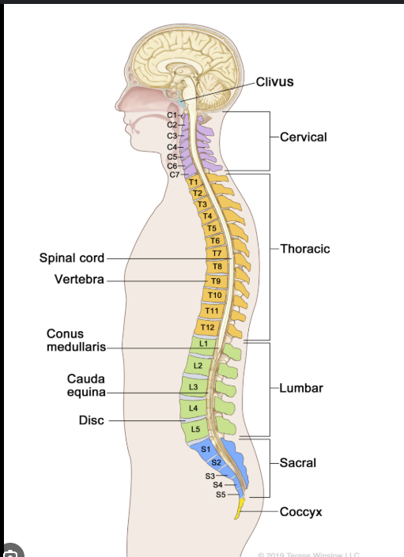
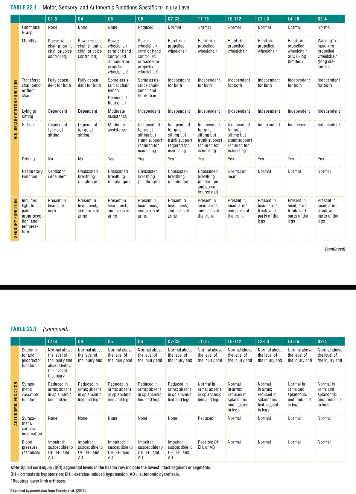
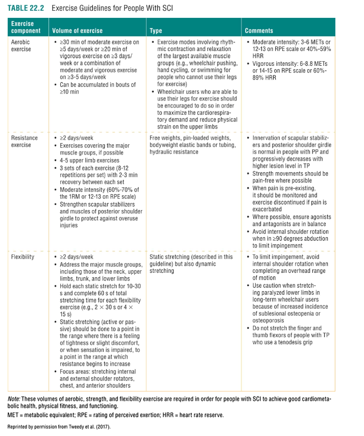
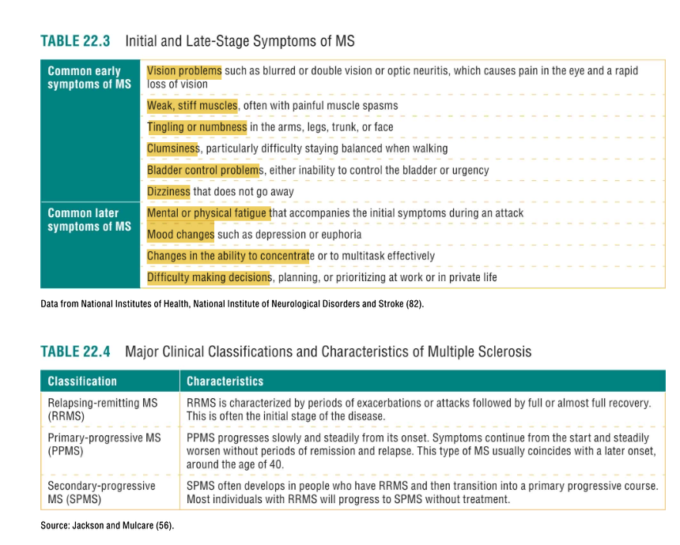
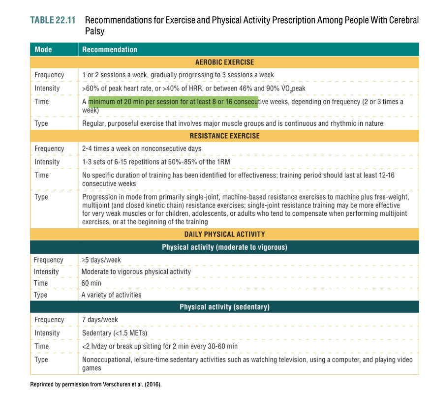
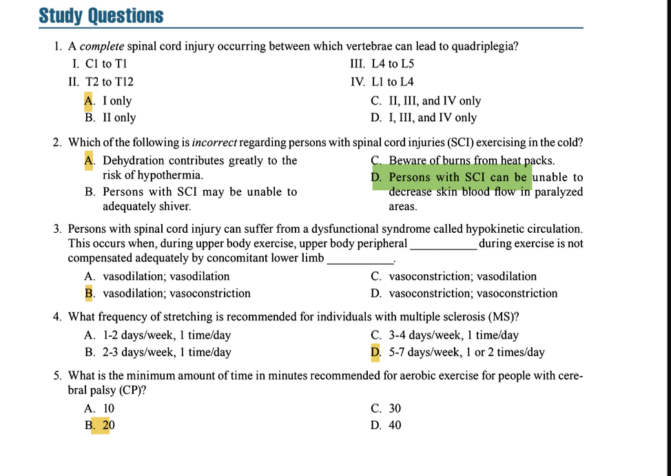

# Clients With Spinal Cord Injury, Multiple Sclerosis, Epilepsy, and Cerebral Palsy

### **SPINAL CORD INJURY (SCI)**

#### **Clinical Manifestations**
*   **Key Concepts & Exam Focus:**
    *   **Definition:** Damage to the neural elements within the spinal canal.
    *   **Level of Injury:** The lowest neurological segment with normal motor and sensory function. Injuries are classified as **complete** (no motor/sensory function below level) or **incomplete** (some function preserved).
    *   **Quadriplegia/Tetraplegia:** Impairment or loss of motor/sensory function in **all four limbs and trunk**. Caused by injury in the **cervical** region (C1-C8).
    *   **Paraplegia:** Impairment or loss of motor/sensory function in the **lower limbs only**. Caused by injury in the **thoracic, lumbar, or sacral** (T1-S5) regions.
*   **Critical Statistics & Specifics:**
    *   Most common causes: Vehicular accidents (~36%), falls (~29%), violence (~14%), sports (~9%).
*   **Study Question Integration:**
    *   **Question 1:** A *complete* spinal cord injury occurring between which vertebrae can lead to quadriplegia?
        *   **Answer: A. I only** (C1 to T1). Quadriplegia results from injury in the cervical region. Injuries at T1 and below affect the lower limbs (paraplegia). Lumbar injuries affect hips and legs but not upper body.

#### **Preventing Injuries in Clients With Spinal Cord Injury**
*   **Key Concepts & Exam Focus:**
    *   **Autonomic Dysreflexia (AD):** A **medical emergency** occurring in individuals with injuries **above T6**.
    *   **Cause:** A noxious stimulus *below* the level of injury (e.g., full bladder, pressure sore, tight clothing) triggers uncontrolled sympathetic nervous system response.
    *   **Signs/Symptoms:** Severe hypertension (high BP), pounding headache, flushed face, sweating *above* the lesion, goosebumps *below* the lesion.
    *   **Immediate Action:** **Sit client up** (to lower BP), locate and remove the cause (check catheter, loosen clothing), and seek emergency medical help if symptoms persist.
    
*   **Technique & Safety Precautions:**
    *   **Contraindication:** Do not leave client lying down. Elevating legs will worsen hypertension.
    *   **Prevention:** Ensure client empties bladder before exercise, check skin for pressure points, ensure clothing and equipment are not restrictive.

#### **Exercise Concerns in the Spinal Cord Injury Population**
*   **Key Concepts & Exam Focus:**
    *   **Thermoregulation:** Impaired due to loss of sympathetic nervous system control and inability to sweat below the level of injury.
    *   **Hypokinetic Circulation:** A mismatch between vasodilation in the exercising upper body and the inability to vasoconstrict in the paralyzed vasculature below, leading to **pooling of blood** and **low blood pressure**.
*   **Critical Statistics & Specifics:**
    *   Target heart rate for aerobic exercise may be **10-30 bpm lower** than in able-bodied individuals due to a reduced maximal heart rate.
*   **Study Question Integration:**
    *   **Question 2:** Which is *incorrect* regarding persons with SCI exercising in the cold?
        *   **Answer: A. Dehydration contributes greatly to the risk of hypothermia.** While dehydration is a concern, the primary risks in the cold are **increased risk of hypothermia** due to the inability to shiver (B), decreased skin blood flow (D), and the risk of burns from heat packs (C) on insensate skin. Dehydration is more critically linked to **heat illness**, not hypothermia.
    *   **Question 3:** Hypokinetic circulation occurs when upper body peripheral ______ is not compensated by lower limb ______.
        *   **Answer: B. vasodilation; vasoconstriction.** During arm exercise, the active muscles vasodilate. In able-bodied individuals, the legs vasoconstrict to maintain blood pressure. In SCI, this compensatory vasoconstriction is lost, leading to blood pooling and hypotension.

#### **General Health Issues of Persons With Spinal Cord Injury**
*   **Key Concepts & Exam Focus:**
    *   **Osteoporosis:** Rapid bone mineral density loss below the level of injury increases fracture risk.
    *   **Pressure Sores (Ulcers):** Caused by unrelieved pressure on skin over bony prominences (ischium, sacrum).
    *   **Spasticity:** Velocity-dependent increase in muscle tone. Can be managed with regular ROM exercise.

#### **Exercise Testing and Training of Clients With Spinal Cord Injury**
*   **Key Concepts & Exam Focus:**
    *   **Primary Mode:** **Arm crank ergometry (ACE)** is the most common mode for aerobic testing and training. Wheelchair ergometry and swimming are alternatives.
    *   **Strength Training:** Focus on functional strength for activities of daily living (ADLs) and wheelchair mobility.
*   **Critical Statistics & Specifics:**
    *   **Aerobic Exercise Frequency:** 3-5 days/week.
    *   **Aerobic Exercise Intensity:** 50-80% of peak power output (PPO); **50-70% HRmax** (note: HRmax is lower than able-bodied).
    *   **Aerobic Exercise Duration:** **20-60 minutes** of continuous or accumulated exercise.
    *   **Aerobic Exercise Mode:** ACE, wheelchair ergometry, swimming, functional electrical stimulation (FES) cycling.
    *   **Resistance Training Frequency:** 2-3 days/week.
    *   **Resistance Training Sets/Reps:** 1-3 sets of 8-12 repetitions.
*   **Technique & Safety Precautions:**
    *   Monitor for signs of AD and hypotension.
    *   Ensure proper positioning and padding to prevent pressure sores.
    *   Use wrist straps for gripping during strength exercises if grip is compromised.
    *   Avoid overstretching joints due to osteoporosis risk.

---

### **MULTIPLE SCLEROSIS (MS)**

#### **Exercise Testing and Training of Clients With Multiple Sclerosis**
*   **Key Concepts & Exam Focus:**
    *   **Definition:** A progressive, degenerative disease of the **central nervous system (CNS)** characterized by **demyelination** of nerve fibers.
    *   **Primary Concern: Heat Sensitivity.** **Uhthoff's sign:** A temporary worsening of symptoms due to an increase in core body temperature (e.g., from exercise, hot weather). Symptoms improve with cooling.
    *   **Fatigue:** The most common and debilitating symptom.
*   **Critical Statistics & Specifics:**
    *   **Aerobic Exercise Frequency:** 2-5 days/week (start low, 2-3).
    *   **Aerobic Exercise Intensity:** **40-70% VO₂peak or HRR**; use RPE (11-14 on 6-20 scale) as primary guide due to HR dysregulation.
    *   **Aerobic Exercise Duration:** 10-40 minutes; can be accumulated in shorter bouts (e.g., 10 min x 2).
    *   **Resistance Training Frequency:** 2-3 days/week.
*   **Technique & Safety Precautions:**
    *   **Cooling Strategies:** Exercise in a cool environment, use fans, cool vests, cold towels, and drink cold fluids.
    *   **Energy Conservation:** Plan workouts for times of day when energy is highest. Allow for ample rest.
    *   **Balance:** Be aware of increased fall risk. Use support as needed.
*   **Study Question Integration:**
    *   **Question 4:** What frequency of stretching is recommended for individuals with multiple sclerosis (MS)?
        *   **Answer: D. 5-7 days/week, 1 or 2 times/day.** Daily stretching is crucial for managing spasticity and maintaining range of motion, which are common issues in MS.
*   **Key Points:**
    *   Exercise is beneficial and does not worsen the disease progression.
    *   Use RPE as a primary intensity guide.
    *   Avoid exercise during acute exacerbations (relapses).
    

---

### **EPILEPSY**

#### **Exercise Testing and Training of Clients With Epilepsy**
*   **Key Concepts & Exam Focus:**
    *   **Definition:** A neurological disorder characterized by **recurrent, unprovoked seizures**.
    *   **Key Finding:** **Exercise can have an inhibitory effect on seizures** for many individuals.
    *   **Primary Safety Concern:** Risk of injury **during** and **after** a seizure.
*   **Technique & Safety Precautions:**
    *   **Contraindications:** Avoid exercises where a sudden loss of consciousness could be catastrophic (e.g., rock climbing, swimming alone, heavy free-weight lifting over the head/face).
    *   **Safety First:**
        *   Ensure a trained professional is present.
        *   Use machines instead of free weights for heavy resistance.
        *   Use a spotter.
        *   Avoid hyperventilation and excessive breath-holding (Valsalva maneuver), as these can alter brain chemistry and potentially trigger a seizure.
    *   **If a Seizure Occurs:**
        1.  **Time** the seizure.
        2.  **Protect** the client from injury (e.g., move equipment, cushion head).
        3.  **Do not** restrain them or put anything in their mouth.
        4.  Roll them onto their **side** (recovery position) after the seizure ends.
        5.  Provide reassurance and call for emergency help if the seizure lasts >5 minutes, if another seizure follows, or if injury occurred.

---

### **CEREBRAL PALSY (CP)**

#### **Exercise Testing and Training of Clients With Cerebral Palsy**
*   **Key Concepts & Exam Focus:**
    *   **Definition:** A group of nonprogressive disorders of the brain occurring *in utero*, at birth, or shortly after, resulting in impaired movement and posture.
        - **Spasticity** is caused by disruptions
within the motor neurons that manifest as a speed-
dependent stretch reflex that is hyperexcited, resulting
in stiffness, cramping, or spasms
        - **Dystonia** is caused by a similar disruption of motor
neurons, but it results in involuntary contractions and
muscle movements due to disrupted communication
between the central and peripheral nervous systems.
        - **CP is not a progressive disease because the
brain damage does not worsen. However,
secondary conditions such as spasticity can
and often do worsen if not well managed,
leading to further loss of joint motion and
mobility and potential contractures.**

    *   **Primary Challenge:** **High energy cost of movement** and early onset of fatigue.
    *   **Common Comorbidities:** Osteoporosis, joint contractures, spasticity.
*   **Critical Statistics & Specifics:**
    *   **Aerobic Exercise Frequency:** 3-5 days/week.
    *   **Aerobic Exercise Intensity:** 50-85% HRmax or VO₂peak; RPE 12-16 (6-20 scale).
    *   **Aerobic Exercise Duration:** **At least 20-40 minutes.** Can be accumulated.
    *   **Resistance Training Frequency:** 2-3 days/week.
    *   **Resistance Training Sets/Reps:** 1-3 sets of 8-15 repetitions.
*   **Technique & Safety Precautions:**
    *   Focus on **functional movements** that aid in ADLs.
    *   Emphasize proper form over load to avoid reinforcing abnormal movement patterns.
    *   Incorporate flexibility training to manage spasticity and prevent contractures.
    *   Be mindful of balance deficits and provide support.
*   **Study Question Integration:**
    *   **Question 5:** What is the minimum amount of time in minutes recommended for aerobic exercise for people with cerebral palsy (CP)?
        *   **Answer: B. 20.** The guidelines state a duration of *at least* 20-40 minutes, making 20 minutes the minimum recommended threshold.
*   **Key Points:**
    *   The goal is to improve functional capacity and should prescribe exercises that will lead to improved capabilities to engage in physical activity.
    *   **Maximal exercise testing** among most individuals with CP is safe and effective
    *   Exercise programs must be highly individualized based on the type and severity of CP.
    *   **muscle weakness** may be the biggest cause for activity limitation in those with CP.

    

### **Comparative Table: Neuromuscular Conditions for the Personal Trainer**

| Condition | Primary Cause & Nature | Key Symptoms & Characteristics | Critical Exercise Cautions & Program Design Considerations |
| :--- | :--- | :--- | :--- |
| **Spinal Cord Injury (SCI)** | **Cause:** Traumatic damage to the spinal cord (e.g., accident, fall). **Nature:** The injury level (cervical, thoracic, lumbar) and completeness (complete/incomplete) define the impairment. | • Paralysis & sensory loss below the level of injury • **Autonomic Dysreflexia (AD)** (medical emergency for injuries above T6) • **Thermoregulatory dysfunction** (can't sweat/shiver below injury) • **Hypokinetic circulation** (low BP during exercise) • Spasticity • Osteoporosis | • **Know signs of AD and emergency procedures.** • Monitor for hypotension (dizziness, nausea) during exercise. • **Manage temperature:** Avoid extreme heat/cold; client cannot self-regulate. • Avoid overloading bones susceptible to osteoporosis. • Use ACE or wheelchair ergometry for cardio. |
| **Multiple Sclerosis (MS)** | **Cause:** Autoimmune disease causing **demyelination** of CNS nerves. **Nature:** Progressive and degenerative, with periods of relapse and remission. | • **Fatigue** (most common symptom) • **Heat Sensitivity (Uhthoff's sign):** Symptoms worsen with increased core temperature. • Muscle weakness • Imbalance & lack of coordination • Variable symptoms day-to-day | • **Prevent overheating:** Use cooling strategies (cool room, fans, cold fluids, vests). • **Use RPE** as primary intensity guide (HR may be unreliable). • Schedule exercise for when client has most energy. • **Frequency:** Stretch **5-7 days/week** to manage spasticity. • Avoid exercise during acute relapses. |
| **Epilepsy** | **Cause:** Various; characterized by **recurrent, unprovoked seizures** due to abnormal electrical brain activity. **Nature:** A symptom of an underlying neurological condition. | • **Seizures** (tonic-clonic, absence, etc.) • Loss of consciousness or awareness • Uncontrolled movements | • **Primary goal: Safety during and after a seizure.** • **Avoid activities where a fall would be catastrophic** (e.g., rock climbing, swimming alone, heavy free weights over head). • Use machines over free weights for heavy loading. • Always have a spotter. • Avoid hyperventilation and Valsalva maneuver. |
| **Cerebral Palsy (CP)** | **Cause:** Non-progressive brain damage occurring before, during, or shortly after birth. **Nature:** A group of disorders affecting movement, posture, and tone. | • **High energy cost of movement** and early fatigue • Spasticity, muscle tightness, & contractures • Impaired motor control & balance • **Osteoporosis** • Possible intellectual or speech impairments | • Focus on **functional movements** that aid in daily activities. • **Emphasize proper form** to avoid reinforcing abnormal movement patterns. • Incorporate frequent flexibility training. • Be mindful of **fatigue**; sessions may need to be shorter or broken into bouts. • **Aerobic minimum: 20 minutes.** • Ensure a balanced and stable environment to prevent falls. |

**Question 1**
Correct Answer: A. I only
Textbook Reference:
"Quadriplegia (also called tetraplegia) is the impairment or loss of motor and/or sensory function in the cervical segments of the spinal cord... Paraplegia refers to impairment... in the thoracic, lumbar, or sacral segments."
(Chapter 22, "Spinal Cord Injury - Clinical Manifestations")

Incorrect Options:
*   B. II only: Injuries from T2 to T12 result in paraplegia (impairment of the trunk and lower limbs), not quadriplegia.
*   C. II, III, and IV only: These options include thoracic and lumbar vertebrae (T2-L5), which are associated with paraplegia, not quadriplegia.
*   D. I, III, and IV only: While option I (C1-T1) is correct, options III (L4-L5) and IV (L1-L4) are lumbar injuries that result in paraplegia or lower limb impairment, not quadriplegia.

**Question 2**
Correct Answer: A. Dehydration contributes greatly to the risk of hypothermia.
Textbook Reference:
"Dehydration is a major contributor to heat illness... In the cold, the trainer must be aware of the increased risk of hypothermia... they may be unable to shiver... and cannot decrease skin blood flow in the paralyzed areas... Also, beware of burns from heat packs..."
(Chapter 22, "Spinal Cord Injury - Exercise Concerns in the Spinal Cord Injury Population" and "Preventing Injuries in Clients With Spinal Cord Injury")

Incorrect Options:
*   B. Persons with SCI may be unable to adequately shiver: This is correct. The textbook states individuals with SCI "may be unable to adequately shiver" below the level of their injury, increasing hypothermia risk.
*   C. Beware of burns from heat packs: This is correct. The textbook cautions to "beware of burns from heat packs" due to lack of sensation in paralyzed areas.
*   D. Persons with SCI can be unable to decrease skin blood flow in paralyzed areas: This is correct. The textbook states they "cannot decrease skin blood flow in the paralyzed areas," which promotes heat loss.

**Question 3**
Correct Answer: B. vasodilation; vasoconstriction
Textbook Reference:
"[Hypokinetic circulation is] a condition in which peripheral vasodilation during exercise is not compensated adequately by concomitant lower limb vasoconstriction."
(Chapter 22, "Spinal Cord Injury - Exercise Concerns in the Spinal Cord Injury Population")

Incorrect Options:
*   A. vasodilation; vasodilation: This would cause a severe drop in blood pressure from widespread blood pooling, but it misidentifies the body's normal compensatory mechanism (vasoconstriction).
*   C. vasoconstriction; vasodilation: This is the opposite of the correct physiological response. Vasoconstriction in the active upper body would impede exercise, and vasodilation in the lower limbs would worsen blood pooling.
*   D. vasoconstriction; vasoconstriction: This does not describe the problem of hypokinetic circulation, which is specifically a failure of vasoconstriction to compensate for vasodilation.

**Question 4**
Correct Answer: D. 5-7 days/week, 1 or 2 times/day
Textbook Reference:
"For flexibility, the recommended frequency is 5 to 7 days per week, one or two times per day."
(Chapter 22, "Multiple Sclerosis - Exercise Testing and Training of Clients With Multiple Sclerosis")

Incorrect Options:
*   A. 1-2 days/week, 1 time/day: This frequency is too low to effectively manage the spasticity and maintain range of motion common in MS.
*   B. 2-3 days/week, 1 time/day: This is the general resistance training frequency recommendation for MS, not the stretching frequency.
*   C. 3-4 days/week, 1 time/day: This frequency is less than the specific recommendation for MS clients, who require daily stretching to combat spasticity.

**Question 5**
Correct Answer: B. 20
Textbook Reference:
"The recommended duration of aerobic exercise is at least 20 to 40 minutes..."
(Chapter 22, "Cerebral Palsy - Exercise Testing and Training of Clients With Cerebral Palsy")

Incorrect Options:
*   A. 10: While exercise can be accumulated, the minimum recommended duration for a single session is higher than 10 minutes.
*   C. 30: While 30 minutes falls within the recommended 20-40 minute range, it is not the *minimum* amount of time stated.
*   D. 40: This is the upper end of the recommended duration range (20-40 minutes), not the minimum.