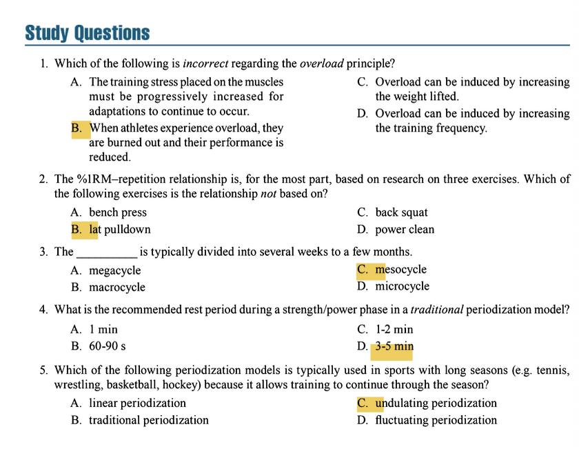

# Resistance Training for Clients Who Are Athletes

### **FACTORS IN PROGRAM DESIGN**

#### **Overload Principle**
**Key Concepts & Exam Focus:**
*   **Definition:** To increase muscle strength, size, and endurance, the training stress (load) must be greater than what the muscle is accustomed to.
*   **Core Tenet:** For adaptations to continue, the training stress must be **progressively increased** over time.
*   **Methods to Induce Overload:** Increasing the weight (load), increasing the number of repetitions, increasing the number of sets, increasing training frequency, and decreasing rest periods.
*   **Study Question Integration (Answer to Q1):** The incorrect statement is **B. "When athletes experience overload, they are burned out and their performance is reduced."** This describes **overtraining** or "overreach," which is a negative consequence of excessive overload without sufficient recovery. The overload principle itself is a positive, fundamental requirement for improvement. Options A, C, and D are all correct applications of the principle.

**Critical Statistics & Specifics:**
*   No specific statistics, but understand the *methods* of applying overload (load, reps, sets, frequency, rest).

**Technique & Safety Precautions:**
*   Overload must be applied **systematically and progressively**. Drastic increases in load or volume can lead to injury.
*   Monitoring for signs of overtraining (e.g., prolonged performance decrements, fatigue, mood disturbances) is crucial for safety.

**Key Points:**
*   The overload principle is a basic athletic training concept.
*   Progressive overload is necessary for continued improvement.
*   Burnout/overtraining is a misuse of the overload principle, not the principle itself.

#### **Specificity of Training (SAID Principle)**
**Key Concepts & Exam Focus:**
*   **SAID Principle:** Specific Adaptations to Imposed Demands.
*   The body adapts specifically to the type of training stress placed upon it.
*   Specificity applies to:
    *   **Muscle Actions:** Eccentric, concentric, isometric.
    *   **Speed of Movement:** Force-velocity relationships.
    *   **Energy Systems:** Alactic (phosphagen), glycolytic, oxidative.
    *   **Movement Patterns:** Training should mimic the biomechanics of the sport.

**Critical Statistics & Specifics:**
*   N/A for this sub-section.

**Technique & Safety Precautions:**
*   Exercise selection should be specific to the sport's movement patterns to maximize transfer but must always prioritize proper technique to minimize injury risk.

**Key Points:**
*   Training adaptations are highly specific to the stimulus applied.
*   The closer the training is to the actual sport skill, the greater the carryover.

---

### **TRAINING LOAD: RESISTANCE AND REPETITIONS**

#### **Influential Factors**
**Key Concepts & Exam Focus:**
*   The primary factor influencing the relationship between %1RM and the number of repetitions able to be performed is **the amount of muscle mass involved** in the exercise.
*   Larger muscle mass groups (e.g., legs, back) allow for more repetitions at a given %1RM compared to smaller muscle mass groups (e.g., arms).
*   **Study Question Integration (Answer to Q2):** The %1RM-repetition relationship is primarily based on research on the **bench press**, **back squat**, and **power clean**. It is **not** based on the **B. lat pulldown**.

**Critical Statistics & Specifics:**
*   **General %1RM–Repetition Guidelines (Based on Big Compound Lifts):**
    *   100% of 1RM = 1 repetition
    *   95% of 1RM = 2 repetitions
    *   93% of 1RM = 3 repetitions
    *   90% of 1RM = 4 repetitions
    *   87% of 1RM = 5 repetitions
    *   85% of 1RM = 6 repetitions
    *   80% of 1RM = 8 repetitions
    *   75% of 1RM = 10 repetitions
    *   70% of 1RM = 12 repetitions
    *   67% of 1RM = 15 repetitions
    *   65% of 1RM = 18-20 repetitions

**Technique & Safety Precautions:**
*   These relationships are guidelines. Individual variation exists. Always use proper technique; failing to complete a rep due to fatigue is a sign that the load is appropriate for that rep goal, but failing due to poor form is a safety risk.

**Key Points:**
*   The muscle mass used in an exercise affects the number of reps possible at a given %1RM.
*   The standard repetition maximum continuum is based on specific multi-joint exercises.

#### **Guidelines for Assessing Load Capabilities**
**Key Concepts & Exam Focus:**
*   **Direct Testing:** Determining a true 1RM. Best for experienced athletes with proficient technique. Requires adequate warm-up and progressive attempts.
*   **Indirect Testing:** Using a multiple-RM test (e.g., a 5RM or 10RM) and then estimating the 1RM using a prediction table. Safer for novices or for exercises with higher technical demand.

**Critical Statistics & Specifics:**
*   **Repetition Maximum Continuum for Training Goals:**
    *   **Strength:** ≤6 reps (≥85% 1RM)
    *   **Power:** 1-5 reps (varies by exercise; single-effort event: 80-90% 1RM; multiple-effort event: 75-85% 1RM)
    *   **Hypertrophy:** 6-12 reps (67-85% 1RM)
    *   **Muscular Endurance:** ≥12 reps (≤67% 1RM)

**Technique & Safety Precautions:**
*   **1RM Testing Safety:** Must be preceded by a dynamic warm-up and submaximal loads. Spotters are mandatory for exercises where a missed attempt could be dangerous (e.g., back squat, bench press).
*   **Contraindications:** Avoid 1RM testing for novices, those with poor technique, or on high-skill exercises like the power clean or snatch until proficiency is demonstrated.

**Key Points:**
*   Load can be determined via direct (1RM) or indirect (multiple RM) testing.
*   The training goal (strength, power, hypertrophy, endurance) dictates the load and repetition range.

---

### **PERIODIZATION OF RESISTANCE TRAINING**

#### **Cycles and Phases**
**Key Concepts & Exam Focus:**
*   **Periodization:** The systematic planning of athletic training. It involves progressive cycling of various aspects of a training program during a specific period to maximize adaptations and reduce injury risk.
*   **Cycle Definitions:**
    *   **Macrocycle:** The longest cycle, typically an **entire training year** (could be multiple years for Olympics).
    *   **Mesocycle:** A shorter cycle within the macrocycle, typically **several weeks to a few months** (e.g., an off-season strength phase, a pre-season power phase). *(Answer to Q3: C. Mesocycle)*
    *   **Microcycle:** The shortest cycle, typically **one week** of training.
*   **Common Phases within a Mesocycle (Traditional Model):**
    1.  **Hypertrophy/Endurance Phase:** High volume, moderate to low intensity. Builds work capacity.
    2.  **Basic Strength Phase:** Moderate volume, high intensity. Focus on increasing strength of prime movers.
    3.  **Strength/Power Phase:** Low volume, very high intensity. Focus on rate of force development.
    4.  **Peaking Phase:** Very low volume, very high intensity. Tapers for maximum performance.
    5.  **Active Rest:** Low volume, low intensity. Promotes recovery and psychological break.

**Critical Statistics & Specifics:**
*   **Mesocycle Duration:** 4-8 weeks is common for a single phase (e.g., a 6-week strength phase).

**Technique & Safety Precautions:**
*   Periodization prevents plateaus and overtraining by managing fatigue through planned variation in volume and intensity.

**Key Points:**
*   Periodization is the planned variation of training variables.
*   It is organized into macrocycles, mesocycles, and microcycles.

#### **Variation in Exercise Selection**
**Key Concepts & Exam Focus:**
*   Variation is a key component of periodization to maintain motivation and promote continuous adaptation.
*   **Exercise Selection Categories:**
    *   **Core Exercises:** Multi-joint exercises that recruit large muscle areas (e.g., squats, cleans, presses).
    *   **Assistance Exercises:** Single-joint exercises that isolate a specific muscle group (e.g., leg extensions, bicep curls).
*   Variation can be achieved by changing exercises (e.g., from barbell bench press to dumbbell bench press), order, volume, intensity, and rest periods.

**Critical Statistics & Specifics:**
*   N/A

**Technique & Safety Precautions:**
*   While variation is good, technique must be established for any new exercise introduced to the program to ensure safety.

**Key Points:**
*   Variation helps to avoid training plateaus and staleness.
*   Exercises are classified as core (multi-joint) or assistance (single-joint).

---

### **TRADITIONAL AND UNDULATING MODELS OF PERIODIZED RESISTANCE TRAINING**

#### **Traditional (Linear) Periodization Model**
**Key Concepts & Exam Focus:**
*   **Definition:** Characterized by a gradual, progressive, and linear decrease in training volume with a simultaneous increase in training intensity over a mesocycle/macrocycle.
*   **Progression:** Moves from high volume/low intensity (hypertrophy) -> moderate volume/moderate intensity (strength) -> low volume/high intensity (power/peaking).
*   **Rest Periods:** Rest periods lengthen as intensity increases.
    *   **Study Question Integration (Answer to Q4):** The recommended rest period during a strength/power phase in a traditional model is **D. 3-5 minutes**. This is necessary for near-complete recovery of the ATP-PC system to maximize force and power output in subsequent sets. (Hypertrophy phase: 1-2 min; Strength phase: 2-3 min; Power phase: 3-5 min).

**Critical Statistics & Specifics:**
*   **Volume:** Starts high (e.g., 3-5 sets of 8-12 reps), ends low (e.g., 3-5 sets of 1-3 reps).
*   **Intensity:** Starts low (e.g., 67-85% 1RM), ends high (e.g., ≥85% 1RM, up to 93-100%).
*   **Rest Periods:** Hypertrophy (30-90 sec), Strength (2-3 min), Power (3-5 min).

**Technique & Safety Precautions:**
*   The gradual progression allows for technique refinement as loads get heavier.
*   Requires careful monitoring to ensure the athlete is recovering adequately during high-intensity phases.

**Key Points:**
*   Traditional periodization involves a gradual, linear shift from high volume to high intensity.
*   It is effective for beginners and for peaking for a single competition.

#### **Undulating (Nonlinear) Periodization Model**
**Key Concepts & Exam Focus:**
*   **Definition:** Characterized by frequent, often daily or weekly, alterations in the load and volume throughout the training cycle.
*   **Application:** An athlete may train for different goals (e.g., strength, power, hypertrophy) on different days within the same week.
    *   *Example Microcycle:*
        *   Monday: Hypertrophy Day (3x10 @ 75%)
        *   Wednesday: Power Day (5x3 @ 85%)
        *   Friday: Strength Day (4x6 @ 80%)
*   **Study Question Integration (Answer to Q5):** The periodization model typically used in sports with long seasons (e.g., tennis, wrestling, basketball, hockey) is **C. Undulating periodization**. This is because it allows for continued training variation and the development of multiple fitness qualities simultaneously throughout the competitive season without requiring a long peaking phase.

**Critical Statistics & Specifics:**
*   Volume and intensity change frequently (e.g., daily or weekly).
*   Rep ranges and loads can vary dramatically within a short timeframe.

**Technique & Safety Precautions:**
*   Requires a well-trained athlete who can handle frequent changes in stress and can perform exercises with proficient technique at various speeds and loads.

**Key Points:**
*   Undulating periodization features frequent changes in volume and intensity.
*   It is well-suited for in-season training or for athletes who compete frequently.

#### **Effectiveness of Traditional and Undulating Periodized Programs**
**Key Concepts & Exam Focus:**
*   **Both models are superior to non-periodized training.**
*   **Traditional (Linear):** May be superior for **maximal strength** gains, especially in less-trained individuals, as it allows for focused adaptation.
*   **Undulating (Nonlinear):** May be superior for maintaining training variety and **simultaneously developing multiple fitness qualities** (strength, power, hypertrophy) and may be more effective for seasoned athletes.

**Critical Statistics & Specifics:**
*   Research shows both models elicit significant strength gains compared to non-periodized programs.

**Technique & Safety Precautions:**
*   The choice of model depends on the athlete's training experience, sport, season, and specific goals.

**Key Points:**
*   Both periodized models are more effective than non-periodized training.
*   The choice between models should be individualized for the athlete.

Of course. Here are the answers to the study questions based on *NSCA Essentials of Personal Training, 3rd Edition*.

**Question 1**
**Correct Answer:** B. When athletes experience overload, they are burned out and their performance is reduced.
**Textbook Reference:**
"The overload principle is a basic training concept that states that to increase muscle strength, the muscle must be gradually stressed or 'overloaded.' However, if the training stress is too great (i.e., the overload is too high or applied too frequently) and is coupled with inadequate recovery, performance can be compromised, a state often referred to as overtraining or overreaching." (Chapter 23, "Factors in Program Design")

**Incorrect Options:**
*   **A. The training stress placed on the muscles must be progressively increased for adaptations to continue to occur:** This is the correct definition and application of the overload principle.
*   **C. Overload can be induced by increasing the weight lifted:** This is a correct method for applying the overload principle.
*   **D. Overload can be induced by increasing the training frequency:** This is a correct method for applying the overload principle.

**Question 2**
**Correct Answer:** B. lat pulldown
**Textbook Reference:**
"For the most part, the %1RM-repetition relationship is based on research on three exercises: the bench press, back squat, and power clean." (Chapter 23, "Training Load: Resistance and Repetitions")

**Incorrect Options:**
*   **A. bench press:** This is one of the three primary exercises upon which the %1RM-repetition relationship is based.
*   **C. back squat:** This is one of the three primary exercises upon which the %1RM-repetition relationship is based.
*   **D. power clean:** This is one of the three primary exercises upon which the %1RM-repetition relationship is based.

**Question 3**
**Correct Answer:** C. mesocycle
**Textbook Reference:**
"The mesocycle is the next level and is typically several weeks to a few months in duration (e.g., an off-season strength phase that lasts 4-8 weeks)." (Chapter 23, "Periodization of Resistance Training")

**Incorrect Options:**
*   **A. megacycle:** This is not a standard term used in the periodization model described in the textbook.
*   **B. macrocycle:** The macrocycle is the longest period, typically representing an entire training year.
*   **D. microcycle:** The microcycle is the shortest period, typically lasting one week.

**Question 4**
**Correct Answer:** D. 3-5 min
**Textbook Reference:**
"Longer rest periods (e.g., 3-5 minutes) are used when the training goal is maximal strength or power because they allow for greater recovery of the energy systems, which is necessary for maintaining high-quality effort in subsequent sets." (Chapter 23, "Traditional and Undulating Models of Periodized Resistance Training")

**Incorrect Options:**
*   **A. 1 min:** This rest period is too short for a strength/power phase and is more appropriate for hypertrophy or muscular endurance training.
*   **B. 60-90 s:** This rest period is too short for a strength/power phase and is more appropriate for hypertrophy training.
*   **C. 1-2 min:** This rest period is too short for a strength/power phase and is more appropriate for hypertrophy training.

**Question 5**
**Correct Answer:** C. undulating periodization
**Textbook Reference:**
"Because of the frequent variation, undulating periodized resistance training is often used during in-season periods to allow for the simultaneous development of multiple training abilities (e.g., strength and power) and to help avoid training monotony." (Chapter 23, "Traditional and Undulating Models of Periodized Resistance Training")

**Incorrect Options:**
*   **A. linear periodization / B. traditional periodization:** Linear/Traditional periodization is designed to peak an athlete for a specific competition or point in time and is not as well-suited for maintaining performance across a long season with frequent competitions.
*   **D. fluctuating periodization:** This is not a standard term for a recognized periodization model in the textbook. The correct term is "undulating."