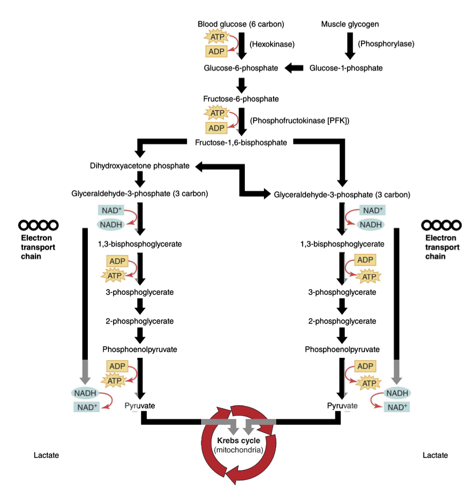
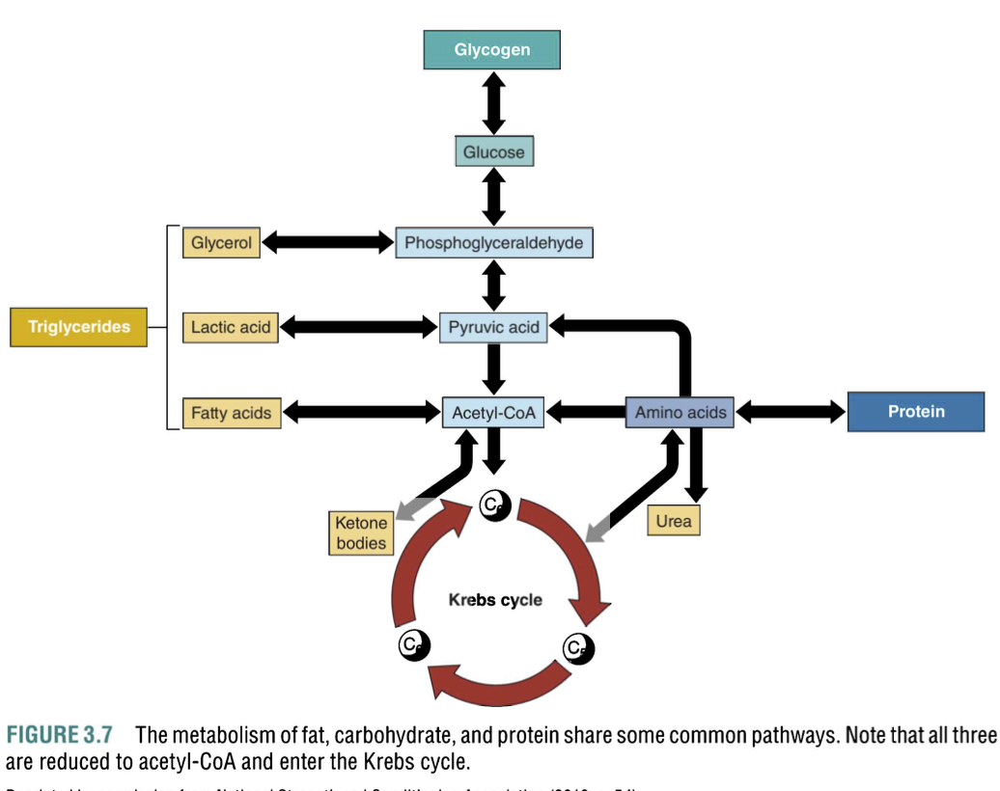
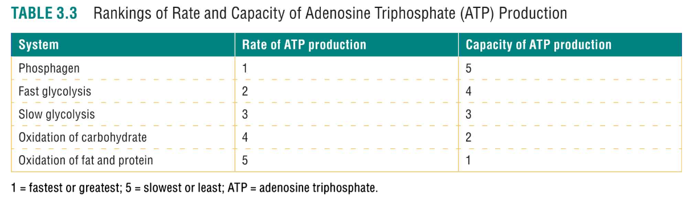
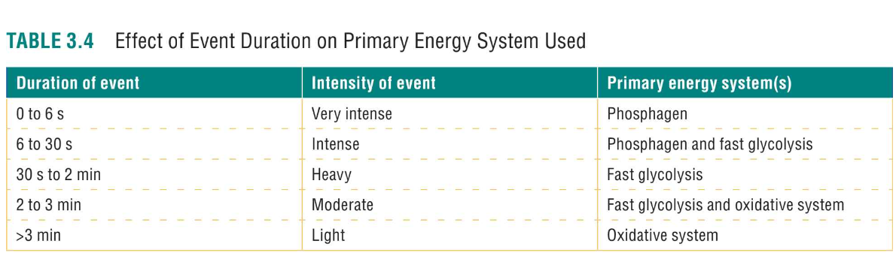

# Phosphagen System (ATP-PCr System, 磷酸源系统)

- The **phosphagen system** (磷酸源系统) is the quickest energy system, used during high-intensity efforts lasting around **10 seconds or less** (e.g., a 100m sprint or lifting heavy weights). This system provides energy immediately, using the stored **ATP** (三磷酸腺苷) and **phosphocreatine** (PCr, 磷酸肌酸).

## Primary Energy Sources:
- **ATP** (Adenosine Triphosphate, 三磷酸腺苷)
- **PCr** (Phosphocreatine, 磷酸肌酸)

## Duration:
- **Up to 10 seconds** for maximum intensity.

## Mechanism:
- **ATP** (三磷酸腺苷) is immediately used for energy in muscles during explosive movements.
- Once **ATP** is used up, **PCr** (磷酸肌酸) donates a phosphate group (磷酸基团) to **ADP** (Adenosine Diphosphate, 二磷酸腺苷) to regenerate ATP. This reaction is catalyzed by the enzyme **creatine kinase** (肌酸激酶).
- **PCr** is stored in limited amounts, so it is exhausted quickly (within **10-15 seconds**).

## Key Feature:
- The **phosphagen system** is **anaerobic** (without oxygen), and because of the limited **PCr** stores, it can only provide energy for a very short period of time.

## How It Works:
- **ATP** (三磷酸腺苷) is broken down to **ADP** (二磷酸腺苷) and a phosphate group during muscle contractions, releasing energy.
- Once **ATP** is depleted, **PCr** (磷酸肌酸) in muscle cells is used to replenish **ATP** (三磷酸腺苷) by transferring a phosphate group to **ADP** (二磷酸腺苷), forming ATP.

After the **phosphocreatine** stores are depleted, the body needs rest to regenerate them. Typically, this takes **3-5 minutes** (which is why **大重量训练的时候需要休息久一点**).

 
 

# Glycolytic System (Anaerobic Glycolysis, 糖酵解系统) 

## Primary Role:
- The **Glycolytic System** (糖酵解系统), also known as **Anaerobic Glycolysis** (无氧糖酵解), is responsible for breaking down **glucose** (葡萄糖) into **pyruvate** (丙酮酸) (and eventually **lactate** (乳酸) under anaerobic conditions) to produce **ATP** (三磷酸腺苷) for energy during high-intensity activities. slow (aerobic) and fast (anaerobic) glycolysis.
- It is the system used when the body requires energy at a faster rate than can be supplied by the **oxidative system** (氧化系统) (aerobic).

## Duration of Activity:
- The glycolytic system predominantly supports **activities lasting from 30 seconds to 2 minutes**, which are performed at moderate to high intensities (such as a 400-meter sprint or high-intensity interval training).

## Energy Yield:
- The breakdown of **glucose** (葡萄糖) through glycolysis yields a net gain of **2 ATP molecules** (2个ATP分子) (if starting from glucose) or **3 ATP molecules** (3个ATP分子) (if starting from glycogen (糖原)).
- This process also produces **2 NADH molecules** (2个NADH分子), which are used in the later stages of aerobic metabolism, but if oxygen is unavailable, **NADH** (还原型烟酰胺腺嘌呤二核苷酸) is converted to **lactate** (乳酸) to regenerate **NAD+** (烟酰胺腺嘌呤二核苷酸), allowing glycolysis to continue.

## End Product (Lactate):
- Under **anaerobic conditions** (无氧条件), **pyruvate** (丙酮酸) is converted to **lactate** (乳酸) by the enzyme **lactate dehydrogenase (LDH)** (乳酸脱氢酶). This conversion prevents the buildup of pyruvate and allows glycolysis to continue.
- **Lactate** (乳酸) is then released into the bloodstream and can accumulate in the muscles and blood, leading to muscle fatigue when it exceeds the body's capacity to clear it.

## Key Enzymes in Glycolysis:
- **Hexokinase** (己糖激酶): Initiates glycolysis by phosphorylating **glucose** (葡萄糖). It is regulated by its product, **glucose-6-phosphate** (葡萄糖-6-磷酸), which inhibits further activity when there is enough glucose breakdown.
- **Phosphofructokinase (PFK)** (磷酸果糖激酶): The **rate-limiting enzyme** (限速酶) of glycolysis, which is regulated by:
  - **Inhibited by ATP** (ATP抑制): High ATP levels signal that energy is sufficient, so **PFK** activity is reduced, slowing glycolysis.
  - **Stimulated by AMP and ADP** (AMP和ADP激活): When ATP is low, and **AMP** (腺苷酸) and **ADP** (腺苷二磷酸) levels rise, **PFK** activity increases, promoting glycolysis to generate more ATP.
  - **Inhibited by Citrate** (柠檬酸抑制): **Citrate** (柠檬酸), a product of the citric acid cycle (柠檬酸循环), indicates that energy levels are high, slowing glycolysis by inhibiting **PFK**.
- **Pyruvate Kinase** (丙酮酸激酶): Catalyzes the final step of glycolysis. It is activated by **fructose-1,6-bisphosphate** (果糖-1,6-二磷酸) and inhibited by **ATP** (ATP).

## Regulation of Glycolysis:
- **ATP** (ATP) acts as a negative regulator for **PFK** (磷酸果糖激酶) and **pyruvate kinase** (丙酮酸激酶), slowing down glycolysis when energy levels are sufficient.
- **AMP** (AMP) and **ADP** (ADP) act as positive regulators for **PFK** (磷酸果糖激酶), increasing glycolysis when energy (ATP) is in demand.
- **Citrate** (柠檬酸) inhibits **PFK** (磷酸果糖激酶), indicating the body has enough energy and slowing down glycolysis.

## Lactate Threshold:
- The **lactate threshold** (乳酸阈值) is the exercise intensity at which **lactate** (乳酸) begins to accumulate in the blood.
- In **untrained individuals** (未训练者), lactate accumulation begins at about **50-60% of VO₂max** (最大摄氧量).
- In **trained individuals** (训练者), this threshold is typically higher, occurring at **70-80% of VO₂max** (最大摄氧量), due to improved aerobic capacity, allowing the body to produce energy more efficiently and at higher intensities without accumulating lactate.

---

### **Summary**:
The **Glycolytic System** (糖酵解系统) provides energy for moderate-to-high-intensity efforts lasting from 30 seconds to 2 minutes. It breaks down **glucose** (葡萄糖) into **pyruvate** (丙酮酸) and produces **ATP** (三磷酸腺苷), but if oxygen is insufficient, **pyruvate** (丙酮酸) is converted into **lactate** (乳酸). **Glycolysis** (糖酵解) is regulated by key enzymes such as **hexokinase** (己糖激酶), **PFK** (磷酸果糖激酶), and **pyruvate kinase** (丙酮酸激酶), which are influenced by **ATP** (ATP), **AMP** (AMP), and other factors. When **lactate** (乳酸) accumulates, it signals that the system is working anaerobically, and the **lactate threshold** (乳酸阈值) indicates the point where lactate starts to build up in the bloodstream.

 
 

# Oxidative (Aerobic) System

The **oxidative (aerobic) system** (氧化系统) is the primary energy system used for **endurance activities** (耐力活动) and is responsible for producing **ATP** in the presence of oxygen. This system is more efficient than anaerobic systems (like the glycolytic system) but is slower in providing ATP.

## Glucose and Glycogen Oxidation (葡萄糖和糖原的氧化)

- **Glucose oxidation** (葡萄糖氧化) begins in the cytoplasm through **glycolysis** (糖酵解), where glucose is broken down into **pyruvate** (丙酮酸). If oxygen is available, **pyruvate** is then transported into the mitochondria (线粒体) and converted into **acetyl-CoA** (乙酰辅酶A), which enters the citric acid cycle (**Krebs cycle**, 克雷布斯循环).
- **Glycogen oxidation** (糖原氧化) is similar, except that **glycogen** (糖原) stored in muscles or the liver is directly broken down to **glucose-6-phosphate** (葡萄糖-6-磷酸), bypassing the first step of glycolysis, making the process slightly faster.
- The **end products** of glucose and glycogen oxidation are **carbon dioxide (CO₂)** (二氧化碳), **water (H₂O)** (水), and a large amount of **ATP** (三磷酸腺苷).

## Fat Oxidation (脂肪氧化)

- **Fat oxidation** (脂肪氧化) is a highly efficient process for producing energy during prolonged exercise at lower intensities.
- **Triglycerides** (甘油三酯), stored in adipose tissue (脂肪组织), are broken down into **fatty acids** (脂肪酸) and **glycerol** (甘油) by **lipolysis** (脂解作用). The fatty acids then enter the mitochondria and are converted to **acetyl-CoA** (乙酰辅酶A).
- **Fatty acids** undergo a process called **beta-oxidation** (β-氧化), which further breaks them down into **acetyl-CoA** units. These units enter the citric acid cycle, where ATP is produced.
- Fat oxidation is slower than glucose oxidation but provides a larger amount of ATP per molecule, making it the primary fuel for endurance activities.

## Protein Oxidation (蛋白质氧化)

- **Protein oxidation** (蛋白质氧化) occurs when **amino acids** (氨基酸) from dietary protein or muscle breakdown are converted into intermediates that enter the citric acid cycle.
- This process is **rarely used** as a primary energy source since protein oxidation is more important for tissue repair and maintenance. However, during prolonged exercise or when carbohydrate and fat stores are depleted, protein can provide a small amount of ATP.
- The nitrogen component of amino acids is removed in the liver and excreted as **urea** (尿素) through the kidneys.

## Oxidative (Aerobic) System Regulation (氧化系统的调节)

- **Oxygen availability** (氧气供应): The oxidative system is the only energy system that requires oxygen to produce ATP. Adequate oxygen supply is essential for efficient aerobic metabolism.
- **Aerobic enzymes** (有氧酶): The oxidative system is regulated by the presence of enzymes such as **cytochrome oxidase** (细胞色素氧化酶), which are involved in the electron transport chain and the citric acid cycle. These enzymes become more efficient and abundant with consistent aerobic training, improving the body's ability to produce ATP using oxygen.
- **Intensity of Exercise** (运动强度): As exercise intensity increases, the body shifts to using more carbohydrates (glucose and glycogen), as they can provide ATP more rapidly than fats. At lower intensities, the body primarily uses fat oxidation for energy.

---

## Summary of the Oxidative System:
- The **oxidative (aerobic) system** (氧化系统) is responsible for producing large amounts of **ATP** in the presence of oxygen. 
- It uses **glucose** (葡萄糖), **glycogen** (糖原), **fat** (脂肪), and **protein** (蛋白质) as fuel sources.
- The system is more efficient but slower compared to anaerobic systems like the glycolytic or phosphagen systems.
- **Fat oxidation** (脂肪氧化) provides a large amount of ATP over long durations, while **protein oxidation** (蛋白质氧化) is used minimally for energy.
- The **oxidative system's regulation** (氧化系统的调节) is influenced by oxygen availability, aerobic enzyme activity, and the intensity of exercise.

 
 

# Energy Production and Metabolic Specificity of Training

## Energy Production in Relation to Exercise Intensity

- **Exercise intensity** (运动强度) determines the primary energy system used for ATP production. At lower intensities, the body predominantly relies on the **oxidative (aerobic) system** (氧化系统) to produce ATP, while at higher intensities, the **phosphagen system** (磷酸源系统) and **glycolytic system** (糖酵解系统) are used more.

---

## Metabolic Specificity of Training

- **Metabolic specificity** (代谢特异性) refers to how the body adapts to the energy demands of a given exercise intensity. The type of energy system primarily engaged during training influences the specific adaptations in the muscle's metabolic pathways.
- Different exercises, whether **short-duration, high-intensity** (短时间高强度) like sprints or **long-duration, low-intensity** (长时间低强度) like jogging, will cause the body to adapt in a way that enhances the efficiency and capacity of the relevant energy systems.
    - **High-intensity, short-duration exercises** (高强度短时间运动) predominantly train the **phosphagen system** (磷酸源系统) and **glycolytic system** (糖酵解系统).
    - **Low-intensity, long-duration exercises** (低强度长时间运动) primarily stimulate the **oxidative system** (氧化系统).

---

## Adaptations to Different Energy Systems

- **Phosphagen System** (磷酸源系统): Training that stresses high-intensity, short-duration efforts, such as weightlifting or sprinting, leads to adaptations that increase the storage of **phosphocreatine (PCr)** (磷酸肌酸) in muscles, enhancing the body’s ability to quickly regenerate ATP during explosive efforts.
    
- **Glycolytic System** (糖酵解系统): Training that involves moderate to high-intensity efforts lasting from 30 seconds to 2 minutes (e.g., 400m sprints) primarily enhances the **glycolytic pathway** (糖酵解途径). This leads to increased capacity for **lactic acid** (乳酸) tolerance and better **glycogen storage** (糖原储存).
    
- **Oxidative System** (氧化系统): Long-duration, lower-intensity training, such as distance running or cycling, boosts the **oxidative capacity** (氧化能力) of muscle fibers, improving the body's ability to utilize **fat** (脂肪) and **carbohydrates** (碳水化合物) for energy. This increases **mitochondrial density** (线粒体密度) and efficiency, leading to better endurance performance.
    
---

## Importance of Training at Different Intensities

- **Energy systems' training overlap** (能量系统训练重叠): Although each energy system is primarily activated at specific intensity levels, all three systems—phosphagen, glycolytic, and oxidative—work simultaneously, with one system taking precedence depending on the exercise intensity.
- For optimal performance across different exercise modalities, athletes should incorporate training that targets each energy system. For example, a sprinter may benefit from both **high-intensity interval training (HIIT)** (高强度间歇训练) and aerobic conditioning, while an endurance athlete needs to develop both their **aerobic** capacity and the ability to buffer **lactic acid** (乳酸).

---

## Training Adaptations and Energy System Efficiency

- **Energy system efficiency** (能量系统效率): With consistent, focused training, the body becomes more efficient at using the appropriate energy systems during specific activities. This efficiency is not only seen in ATP production but also in the **regulation of metabolic byproducts** (代谢副产品), such as lactate accumulation during anaerobic efforts.
- The **phosphagen system** becomes more efficient at regenerating ATP quickly, the **glycolytic system** improves its ability to handle lactic acid, and the **oxidative system** enhances its capacity for **aerobic respiration**.

---

## Cross-Training Effects

- Cross-training (交叉训练) involves using different types of exercise to improve overall fitness, which can enhance performance in various energy systems. For example, a long-distance runner might incorporate high-intensity interval sprints to improve their anaerobic power, while a sprinter might do steady-state running to improve aerobic capacity for better recovery between bouts of intense effort.

---

## Summary of Key Concepts

- **Energy systems** work together but dominate based on the intensity and duration of exercise.
- **Metabolic specificity** of training refers to how exercise intensity and duration affect adaptations in energy systems.
- The body becomes more efficient in ATP production and **lactate buffering** with proper training in each energy system.
- **Cross-training** helps improve overall fitness by engaging multiple energy systems.
- Proper training at the right intensities leads to better performance in specific athletic demands.
