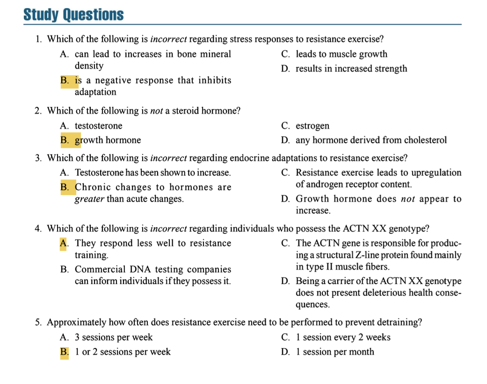

# Chapter 5 Learning Objectives Summary

## 1. Describe Acute Responses and Chronic Adaptations to Resistance Exercise

### Acute Responses
- **Neurological**:
  - ↑ EMG amplitude
  - Motor unit recruitment (following size principle)
- **Muscular**:
  - Metabolite accumulation (H⁺, Pᵢ)
  - Substrate depletion (CP, glycogen)
- **Endocrine**:
  - Transient ↑ in testosterone, GH, cortisol
  - Mechanotransduction signaling

### Chronic Adaptations
- **Neurological**:
  - Improved recruitment/firing rate
  - Reduced cocontraction
  - Synchronization
- **Muscular**:
  - Hypertrophy (↑ myofibrils)
  - Fiber type shifts (IIx→IIa)
  - ↑ Cytoskeletal proteins
- **Skeletal**:
  - ↑ Bone mineral density (especially with high strain/rate loading)
- **Metabolic**:
  - ↑ Absolute levels of anaerobic enzymes/substrates (CP, glycogen)
- **Body Composition**:
  - ↑ Fat-free mass
  - ↓ Body fat %

## 2. Identify Factors Affecting Adaptations

### Key Factors
- **Specificity**:
  - Adaptations match training mode/velocity
  - Free weights > machines for functional strength
- **Sex**:
  - Males show greater absolute gains
  - Due to higher muscle mass/testosterone
- **Age**:
  - Elderly can gain strength (200%↑)
  - Require higher maintenance volume
- **Genetics**:
  - ACTN3 genotype affects power potential
  - 10-20% are "low responders" for hypertrophy
- **Program Variables**:
  - Volume/intensity/frequency combinations dictate adaptations

## 3. Design Programs for Specific Adaptations

### Adaptation-Specific Programming
- **Hypertrophy**:
  - 3-6 sets/exercise
  - 65-75% 1RM
  - 30-90s rest
- **Strength**:
  - >80% 1RM
  - 2-5 sets
  - 2-5 mins rest
- **Power**:
  - Explosive movements
  - 30-60% 1RM for speed
  - Full recovery
- **Bone Density**:
  - High-impact/plyometric exercises
  - Progressive overload
- **Metabolic**:
  - High-volume circuits
  - Short rest periods

## 4. Avoid Overtraining in Program Design

### Prevention Strategies
- **Periodization**:
  - 3:1 loading:deload ratio
- **Monitoring**:
  - Watch for symptoms:
    - Sleep disruption
    - Prolonged soreness
    - Plateaus
- **Recovery**:
  - Avoid training to failure every session
  - Deload weeks (↓ 30-50% volume every 4-6 weeks)
  - Balance high/low intensity days
- **Volume Management**:
  - Novices: 10-15 sets/muscle/week
  - Advanced: 15-20+ sets

## 5. Understand and Reduce Detraining Effects

### Detraining Effects
- Strength loss begins after ~2 weeks
- Faster in Type II fibers
- Muscle atrophy after 4 weeks
- Neurological adaptations decline first

### Mitigation Strategies
- **Minimal Effective Dose**:
  - 1 session/week maintains strength
  - 2+ for elderly
- **Prioritize High-Load Training**:
  - 80% 1RM preserves strength better than 55%
- **Eccentric Focus**:
  - Maintains muscle mass
- **Cross-Training**:
  - Maintains neural patterns
- **Nutrition**:
  - 1.6-2.2g protein/kg

### Key Evidence
- High responders lose adaptations slower
- Trained individuals retain benefits longer
- Structural changes persist longer than neural/muscular

