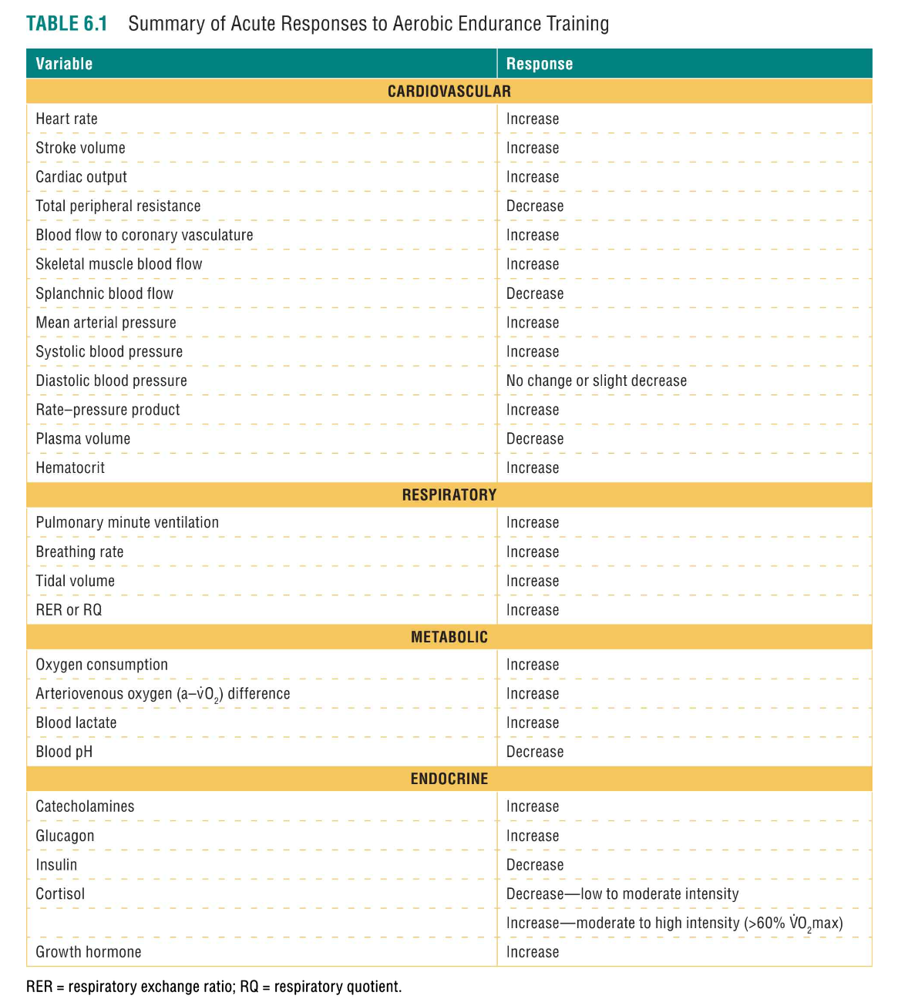
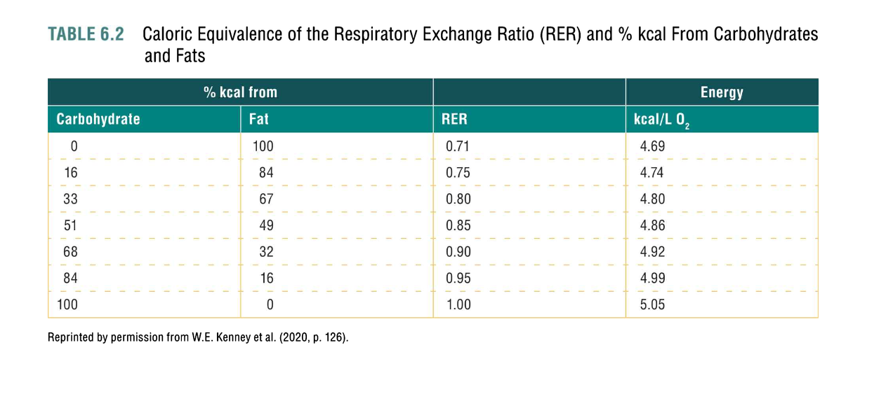
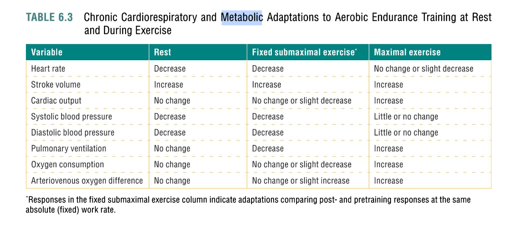
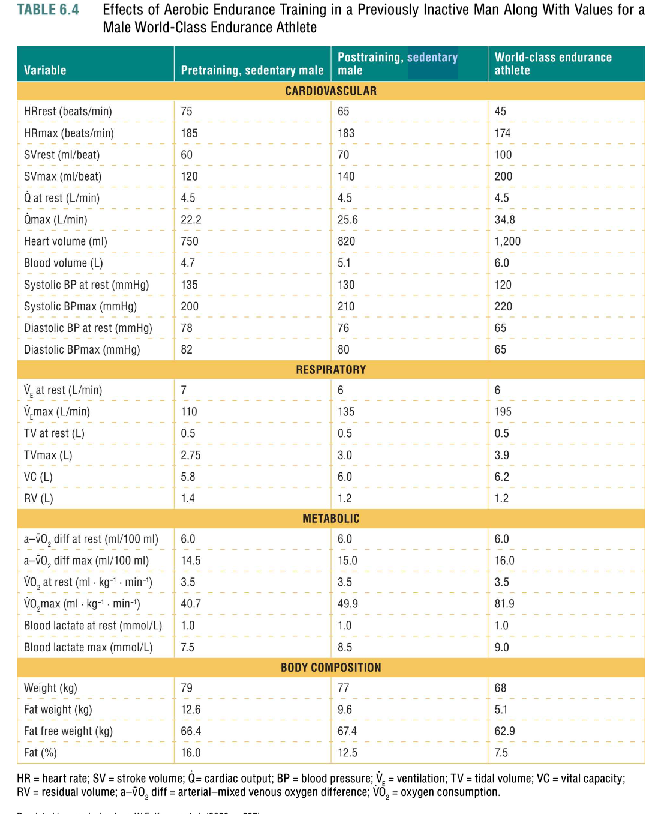
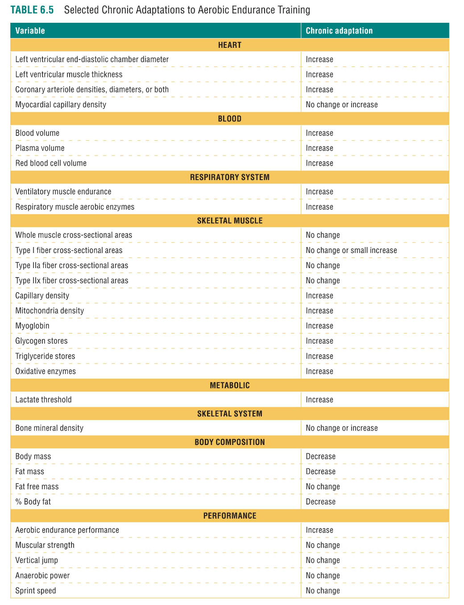
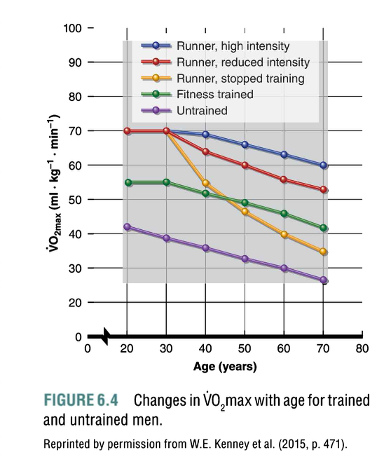
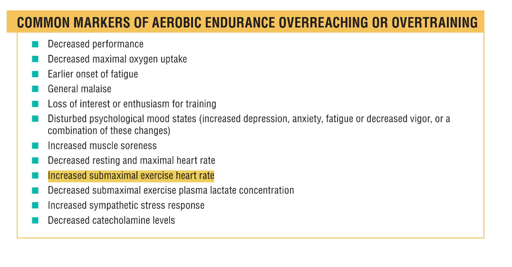
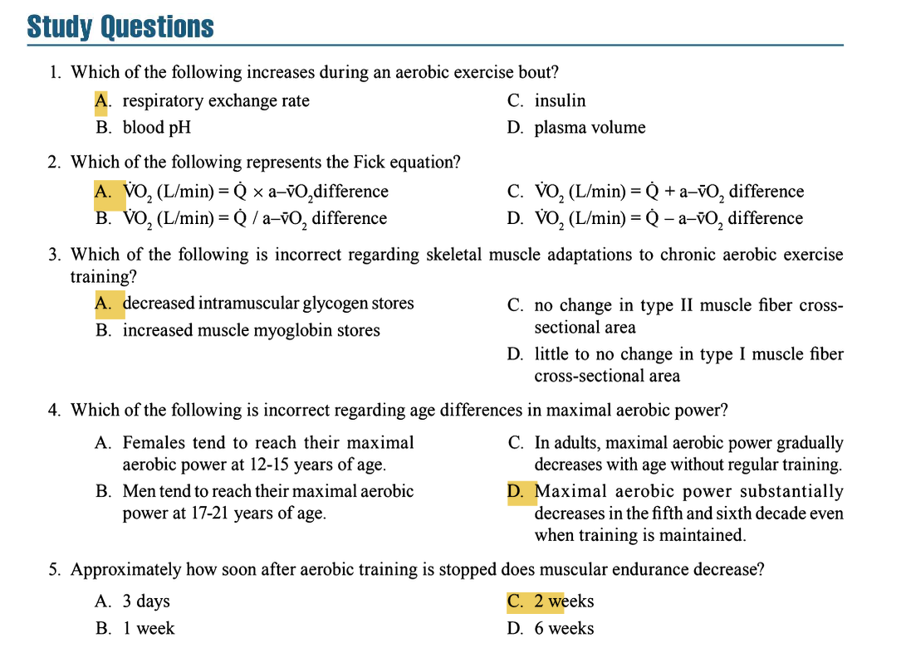

## ACUTE RESPONSES TO AEROBIC ENDURANCE EXERCISE  
*Immediate physiological changes during a single bout of exercise.*

### 1. Cardiovascular Responses
- **Heart Rate (HR 心率)**: ↑ with intensity (beats per minute, bpm).
- **Stroke Volume (SV 每搏输出量)**: ↑ up to **40–60% VO₂max** (plateaus or rises further, depending on fitness) (mL/beat).
- **Cardiac Output (Q 心输出量)**: ↑ Due to ↑ HR and SV (**Q = HR × SV**) (L/min).
- **Blood Pressure 血压**:
  - **Systolic BP (SBP 收缩压)**: ↑ with intensity (mmHg).
  - **Diastolic BP (DBP 舒张压)**: No change/ slight ↓ (mmHg).
- **Total Peripheral Resistance (TPR 总外周阻力)**: ↓ **50–60%** (vasodilation in muscles) (mmHg·min/L).
- **Blood Flow 血流**: ↑ to muscles/coronary arteries; ↓ to splanchnic region (mL/min).
- **Frank-Starling Mechanism 法兰克-斯塔林机制**: ↑ Venous return → ↑ SV (mL/beat).
- **Rate-Pressure Product (RPP 速压产物)**: Indicates myocardial O₂ demand (**RPP = HR × SBP**) (bpm·mmHg).
- **Plasma Volume 血浆容量**: ↓ during exercise (L).

**Key for Study Questions**:
- Plasma volume **↓** during exercise (not ↑) → Eliminates option D in Q1.

---

### 2. Respiratory Responses
- **Pulmonary Minute Ventilation (Vₑ 肺通气量)**: ↑ Due to ↑ **breathing rate (BR 呼吸频率)** and **tidal volume (TV 潮气量)** (**Vₑ = BR × TV**) (L/min).
- **Respiratory Exchange Ratio (RER 呼吸交换比)**:
  - **RER = VCO₂ / VO₂** (unitless; estimates fuel use: **0.7 = fats; 1.0 = carbs**).
  - Can exceed **1.0** during high intensity (due to buffering H⁺ ions as CO₂).
  

**Key for Study Questions**:
- RER **↑** during exercise → Correct answer for Q1 is **A**.

---

### 3. Metabolic Responses
- **Oxygen Consumption (VO₂ 氧气消耗)**: ↑ with intensity (L/min).
- **Arteriovenous O₂ Difference (a-vO₂ diff 动脉静脉氧气差)**: ↑ (mL O₂/100 mL blood).
- **Lactate 乳酸**: ↑ at higher intensities → ↓ blood pH (mmol/L).
- **Fick Equation 费克方程**: **VO₂ = Q × a-vO₂ diff** (L/min).

**Key for Study Questions**:
- Fick equation is **VO₂ = Q × a-vO₂ diff** → Correct answer for Q2 is **A**.

---

### 4. Endocrine Responses 内分泌反应
| Hormone 激素 | Response 反应 |
|--------------|------------------|
| **Catecholamines (epinephrine/norepinephrine) 儿茶酚胺（肾上腺素/去甲肾上腺素）** | ↑ (↑ HR, BP, fuel mobilization) (pg/mL) |
| **Glucagon 胰高血糖素** | ↑ (↑ blood glucose) (ng/mL) |
| **Insulin 胰岛素** | ↓ (↓ glucose uptake) (µU/mL) |
| **Cortisol 皮质醇** | ↓ (low intensity); ↑ (mod-high intensity) (µg/dL) |
| **Growth Hormone 生长激素** | ↑ (mod-high intensity) (ng/mL) |

**Key for Study Questions**:
- Insulin **↓** during exercise → Eliminates option C in Q1.

---
 
 

## CHRONIC ADAPTATIONS TO AEROBIC EXERCISE  
*Long-term changes from repeated training.*

### 1. Cardiovascular Adaptations 心血管适应
- **VO₂max 最大摄氧量**: ↑ (**10–30%**; best measure of aerobic fitness) (L/min or mL/kg/min).
- **Stroke Volume 每搏输出量**: ↑ (due to ↑ left ventricle size, blood volume) (mL/beat).
- **Heart Rate 心率**: ↓ at rest/submaximal exercise; no change at max (bpm).
- **Blood Pressure 血压**: ↓ in hypertensives (**↓7/6 mmHg**).
- **Capillary Density 毛细血管密度**: ↑ in muscles/heart (capillaries per fiber).

### 2. Respiratory Adaptations 呼吸适应
- **Ventilatory Efficiency 通气效率**: ↓ O₂ cost of breathing (L O₂/min).
- **Vₑ 肺通气量**: ↓ during submaximal exercise; ↑ during max exercise (L/min).

### 3. Skeletal Muscle Adaptations 骨骼肌适应
- **Fiber Type Shifts 纤维类型转变**: ↑ Type I fibers; ↓ Type IIx (**no change in Type IIa**) (relative percentage).
- **Mitochondria 线粒体**: ↑ density/size (**2–3x oxidative enzymes**) (number/area).
- **Capillaries 毛细血管**: ↑ density (capillaries per fiber).
- **Glycogen/Myoglobin Stores 糖原/肌红蛋白储备**: ↑ (g/g muscle).

**Key for Study Questions**:
- Intramuscular glycogen **↑** with training → Correct answer for Q3 is **A** (incorrect statement).

### 4. Metabolic Adaptations 代谢适应
- **Fuel Use 燃料使用**: ↑ fat oxidation (g/min); ↓ glycogen depletion (g/min).
- **Lactate Threshold 乳酸阈值**: ↑ from **50–60% to 70–90% VO₂max** (mL/min).
- **VO₂max 最大摄氧量**: ↑ (**10–30%**) (L/min or mL/kg/min).

### 5. Endocrine Adaptations 内分泌适应
- **Blunted Hormone Response 激素反应迟钝**: ↓ catecholamines, cortisol at same submaximal intensity post-training (pg/mL, µg/dL).
- **Insulin Sensitivity 胰岛素敏感性**: ↑ acutely (lasts ~72h) (μU/mL).

### 6. Bone/Connective Tissue Adaptations 骨骼/结缔组织适应
- **Bone Mineral Density (BMD 骨密度)**: ↑ with weight-bearing exercise (e.g., jogging > walking) (g/cm²).
- **Tendons/Ligaments 韧带/肌腱**: ↑ strength/stiffness (N/mm²).

### 7. Body Composition Adaptations 体成分适应
- **Fat Loss 脂肪损失**: Dose-dependent (**150+ min/week → ↓2–16.5 lbs**) (lbs).
- **Fat-Free Mass 无脂肪质量**: Preserved (kg).

### 8. Performance Adaptations 运动表现适应
- **Aerobic Endurance 有氧耐力**: ↑ (no effect on strength/power).

---

## FACTORS INFLUENCING ADAPTATIONS 影响适应的因素
1. **Specificity 特异性**: Adaptations match training mode (e.g., cycling → cycling gains).
2. **Genetics 遗传学**: Accounts for **20–30% VO₂max variability; 50% HRmax variability**.
3. **Sex 性别**: Females show smaller absolute ↑ in SV/Q but similar % changes.
4. **Age 年龄**:
   - **VO₂max peaks**: Females (12–15 yrs); Males (17–21 yrs).
   - Declines with age but mitigated by training (**trained adults maintain VO₂max better**).
  

**Key for Study Questions**:
- VO₂max **does not substantially ↓** in trained older adults → Correct answer for Q4 is **D** (incorrect statement).

---

 
 

## OVERTRAINING 过度训练
- **Overreaching 过度训练**: Short-term performance ↓ → recovery → supercompensation.
- **Overtraining Syndrome 过度训练综合症**: Chronic ↓ performance + symptoms (fatigue, ↑ resting HR, poor sleep).
- **Treatment 治疗**: Rest and/or decreased training volume.

---

 
 

## DETRAINING 去训练化
- **Response to Detraining 去训练化的反应**:
   - **Muscular Endurance 肌肉耐力**: ↓ after **2 weeks** of cessation.
   - **Muscle Metabolism 肌肉代谢**:
     - **Glycogen Levels 糖原储备**: ↓.
     - **Lactate Production 乳酸产生**: ↑.
   - **Cardiovascular Function 心血管功能**:
     - **VO₂max 最大摄氧量**: ↓ **7%** after **12 days**.
     - **Maximal Cardiac Output 最大心输出量**: ↓ **7%**.
     - **Aerobic Enzyme Activity 有氧酶活性**: ↓ **17–19%**.
   - **Bone Mineral Density (BMD 骨密度)**: Site-specific decreases (e.g., tibia) after cessation of aerobic training.

**Key for Study Questions**:
- Detraining leads to a **7% decline** in VO₂max → Correct answer for Q5 is **C** (incorrect statement).

---

