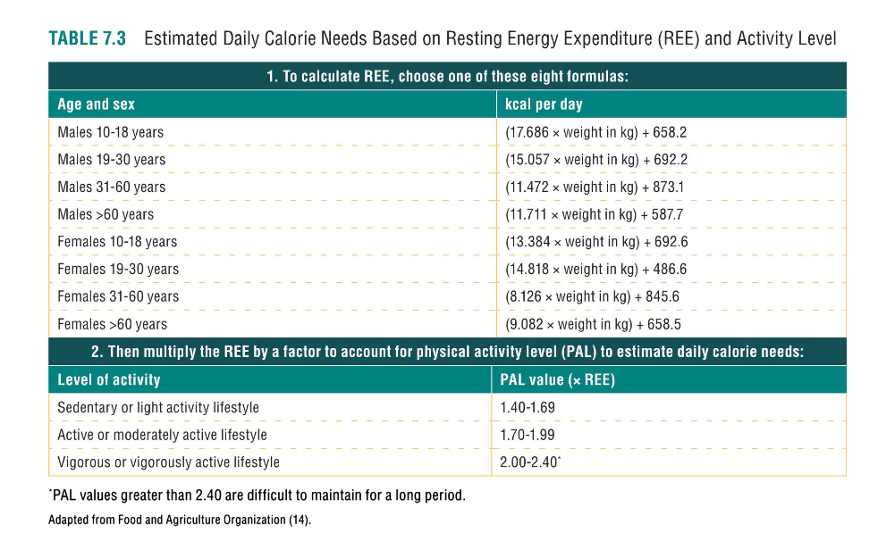
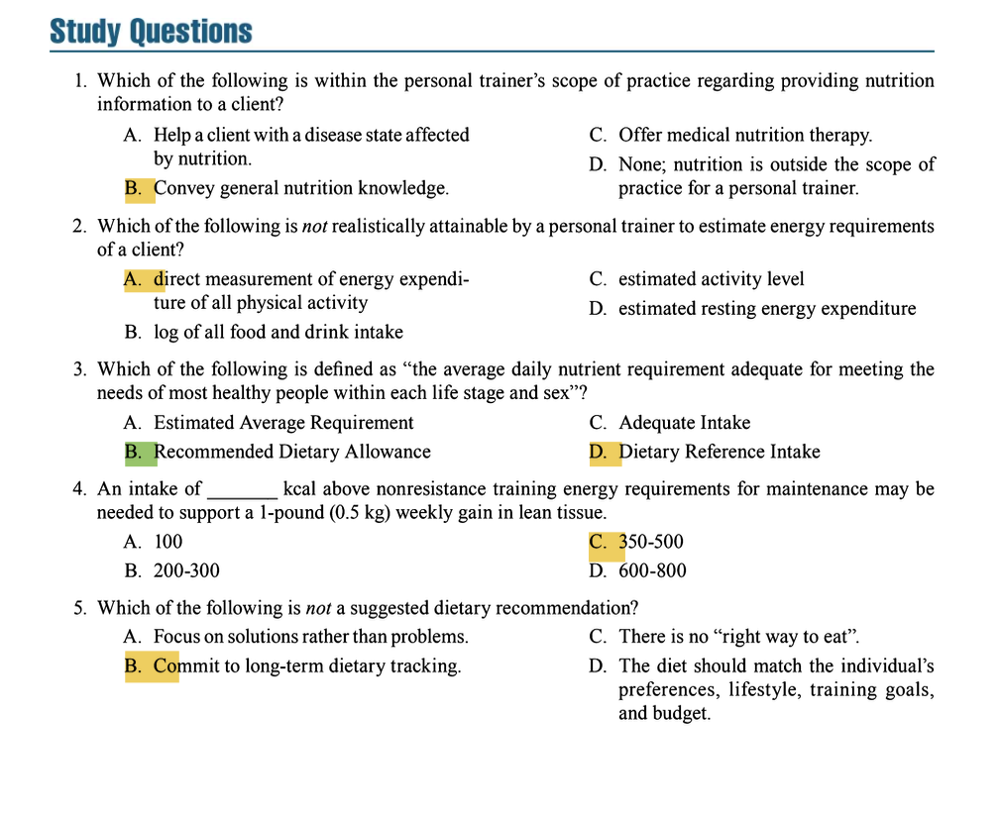

## **ROLE OF THE PERSONAL TRAINER REGARDING NUTRITION**  
**Key Points:**  
- **Scope of Practice**:  
  - Trainers can provide **general nutrition advice** related to:  
    - Physical performance  
    - Disease prevention (e.g., "Omega-3s from fish may reduce heart disease risk" [per AHA])  
    - Weight loss/gain  
  - **Ethical Limitation**: Must recognize when to refer clients to dietitians for complex issues (e.g., medical conditions).  

- **Clearing Confusion**:  
  - Clients often get misinformation from media/social media.  
  - Trainers act as credible sources by:  
    - Citing evidence-based guidelines (e.g., USDA MyPlate).  
    - Avoiding restrictive diets unless qualified.  

**Action Items:**  
- Stay updated on nutrition science.  
- Use reputable sources (e.g., Academy of Nutrition and Dietetics).  

---
 
 

## **WHO CAN PROVIDE NUTRITION COUNSELING AND EDUCATION?**  
**Key Points:**  
- **Referral to Professionals**:  
  - Required for:  
    - **Medical nutrition therapy** (e.g., diabetes, eating disorders, heart disease).  
    - Issues beyond trainer’s expertise.  
  - Find dietitians via:  
    - U.S./Canada: AND (*eatright.org*), SCAN (*scandpg.org*), Dietitians of Canada.  
    - Europe: EFAD (*efad.org*).  
    - Australia: Sports Dietitians Australia.  

- **Legal Regulations**:  
  - **Licensing**: Strict scope (e.g., Alabama: only RDs can advise).  
  - **Certification/Registration**: Less restrictive (e.g., Arizona: no license required).  
  - **Accountability**: Trainers can face legal action for negligence.  

**Action Items:**  
- Check **state/country laws** before giving advice.  
- Have clients sign **release forms** for RD communication.  

---
 
 

## **DIETARY ASSESSMENT**  
**Key Points:**  
- **Methods to Gather Data**:  
  1. **24-Hour Diet Recall**: Quick but less accurate.  
  2. **Diet History**: Questions about habits, allergies, preferences.  
  3. **3-Day Diet Record**: Most valid but prone to underreporting.  

- **Challenges**:  
  - Clients often **underestimate intake** (especially if overweight).  
  - Recording alters eating habits.  

- **Evaluation Tools**:  
  - **MyPlate (USDA)**:  
    - Focus on variety, portion sizes, limiting sodium/sugars/saturated fats.  
    - Customizable plans (see **Tables 7.1a–c** for examples).  
  - **Computerized Analysis**:  
    - Requires 3+ days of detailed logs (brand names, cooking methods).  
    - Limitations: Missing nutrient data, incomplete databases.  

**Action Items:**  
- Use **diet apps** for motivated clients (e.g., MyPlate.gov).  
- Refer to RDs for detailed analysis or medical conditions.  

---
 
 

## **ENERGY**  
**Key Concepts**  
1. **Energy Measurement & Components**  
   - **Kilocalorie (kcal)**: Heat required to raise 1 kg water by 1°C.  
   - **Total Energy Expenditure (TEE) =**  
     - **Resting Metabolic Rate (RMR)** (60–75% of TEE)  
       *Factors increasing RMR*:  
       - Lean mass  
       - Growth  
       - Hyperthyroidism  
       
       *Factors decreasing RMR*:  
       - Caloric deficit  
       - Hypothyroidism  
     - **Physical Activity** (Most variable; depends on exercise/non-exercise movement)  
     - **Thermic Effect of Food (TEF)** (7–10% of TEE; highest for protein)  

2. **Estimating Energy Needs**  
   - **Equations**:  
     - **Step 1**: Calculate RMR using FAO equations (Table 7.3)  
       *Example*: Male (19–30 yrs) = (15.057 × weight in kg) + 692.2  
     - **Step 2**: Multiply by **Physical Activity Level (PAL)**:  
       - *Sedentary*: 1.4–1.69  
       - *Moderate*: 1.7–1.99  
       - *Heavy*: 2.0–2.4  

3. **Energy Availability (EA) & RED-S**  
   - **EA = (Energy Intake − Exercise Expenditure) ÷ Lean Mass**  
   - **RED-S Risk**: EA <30 kcal/kg lean mass → menstrual dysfunction, bone loss, fatigue  
   - **Action**: Refer to RD/MD if client shows:  
     - Rapid weight loss (>10% in 1 month)  
     - Low energy  
     - Disordered eating patterns  

#### **Tools & Tracking**  
- **Apps**: MyFitnessPal, LoseIt, MyPlate.gov for calorie/macro tracking  
- **Monitor**: Weight stability, energy levels, and recovery  

---
 
 

## **NUTRIENTS**  
**A. Protein**  
- **Functions**:  
  - Muscle repair  
  - Satiety  
  - Energy (during deficits)  
- **Daily Requirements**:  

| **Client Type**       | **Protein Intake** |  
|-----------------------|--------------------|  
| Sedentary (RDA)       | 0.8 g/kg           |  
| Endurance Athletes    | 1.4–2.0 g/kg       |  
| Resistance Training   | 1.6–2.2 g/kg       |  
| Caloric Deficit       | Up to 2.2 g/kg     |  

- **Sources**:  
  - Animal (complete proteins)  
  - Plant (combine rice + beans)  
- **Cautions**:  
  - Safe up to **4 g/kg** for healthy individuals  
  - Monitor kidney function, calcium, and fluid intake  

**B. Carbohydrates**  
- **Primary Fuel**: High-intensity exercise and brain function  
- **Daily Requirements**:  

| **Activity Level**    | **Carb Intake** |  
|-----------------------|-----------------|  
| Endurance Athletes    | 7–10 g/kg       |  
| Strength/Sprint       | 5–6 g/kg        |  
| Ketogenic Diets       | 50–100 g/day    |  

- **Ketogenic Diets**:  
  - *Pros*: Fat loss, satiety  
  - *Cons*: May impair muscle gain, reduce adherence  

**C. Fats**  
- **Essential Fats**:  
  - Omega-3 (0.5–1% of calories)  
  - Omega-6 (3% of calories)  
- **General Intake**: 20–30% of total calories (focus on unsaturated)  
- **When to Reduce Fat**:  
  1. To increase carbs for endurance training  
  2. For calorie deficits (fat = 9 kcal/g)  
  3. High cholesterol (refer to RD)  

**D. Vitamins & Minerals**  
- **Dietary Reference Intakes (DRIs)**:  
  1. **Estimated Average Requirement (EAR)**: Meets needs of 50% of population  
  2. **Recommended Dietary Allowance (RDA)**: Meets 97–98% of needs  
  3. **Adequate Intake (AI)**: Used when RDA cannot be determined  
  4. **Tolerable Upper Intake Level (UL)**: Maximum safe intake  

- **Key Micronutrients**:  

| **Nutrient** | **RDA (19-30 yrs)** | **UL** | **Key Functions** |  
|--------------|---------------------|--------|-------------------|  
| Vitamin A    | 900 μg (M), 700 μg (F) | 3,000 μg | Vision, immunity |  
| Vitamin D    | 15 μg               | 100 μg | Bone health |  
| Calcium      | 1,000 mg            | 2,500 mg | Bone/muscle function |  
| Iron         | 8 mg (M), 18 mg (F) | 45 mg | Oxygen transport |  

- **Action**: Prioritize whole foods; supplement only if deficient  

**E. Water & Hydration**  
- **Guidelines**:  

| **Timing**          | **Recommendation** |  
|---------------------|--------------------|  
| **Pre-Exercise**    | 5–7 mL/kg 4 hrs prior + 3–5 mL/kg if dehydrated |  
| **During Exercise** | Replace sweat losses (thirst is unreliable) |  
| **Post-Exercise**   | 20–24 oz per pound lost + sodium |  

- **Signs of Dehydration**:  
  - Dark urine  
  - Rapid HR  
  - Muscle soreness  
- **Caffeine**: Does **not** dehydrate (tolerance develops in 1–4 days)  

---
 
 

## **WEIGHT GAIN**  

**Key Principles**  
- **Purpose**: Improve physique or athletic performance via muscle mass.  
- **Requirements**:  
  - **Caloric Surplus**: 350–500 kcal/day above maintenance for ~1 lb (0.5 kg) muscle/week.  
    *Experienced trainees*: Smaller surplus to minimize fat gain.  
  - **Protein Intake**: ≥1.6 g/kg/day (higher for plant-based diets due to lower leucine).  
  - **Resistance Training**: Progressive overload essential.  

**Strategies**  
- **Increase Caloric Intake**:  
  - Larger portions, calorie-dense foods (e.g., nuts, oils).  
  - Frequent meals/snacks (5–6/day).  
  - Meal replacement shakes (if appetite is low).  
- **Monitor Progress**:  
  - Track weight/body composition weekly.  
  - Adjust surplus if fat gain exceeds muscle gain.  

**Example**:  
> 70 kg client needs ~2,500 kcal/day (maintenance) → Aim for **2,850–3,000 kcal/day** + 112 g protein.  

---
 
 

## **WEIGHT LOSS**  
**Key Principles**  
- **Caloric Deficit**: 500–1,000 kcal/day → 1–2 lb (0.5–0.9 kg) fat loss/week.  
- **Protein Intake**: 1.6–2.2 g/kg to preserve muscle.  
- **Energy Density**: Prioritize low-calorie, high-volume foods (vegetables, broth soups).  

#### **Considerations**  
- **Genetics**: Limits minimal achievable body fat.  
- **Training Status**:  
  - *Novices*: Can gain muscle while losing fat.  
  - *Trained Individuals*: Fat loss may include lean mass loss.  
- **Rapid Loss Risks**: Dehydration, nutrient deficiencies.  

**Action Steps**:  
1. Calculate TDEE (use **Table 7.2/7.3**).  
2. Create deficit via diet + exercise (e.g., -250 kcal diet + -250 kcal exercise).  
3. Emphasize protein + fiber for satiety.  

---
 
 

## **EVALUATING WEIGHT LOSS DIETS**  
**Red Flags of Fad Diets**  
1. **Excludes Food Groups**: Risk of nutrient deficiencies.  
2. **Overemphasizes One Food**: e.g., "Cabbage Soup Diet."  
3. **Very Low Calories**: <1,200 kcal/day (unsustainable, muscle loss).  
4. **Discourages Exercise**: Counterproductive for health.  
5. **Promises Quick Results**: Likely water/muscle loss.  

#### **Client Guidance**  
- **Focus on Energy Balance**: "Does this diet create a deficit?"  
- **Review Supplements**: Check for stimulants (e.g., banned substances).  
- **Cross-Reference Claims**: Use evidence-based resources (e.g., AND, ISSN).  

**Example**:  
> Client asks about keto diet → Highlight carb needs for performance & risks of long-term restriction.  

---

 
 

## **DIETARY SUPPLEMENTS**  
**Regulation & Safety**  
- **DSHEA (1994)**: Supplements = food, not drugs.  
  - Labels can claim *structure/function* (e.g., "supports bones") but not *disease treatment*.  
- **Quality Verification**:  
  - **USP/NSF/Informed Choice**: Certify purity/banned substances.  
  - **ConsumerLab.com**: Independent testing.  

#### **Common Categories**  
| **Category**          | **Examples**                  | **Notes**                          |  
|-----------------------|-------------------------------|------------------------------------|  
| Protein               | Whey, casein, plant blends    | Useful for gaps in dietary protein.|  
| Meal Replacements     | Bars, shakes                  | Convenient but check sugar content.|  
| Creatine             | Monohydrate                   | Evidence-based for strength.       |  
| Pre/Prohormones       | DHEA, androstenedione         | Avoid (mimic steroids).            |  

#### **Trainer’s Role**  
- **Do Not Recommend**: Outside scope of practice.  
- **Educate**:  
  - Verify 3rd-party testing.  
  - Refer to RD for medical interactions (e.g., iron + hemochromatosis).  

**Resource**: [ISSN Review](www.jissn.com) for efficacy/safety data.  

---
 
 

## **THE ART OF MAKING DIETARYRECOMMENDATIONS**  
**Behavior Change Strategies**  
1. **Client-Centered Approach**:  
   - Respect preferences/goals (e.g., vegetarian, budget constraints).  
   - Use open-ended questions: *"What’s one healthy swap you’d enjoy?"*  

2. **Habit-Based Focus**:  
   - **Add Before Subtracting**: More veggies → naturally displaces processed foods.  
   - **Leverage Strengths**: e.g., Cooking skills → meal prep.  

3. **Tracking Guidelines**:  
   - **Short-Term**: Teach portion awareness (1–2 weeks).  
   - **Long-Term**: Use only if progress stalls (risk of disordered eating).  

#### **5-Step Coaching Process**  
1. **Assess**: Goals, intake, biomarkers.  
2. **Plan**: Collaborative, solution-focused actions.  
3. **Implement**: 1–2 changes/week (e.g., "Add protein to breakfast").  
4. **Monitor**: Consistency → outcomes.  
5. **Adjust**: Revise plan based on feedback.  

**Ethical Note**:  
> Avoid rigid tracking for clients with eating disorder history. Prioritize **internal cues** (hunger/fullness).  

---

### **Question 1**  
**Correct Answer: B. Convey general nutrition knowledge.**  
**Textbook Reference**:  
*"It is well within the personal trainer’s scope of practice to address misinformation and to give general advice related to nutrition for physical performance, disease prevention, weight loss, and weight gain."*  
*(Chapter 7, "Role of the Personal Trainer Regarding Nutrition")*  

**Incorrect Options**:  
- **A. Help a client with a disease state**: *"Referral to a nutrition professional is indicated when the client has a disease state (e.g., diabetes, heart disease) that is affected by nutrition."*  
- **C. Offer medical nutrition therapy**: *"This type of nutrition information is called medical nutrition therapy and falls under the scope of practice of a licensed nutritionist, dietitian, or registered dietitian."*  
- **D. None**: Contradicts the textbook’s explicit statement about general advice.  

---

### **Question 2**  
**Correct Answer: A. Direct measurement of energy expenditure of all physical activity.**  
**Textbook Reference**:  
*"A true estimation of energy requirement (i.e., energy expended in a day) is difficult to obtain directly. Therefore, surrogate methods are often used."*  
*(Chapter 7, "Estimating Energy Requirements")*  

**Incorrect Options**:  
- **B. Log of food/drink intake**: Valid if weight is stable (*"if the client is maintaining a stable body weight... the best way to determine energy requirement is to assess the calorie intake from the three-day food log."*)  
- **C/D. Estimated activity level/RMR**: *"Mathematical equations can roughly estimate calorie expenditure... first calculate resting energy expenditure (REE)... then multiply by a factor based on activity level."*  

---

### **Question 3**  
**Correct Answer: B. Recommended Dietary Allowance (RDA).**  
**Textbook Reference**:  
*"Recommended Dietary Allowance (RDA) is the intake that meets the nutrient needs of almost all (97%-98%) healthy individuals in a specific age and sex group."*  
*(Chapter 7, "Vitamins and Minerals")*  

**Incorrect Options**:  
- **A. Estimated Average Requirement (EAR)**: *"Meets the estimated nutrient needs of half the individuals in a specific group."*  
- **C. Adequate Intake (AI)**: *"A goal intake when sufficient scientific information is unavailable to estimate the RDA."*  
- **D. Dietary Reference Intake (DRI)**: Umbrella term for all categories (RDA, AI, EAR, UL).  

---

### **Question 4**  
**Correct Answer: C. 350-500.**  
**Textbook Reference**:  
*"An intake of 350 to 500 kcal above nonresistance training energy requirements for maintenance may be needed to support a 1-pound (0.5 kg) weekly gain in lean tissue."*  
*(Chapter 7, "Weight Gain")*  

**Incorrect Options**:  
- **A/B. 100 or 200-300**: Too low (*"Does not account for energy required to fuel tissue synthesis... and adaptive increases in energy expenditure."*)  
- **D. 600-800**: Exceeds recommended surplus.  

---

### **Question 5**  
**Correct Answer: B. Commit to long-term dietary tracking.**  
**Textbook Reference**:  
*"Growing evidence demonstrates a potential link between tracking apps and eating disorder symptoms... After [a] learning phase, the emphasis should be on nontracking, habit-based strategies."*  
*(Chapter 7, "The Art of Making Dietary Recommendations")*  

**Incorrect Options**:  
- **A. Focus on solutions**: *"Focus on the things clients are already doing well... leverage skills the client already has."*  
- **C. No 'right way'**: *"There is no 'right way to eat' or 'best diet' that applies to everyone."*  
- **D. Match preferences**: *"Adequate diet... does so in a way that matches the individual’s preferences, lifestyle, training goals, and budget."*  

---

### **Key Takeaways**  
1. **Scope of Practice**: Trainers provide general advice, not medical nutrition therapy.  
2. **Energy Estimation**: Direct measurement is impractical; use logs/equations.  
3. **RDA vs. Other DRIs**: RDA covers 97–98% of healthy individuals.  
4. **Weight Gain Surplus**: 350–500 kcal/day for lean mass.  
5. **Dietary Coaching**: Avoid rigid tracking; prioritize habits.  

**Visual Reference**:  
- [Table 7.3](#) for RMR equations.  
- [ISSN Review](#) for supplement safety.