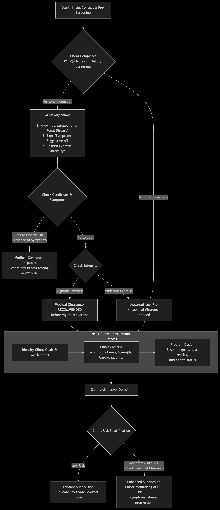
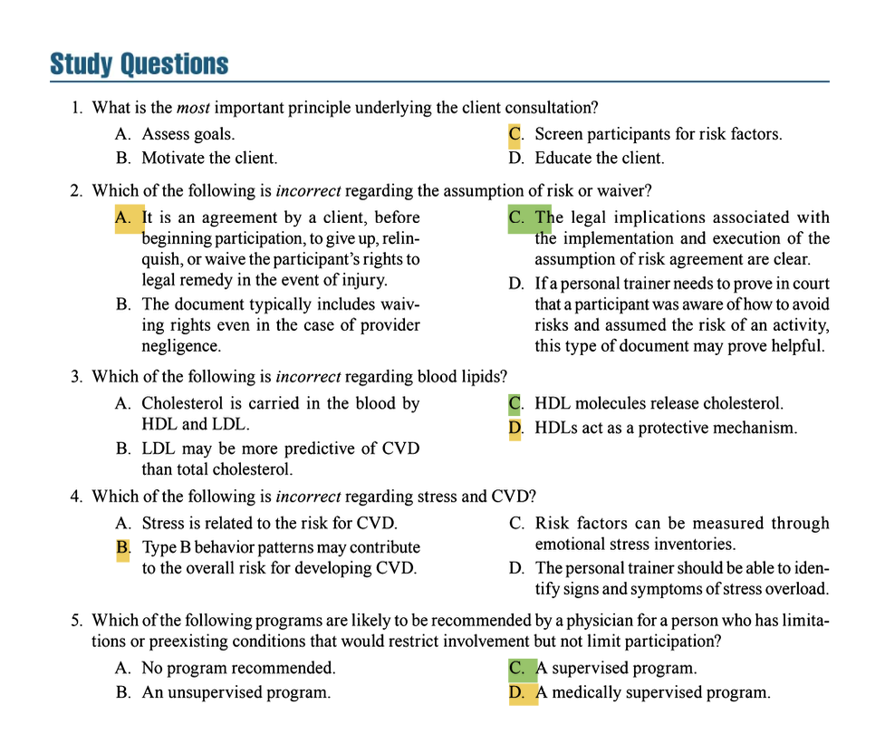

## **PURPOSE OF CONSULTATION AND HEALTH APPRAISAL**  
- **Definition of Personal Trainers**:  
  - Health/fitness professionals who assess, motivate, educate, and train clients using an individualized approach.  
  - Design safe, effective exercise programs and guide clients toward their goals.  
  - Respond to emergencies and refer clients to healthcare professionals when needed.  

- **Primary Purpose of Consultation & Health Appraisal**:  
  - Screen for risk factors and symptoms of chronic diseases (cardiovascular, pulmonary, metabolic, orthopedic).  
  - Ensure safety during exercise testing and participation.  
  - Classify risk and determine the need for medical referrals.  

---  

#### **CLIENT CONSULTATION**  
**1. Initial Interview**  
- **Purpose**: Mutual sharing of information to assess compatibility, discuss goals, and establish a client–personal trainer agreement.  
- **Key Steps**:  
  - **Assess Compatibility**:  
    - Personal trainer shares their credentials (education, certifications, experience, specialties).  
    - Discuss program logistics (location, schedule, mission statement, success rates).  
    - Evaluate client’s exercise readiness (motivation, past experiences, support system, potential obstacles).  
    - Use attitudinal assessments (e.g., paper tests) to predict compliance.  
    - Address concerns and set boundaries (roles, expectations, resources).  
    - Refer if incompatibility is identified.  

  - **Discuss Goals**:  
    - Establish SMART goals (Specific, Measurable, Action-Oriented, Realistic, Time-Sensitive).  

**2. Client–Personal Trainer Agreement**  
- **Components**:  
  - Services provided, parties involved, expectations, timeline, costs, payment process.  
  - Cancellation policy, termination clauses, conditions rendering the contract void.  
- **Legal Considerations**:  
  - Must be signed by both parties (assuming legal age/competency).  
  - Consult an attorney to ensure compliance with local laws.  

**3. Client–Personal Trainer Fitness Facility Agreement**  
- **For Independent Contractors**:  
  - Outlines permitted facility use (equipment, spaces).  
  - Clarifies liability (trainer assumes responsibility; facility not liable for injuries/accidents).  
- **For Facility Employees**:  
  - Facility provides safe, maintained equipment and environment.  
  - Facility’s liability insurance covers the trainer.  
  - Requires signatures from client, trainer, and facility manager.  

---  
 
 

## **PREPARTICIPATION HEALTH APPRAISAL SCREENING**  
**Purpose**:  
- Identify diseases, CVD risk factors, and lifestyle factors needing special consideration.  
- Determine if medical clearance is required before exercise.  

**Steps**:  
1. **Complete Health Appraisal Forms**:  
   - Review forms before services begin.  
   - Use cost-effective, time-efficient tools to avoid unnecessary barriers.  

2. **Common Screening Tools**:  
   - **PAR-Q+ (Physical Activity Readiness Questionnaire for Everyone)**:  
     - Self-recall of symptoms/observations.  
     - Identifies need for medical screening but does not assess CVD risk.  
     - Best for low-intensity activity clearance.  
   - **Health/Medical Questionnaire**:  
     - Assesses coronary risk factors, medications, exercise contraindications.  
     - Covers medical history, orthopedic concerns, lifestyle, supplements.  

3. **Additional Screening Forms**:  
   - **Lifestyle Questionnaires**:  
     - Evaluate diet, stress, physical activity, and other health behaviors.  
     - Helps set goals but may not be valid for those with diagnosed conditions.  
   - **Informed Consent**:  
     - Describes program details, risks, benefits, confidentiality, participant responsibilities.  
     - Must be verbally and written explained before participation.  
   - **Assumption of Risk/Waiver**:  
     - Client waives rights to legal claims for injuries (even due to trainer negligence).  
     - Legal enforceability varies; does not absolve trainers of professional duty.  

4. **Special Considerations for Children**:  
   - Parents must complete health history forms.  
   - Preparticipation physical evaluation form (approved by AAP/AAFP) may be used.  
   - Waivers/assumption of risk agreements are **not enforceable** for minors.  
   - Trainers must:  
     - Follow safe, age-appropriate training methods.  
     - Understand children’s physiological/psychological needs.  

5. **Record Keeping**:  
   - Organize and store client documents securely.  
   - Follow HIPAA guidelines for confidentiality.  

**Evaluation of Risk Factors & Referrals**:  
- Review forms to identify CVD risks, medical conditions, and lifestyle concerns.  
- Refer to physicians when necessary.  

---  
 
 

## **EVALUATION OF CORONARY RISK FACTORS, DISEASE, AND LIFESTYLE**  
**Cardiovascular Disease (CVD) Risk Factors**  
- **Definition**: CVD is the leading cause of mortality; atherosclerosis (plaque buildup in arteries) is a key contributor.  
- **Positive Risk Factors** (increase CVD likelihood):  
  - **Age**: Men ≥45; women ≥55.  
  - **Family History**: Heart disease in male relatives <55 or female relatives <65.  
  - **Cigarette Smoking**: Current smokers, those who quit <6 months ago, or exposure to secondhand smoke.  
  - **Physical Inactivity**: Not meeting guidelines (≥150 min moderate or 75 min vigorous activity weekly).  
  - **Obesity**: BMI ≥30 kg/m² or waist circumference >40 in (men) / >35 in (women).  
  - **Hypertension**: Systolic ≥130 mmHg or diastolic ≥80 mmHg (or on medication).  
  - **Dyslipidemia**:  
    - LDL ≥130 mg/dL or HDL <40 mg/dL (men) / <50 mg/dL (women).  
    - Total cholesterol ≥200 mg/dL if LDL/HDL unavailable.  
  - **Elevated Blood Glucose**: Fasting glucose ≥100 mg/dL or HbA1c ≥5.7%.  
- **Negative Risk Factor** (reduces CVD risk): HDL ≥60 mg/dL (subtract 1 positive risk factor).  

**Medical Conditions & Diagnosed Disease**  
1. **Cardiovascular/Pulmonary Disease**:  
   - **Signs/Symptoms**: Chest pain, shortness of breath, dizziness, edema, palpitations.  
   - **Conditions**: Chronic bronchitis, emphysema, asthma (COPD).  
2. **Sudden Cardiac Death (SCD)**:  
   - **Causes**: Hypertrophic cardiomyopathy (younger), coronary artery plaque rupture (older).  
   - **Risk Factors**:  
     - Exertional chest pain, syncope, family history of SCD <50.  
   - **Prevalence**: Rare but higher in untrained individuals during vigorous activity.  
3. **Metabolic Disease**:  
   - **Diabetes**: Type 1 (insulin-dependent) and Type 2 (insulin resistance).  
   - **Risks**: Hyperglycemia accelerates atherosclerosis; requires medical monitoring.  
4. **Orthopedic Conditions**:  
   - Arthritis, recent surgery, osteoporosis may need physician clearance.  

**Lifestyle Evaluation**  
- **Dietary Intake**:  
  - High saturated fat/cholesterol → atherosclerosis.  
  - High sodium → hypertension; alcohol → atrial fibrillation.  
  - Assess via 3-day food logs or dietary recalls.  
- **Exercise Patterns**:  
  - Identify inactivity (a major CVD risk factor).  
  - Note joint pain or exertional symptoms.  
- **Stress Management**:  
  - Chronic stress linked to CVD (e.g., Type A behavior: hostility, depression).  

---  
 
 

## **INTERPRETATION OF RESULTS**  
**PAR-Q+ Analysis**:  
- **"Yes" to any question** → Refer to physician before exercise.  
- **"No" to all questions** → Safe for low-intensity activity.  

**ACSM Preparticipation Screening Algorithm**:  
Classifies clients into 6 categories based on:  
1. Current exercise status.  
2. Known CVD/metabolic/renal disease.  
3. Signs/symptoms.  
   - **Example**: Asymptomatic sedentary client with no disease = low risk; symptomatic exerciser = high risk.  

---  
 
 

## **REFERRAL PROCESS**  
**Medical Examinations**:  
- Recommended for clients with:  
  - Positive PAR-Q+, CVD risk factors, or symptoms.  
  - **Components**:  
    - Body weight, BMI, blood pressure, heart/lung auscultation, arterial palpation, neurological tests.  
    - Lab tests (cholesterol, glucose) if needed.  

**Physician Referral Form**:  
- Documents:  
  - Functional capacity, activity restrictions, medications.  
  - **Program recommendations** (unsupervised, supervised, or medically supervised).  

---  
 
 

## **MEDICAL CLEARANCE**  
**Program Recommendations**:  
1. **Unsupervised**: Apparently healthy clients (no risks).  
2. **Supervised**: Clients with limitations (e.g., controlled hypertension).  
3. **Medically Supervised**: High-risk clients (e.g., uncontrolled diabetes, post-heart attack).  

**Key Points**:  
- Referral is a safety measure, not liability avoidance.  
- Adjust programs based on physician feedback. 

---  
 
 

### **Client Intake & Progression Decision Tree**

#### **Phase 1: Pre-Participation Screening (The Gatekeeper)**

This phase uses the **ACSM Algorithm** to determine if medical clearance is needed before proceeding.

1.  **Administer Screening Tools:** Have the client complete:
    *   **PAR-Q+ (Physical Activity Readiness Questionnaire for Everyone):** The modern, expanded version that is the cornerstone of the ACSM algorithm.
    *   **Comprehensive Health History Questionnaire:** As detailed in the NSCA text. This gathers info on past and current medical conditions, surgeries, medications, and family history.

2.  **Apply the ACSM Algorithm (The 3 Key Questions):**
    *   **Step 1: Does the client have a known Cardiovascular, Metabolic, or Renal disease?** (e.g., heart disease, diabetes, kidney disease).
    *   **Step 2: Does the client report any major ** Signs or Symptoms** suggestive of these diseases?** (e.g., chest pain, shortness of breath at rest, dizziness/fainting, swollen ankles).
    *   **Step 3: What is the ** desired exercise intensity**?** (Moderate vs. Vigorous).

3.  **The Decision:**
    *   **YES to either Disease OR Symptoms:** The client is classified as "high risk." **Medical clearance is REQUIRED** before beginning *any* fitness assessment or exercise program.
    *   **NO to both Disease and Symptoms:** The client is "asymptomatic." Proceed to the intensity question.
        *   If they plan to do **MODERATE** exercise, they are "apparently healthy" or "low risk." **No medical clearance is needed.** Proceed to consultation.
        *   If they plan to do **VIGOROUS** exercise, **medical clearance is RECOMMENDED** (though not strictly required) before starting that vigorous activity. Use professional judgment. For a completely asymptomatic client, you may proceed with caution, but for any doubt, err on the side of caution and get clearance.

#### **Phase 2: Client Consultation & Goal Identification (NSCA Process)**

Once medical clearance is obtained (if needed) or deemed unnecessary, you proceed with the consultation.

*   This is where you sit down with the client and discuss their **goals, motivations, past exercise experience, time constraints, and preferences**.
*   You cannot set effective goals without first knowing if you need medical clearance. This conversation happens *after* the screening hurdle is cleared.

#### **Phase 3: Fitness Testing (Proceed with Caution)**

Fitness testing is only conducted after phases 1 and 2.

*   **Informed Consent:** The client must understand the risks and benefits of each test and provide verbal/written consent.
*   **Test Selection:** Choose tests that are:
    *   **Relevant** to the client's goals (e.g., don't test a 1RM bench press for a client whose goal is walking endurance).
    *   **Appropriate** for their health status and risk stratification (e.g., a submaximal bike test may be safer than a maximal treadmill test for a moderate-risk client).
    *   **Sequence correctly:** Follow the NSCA's recommended order to prevent fatigue from influencing results: 1) Resting measures, 2) Body composition, 3) Cardiorespiratory, 4) Muscular strength, 5) Muscular endurance, 6) Flexibility.

#### **Phase 4: Program Design & Supervision**

*   **Program Design:** The program is built from the information gathered in *all* previous steps:
    *   **Health Status** (Phase 1) dictates **contraindications** and **precautions**.
    *   **Client Goals** (Phase 2) dictate the **training priorities** (e.g., hypertrophy, endurance, health).
    *   **Fitness Test Results** (Phase 3) provide the **baseline metrics** to determine initial loads, volumes, and intensities and to measure progress.

*   **Supervision Level:** The client's risk stratification directly influences the required level of supervision.
    *   **Low Risk:** Standard personal training supervision is appropriate.
    *   **Moderate/High Risk (or those with medical clearance):** Requires enhanced supervision. This means:
        *   Closer monitoring of heart rate, blood pressure, and perceived exertion (RPE).
        *   Being vigilant for any signs or symptoms (e.g., unusual shortness of breath, nausea, dizziness).
        *   Adopting a more conservative approach to progression (e.g., using the **2-for-2 rule** for strength progressions very cautiously).
        *   Maintaining clear communication with the client's healthcare provider, if applicable and with client consent.

### **Key Takeaways for the Practitioner:**

*   **Safety First:** The screening process is non-negotiable. It protects the client, the trainer, and the facility.
*   **Document Everything:** Keep copies of the PAR-Q+, health history, medical clearances, and testing results.
*   **Scope of Practice:** A personal trainer does *not* diagnose. We identify risk and refer to qualified medical professionals.
*   **It's a Process, Not a One-Time Form:** Client health can change. Re-screen clients periodically (e.g., every 6-12 months) or anytime they report a new diagnosis, symptom, or change in medication.
*   **When in Doubt, Refer Out:** If you are ever uncertain about a client's readiness to exercise, seek medical clearance. It is always the correct and professional choice.

### **Question 1**  
**Correct Answer: C. Screen participants for risk factors.**  
**Textbook Reference**:  
*"The most important principle underlying the client consultation and health appraisal process is to screen participants for risk factors and symptoms of chronic cardiovascular, pulmonary, metabolic, and orthopedic diseases to optimize safety during exercise testing and participation."*  
*(Chapter 9, "Purpose of Consultation and Health Appraisal")*  

**Incorrect Options**:  
- **A. Assess goals**: *"The initial interview is a scheduled appointment intended as a mutual sharing of information with the expected outcomes of assessing client-personal trainer compatibility, discussing goals, and developing a client-personal trainer agreement."*  
- **B. Motivate the client**: *"Personal trainers are health/fitness professionals who use an individualized approach to assess, motivate, educate, and train clients regarding their health and fitness needs."*  
- **D. Educate the client**: *"Personal trainers... educate... clients regarding their health and fitness needs."*  

---  

### **Question 2**  
**Correct Answer: C. The legal implications associated with the implementation and execution of the assumption of risk agreement are clear.**  
**Textbook Reference**:  
*"The legal implications associated with the implementation and execution of the assumption of risk agreement appear to be unclear at best because of the various legal interpretations associated with waiver documents."*  
*(Chapter 9, "Additional Screening")*  

**Incorrect Options**:  
- **A**: *"An assumption of risk or waiver is an agreement by a client, before beginning participation, to give up, relinquish, or waive the participant’s rights to legal remedy (damages) in the event of injury."*  
- **B**: *"Waive the participant’s rights to legal remedy... even when such injury arises because of provider negligence."*  
- **D**: *"If a personal trainer needs to prove in court that a participant was aware of how to avoid risks and assumed the risk of an activity, this type of document may prove helpful."*  

---  

### **Question 3**  
**Correct Answer: C. HDL molecules release cholesterol.**  
**Textbook Reference**:  
*"LDL molecules release cholesterol, which penetrates the arterial wall... HDLs act as a protective mechanism by transporting cholesterol to the liver for elimination."*  
*(Chapter 9, "Blood Lipid Levels")*  

**Incorrect Options**:  
- **A**: *"Cholesterol is carried in the bloodstream by high-density lipoproteins (HDLs) and low-density lipoproteins (LDLs)."*  
- **B**: *"The LDL may be more predictive of CVD risk than total cholesterol levels."*  
- **D**: *"HDLs act as a protective mechanism."*  

---  

### **Question 4**  
**Correct Answer: B. Type B behavior patterns may contribute to the overall risk for developing CVD.**  
**Textbook Reference**:  
*"Type A behavior pattern characteristics include hostility, depression, social isolation, and chronic stress... These lifestyle stress-related characteristics can be measured psychosocially and physiologically."*  
*(Chapter 9, "Stress Management")*  

**Incorrect Options**:  
- **A**: *"Epidemiological studies provide evidence that stress is related to the risk for CVD."*  
- **C**: *"These lifestyle stress-related characteristics can be measured... through emotional stress inventories."*  
- **D**: *"It is important for the personal trainer to be able to identify the common signs and symptoms of stress overload."*  

---  

### **Question 5**  
**Correct Answer: C. A supervised program.**  
**Textbook Reference**:  
*"A supervised program may be recommended for people who have limitations or preexisting conditions that would restrict involvement but not limit participation. These programs are usually directed by a certified fitness professional... who monitors intensity and modifies activity."*  
*(Chapter 9, "Program Recommendations")*  

**Incorrect Options**:  
- **A**: Not mentioned as an option.  
- **B**: *"An unsupervised program is commonly recommended for people who are apparently healthy or presumably healthy with no apparent risks."*  
- **D**: *"A medically supervised program may be recommended for individuals who present a higher potential risk because of... uncontrolled disease."*